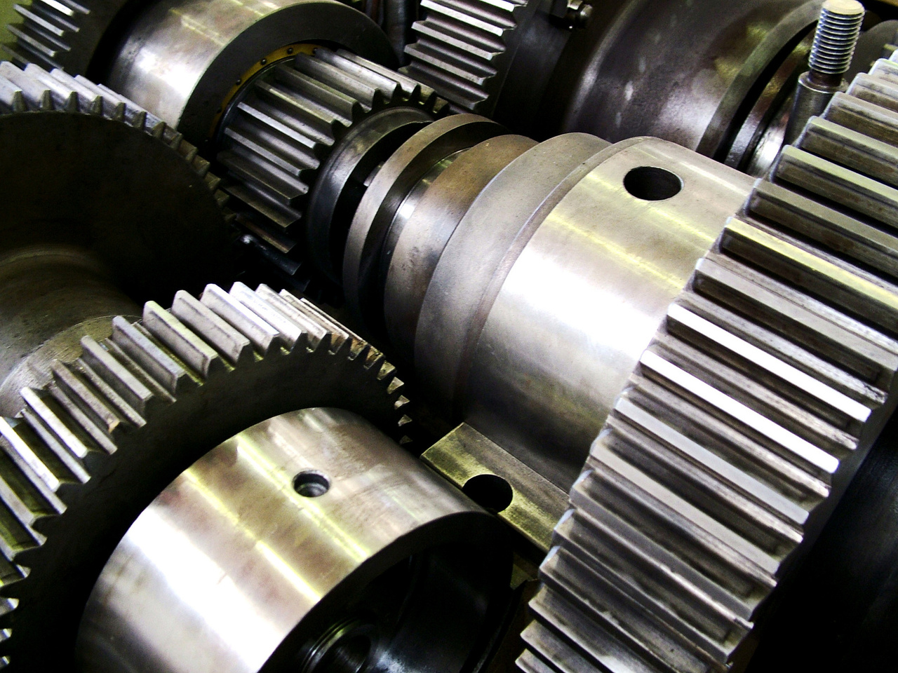

# About End-To-End PLM

As time goes on, the product lifecycle management (PLM) area proposes more and more functionality, linked together, in platforms that tend to be bigger with time.

The increasing size of the PLM platforms is answering to a simplistic dream of users to have "everything linked together in the same place". In this article, we are going to analyze that dream that is, to our point of view, conveniently forgetting some of the most basic principles of large IT systems.

## The three business domains of the industry

An industrial company is generally architectured on 3 business domains:

* Engineering Office: Where the products are designed, and certified in some industries;
* Industry: Where the products are built;
* Support: Where the products are supported.

Those three domains, while working on the same data, have very distinct constraints and their optimal interfacing is a the center of many marketing speeches.

