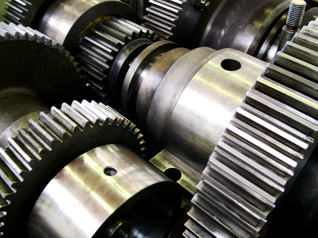
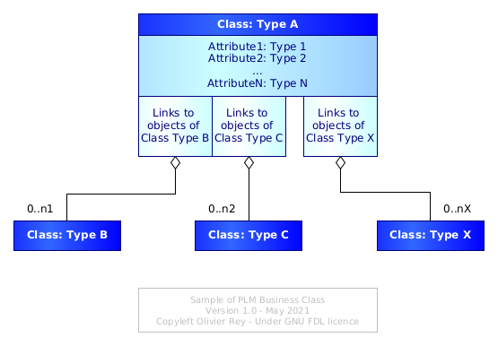
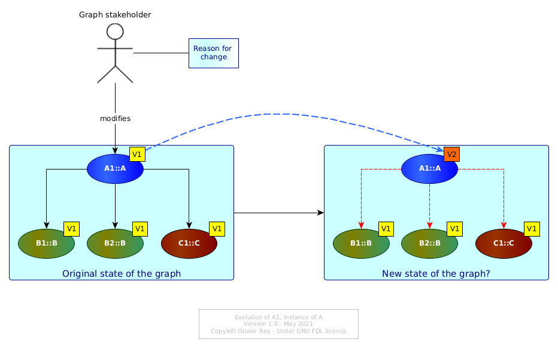
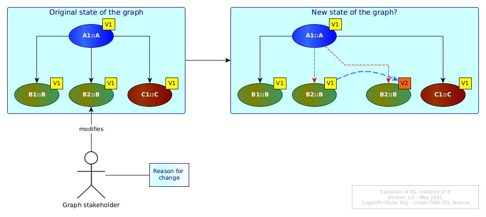
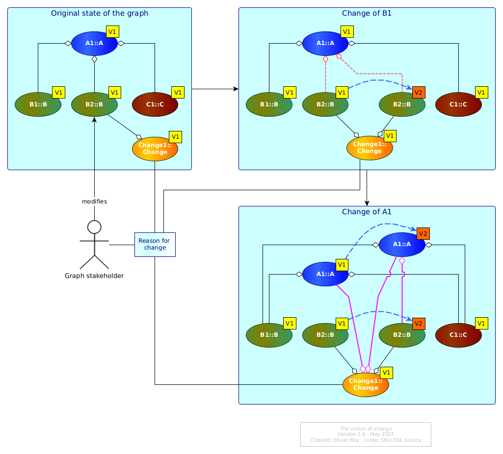
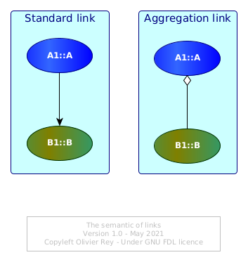
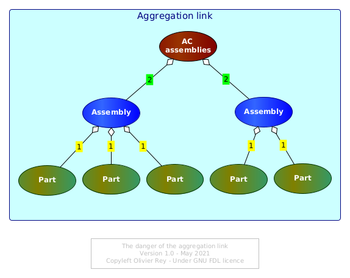
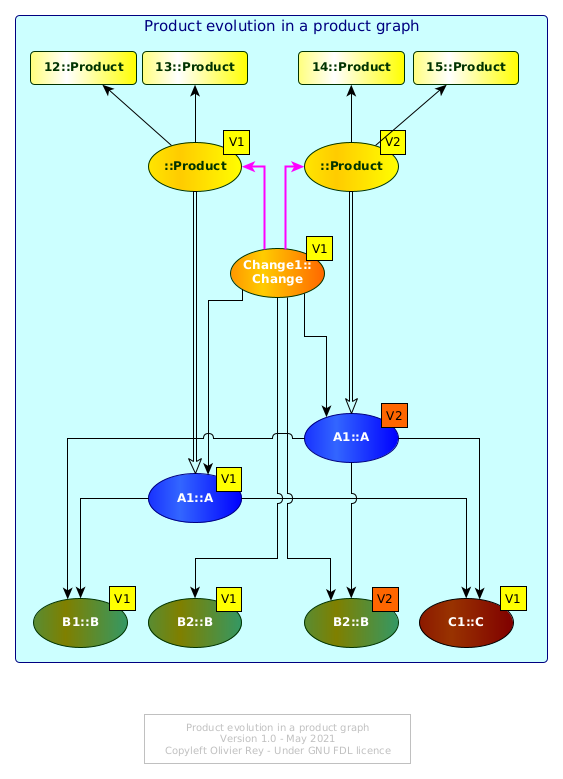

# PLM and graph data

*Photo by [Lotus Head](https://freeimages.com/photographer/LotusHead-31750) from [FreeImages](https://freeimages.com)*

This article is the first of a series on PLM. It aims to describe the main core functions of a PLM by taking the perspective of graph data.

As the industry is beginning to look towards IT a bit more seriously that what was done in the last decades, it may be important for IT people inside and outside the industry to understand the basics of a PLM. This can lead to points of comparison with other kinds of IT systems that are met frequently outside the industry (in the so-called "tertiary" sector).

## What is a PLM system?

PLM means Product Lifecycle Management. This acronym generally describes systems that are used to manage the "lifecycle" of a manufacturing product (we will come back on the lifecycle notion).

Indeed, a complex manufacturing product is composed of several parts that will evolve during its production life. The PLM system is supposed to enable the management of product data all along its lifetime and for several stakeholders concerned by it (engineering for the product design, industry for the product manufacturing and support for the product support).

## A graph of business objects

We will propose the following IT definition of the PLM: *A PLM is an IT system that is essentially manipulating a graph of "business objects"*.

We can define a business class as a conceptual entity with:

* A type (for instance "Part");
* A set of characteristics (also called attributes, fields or properties):
    * Those attributes can be typed data (strings, numerical values, currencies, date, etc.) but also documents such as Office documents, 2D or 3D drawings, raw data resulting from simulation testing, etc.);
* A set of lists of authorized links towards other classes.

Modern PLMs propose standard classes (we will come back on that point), but it is also possible to parameterize custom classes. Once a class is defined, the PLM system enables to create instances of the class, what are called "objects". Each business object will be of a certain class type and will have different values for its attributes (see Figure 1).

*Figure 1: Structural view of a business class*

The basic functions of the PLM will be to enable the management of one product graph by a more or less large team of people from different organizations.

## The lifecycle of a business object

The notion of lifecycle is often not clear for IT people that come from other areas than industry. The reason is the tertiary sector is not really using this term and prefers to speak about "states" or "state machines".

In the manufacturing industry, it is important to understand the lifecycle of the data that are representing the product. We can say that every data, for instance data associated to a part, will have schematically 2 different states:

* It can be "in work": people are working on a part but as the work is not finished, the data are not available for the rest of the community;
* It can be "released": the data is considered as stable and is published to the rest of the community.

Indeed, many versions of the same business objects can be stored in an "in work" status before being released. Also, if a part evolves, several versions will be released with time (which opens the topic of "applicability" that we will see later on).

In other words, industrial data is managed as IT people manage software source code, and not really as IT people manage data in the context of tertiary sector applications.

In the tertiary sector, the "management data" are generally stored with other purposes:

* It is required to be able to access to the data that are valid today;
* It is required to be able to access to important previous versions of data for auditing purposes (for instance before a contract modification);
* But it is not generally required to secure every change on data.

Note that the current way of managing data in the IT world is generating technical debt and graph-oriented techniques enable to solve that issue (see [here](https://orey.github.io/papers/research/index-research/)).

Coming back to the industry, industrial data being inside a graph, every change on a "node" of this graph (a business object) may have impacts on the linked objects.

Let us consider Figure 2.

*Figure 2: Basic evolution of a graph of objects*

Originally, all objects of the graph are considered as being in version 1. The instance `A1` of `A` changes to version 2. `A1` V2 can have different values in its attributes but the change implies questions about the links `A1` maintains with `B1`, `B2` and `C1`. Are they still valid? Maybe, on an industrial standpoint, some tests must be done (or digitally, or physically) to assess this point.

Let's now consider Figure 3 now where `B1` is evolving.

*Figure 3: Evolution of a linked object*

Must `A1` evolve too? If `B1` V1 was an error, maybe `A1` V1 should be transformed in `A1` V2 pointing to `B1` V2, and `A1` V1 should be made not usable by anybody...

## The notion of change

In Figure 3, we can see that it would probably make sense to make a new version of `A1` in order to take into account the change in `B1`. Let us name `Change1` the change that transforms `B1` V1 into `B1` V2.

`Change1` is an instance of the the `Change` class, which is a business object. When defining it in the first step, `Change1` will be in version 1.

But if, due to `Change1`, we have to change `A1` V1 into `A1` V2, then this change should also be associated to `Change1`.

The Figure 4 is showing the change of `B1` and then the change of `A1`.

*Figure 4: The change business object*

The `Change1` change is referencing in a first step only the previous and present version of `B1` and in a second step the previous and current version of `A1`.

Note that we could have created 2 versions of the `Change1`, one for the original change of `B1` and the second one for the change of `B1` and the impacted change on `A1`. This kind of choice will depend on the industrial change policy.

In the industry, the change object is crucial and often embeds many data including documents. There are many reasons for that, to begin with the costs of a change.

Indeed, any change on a manufactured product may imply costly impacts on the production line and on the support of the product. In some industries like aerospace, the product may be "certified" (airworthiness for instance). Any change to the product will imply a certification impact assessment that could result in costly re-certification. Another reason to manage changes is to be able to find back in the past what reason caused a change that resulted in product performance regression or problem.

Generally, the change object is at the core of a special process, often named "change board" or "change committee", where many stakeholders gather in order to determine if the change is worth doing, and if yes, what is the best solution (or the less worst).

## About the aggregation link

In the previous figures (from 1 to 4), the links between business objects were standard arrows, such as the one on the left of the Figure 5 below.

*Figure 5: The semantics of links*

On the right of Figure 5, IT people will have recognized a link with a white diamond shape. For UML users, this link means "aggregation".

Aggregation can be considered as a special case of relationship between 2 classes: It just bears more meaning than the simple arrow, the meaning that if `A1` is aggregating `B1`, that means that `A1` is a "bigger" structure than `B1` and `A1` is some kind of "container" object.

The aggregation link asks an important question in the PLM system: What is the elementary brick that contains only data and no other sub-brick? This should be a convention of the particular industry.

## The ambiguous notion of part

Generally, a manufacturing product can be seen as made of "parts". There are  conceptually 2 kinds of parts:

* The elementary parts: The ones that cannot be split into smaller parts;
* The assemblies: The parts that are containing other parts.

This notion is very important because:

* Defining properly the level of elementary parts is defining the minimal scale at which a certain business will manage its data lifecycle;
* Different businesses are often seeing the product at different levels (in terms of "elementary" parts), for instance support and engineering in aerospace.

The industry often refers as "part" something that can be or an elementary part or an assembly (because both entities usually have part numbers). This is often confusing and leads to misunderstanding with IT people. In some cases, it could be clearer to talk about a "leaf of the graph" or just a "leaf" as being the agreed lowest level of data managed in lifecycle, and about "containers" if the object managed is a container for other objects.

For instance, an assembly being a set of parts, the parts in that context could be "leafs", and the assembly would be a container.

For sure, a container has fundamentally the exact same structure as the leaf, the structure shown in Figure 1:

* It has properties with real data attached to its instance;
* It has links to other business objects.

The only difference between a leaf and a container is that, in the container case, there is at least *one link* that can be considered semantically as an "aggregation" (see Figure 5). A leaf should have no aggregation link.

## Product structure, aggregation and semantic ambiguity

As soon as we define a particular kind of links (aggregation), we can define "trees" which are partial representation of the global product graph just looking at the aggregation links between containers and leafs. This is often called: "product structure".

Even if this view is still very used in the industry, we must never forget that it is only a very partial (and potentially misleading) view of the product (moreover, this view can be insufficient for several stakeholders, such as the support engineering in aerospace).

Indeed, semantically typing the links is opening the door to a lot of semantic ambiguities. If it seems obvious that a assembly can be represented as an object that "contains" other objects that would be "parts", the fact that a group of components are stored in the same functional area (e.g. an area named "all assemblies related to air conditioning") introduced a double meaning in the aggregation link:

* The original meaning was: A physical component is physically the result of the assembly of smaller sub-components;
* The second meaning of aggregation would be an administrative way of gathering things (like a set).

The result is that, in the same "product structure", you can have quickly two or more different semantic interpretations of the same "aggregation" link.

*Figure 6: The danger of the aggregation link*

In the Figure 6 above, it is easy to see that the aggregation link tagged `1` is representing the physical aggregation, and the aggregation link tagged `2` is representing the administrative classification.

In reality, things are often much worse. Indeed, we usually can find many different concepts in the "product structure":

* The organization of the company (each organization will have a sub-tree with its own components);
* The variants of the product;
* The various versions of the same component (named "variable component" and aggregated under a "non-variable component");
* Etc.

## The influence of ERP systems on modern PLM systems

Modern PLM systems try to avoid this confusion brought by the "tree vision" of the product, by proposing other business classes and objects that enable the modeling of the industrial concepts.

For instance, the organization of the company should have an impact on access rights but not on the structure of the graph of objects. The variants of the products can also be managed with new concepts that enable to manage smoothly options compatibility and incompatibility. Versions of the same business object can be managed without all versions to appear in the "product structure".

The modern PLM systems propose more and more business classes that everybody need in the industry. Even if, structurally, those objects are still conforming to the Figure 1 definition, they represent in a much more accurate way the semantics of the industry, being engineering, manufacturing or support. For sure, those objects also come with their links to other domain specific business objects.

We could say that the PLM systems evolved as the ERP systems did in the last decades: towards a better description of the business semantics, while keeping the core graph, lifecycle and change engine available. This, for sure, is a major step ahead most companies still don't benefit from, unfortunately.

## About applicability

Before closing this first brief introduction to PLM systems concepts, we must stop a while on the applicability context.

Let's consider Figure 4 right bottom blue area. We have many versions of `A1` and `B1` that are existing. What version is really "applicable" to a certain product that was produced in the assembly line Saturday May 1st 2021?

In a graph, the simplest way to do it would be to have a business object representing the various instances of the product and to create a link between the instance number `12` of the product and the proper version of `A1`and `B1` it is using.

This is what is shown in Figure 7 (with an intermediate object that represents the product version).

*Figure 7: Product evolution in product graph*

Product instance `12` and `13` are instances of the V1 of the product. After the change, `14` and `15` are instances of the V2 of the product.

The idea here is to use the graph in order not to have to "calculate anything". As the product is made of released business objects, the product is a set of links to business objects (that on their side can also link to other objects). Here, we see the importance of having homogeneous semantic links, especially if the head of the tree (the release of the product) is supposed to be the head of the full product tree for this particular version.

For sure, if the graph is full of semantic ambiguity (like the ones we mentioned), we may end up in the necessity of adding complex management rules to get the real tree of applicable objects for a specific serial number (this is often called "configuration calculation"). Criticizing this model would need a dedicated article.

All that we need to say is that modern PLM systems are more and more graph-aware and are managing the product configuration in manners that are used successfully for decades in the domain of complex huge softwares. To be simple: using the real power of graphs with adequate domain specific business objects leads to a very powerful industry management approach.

## The core features of the PLM systems

If we attempt a synthesis of this brief introduction, we could say that the PLM system very core features appears to be:

* The capability of managing a graph of business objects;
    * Business objects are instances of classes having fields, documents and links to each other;
* The functionality of managing the lifecycle of business objects:
    * Version management,
    * Change management.
* The functionality of proposing domain-specific business objects and domain-specific relationships between objects, each set of business objects/links enabling specific features (quite often sold as "modules" of the PLM system).

Essentially, the real core of a PLM system is *graph data*. That implies that more advanced features linked to configuration and applicability can be made simple thanks to correct graph data usage.

## The complexity of graph data modeling

Representing data as graphs is very powerful and used in many applications nowadays. It enables to dissociate (under certain conditions) the data from the the links data have together. However, implementing management rules in graphs is not easy (see the [graph transformation](https://orey.github.io/papers/research/graph-transfo/) page).

## Getting inspired by PLMs outside of industry

If the PLM systems are not easy to understand by people coming from the tertiary sector (like banks, insurances or public sectors), in a world obsessed with data (see [The real nature of data](https://orey.github.io/papers/articles/data-interop/)), the introduction of graphs in management data is definitely a good idea (see [here](https://orey.github.io/papers/research/graphapps/) and [there](https://orey.github.io/papers/research/index-research/) in this site). More and more, we see attempts of PLM use in the tertiary sector in business domains that are not obviously similar to industry use cases.

But we have to remember that tertiary sector applications are managing a lot of business rules while industry are managing much less (that will be the object of a future article about "end to end PLM"). The challenge of tertiary sector applications is to benefit from the graph data approach while being able to implement and maintain complex business rules in a universe of graph data.

This is not trivial and the purpose of most of the pages of this site.

## See also

Read also the second article on PLM: [Configuration management of industrial products in PDM/PLM](conf-mgt.md)

(*May 2021*)
