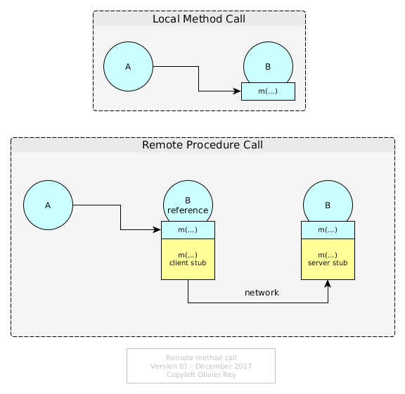

# Considerations About Rest And Web Services

 

It's been a very long time since I've been explaining this to a lot of people and maybe today I should try to put the full explanation on paper.

## A Bit Of History

When the REST concept was published, sometimes around 2001, I was in a middleware team in a big software company. In that team, we were accustomed to use business services for more than a decade.

Indeed, the term "web service" or "SOA" was not existing at the time. But, in many business domains such as airline commercial business, banking, insurance, etc., many people knew what was RPC and were using it extensively to communicate between systems.

RPC means Remote Procedure Call. RPC concept was introduced to me with the DCE \([Distributed Computing Environment](http://pubs.opengroup.org/onlinepubs/9629399/)\). DCE was a very powerful standard that were never completely used, as far as I know, but it explained in great details the basis of interoperability between systems. For sure, the standard was only making a synthesis of ideas that were much older.

## What Is RPC?

### Interoperability Contract

Fundamentally RPC is, like it is said in its name, a remote procedure call.

To understand the concept, let's imagine 2 programs that want to communicate, first program being `A` and second being `B`. `B` will publish an API in order to be called. In most procedural programming languages \(like C\), if the two programs are located on the same machine, `A` can call the API of `B` \(see the top of Figure 1\).

Figure 1: Local Procedure Call and Remote Procedure Call

The idea of interoperability in RPC is that, if `B` is located in a remote machine \(or a remote process\), `B` should not change when invoked by `A`. On the other side, `A` should not change in its invocation of `B` interface. So `A` will call a `B` interface locally to its system, this interface hiding a client stub that will wrap/serialize data in a certain format to be sent on the wire; on the machine hosting `B`, there will be a server stub unwraping/unserializing data to call locally the `B` interface.

For sure, in order to work in a complex network, the message sent from `A` will have to fond is route to the machine hosting `B`. We have here all the elements of the client-server architecture.

### The Notion Of "Verb"

Well, RPC is a bit more than that. Because, when calling a remote procedure \(or function\), semantically, we call a remote system asking it to do something \(the B API\) with the input data that we provide \(the request\). We expect data back \(the response\).

This is/was called a "verb". `A` says to `B`: "perform `B-interface` contract with my input data and give me back the contract expected output data".

Trends passed on many parameters:

* The protocols used changed,

* The addressing schemes changed,

* The format of the data changed \(from many proprietary formats or Edifact, to XML to JSON\).

But the fact is, in most businesses proposing a certain degree of business complexity, RPC is still there. Most often, verbs are expressing an "action" semantic and requests are proposing data trees, so as responses.

### No Assumptions on the Technology Used

We must notice that RPC does not make any assumption on the technology used by the server (the one that implements the `B` interface).

The contract is limited to a verb, and two trees of data, one for the request and one for the response. We could note the contract as being: `A` uses `response = B-interface(request)` .

## The Corba Failed Attempt

### Principle

In the 90s, the objet-oriented programming (OOP) being trendy, the intention behind [Corba](https://en.wikipedia.org/wiki/Common_Object_Request_Broker_Architecture) was born. The idea was to generalize the object notions to a distributed world. The logic consequence was to imagine a client-server protocol for objects to communicate between one another.

The principle is simple: an object `A` calls locally a method `m(...)` on an object `B`. If we imagine the `B` instance as being remote, the idea is the same than RPC: The method should have a client and server stub.

Figure 1: Local Method Invocation and Remote Method Invocation

The fact is, despite the fact that it looks like RPC, this model is radically different from it:

* It supposes that the remote system is object oriented;
* It supposes that the remote system is stateful (the `B` instance must exist for its method to be called);
* It supposes an addressing system to find the reference of the instance of B;
* The contract of the method is not self sufficient, indeed, conceptually `A` asks for: `response = state(B).m(request)` which introduce some uncertainty on the call (because it depends on B state);
* The contract is supposing the state of B should be managed differently from the request parameters, and so, it puts a different semantic weight on B that should be a "first-class entity" whereas the request parameters are considered as "second class entities".

This way of thinking distributed systems is leading to consider that the network offers "objects that can provide services on themselves", instead of providing simple services (i.e. distributed functions).

In 2017's language, we could say that CORBA is proposing a "resource-oriented architecture".

### The Drawbacks of the ORB Approach

An ORB (Object Request Broker) is a middleware that enables to manage those distributed objects, their remote invocation and the required addressing schema.

The main drawback of the ORB approach is that a service can be, semantically, much more complex than calling one method of one object. Indeed, if we call a method on an object, we can imagine that the object will process this method on its state, or that it will process it considering its aggregation ("facade" pattern).

For services, we do not make any assumptions of the kind. We just call a function that is supposed to do something with the inbound parameters that we provide (inbound parameters that are generally some kind of tree of objects having or not links together).

Certainly, we can "twist" Corba in order to make it look like RPC: we can use objects that do not contain state and that have "methods" that are indeed just "procedures".

But the addressing repository will have to manage object instance addresses instead of knowing the service location.

### An Idea That Keeps Coming Back

This idea keeps coming back. Rest architecture can be seen as a reformulation of Corba principles:

 * Resources are benefiting from an addressing scheme (URI);
 * Resources have a name (class name), they are identified through their instance and they publish methods;
 * Invoking a service is indeed a remote method invocation.
 
Moreover, a strange design option is taken in the Rest specification: the presentation layer is binded on the underlying network protocol (http) in a very hard way. Indeed, the only verbs that seem to be invokable are CRUD verbs (CRUD standing for Create Retrieve Update Delete). 

We can also see this ORB principle applied, in a weaker way, in WSDL. When SOAP web services were really in the spirit of RPC, WSDL standard groups transactions in a way that is sometimes near to the idea of a group of methods operating on a remote object.

We can note also in WSDL, a very strange hard biding on the underlying protocol (the WSDL schema integrates information from several OSI layers which is bad).

Rest was those last years recently put in front of the scene due to IT marketing and the creation of [Swagger.io](https://swagger.io)

## The Core Problem of Resource Orientation

Resource orientation, like in an ORB, is semantically a very hard restriction of RPC. RPC is a way of calling a service that will transform a graph of data in another graph of data. In the ORB approach, we call a method on a object, which is very restrictive.

This can work if the semantics of the business is simple. If my business objects are modeled properly by one class, then maybe an ORB can work. If the business objects I have to model need several classes interacting together in a complex manner, then using an ORB will be a real pain. When a service can transform my graph of objects into another graph of objects, an ORB will force me to "adapt" my semantics to a pure technical object-oriented method call.

For sure, this is true for Rest, as it was true for Corba. For pure Rest, it is even worse: being able to consider that only the http verbs (network layer) should be used to express the semantics of the presentation layer, the semantics of the "functional verbs" seems even more restrictive than Corba.

For social networks like Twitter or Facebook, it seems to work. I can define a Rest API providing all the services offered by the platform. For a business application, we generally cannot use Rest because the constraints (RMI with CRUD verbs) are too strong.

Again, like in Corba, we can cheat: we can use "almost Rest" and have a request body with JSON. That turns the method invocation into an almost-service. We can also include in the request a service name, but that is pretending to implement Rest and doing JSON-RPC-like behind the scene.

## Conclusion

Rest is very practical for the applications which semantics is simple and can be adapted to two constraints:

 * A resource oriented API (pushing for services to be RMI);
 * A verb semantic limited to a variation of CRUD.

For other applications, like business applications [1], we believe things never changed for decades. Before SOA, RPC services were existing. They were the same stuff than JSON-RPC like transactions today.

Service orientation is a much more general way of implementing service distribution than ORB concepts. In particular, service orientation does not presuppose that the remote server sees the data as the caller  does. The service signature is an agreed contract for both the client and the server to communicate together, but each of them can restructure data as they want, in an object oriented way or not.

So, my advice is not to force yourself to implement a Rest API to your application because it is trendy, but to do it only if your business semantics enables it.

## See Also

 * [About GraphQL](graphql-web-services)

## Notes

[1] - In some businesses, like the airline one (standardized by [IATA](https://www.iata.org)), services have big requests and big responses for decades because the business requires it.

