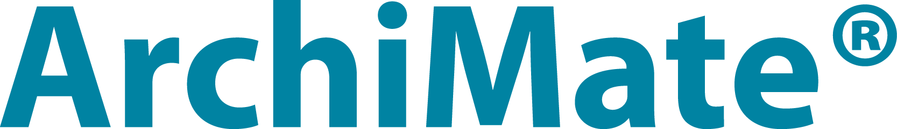

# Introduction to the Archimate Revolution

 

In the last decade, a quiet revolution took place in the Enterprise Architecture (EA) domain. This revolution is called [Archimate](http://www.opengroup.org/subjectareas/enterprise/archimate).

This article is the first of a series of articles focusing on some specific aspects of Archimate and practices around the standard.

All Archimate diagrams of this site are done using [Archi](https://www.archimatetool.com/). This tool is free and great. If you use it, consider making a donation.

## A Semantic Modeling Language

### Brief Introduction To The Archimate Meta-Model

Archimate is a modeling language that enables to describe and study several aspects of the enterprise:

  * Its strategy and motivations,
  * Its projects,
  * And the 4 core layers of enterprise description:
    * The business layer,
    * The software layer,
    * The technology layer (infrastructure),
    * The physical layer.

All those aspects propose:

  * Typed artifacts,
  * Typed relationships between artifacts.

Note that several relationships types can interconnect many different types or can be used in many contexts. The detailed description of all artifacts is not in the scope of this article and we can advise the reader to refer to the book *Enterprise Architecture At Work* from [Mark Lankshorst](https://en.wikipedia.org/wiki/Marc_Lankhorst).

Archimate also defines interlayer relationships which enables to "connect" the various layers together. This is an absolutely fundamental feature of the language.

Indeed, an Archimate model is actually a *graph*. For those who are familiar with the Semantic Web ([RDF, RDFS](https://en.wikipedia.org/wiki/Resource_Description_Framework), and [OWL](https://en.wikipedia.org/wiki/Web_Ontology_Language)), any Archimate model is a semantic graph.

The graph model is the result of the union of all diagrams implemented with the same set of artifacts. For each artifact, the union of all its incoming and outgoing relationships creates the [neighborhood](https://en.wikipedia.org/wiki/Neighbourhood_(graph_theory)) of the artifact in the graph model.

When you use Archimate, you represent things using the various artifacts that are available to you. Each element you draw on a certain views (there are many types of views) will have a certain type, like "Business Process" or "Application Function". Thus, the resulting model will be a set of views, each of them presenting many interconnected artifacts that all are instances of types that have a specific *meaning*.

### Viewpoint And Meta-Model

The creation of a semantic language generally implies the creation a meta-model.

Many tools are existing to create meta-models (for instance [Eclipse EMF](https://www.eclipse.org/modeling/emf/) with [Sirius](http://www.eclipse.org/sirius/), or [MetaEdit+](https://www.metacase.com/mep/) depending if you want to pay or not).

In the history of enterprise architecture, many approaches defined the notion of "view point": in order to act on the enterprise as a whole (or as a system), the first step is to describe the enterprise. In order to describe it, due to the complexity of the task, the architect must use several viewpoints. The union of those viewpoints is defining the model of the enterprise.

The [Zachman framework](https://en.wikipedia.org/wiki/Zachman_Framework) was one of the first publicly available enterprise architecture "framework".

The problem with this framework, but also with many other enterprise architecture frameworks, is that they propose many viewpoints, generally each of them proposing a complete meta-model for each viewpoint (with artifact types and relationship types), but no consistent view of those various viewpoints.

This is a major issue for the framework because:

  * Separate meta-models for separate viewpoints can be ambiguous and can create various ways of representing the same things;
  * There can be semantic overlap between various viewpoints and their respective meta-model;
  * What should be a single viewpoint can artificially be split into different view points with different meta-models (we'll see later in this article the dramatic consequences of the Longépé Enterprise Architecture model in France).

If the consistency is not "built in" the framework, if it is not part of the primary requirements, then the framework will be very difficult to use.

And the fact is interconnecting various meta-models to be able to create something consistent is not an easy task. Indeed, Archimate seems to be the best illustration of it, and I fear I don't know many other samples. The only modeling approach that look like Archimate is the [Aris methodology](https://en.wikipedia.org/wiki/Architecture_of_Integrated_Information_Systems).

### Samples of Non Consistent Modeling Approaches

#### Sample #1: UML

UML is not consistent due to the many meta-models that are not semantically connected together as a whole.

Suppose you made class diagrams and sequence diagrams for a set of classes. You can add a state diagram for a particular process of a specific class `A` of your model. In UML, there is no way to know if this state diagram is consistent or not with the rest of the diagrams that include `A`. This is due to the fact that UML proposes a set of various kinds of views that are not *linked together*.

This problem can perhaps explain why modeling in UML was progressively abandoned by many projects; because it was not really suited to express in a consistent way what the code should be.

#### Sample #2: Longépé

Another dramatic inconsistent model is the Longépé French model which defined, instead of Archimate "software layer", two different layers:

  * One functional layer, that could be interpreted as the Application Function part of the Archimate meta-model,
  * One technical layer, that could be interpreted as the Application Component part of the Archimate meta-model.

As in Archimate, there is, for Longépé, a business layer and an infrastructure layer, which scopes are almost the same than Archimate's.

In the Longépé model, every model can be "derived" from the model of the superior layer. This means that the technical layer can be derived from the functional layer. This assertion is obscure, misleading and semantically erroneous. In Archimate, the application function is "assigned to" a application component. That enables to manage the good and the bad assignment, what is called the "urbanisation" in French (notion of good or bad function positioning in the global IT systems).

This artificial split of one layer (the application layer of Archimate) into two layers which dependency is erroneously defined, caused a huge number of French IT projects to fail, and numerous errors of interpretation and understanding for French architects. The book of Christophe Longépé was at the origin of many misjudgments, errors, confusions and money loss in the French market since the publication of its first edition in 2001.

#### Sample #3: Projects Creating Their Own Modeling Framework

In consulting missions, I also saw strange practices, as the one of creating a project-specific enterprise architecture modeling framework that evolved throughout the project and incorporated progressively various inconsistent meta-models coming from various modeling standards. For sure, all architects works in this framework were confusing and not usable and led the project to failure.

## The Many Revolutions of Archimate

### Revolution #1: The Language Just Works

That's why the fact 

It is the same for the various views of many meta-model. Indeed, if the quality of the meta-model is high, then the modeling will be good. However, if the meta-model is bad, the modeling will be very bad.

We will perhaps come back in more details on that point but bad meta-models generally propose ambiguous concepts and artifacts, very often concepts that are semantically overlapping.

Archimate:

  1. Reduces the ambiguity in the description of things related to the enterprise,
  1. Proposes a graph approach that is adding consistency to the model.

This is, really, a revolution. In some cases, meta-models induce architects to think badly, to force themselves to think in an inconsistent model where the semantics are confusing. In Archimate, this is not the case.

### Revolution #2: Architects Can Share And Propose Auditable Works

Even if Archimate will not guarantee that 2 enterprise architects will produce the same modeling when representing the same things, using the same standardized language enable each of them to understand the modeling of the other, to challenge it and to debate.

We can forget Visio or Powerpoint schema based modeling, that are very ambiguous at several levels (we will come back on those points in further articles). The works become auditable by other Archimate architects.

### Revolution #3: Managing Complex Representations

### Revolution #4: Aggregate Various Sources of Knowledge

### Revolution #5: Managing Dependencies

### Revolution #6: Modeling Transformation, Modeling Time

### Revolution #7: Using Archimate In Many Software Activities

