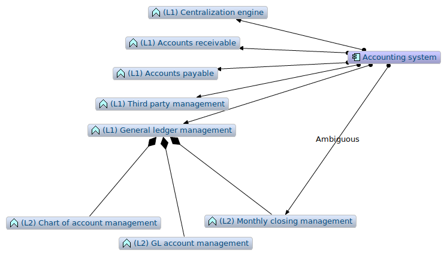

# Archimate recipes

Modeling in [Archimate](archimate-intro.md) can sometimes present some difficulties.

In this article, we will expose some tips and tricks that can facilitate your daily life as an enterprise architect using Archimate in your modeling activities.

## Prerequisites

This article is using [Archi](https://archimatetool.com). This tool is great. If you are using it, please consider making a donation.

## Introduction to tags

Archimate is a very powerful language but sometimes, it can be very useful to create tags to distinguish artifacts or group them into sets.

We will put some tags in the name of the artifact in some cases, and in other cases, we can benefit from the use of properties (for instance to process some calculation based on some property values). The convention we use in this article is to "tag" the names of the artifacts by placing a label between parenthesis.

## Levels of nesting

### Basics

In an Archimate model, it is quite common to model nested objects like shown in Figure 1.

<u>Figure 1</u>: Sample of nesting in the business layer

In Figure 1, we can see that the `Accountant` role is assigned both to the `Accounting` business function and to the `Closing` business process. The `Closing` artifact is nested into the `Accounting` function that is, in our model, a business function of the highest level.

Being the highest level of "granularity" of our processes (in some cases, this level can be the one of the quality system of the company), we can tag the `Accounting` artifact with the level `(L1)` to indicate its level.

All the business processes and/or business functions that will be nested into it will be tagged `(L2)` for "level 2". All nested objects inside level 2 objects will be tagged level 3 `(L3)` and so on.

An option is to flag the relationship with the level as shown in Figure 1. This can be superfluous if the artifacts are already tagged.

### Graph view

This simple system enables to sort artifacts per level on the Archimate graph view (see Figure 2).

<u>Figure 2</u>: Archimate graph centered in the Accountant artifact

When the diagram has many artifacts, it is possible to sort the level of vision that we want to have in the graph view. This kind of need appears for instance when we want to have a good vision of the full coverage of a certain point of view.

In the graph view, helped with the tags, we can sort all processes attached to the `Accountant` role per level in order to determine in, in all our views, we cover what we imagine as being all `(L1)` processes.

<u>Figure 3</u>: Sorted Archimate graph centered in the Accountant artifact

When the model has many views with many artifacts at various different levels, the graph view helps making the model consistent.

### Working at different levels

In Figure 4, working with process levels enabled the enterprise architect to indicate that, at a certain level `(L2)`, the main role taking in charge the `Closing` process is the `Accountant`, but at a lower level, we have other roles taking in charge a part of the process.

<u>Figure 4</u>: Main role and secondary role

For sure, all diagrams should be consistent, so possibly not to show the relationships that could be misleading in the view.

For instance, in Figure 4, the assignment link between `Accountant` and `(L2) Closing` is misleading in the diagram. Because, it this diagram, we should only show the various roles that collaborate to the sub-processes of the `(L2) Closing` process.

<u>Figure 5</u>: Main role and secondary role (less ambiguous view)

Figure 5 is showing a much less ambiguous view. For sure, as soon as we we look at those processes at the `(L2)` level, the `Business controller` role will become invisible.

### Functional content of application components

A very common requirement that we have in modeling the IT systems in Archimate is the requirement of modeling application functions at different levels.

<u>Figure 6</u>: Accounting system basic view

The Figure 6 shows a basic accounting system with implicit assignment and aggregation links. By tagging the functions with their level, we can clarify at what level we are looking at the model.

The problem is to represent a zoom on a particular function like shown in Figure 7.

<u>Figure 7</u>: The need to represent an ambiguous assignment

This assignment relationship being flagged, the graph view enables a grouping of functions per levels.

<u>Figure 8</u>: The need to represent an ambiguous assignment

When we will try to assess the coverage of functions in the accounting system, we will have to consider only the `(L1)` application functions.

### Conclusion on nesting

Nesting is an important part of big Archimate models. Generally, it is very useful to have certain artifacts (like active structures for instance) attached to several different levels of behaviors depending on the views.

Most of the time, tagging artifacts with their level:

  * Enable not to confuse the levels of artifacts,
  * Get interested between the nested relationships between various levels of artifacts,
  * Think about coverage (in our case, processes of a certain level per role, or sub-processes of a certain process).

## Several instances of the same software in different contexts

To be done.

## Managing time and scenarios

To be done.

## Reports

Reports can be generated from the Archimate model. You can find [here a report template](https://github.com/orey/archi-report-template) slightly modified compared to the original [Archi](https://archimatetool.com) one.

(*July 2018*)