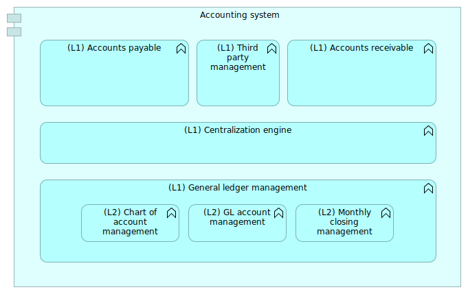

# Archimate recipes

Modeling in [Archimate](archimate-intro.md) can sometimes present some difficulties.

In this article, we will expose some tips and tricks that can facilitate your daily life as an enterprise architect using Archimate in your modeling activities.

## Prerequisites

This article is using [Archi](https://archimatetool.com). This tool is great. If you are using it, please consider making a donation.

## Introduction to tags

Archimate is a very powerful language but sometimes, it can be very useful to create tags to distinguish artifacts or group them into sets.

We will put some tags in the name of the artifact in some cases, and in other cases, we can benefit from the use of properties (for instance to process some calculation based on some property values). The convention we use in this article is to "tag" the names of the artifacts by placing a label between parenthesis.

Tags are sometimes linked to [derived relationships](http://pubs.opengroup.org/architecture/archimate3-doc/chap05.html) but often they answer to other needs.

## Levels of nesting

### Basics

In an Archimate model, it is quite common to model nested objects like shown in Figure 1.

<u>Figure 1</u>: Sample of nesting in the business layer

In Figure 1, we can see that the `Accountant` role is assigned both to the `Accounting` business function and to the `Closing` business process. The `Closing` artifact is nested into the `Accounting` function that is, in our model, a business function of the highest level.

Being the highest level of "granularity" of our processes (in some cases, this level can be the one of the quality system of the company), we can tag the `Accounting` artifact with the level `(L1)` to indicate its level.

All the business processes and/or business functions that will be nested into it will be tagged `(L2)` for "level 2". All nested objects inside level 2 objects will be tagged level 3 `(L3)` and so on.

An option is to flag the relationship with the level as shown in Figure 1. This can be superfluous if the artifacts are already tagged.

### Graph view

This simple system enables to sort artifacts per level on the Archimate graph view (see Figure 2).

<u>Figure 2</u>: Archimate graph centered in the Accountant artifact

When the diagram has many artifacts, it is possible to sort the level of vision that we want to have in the graph view. This kind of need appears for instance when we want to have a good vision of the full coverage of a certain point of view.

In the graph view, helped with the tags, we can sort all processes attached to the `Accountant` role per level in order to determine in, in all our views, we cover what we imagine as being all `(L1)` processes.

<u>Figure 3</u>: Sorted Archimate graph centered in the Accountant artifact

When the model has many views with many artifacts at various different levels, the graph view helps making the model consistent.

### Working at different levels

In Figure 4, working with process levels enabled the enterprise architect to indicate that, at a certain level `(L2)`, the main role taking in charge the `Closing` process is the `Accountant`, but at a lower level, we have other roles taking in charge a part of the process.

<u>Figure 4</u>: Main role and secondary role

For sure, all diagrams should be consistent, so possibly not to show the relationships that could be misleading in the view.

For instance, in Figure 4, the assignment link between `Accountant` and `(L2) Closing` is misleading in the diagram. Because, it this diagram, we should only show the various roles that collaborate to the sub-processes of the `(L2) Closing` process.

<u>Figure 5</u>: Main role and secondary role (less ambiguous view)

Figure 5 is showing a much less ambiguous view. For sure, as soon as we we look at those processes at the `(L2)` level, the `Business controller` role will become invisible.

### Note on derived relationships

Semantically, we try to express an ambiguity. Figure 1 could say that the `Accountant` role is assigned to `Closing` and "in a more general way" to the `Accounting` function. But we know nothing about the other `(L2)` functions and if the `Accountant` role is really assigned to all `(L2)` functions that would compose the `Accounting` function.

The definition of a relationship is not really helping:

> If two structural or dependency relationships r:R and s:S are permitted between elements a, b, and c such that r(a,b) and s(b,c), then a structural relationship t:T is also permitted, with t(a,c) and type T being the weakest of R and S.

[Source](http://pubs.opengroup.org/architecture/archimate3-doc/chap05.html)

Let's say `C` is the composition relationship ("composes") and `A` the assignment relationship ("is assigned to"). We have:

  * `R1 = Closing C Accounting`
  * `R2 = Accountant A Accounting`
  * `R3 = Accountant A Closing`

So, in the context of structural relationships derivation rules, we could say that `R3 + R1 &rarr; R2`. That means that `R2` is a derived relationship.

In the activity of modeling, derived relationships are not always interesting. Indeed, in Figure 4, we don't want to have `Business controller` assigned to `Closing`, even if `Closing` is composed with `Validate provisions`.

We believe that, in such cases, it is clearer to use tags. When watching a role, we can see immediately at what level of process he is assigned. If we don't use the derive relationship, we can express complex situation of drill down that are, strictly speaking, not complete, but that "fit" better to the reality.

### Functional content of application components

A very common requirement that we have in modeling the IT systems in Archimate is the requirement of modeling application functions at different levels.

<u>Figure 6</u>: Accounting system basic view

The Figure 6 shows a basic accounting system with implicit assignment and aggregation links. By tagging the functions with their level, we can clarify at what level we are looking at the model.

The problem is to represent a zoom on a particular function like shown in Figure 7.

<u>Figure 7</u>: The need to represent an ambiguous assignment

This assignment relationship being flagged, the graph view enables a grouping of functions per levels `(L1)` and `(L2)`. If we think about coverage, e.g. to answer to the question "what are, in all views of the model, all the functions of the accounting system?", we'll have to consider only the `(L1)`.

<u>Figure 8</u>: The need to represent an ambiguous assignment

Indeed the relationship `Accounting System` to `Monthly closing management` that we created in a certain viewpoint is a derived relationship and a consequence of 

### Conclusion on nesting

Nesting is an important part of big Archimate models. Generally, it is very useful to have certain artifacts (like active structures for instance) attached to several different levels of behaviors depending on the views.

Most of the time, tagging artifacts with their level:

  * Enable not to confuse the levels of artifacts,
  * Get interested between the nested relationships between various levels of artifacts,
  * Think about coverage (in our case, processes of a certain level per role, or sub-processes of a certain process).

## Several instances of the same software in different contexts

Big software such as ERP often propose several modules. Documenting the proposed modules can be of interest to be able to capitalize on the descriptions, especially of some customizations were done inside the off-the-shelf software.

The figure 9 shows an illustration of that case: The module 3 of the ERP was customized centrally to the company for the needs of the French subsidiary.

<u>Figure 9</u>: Standard and customized modules

The `(FR)` tag will enable to see directly that the function is customized in a certain context.

The complexity comes when we will try to represent the various instances of the ERP running for the various subsidiaries.

<u>Figure 10</u>: Several ERP instances

In figure 10, we use the specialization relationship to define the "instances" of ERP used by several subsidiaries based on the "central version" of the ERP.

This figure is ambiguous, however. It lets think that every subsidiary is using all modules of the ERP, whereas it is probably not the case. The `(L1) ERP` is the description of the "central version" of the ERP, the one that will be deployed per subsidiary, and the description of its sub-modules.

But we also need sub-modules for the instances of that product, knowing that only the French subsidiary is using the customized `(L2) ERP module 3`.

<u>Figure 11</u>: Linking sub modules

The Figure 11 proposes a way to reuse the sub-modules defined at the `(L1) ERP` level. This can be sufficient if only the French subsidiary is using the `(L2) ERP module 3`. But if the US subsidiary was to use also the module 3 *without* the French customization, we would have to reconsider the modeling in order to better represent the reality.

<u>Figure 12</u>: Specializing module 3

The figure 11 shows how to specialize module 3 in order to represent the reality. The US ERP will use the standard ERP module 3 with standard functions, whereas the French subsidiary will use a customized version of the module 3 containing the French customizations.

By creating another module, specialized from the original module 3, we were able to express the reality. The tags also enable the identification of the various dimensions that we want to keep track of:

  * The various level of nesting of components,
  * The organizations running the software,
  * The business domains.

All the tags used in the model should be documented precisely in the model description. They represent a kind of specific taxonomy of the various artifacts and ease the understanding of complex situations.

## Managing time and scenarios

Quite often in the digital transformation process, we need to establish the "as-is" situation and the "to-be" situation. This can be quite tricky if some naming conventions were not determined to make understand what are the "as-is" artifacts and the "to-be" ones.

For instance, Figure 12 shows us a customized ERP module 3 for the French subsidiary. Let us suppose that this module is the "to-be" situation.

<u>Figure 13</u>: As-is situation

The Figure 13 would describe the as-is situation.

We know we need customized functions for the French subsidiary. Those functions will have to be implemented in some application component, being within the ERP module 3 or in an external module. That leads us to 2 scenarios.

<u>Figure 14</u>: 2 scenarios

The Figure 14 shows a way of representing the 2 scenarios:

  * One being a direct modification of module 3 with the new functions (scenario 1);
  * One being a light modification of module 3 with the access to an external application implementing the new functions.

In that case, we have 3 artifacts corresponding to the module 3, each of them having a different temporal tag:

  * `(as-is)` for the current module 3,
  * `(s1)` for the first scenario,
  * `(s2)` for the second one.

We decided to keep the link between the evolutions of the module 3 (`(s1)` and `(s2)` tags) and their origin tagged `(as-is)` by using a specialization relationship tagged with the scenario number. This convention enables to work on alternate scenarios.

Le's suppose now that we want to describe the following scenario:

  * Step 1: Implementing the customized functions into the ERP module;
  * Step 2: Getting those customized functions out of the ERP module.

We would have the situation presented in Figure 15 with `(s1)` and `(s2)` representing the steps 1 and 2.

<u>Figure 15</u>: Evolution of solutions with time

This solution has an advantage: the ERP content is always exact, because the tags "as-is" and "to-be" duplicated the "ERP" artifact. The drawback is that the ERP artifact is not unique.

Another description choice would have been to keep only one artifact for the ERP component. The component would have aggregated the several various "versions" of the module 3. In that case, the links between the ERP and the version of sub-module should have been very explicit in order to keep track of the various modifications of the module 3.

Using temporal tags enable to better formalize scenarios and successions of steps in a context of digital transformation. This use must be adapted to the purpose of the project. In all cases, the trade-off analysis result should be explained in the model itself.

## About tags

In this article, we have introduced the use of tags in several cases:

  * Nesting
  * Multiple instances
  * Time management

The first case can be used for clarity and consistency. Using tags for nesting does not add semantic information to the model, but enables it to be more readable.

The case of multiple instances is more complex, because we often want to represent several meanings at the same time, for instance two companies are using the same software but not really the same functions in it. In that case, a specific trade-off must be done in order to find the correct level of expressiveness.

The case of time management is particularly useful to represent the various states of a digital transformation, or the various scenarios to go from one state to another. In that case also, the trade-off analysis is important and depends on what we really want to express.

One simple rule can be to use different artifacts in the case when those artifacts can be estimated separately. For instance in Figure 14, the various versions of the module 3 will enable different sizing. The fact that we have only one ERP artifact would take the hypothesis that the version of the module 3 has no impact on the full ERP, whereas having 2 ERP artifacts will lead to think that depending on the version of the module 3, the ERP component could be impacted.

We can note that those tags are not adding new semantic content (like UML stereotypes can do for instance). In this situation, tags can really be of help in quite a large number of situations.

In Figure 10, we used tags to propagate two Archimate information in the tags of the software:

  * Location
  * Main organization using the software

This use should be balanced and challenged. We did that in order to materialize the various instances of the software and the fact that those instances were really depending on the where and the who. On the other hand, native Archimate artifacts are existing which can be ambiguous. Sometimes, tags are just temporary ways to represent a complex reality before using a more standard way to do it.

Remember that models are dynamic and often work in progress and that there is no definitive way of modeling complex reality.

## See also

  * [Introduction to Archimate](archimate-intro.md)
  * Reports can be generated from the Archimate model. You can find [here a report template](https://github.com/orey/archi-report-template) slightly modified compared to the original [Archi](https://archimatetool.com) one.

(*October 2019*)