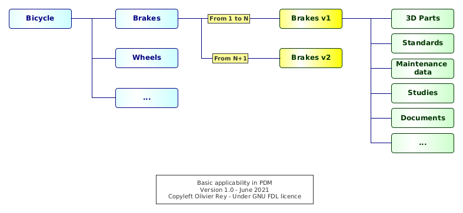
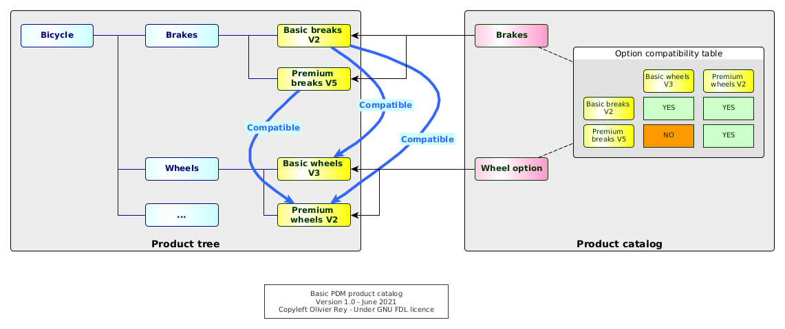
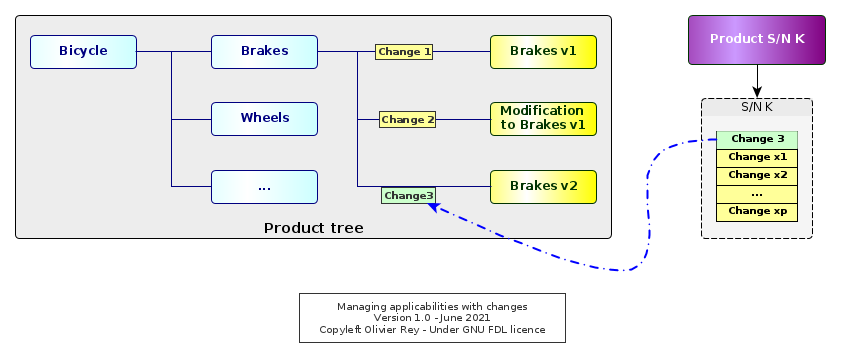
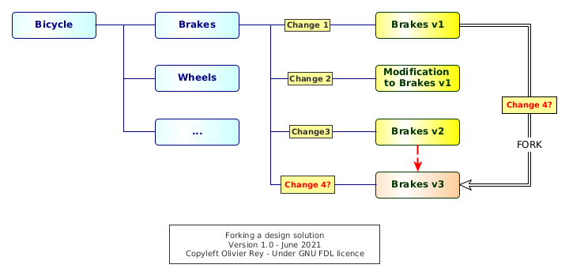
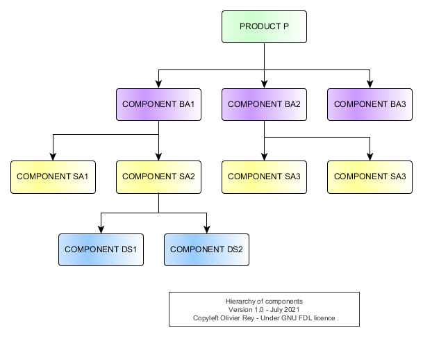

# About Industrial Configuration Management

This article is the second one of a series on PLM. Please have a look at [PLM and Graph Data](about-plm.md) article for an introduction.

*Photo by [Martin Kessel](https://freeimages.com/photographer/ukmjk-31383) from [FreeImages](https://freeimages.com)*

Configuration management (CM) is at the heart of the industry, being the traditional industry or the software industry. While the software industry massively invested on this area for decades, reaching a certain level of maturity in which CM is no longer a problem, some areas of the traditional industry still use old CM practices that prevent other digital evolutions to be massively used, such as works at the digital twin level. When CM stays a matter of experts and is not streamlined in the industrial process, inefficiencies, productivity losses and bad quality of data are everywhere.

In this article, we will try to examine the two different ways of performing CM:

* The dynamic one, where the configuration of a product is the result of a calculation (quite often based on a complex filtering);
* The static one, where the configuration of a product is benefiting from the graph data that we can find in PLMs (see [PLM and Graph Data](about-plm.md) for more information).

Strangely, this topic is not massively discussed on the web while it is at the heart of the industry performance (and non performance), being during the design process, the manufacturing phase of product life cycle or during its support phase.

## The old way: Filtering the product tree

### The product tree

In old Part Data Management (PDM) systems, a product is represented by a tree, which leaves are parts or groups of parts, often called "design solutions".

The product tree structure is generally the fruit of several inspirations, amongst which we can find:

* A functional split of the product (quite often coming from the [system engineering](https://en.wikipedia.org/wiki/Systems_engineering) view of the product);
* A regulatory view of the product (e.g. a split of an aircraft product per ATA code of the systems in the aerospace world);
* An organizational view of the product, e.g. mapping the product in the various organizations of the engineering office that design the product (mechanical engineering, electrical engineering, engine, air conditioning, etc.);
* A mix between technical PDM systems capabilities (sometimes related to CM) and between the previous constraints.

The product tree, or "product structure", is containing the product with all its options, which is sometimes called "the 150% vision of the product". For sure, all options will not be applicable at the same time on a single instance of the product.

The big challenges are, in this context:

* To be able to get the exact list of applicable parts (or applicable design solutions) for a certain instance of the product;
* To be able to manage the catalog of applicable options at a certain moment to future instances of the product;
* To be able to manage change in this universe, for instance when some parts become obsolete and must be exchanged by something else.

Moreover, the configurations of products that were manufactured or built must be preserved for maintenance. That can mean being able to create maintenance manuals and spare part lists for all products that were, at some point, manufactured and/or built. That would mean keeping track of the individual configuration of some product at some key moments of their life cycle.

### Manual version management in the product tree

Generally, old PDM systems don't manage natively the version management. When a leaf of the tree changes, let's suppose it is a design solution, a new version of the design solution must be created manually by copying the previous one and its content and name it with a version number in its name.

Let's take an example: The brakes of the bicycle product (see Figure 1) are changing because the brakes provider does not manufacture the old brakes anymore. In the PDM system, we must keep the old brake version because those information can be useful for the support of the already manufactured bicycles. We create a new brakes design solution by copying the old one, renaming it, and changing in it what needs to be changed to take into account the new version of the component.

From a certain point in time, from a certain instance of the bicycle product, all brakes will be of the new release (V2). Generally, industrially, we will move from the old version (V1) to the new one (V2) when the stock of old brakes will be empty. This shows that the changes in product configuration can have quickly industrial impacts.

In the PDM system, we end up having, at the bottom of one branch, two versions of the brakes. If the product tree was inspired by a systems engineering approach, we should have a generic "brakes branch", corresponding to the "brake function", with two possible implementations:

* One that was used from the first instances of the bicycle product up to instance number N (we will often speak about product "serial number" or S/N to identify in a unique way the instances of the product),
* And the second one that will be used from instance number N+1 and for the future (see Figure 1).

*Figure 1: Basic applicability in PDM*

### Configuration management using links

We can provide a quick definition of applicability in this context:

* For a product with a serial number K, the brakes version 1 are applicable to S/N K if K is inferior or equal to N;
* From N+1, the version 2 of the brake is applicable.

In PDM systems, the applicability is traditionally attached to the links as shown in Figure 1. Applicabilities are, in that case, intervals of product S/N: Brakes V1 are applicable to bicycle which S/N is in the range [1, N], and brakes V2 are applicable to the products which S/N is in the range [N+1, infinity[.

Having defined the applicabilities on all links, it is possible to filter the full product tree with a specific S/N to see what is applicable to this S/N. The filtered tree will correspond to the subset of the product tree corresponding to the specific options that are present in the product which serial number is K.

For sure, if we try to filter the product tree with a S/N that does not exist (i.e. in the future), we may retrieve (depending on how the filtering mechanism is implemented) the list of all possible design solutions that are applicable *from now*. In the case of Figure 1, for sure, the V1 of the brakes will not be applicable anymore for any S/N superior to N. Without any particular definition of our S/N options, we may see more than 100% of a product because we did not defined the very features of that S/N yet, and we may get all available options (product catalog) with this filter.

We must admit that this mechanism is quite confusing because the product tree mixes various objectives:

* A unique way to classify product data per function, organization, etc.;
* A manual version management based on naming conventions (and so a filtering algorithm that relies also on that naming convention);
* A way to store the configuration on links, making the S/N configuration implicit, dynamic and the fruit of a filtering algorithm.

### The product catalog

In order to maintain a catalog of options and to manage options compatibility, we need to have those data store somewhere (see Figure 2).

*Figure 2: Basic PDM product catalog*

In some cases, those crucial data will be maintained outside the PDM, in Excel, or in a separate Access database, which will rely on manual actions for the synchronization (source of errors and inconsistencies); in some other times, those data will be maintained inside the PDM system itself.

Compatibility tables are an important element of this product catalog. Very frequently, they implement non trivial rules that depend on one another. The Figure 2 shows a sample of that: the basic breaks in V2 are compatible with both basic wheels in V3 and premium wheels in V2.

The product catalog is crucial because it is enabling:

* To create a vision of the product options for the marketing and sales department (in a certain way to define the common language between marketing and sales and the engineering departments);
* To attach to a specific S/N of product a list of options;
* To guarantee that those options are compatible with one another.

The product catalog introduces a S/N vision inside the PDM system. From now on, without any product catalog vision, we could live with just "S/N intervals" of applicabilities. But if we make the S/N concrete and attached to a specific set of options, we can ask ourselves what is the best way of managing this information inside the system (we will come back on that point).

### Managing the changes

For, sure, as shown in Figure 2, components have versions, and we must track the changes between those versions. Change tracking is fundamental because it has an industrial impact, especially on stocks, on procurement, on all the manufacturing process, and on the maintenance process. Change management is the set of required actions that are done to justify the change and master its impacts.

In some businesses such as aerospace, the change is also tracked to prove to the authority that the aircraft can "inherit" from a past certification because the changes performed on it are just "small" ones. In case a change is important, a re-certification is required on a part or all the aircraft type.

Basically, during the life cycle of the product, all entities will change and will be versioned, including the compatibility tables for the various options. Change objects are interesting to track precisely why we did a change. In complex manufacturing products, change management ensure that the primary objective of the change is respected: fix something, enhance something else, take into account the impact of obsolescence, etc.

### Seeing the product through a stacks of changes

#### Applicability management through changes

In some areas such as aerospace, the change is considered so important, because of the fact that it is linked to airworthiness certification of flying machines, that the *full product is seen through changes* - and not through physical components.

To explain the problem, we will simplify a bit the situation. A change is an entity that will describe the replacement of one or several design solutions by one or several new ones. If we consider that an original design solution was "created by a change" (Change 1 in Figure 3 is creating the Brakes in V1), we can see the product as a "stack of changes".

*Figure 3: Managing applicabilities with changes*

In Figure 3, we can see several states of the brakes:

* The Change 1 is creating the design solution Brakes V1.
* The Change 2 does a modification to the Brakes V1.
    * In our example, this situation is often called a "retrofit". The design solution "Modification to brakes V1" must be envisaged as being applicable on top of Brakes V1. This situation occurs when, for instance, a part was forgotten in the original Brakes V1 design solution but, for certain reasons, we can't change directly the design solution Brakes V1.
    * To apply this retrofit, both Change 1 and Change 2 will be applicable, but maybe some products were manufactured with only the Change 1 and so they may have defects.
    * For sure, the manufacturing and the support will have to be aware that "Modification to brakes V1" is not a full design solution but some kind of "delta" to be applied to the previous version of the component (here Brakes V1).
* The Change 3 replaces the previous one with a full new design solution that is only pointing to Brakes V2.

It is interesting to note that, in this model, we know if a design solution is applicable or not to a product serial number *if the change is applicable to the product serial number*. The product is no more a set of components: It is a "set of changes".

We will call this way of proceeding an "administrative configuration management method", administrative because the product is *hidden behind the administrative iterative change process that leads to define it and to ensure its certification*.

The main consequence of this kind of configuration management is that a specific S/N of the product cannot be retrieved from the product tree by applying just a filtering on S/N ranges: We must do some kind of complex "calculation" to start from the description of the product as a set of changes to find what are the real design solutions that are applicable to this S/N.

We can note that this way of working is complexifying the works of everyone, because everyone in the company needs the vision of the S/N:

* The design office needs to work in a certain product context to perform relevant modifications;
* The industry needs to know the exact configuration of the S/N in order to build it;
* The support needs the exact configuration of all S/N to ensure that the maintenance manuals and spare part lists are covering all the manufactured products.

The problem of configuration calculation process is that it embeds *business rules*. An example of that is the retrofit situation that we have just shown in Figure 3. We could have decided never to use this kind of "delta" mechanism and only work by a replacement approach. The set of rules that will apply to find back the configuration of a S/N being business rules, they may change with time.

This can be a real problem because with this change in time, it is not guaranteed at all that when we recalculate the configuration of a S/N in the past, we will find again the exact same configuration that we have delivered top the manufacturing team. That means that the PDM system is not reliable to find back the configurations of the already delivered products.

#### Stacking the changes

This model establishes a "lineage" between changes that, most of the time, does not enable "forks" of design solutions, like shown in Figure 4.

*Figure 4: Forking a design solution*

Brakes V3 are clearly a fork of Brakes V1, so the change should be done between both. But, in a standard "stack-oriented change system", the Change 4 will be associated to the next iteration of Brakes V2, which is not the case.

This lineage forces to see the product as a continuous set of changes, a pile or a stack of changes. That means that, in case of wrong modifications in the design solutions, it is not possible to get a design solution of the past and to start at this point, which the fork mechanism is all about. It is mandatory to "undo" all modifications you did to come back to the previous state. Undoing is generally a manual, costly and error prone process (incredible to people that come from the software industry, where forking is one very basic action in configuration management).

#### From the PDM system to the CLM system

This stacking of changes method transforms the PDM system into what we could call a "CLM", standing for Change Lifecycle Management, but not into a PLM (Product Lifecycle Management).

This statement is very important because, in a certain way, the administrative CM method based on change stacks is proposing an approach that is *diverging from the PLM world* where the product is at the center and the change on a secondary level. The CLM system, by putting the change first and the product "behind" it, closes the door to graph data usage in PLM, as we will see it in the rest of the article, which creates cascading problems in all the manufacturing company.

### The limitations of filtering-based CM

Filtering-based CM systems (being simple applicability oriented or change-based applicability oriented) seem to us as being structural sources of problems. Moreover, when investigating their origin, it appears that they are very linked to the PDM system limitations of the 90s.

And the fact is PDM systems evolved into PLM systems leveraging the product graph data and enabling a vision of CM closer to what is found in the software industry, a method that we could name "100% calculated configuration" or "static configuration management". This way of working is the only one to enable enhancing the works at the digital twin level.

Indeed, how can you work on the digital product if the vision you have of the product is the result of a dynamic filtering calculation that will not be persistent enough to enable the creation of the many links you need to do in the graph data?

## The new way: Linking graph data

### Reusing components in the industry

Those last decades, the vision of the manufactured product changed a lot. If manufacturers were used to build all parts of their products, they transformed progressively into assemblers, letting the role of manufacturing subsystems to subcontractors (so-called "supplier"). In a lot of cases, the supplier is not only manufacturing components, but it is also in charge of designing them.

The manufacturing industry entered the same constraints as the software industry. In order to build your product, you have to assemble components that you did not manufacture, so you have to master their compatibility with your own products. You must then take conventions with your suppliers about "interfaces".

To come back to our brakes example, as a bike manufacturer, we buy the brakes from an external supplier that will provide brakes to our company but also to other bicycle manufacturers. We have to define in a contract what will be the interfaces between our bicycle and the brakes. Those interfaces can be mechanical, but also, in the general case, electrical, fluid based, etc.

This definition of clear interfaces between components is the condition of component reusability. It also enabled a certain specialization of manufacturers that can perform R&D activities on their very domain and be innovative. This also created a component market that can imply large worldwide supply chains.

Being in machines, in automotive or in aerospace, the assemblers must control the configuration of the components they use. Like in software, during the lifecycle of a product, there will be many versions of the same component available for series production. For each of them, every actor will need information:

* In order to integrate it in the product tree (and possibly into the product 3D mock-up);
* In order to assemble it to the other parts of the product;
* In order to support it in the long run.

### The site specialization

Even if the assembler is mainly assembling components that are not manufactured internally, many manufacturers tend to specialize sites in order to implement the same component-oriented industrial strategy. Big manufacturers have the same constraints than their suppliers and, if they want to keep an expertise on some areas, it is better that they concentrate this expertise on a set of physical locations.

### Variants and customizations

Consequently, the challenge of modern manufacturing is to manage the product as a set of components, each of them having its own lifecycle, and most of them being more or less mastered by suppliers.

This model has many advantages:

* It is easier to create product variants, or product families, product lines, or different brands, considering that many components can be reused from one model to another;
* The component reusability enables better innovation on each component level;
* The industrial process is divided between component assembly process and final assembly processes, which implies a good performance of the logistics to be able to transport components to the different assembly lines.

The main drawback of the model is to enter a cycle of incremental component improvements without any product redesign. Indeed, redesigning a product is a much bigger task that can change the scope of the various components. When a supply chain is optimized with many internal and external components, the global innovation may have a tendency to decrease. In this context, new players can enter the industry with other more effective approaches.

### Consequences for configuration management

The first consequence of this industrial reality is that the configuration must be managed at different levels:

* At the component level, the configuration must support variants and options;
* At the product level, the configuration must support which components are applicable.

For some big manufacturing products, such as cars, ships or aircrafts, we can have intermediate levels, sort of "big components" that aggregate smaller components. The configuration of the product becomes a multi-level configuration management system.

The product tree representation should materialize this tree of components like shown in Figure 5.

*Figure 5: Hierarchy of components*

We see that the product is composed of several layers of components. By seeing the diagram, we could analyze the various levels:

* The blue level is the design solution level. In that sample, that is the only layer the manufacturer of the product P really masters in terms of detailed design.
* The yellow level is the level of "Small Assemblies" (prefixed "SA"). Only the SA2 is mastered internally. All other small assembly are coming from suppliers.
* The purple layer is the layer of "Big Assemblies" (prefixed "BA"). BA1 and BA2 are mastered by the manufacturing company because they are in charge of assembling the small assemblies that composed them. But BA3 is directly coming from a supplier.

We can see that the way of organizing the data implies several things:

1. When using components, we need to test the digital fit of components together before trying to assemble them physically. We can call this process the **digital integration** of components at the "digital twin" level. Note that this process can be quite complicated because it can imply the verification of many interfaces on many levels.
2. The product tree is very linked to the manufacturing split of components, especially when the design is subcontracted to suppliers. But even in the case when the design stays an internal activity to the manufacturer, there is a great interest to act as if the component was a black box with interfaces.
3. The component split comes from the early phases of the design, especially from the systems engineering that created a **product architecture** enabling to define the various components and their interfaces.

Product architecture and digital integration are at the core of modern manufacturing. We can note that they are at the core of the software industry for decades.

### Materializing the S/N in the product tree

We already mentioned the S/N as being a unique identifier of a product. 

-------

Product line MCA/CA : reusing components between variants

Same basic information but in a graph

The notion of delivery

Committing tagging
forking, merging, rebasing

This way of representing the component lifecycle has many advantages:
* It does not require a configuration calculation to see in what state the component is: We just have to choose at what stage we want to see the component; Those configuration images will never change with time, and will never rely on business rules;
* The tracing of evolutions is very detailed, which enables reliable concurrent engineering even from versions that are not yet flagged;
* Every commit can be compared to any other commit and not rely on just the comparison of two consecutive versions (was-is);

concurrent engineering made easy

persisting all to better manage the impacts on others
I can go directly to the last version

Powerful digital tools to compare version

* Functional and logical comparison, provided functions are expressed in structured metadata;
* Automatic comparison of 3D models at part or assembly level, when 3D exists;
* Structured metadata comparison with \emph{ad hoc} algorithms.

The last point is important: everybody knows that Office documents in design solutions contain too often non accessible structured data. If those data were to be accessible in a structured way (metadata), specific algorithms could be developed to make sense of their evolution in the versioning process.

migration is easy

Components that aggregate components

Dependency graph of components

compatibilites/incompatibilities

Special builds - enabling parallel studies in a branch, chosing the best

answering to RFPs

New Roles

* The product architect role, in charge of defining the various low level components and the architecture of the product (in big products, there may be several product architects);
* The continuous build and tests role, responsible for organizing the various deliveries corresponding to the various modifications required and running integration testing on top of each component unit testing;
* The product manager role that is defining the content of each product iteration and is coordinating component product manager that are defining the content of their components in a coordinated way.

Digital testing is the real digital twin

Bridges between semantic universes 

* The sales and marketing configuration is a customer sheet, which corresponds to a future MSN; The vision of sales and marketing is naturally a real H/C configuration (``solved configuration'');
* The manufacturing view is linked to the engineering view at various levels of granularity, and SOIs are attached to it; A solved configuration graph would enable to make possible every comparisons in case of change from the design office; It could also enable the capitalization of SOI per VCI/design solution or CA;
* For support and services, the ILS tree can have a similar lifecycle than the manufacturing view; As manuals are concerned, the PLM implementing a \cocms\ will be able to keep old versions of delivered H/C as links to certain versions of certain components; That would enable to create more easily manuals for customer fleets and to generate revision marks based on the comparison of whatever versions in the past.

In other terms, we believe that the component orientation of the \cm\ system is one of the main conditions to enable to build a repository of design solutions that have their own lifecycle and will be aggregated in higher level components, each of them having also their own lifecycle.

One of the direct consequences of this model is that all DMUs are configured. In the system, whether we look at an VCI/design solution, or at the equivalent of an ICI (a functional component?), a virtual component (for instance aggregating several components of certain versions), a baseline, a CA or a MCA, all those components will exist for real, and will be usable to create DMUs. The fact that they are used or not in a real industrial context will rely on the fact that they are pointed to by a component which is used.

Missing the opportunity: industrial catastrophe

We think that, if the 150\% product tree filtering principle is preserved:
\begin{itemize}
\item It will be necessary to have a \emph{specific} \ah\ module in charge of calculating the engineering configurations (internal or external to 3DExperience or external); This specific module will implement the exact rules of today and will prevent leveraging the power of the new platform;
\item The connection of the engineering view (ATA product structure with applicability at the leave level) to the other domains (probably more ``calculated configuration'' oriented) will be structurally painful.
\end{itemize}

\section{Transposing software \cocm\ concepts to the aerospace industry}

\subsection{Warning}

This section should be considered as a starting point of further analysis for the \ah\ DDMS project. Indeed, it describes certain axis to investigate and debate, but without having the ambition to have an exhaustive list of topics, nor to propose the best solution.

\subsection{Logical and physical components}

If we first focus on the design office and the manufacturing organizations, currently in \ah, for the aircraft program, the data structure are respectively a VPM tree organized mainly by ATA code, and a MCA/CA split, both reorganizing the same VCI/design solutions (the \myfig{cm-06}\ can be a good representation for that case).

Contrary to the software industry, it seems that, most of the time in the industry, ``components that aggregate components'' are mostly void containers, meaning they do not have ``specific data''\footnote{This assertion should be challenged because, for instance, the mBOM is enriching the eBOM. In that situation, the link to original structure is very important, but the mBOM can be a data ``decoration'' of the eBOM that should be, in that case, manage in the upper-level component.}.

Securing their exact set of dependencies in an appropriate lifecycle seems a real gain for every actor because every evolution will be traced sharper than ever if components that aggregate components have their own lifecycle.

\subsection{Where are the changes?}

\imagepng{cm-07}{The certified H/C version and its evolutions}{1}

If we consider \myfig{cm-07}, we can see a special blue border for certified components. We can easily see the genealogy between the certified version and the current MSN produced. The baseline appears as a logical grouping of components.

If we analyze the changes, we could say the following things:
\begin{itemize}
\item When a component is evolving from one commit to another, that should not be flagged as a change, even if the comments could refer to the change in the case where the commit was done implementing the change\footnote{For certain branches in the context of studies, some flags should tag the changes done in the context of the study.};
\item Flagging is stamping a change (see proposed rules below);
\item Linking to a dependency should be done in the context of a change.
\end{itemize}

This opens the question of various level of changes, a change in a VCI/DS not having the same impact as a change in a ``component of components\footnote{Maybe a more explicit expression that ``configuration of configuration''.}''.

\cadre{Some potential migration rules}{
 We could propose that: \newline
 --Each major version should be studied to determine whether the change requires to create a new component or not;\newline
 --Each change in CG4 becomes a minor version (like version 1.\underline{2}) and that intermediate CGs are subversions of the minor version (CG1 being version vX.Y.10, CG2 being version vX.Y.20, CG3.1 being version vX.Y.40 and CG3.2 being version vX.Y.60).}

\subsection{Is \cocm\ applicable (or interesting) in the aerospace industry?}

In order to assess the capability to transpose a \cocm\ model to aerospace, we should analyze how this model can solve common industrial pro-blems. Using a list of use cases and current pain points would be a good starting point, for instance:
\begin{itemize}
\item Does this model enable to work in context? As well as today or better?
\item Is is possible to load quickly a DMU for a zone? For the whole A/C?
\item Does the model enable to go from an to be built to a manufacturing view easily?
\item Is it possible to reassign already produced components that were part of a certain to be built to another one?
\item Can we reuse past customizations? Is it possible to put them in context again just to see what the DMU looks like?
\item Can we go back in time and compare components between today and several months ago? What exactly do we see?
\item To what extent can we do concurrent engineering?
\item Can we automate the impact of a change on views that are not engineering?
\item What exactly can we do with multiple retrofit?
\item Can we benefit from this model in the prototype phase but also in the series phase?
\item Is is conceivable to not using Excel anymore in the \cm\ area?
\item What \cm\ tasks could be delegated to the operational team?
\item Etc.
\end{itemize}

A list of topics like this one should be at the center of the \cm\ DDMS works, and its assessment versus several models should be envisaged considering the 4 perspectives (Marketing and sales, engineering, manufacturing and support and services).

\section{Conclusion}

In this note, we have presented:
\begin{itemize}
\item The underlying hypothesis of the current systems, and how those hypothesis are, for us, driving structural problems in the \cm\ area;
\item The \cocm\ principles that are worth investigating because they seem promising on several aspects, mainly:
\begin{itemize}
\item Those principles are based on components, which are are the heart of DDMS reflexions;
\item They are proposing a ``calculated configuration'' model that appears to be fitted for end-to-end configuration and ready for multi-views;
\item The model seems to be implemented in the 3DExperience.
\end{itemize}
\end{itemize}

The current IT systems are impressive, both by their capability of compensating the limitation of (old) backbones products, by the functionality they provide on a day-to-day basis, functionality that enable to create A/C, and by the massive efforts they required with time and require on a daily basis to be operative.

However, \cocm\ is a \cm\ model based on another paradigm: simpler in certain aspects (component orientation) but enabling to do very complex and agile \cm\ as the aerospace business needs it.
