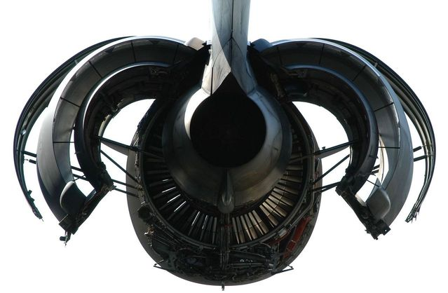

#About Configuration Management

This article is the second one of a series on PLM. Please have a look at [PLM and Graph Data](about-plm.md) article.

Configuration management (CM) is at the heart of the industry, being the traditional industry or the software industry. While the software industry massively invested on this area for decades, reaching a certain level of maturity in which CM is no longer a problem, some areas of the traditional industry still use old CM practices that prevent other digital evolutions to be massively used, such as works at the digital twin level.

In this article, we will try to examine the two different ways of performing CM:

* The dynamic one, where the configuration of a product is the result of a calculation (quite often based on a complex filtering);
* The static one, where the configuration of a product is benefiting from the graph data that we can find in PLMs (see [PLM and Graph Data](about-plm.md) for more information).

Strangely, this topic is not massively discussed on the web while it is at the heart of the industry performance (and non performance), being during the manufacturing phase of product life cycle or during its support phase.

# The old way: Filtering the product tree

## The product tree

In old Part Data Management (PDM) systems, a product is represented by a tree, which leaves are parts or groups of parts (so-called "design solutions" in some industries).

The product tree structure is generally the fruit of several inspirations, for instance:

* A functional split of the product (quite often coming from the [system engineering](https://en.wikipedia.org/wiki/Systems_engineering) view of the product);
* A regulatory view of the product, e.g. a split of an aircraft product per ATA code in the aerospace world;
* An organizational view of the product, e.g. mapping the product in the various organizations of the engineering office that design the product;
* A mix between technical PDM systems capabilities and a mix of the previous constraints.

The product tree, or "product structure", is containing the product with all its options, which is sometimes called the "150%". For sure, all options will not be applicable at the same time on a single instance of the product.

The big challenges are, in this context:

* To be able to get the exact list of applicable parts (or group of parts) for a certain instance of the product;
* To be able to manage the catalog of options applicable at a certain moment to all instances of the product;
* To be able to manage change in this universe, for instance when some parts become obsolete and must be exchanged by something else.

Moreover, the configurations of products that were manufactured or built must be preserved for maintenance. That can mean being able to create maintenance manuals and spare part lists for all products that were, at some point, manufactured and/or built. That would mean keeping track of the individual configuration of some product at some key moments of their life cycle.

## The tree representation limitations

In old PDMs, we can see several limitations.

The first one is that there is no real version management built in inside the system. When a leaf of the tree changes (let's consider from now on that the PDM is managing "design solutions" which are related to a small group of parts that will be used together in the product), a new version of the design solution is created by copying the previous one and its content and name it with a version number in its name.

Let's take an example: The brake of my bicycle product is changing because my brake provider does not manufacture the old brake anymore. In my PDM, I must keep the old brake version because those information can be useful for the support of the already manufactured bicycles. I will create a new brake design solution by copying the old one, renaming it, and changing what needs to be changed.

From a certain point in time, from a certain instance of my product, all brakes will be of the new release. Generally, I will do that when all my stock of old brakes will have been emptied.

In my PDM, I end up having, at the bottom of one branch, two versions of the brake. If I built my product tree getting inspired by a systems engineering approach, I will have a "brake branch" with two possible implementations:

* One that was used from the first instance of my product up to instance N (we will often speak about product "serial number" or S/N),
* And the second one that will be used from instance N+1 and for the future.

We can provide a quick definition of applicability in this context: For a product with a serial number K, the brake version 1 is applicable to K if K is inferior or equal to N and, from N+1, the version 2 of the brake is applicable.

%---------------------------------subsection
\subsection{Surprising facts}

For an external eye, the three first surprising facts of \ah\ \cm\ are:
\begin{itemize}
\item The H/C product is represented as a tree with all product options (so-called ``150\%'', see Fig.~\ref{fig:cm-01-aircraftps}),
\item The tree classifies the various data, but only the leaves support the real content and the applicabilities (single level \cm);
\item It requires a ``calculation process'' to see the real configuration of a specific instance of H/C\footnote{We will use the term MSN (Manufacturer Serial Number) in the rest of the document.}.
\end{itemize}

In the software industry, there is no notion of ``configuration calculation'', whatever the complexity of the various ``builds'' (equivalent to MSN).

\imagepng{cm-01-aircraftps}{aircraft product structure}{0.7}

This filtering mechanism has several structural important drawbacks.

%---------------------------------subsection
\subsection{No built-in lifecycle nor stability in time of the result of filtering}

When calculating the configuration of a H/C, a result of the filtering process is produced\footnote{Generally called to be built (As To Be Built) in \ah.}. This result will be time-sensitive, meaning depending on when this result was calculated, and based on what applicability data were in the database at the time, a later calculation could calculate something else due to a change in applicability data.

The client of the to be built will have to manage by himself the to be built variations over time as long as the ``definitive'' to be built is not available. Indeed, there may never be any definitive to be built because the product tree is continuously evolving, which is normal.

The problem is, when a set of changes were done in the product tree, the new to be built will reflect those changes but the process will not be able to recalculate in the past the previous to be built.

The problem is, for us, not in the fact that the to be built changes, but more in the fat that the past to be built cannot be built again as it was delivered once.

%---------------------------------subsection
\subsection{Sensitiveness to change of calculation rules}

For sure, this problem, on the long run, is aggravated by the possible changes of rule calculation. For various reasons, the filtering will change over time in order to take into account new concepts (and new metadata attached to the leaves of the product tree\footnote{Leaves of the tree are VCI (Virtual Configuration Item) or DS (Design Solutions).}).

This means that the possibility to get back the configuration of a certain H/C in the past is not possible.

%---------------------------------subsection
\subsection{VPM constraints as \cm\ principles}

For an external eye, it seems that the \ds\ VPM\footnote{Virtual Product Management.} tool brought the capability of managing CAD vaulting but with some feature that had also important drawbacks and that required workarounds, as shown in the table \ref{table:vpm-workarounds}.

\begin{table}
\begin{center}
{\small
\begin{tabular}{ | p{4cm} | p{10cm} | }
\hline 
\textbf{Native feature and/or convention of use} & \textbf{Workaround/Industrial process} \\ 
\hline \hline
Product tree filtering, based on tree-leave level applicability & The tree-leave level applicability is a convention for most cases, except for the dynamic systems (so-called ``configuration of configuration''). However, those exceptions did not build a real \cocm\ system as we will describe it. \\
\hline 
No management of filtering results lifecycle & Users of the filter result must manage their differences and histories by themselves. \\
\hline
No native version management of items & Management of versions is done using naming conventions for index (in French: ``indice du plan''.) or dash changes in VCI lifecycle.\\
\hline \hline
\end{tabular}}
\caption{Some VPM workarounds}
\label{table:vpm-workarounds}
\end{center}
\end{table}

With time, some of those constraints seem to have been internalized by the organizations, up to the point where some workarounds became ``kind-of'' \emph{business} \cm\ principles.

%---------------------------------subsection
\subsection{Implementing change-oriented filtering}

The aerospace industry has to track all changes between the first certified A/C and the later ones that are being built and delivered to the customers. The common way of addressing this constraint is to describe a particular A/C as a set of changes compared to the original certified A/C. All the various design solutions being associated with their applicability data expressed in terms of changes, the change takes quite often the meaning of ``component''\footnote{Components are often named by their change number, and changes are said to be ``installed'' on a particular machine.}.

The fact is when we filter a product tree based on a stack of changes, the dependencies between components are not visible. If the change filter is a set of change only built to be able to design in context, most people from the design office are not able easily to see on what A/C they are working.

In other words, the union of all those constraints led to a situation where the design office PLM is proposing a change-oriented system in which the product is, most of the time, not easy to ``see''.

In \ah, in the case of the aircraft, this situation will lead to industrial problems, when a particular H/C must be built with MCAs or CAs that have not the ``same level of changes'' (in case of reassignment of MCA or CA). The piling of changes method is not enabling \emph{going back in time}, especially looking back in the past just for some part of a particular machine. In the case of the aircraft, complex manual work is required just to address the question of the feasibility of the assignment.

In some way, the PLM systems based on change are determining in an indirect way the lifecycle of a product. They could be named \emph{change lifecycle management (CLM)} systems because they put the change concept first and the component concept in second position.

%---------------------------------subsection
\subsection{An optimal way to do with VPM constraints}

As a temporary conclusion, we could say that the generation of PLM systems that use change-based filtering on VPM, on a product tree with leave-level applicability are \emph{the best that could be developed} based on the mix of the VPM product constraints and company conventions.

For sure, if a core product, like \ds\ 3DExperience, was to release the VPM constraints of propose new semantics for industrial business objects, we should analyze the possible new ways of working instead of trying to reproduce VPM constraints inside the new platform.

%---------------------------------subsection
\subsection{Steps towards digital continuity}

With time, the addition of powerful features (such as the ECPDM/ILS-aircraft interface or the CorePDM configurator) were a step towards digital continuity between the various actors.

But one of the complexity of implementing this digital continuity remained the \cm\ topics and the robustness of interfaces from the engineering change process to the downwards actors and systems.

In ILS for instance, a domain largely covered by the ASD S3000L standard, the lifecycle of ILS trees is different from the one of the design office \to be built\ (to be built) configuration, especially because technical publication require a view on the past, as much as a view on the present.

%============================SECTION
\section{The DDMS approach}

%---------------------------------subsection
\subsection{Introduction}

The DDMS programs brings with it two preoccupations that push for a re-thinking of how we do things around \cm:
\begin{enumerate}
\item The \eecm,
\item The component orientation, this from the very start of the development cycle with the notion of ``smart component''.
\end{enumerate}

%---------------------------------subsection
\subsection{The need for \eecm}

In order to be efficient as a company, four main actors must manage a configuration based on the ``same'' data:
\begin{enumerate}
\item The marketing and sales department are working with a product option catalog and a customer sheet per H/C;
\item The design office is managing a configuration based on change applicability, and today modeled from VPM constraints and conventions;
\item The manufacturing engineering is working on detailed \soi\ (SOI) attached to a manufacturing BOM\footnote{Bill Of Materials.} linked with the engineering BOM;
\item The support and services division is working on several trees (ILS, MSG-3, AMM, etc.) in order to manage the various support manuals and spare parts lists.
\end{enumerate}

The H/C lifecycle is also dual:
\begin{itemize}
\item A long period of prototyping when concurrent engineering is key to respect program milestones;
\item A series period when the management of evolutions is key for all actors to be productive.
\end{itemize}

%---------------------------------subsection
\subsection{DDMS Product Line through ``components''}

With time, in order to be more productive in an industrial way, aerospace took some inspiration from the automotive industry, especially for the notions of baselines and options packs. Even if those notions were existing in \ah\ for a long time (options and customizations catalogs), the level of customization was, in old programs, disturbing large scale industrial efficiency.

The notions of baseline, option packs, etc., had to be created, this for many reasons including:
\begin{itemize}
\item Reducing costly customizations,
\item Gaining lead time,
\item Capability of using ``build to stock'' approaches,
\item Etc.
\end{itemize}

The modularization of H/C began years ago and was particularly at the center of the X4/H160 program with a site specialization based on MCA/CA approach\footnote{MCA/CA: Major Component Assembly, Component Assembly.}. Those new industrial intentions brought new hard requirements on the H/C \cm. For sure, as soon as MCAs ans CAs are managed in various sites, it is obvious that some kind of ``MCA/CA assembly'' \cm\ level is or will be required to be able to operate efficiently in various industrial common use cases such as MCA/CA reassignment.

In order to generalize an approach based on components, the concepts of ``component'' and ``smart components'' are at the center of DDMS Product Line and Modeling and Simulation workgroups. Being able to think the A/C in components that can be reused on several products of the same family is a major industrial challenge of the next decades.

For \ah, the challenges are at the center of the civil and military versions of the H160\footnote{The H160M will be delivered to the French MoD under the name of HIL (``Hélicoptère Inter-armées Léger'').}, but also in the future product family that could be derived from the aircraft.

\subsection{\cmm\ new principles and 3DExperience}

In the context of DDMS, \ah\ is launching a study on \eecm.

In the next part, this document will detail different \cm\ principles that could potentially be an inspiration to this study, and give birth to prototypes in the 3DExperience.

\section{\cocmm}

In this part, we will use the terms ``\cocm'' to designate the \cocm\ practices that are used in the software industry, when creating large software with many customizations for many different customers.

We will also mention some of the challenges of a potential migration of current data to a \cocm\ driven system.

\subsection{The component as the basis}

Each \cm\ system has its building blocks. In \cocm, the building block is a \emph{component}, which can be easily translated in the industry world where the building block is the VCI or the Design Solution.

\cadre{Ease of migration of VCI/DS}
{As the building blocks can be reused as they are, in case of migration, no information would ever be lost by migrating existing CIs to a \cocms.}

\subsection{Component version management}

Version management is the first core difference of a \cocms\ versus a system based on VPM. In a \cocms, the versions are directly managed by the system. In the software industry, software like Mercurial or Git are managing the lifecycle of the component.

\cadre{Sample of migration rules for index and dash changes}
{
In a migration context, the dash changes could be converted into major versions (like ``v2'', ``v3'' and so on), and the index changes could be converted in minor versions (like ``v2.1'', ``v2.2'' and so on).
}

Even if a natural translation of concepts can be used, the \cocm\ approach proposes a lot of supplementary features compared to what is currently implemented in VPM.

We will focus on the following ones:
\begin{enumerate}
\item Committing and delivering,
\item Tagging,
\item Branches
\item Version comparison
\end{enumerate}

\subsubsection{Committing and delivering, the basis of concurrent engineering}
\label{delivery}

The \myfig{cm-02}\ shows two basic concepts used in the software industry for version management: committing and tagging.

\imagepng{cm-02}{Difference between committing and tagging}{1}

A commit is an intermediate step in the lifecycle of the component. It can correspond to the end of a day's work, a partial implementation of the planned task, a version of the component that is incomplete (for instance, with an unfinished test phase), etc.

Commits are very important in software engineering because they create complete snapshots of the component and enable to store the full image of the component at a specific moment.

Generally, the software industry couples this versioning mechanism to build systems that build the component each night (or more frequently) with the last committed version. In case some other entity would need the component in an ``as-fresh-as-possible'' state, the intermediate build is available with the following insurances:
\begin{itemize}
\item The commit number of the component is guaranteeing a forever archived component;
\item Each build of that component will keep on existing forever which means that someone who would use this intermediate version will be able to depend on it, even if this component is not ``flagged'' or ``labelled'';
\item Any later change of the component can be compared with the committed version of the same component;
\item This comparison of versions will ease the upgrade works of those who depend on that particular component.
\end{itemize}

In one word, the intermediate commits of the various comments, coupled with a basic component delivery mechanism, \emph{ensure the foundations of concurrent engineering} (quite often a massive concurrent engineering with possibly up to thousands of engineers relying on a certain version of that component).

A very long time ago, some software systems enabled software developers to share \emph{code} which caused tremendous concurrent engineering problems. For decades now, the software industry realized (even in the case of interpreted programming languages that do not need a build mechanism \emph{per se}) that the concurrent engineering was based on three major pillars:
\begin{enumerate}
\item Being able to work aside from the rest of the world (and test the new development ``in context'');
\item Being able to quickly secure any intermediate step forever (commit);
\item Being able to publish quickly the new (intermediate) state to other engineers.
\end{enumerate}

\subsubsection{Tagging}

Tagging a component commit, generally with a version tag (to which we can post-fix the branch identifier), indicates that a particular commit is in a remarkable state. Generally, in the software industry, the tagged versions are the ones that are ready to be reused by other components.

Minor versions are generally fully compatible with the previous ones, while major versions can require some adaptation from the other components that reuse the concerned component\footnote{The Python programming language is a good example of this phenomenon: the version 2.7 keeps on existing and being maintained while being incompatible with the version 3 that is existing for more than a decade.}.

If, technically, the reusability of all committed and built versions is possible, the tagging action makes it ``officially reusable''. That can be very structuring in the software industry and the major/minor version tagging can implicate after-sales support policy with important financial consequences.

The \ah\ equivalent to tags appears to be the change maturity gates. A certain component (VCI or design solution) will have several versions (dash) and subversions (index) each of them being applicable in the context of changes.

\cadre{Clarifying commits and deliveries}{
One structural limitation of the VPM product and current practices is that intermediate commits are not possible (or not implemented, maybe for processes or technical reasons). We can add to that the fact that explicit delivery mechanisms (even very fast ones) are most of the time implicitly linked to the status of the change. Concurrent engineering is put at stake by this double phenomenon.\newline
No intermediate commits and no explicit deliveries cause structural concurrent engineering problems in the development phase, when non design office actors need to access quickly to ``between two maturity gates'' components. If the elapse time between the change of maturity is lasting several weeks, it will be impossible for non design office actors to compare the status of today with the status of one week ago, the past status being in some cases structurally lost.\newline
This causes many problems and inefficiencies in case of multiple retrofits during the maturity phase of a H/C development.}

\subsubsection{Branches or how to decouple the change process from the version management}

In \ah\ aircraft program, the change process is intimately intertwined to version management: as each version is a different VCI or design solution, and has attached to it its applicability information, expressed in applicable changes, it is not possible to decouple the version management on one side to the change process on the other.

The fact is the decoupling of version management and change process is absolutely required when we want to analyze multi-criteria industrial trade-offs in order to find the best industrial compromise. It should be possible, for a certain change request to study several different evolutions of the same component before deciding what evolution is the best\footnote{The dimension of analysis can imply non engineering information such as stocks.}.

We can note that, if this functionality is not available, the first risk is to over-use the retrofit process: due to a lack of solution trade-off, a solution is chosen, and it will be \emph{reworked several times} before being mature. If we include the problems of dependencies, the maturation of a full system can be very long and very expensive, due to the fact that the current system is only a ``way forward'' \cm\ system coupling versioning and change.

\imagepng{cm-03}{A sample of a real-life component}{1}

If we consider \myfig{cm-03}, we can see the benefits of decoupling for the component \texttt{A}:
\begin{itemize}
\item The version 1 of the component gave birth to a production maintenance branch that enabled to correct production problems while keeping on working on something else on other branches;
\item The version 1 at the same time evolved to version 1.1, also put on production maintenance in branch 3, to evolve to version 2;
\item Between version 1 and 1.1, a study branch was created for a new feature, this new feature being merged into the master branch to prepare the version 2; In case of complex trade-off, several branches could have been created, each of them representing a possible solution, even if only one of them would have been chosen at the end to implement the new feature.
\end{itemize}

In the \myfig{cm-03}, we can see many tags, some of them being associated to a standard change process, and  some of them being associated to detailing the real multiple influences of the evolution of the component.

As all versions are committed forever and all can be compared one to another, the changes between two versions can be explained with more details than today. For instance, the version 2 of component \texttt{A} is the result of:
\begin{itemize}
\item An enhancement to version 1,
\item Plus a small modification coming from a production fix of version 1,
\item Plus a small modification giving birth to version 1.1,
\item Plus a small modification coming from a production fix of version 1,
\item Plus an enhancement to version 1.1,
\item Plus a small modification coming from a production fix of version 1.1,
\item Plus an enhancement to version 1.1,
\item Plus a new feature coming from branch 2,
\item Plus a consolidated tested version that became version 2.
\end{itemize}

This way of representing the component lifecycle has many advantages:
\begin{itemize}
\item It does not require a ``configuration calculation'' to see in what state the component is: we just have to choose at what stage we want to see the component; Those configuration images will never change with time, and will never rely on management rules;
\item The tracing of evolutions is very detailed, which enables reliable concurrent engineering even from versions that are not yet flagged;
\item Every commit can be compared to any other commit (like on-demand multiple levels ``was-is tables''\footnote{The ``was-is'' table is a way to represent a change by representing the previous situation and the new one. But the current functionality being coupled to a change, you need all the was-is tables to get back in the past.}) in order to generate a comparison that will be meaningful for all actors;
\begin{itemize}
\item For instance, based on \myfig{cm-03}, we can generate a comparison between version 2 and version 1, getting rid of the complexity of the path that enabled this transformation of component; At the same time, all changes are traced, probably in a finer grain than ever;
\end{itemize}
\item Many alternate solutions can be investigated, without being retrofitted in the main branch; That enables to capitalize on the work;
\begin{itemize}
\item Those studies can be exhumed later in order to be applied on the current version of the main branch just ``to see how it goes''.
\end{itemize}
\end{itemize}

\cadre{Built-in trade-off capability}{
The capability of managing several branches in the same component lifecycle mechanism would enable the design office to work, at the same time on the maturity of the production component, and on the future versions of the same component and/or on studies done for a particular reason or customer.\newline
The core features of the component lifecycle available mechanisms can ease the complex trade-off analysis required in the design phases.
}

\subsubsection{Version comparison requirements for design solutions}

As in the current VPM system, versions are managed through name change of the VCI, and the level of applicability of each version changes, the VPM system should not propose any A/C with 2 versions of the same VCI applicable. This means that comparison is complex in nowadays systems\footnote{It is possible that some workaround exist to visualize automatically the differences.}.

If \ah\ would use a \cocms, the requirements for version comparison of components could be based on:
\begin{itemize}
\item Functional and logical comparison, provided functions are expressed in structured metadata;
\item Visual comparison of 3D models at part or assembly level, when 3D exists;
\item Structured metadata comparison with \emph{ad hoc} algorithms.
\end{itemize}

The last point is important: everybody knows that Office documents in design solutions contain too often non accessible structured data. If those data were to be accessible in a structured way (metadata), specific algorithms could be developed to make sense of their evolution in the versioning process.

\subsubsection{Migrating current VCI/DS to a \cocms}

We think that \cocm\ systems can easily integrate the complexity of versions, subversions of components. In some systems, branching of VCI/design solution is also possible and this appears to be easy to migrate also.

The change applicability information can also be migrated in this process, even if the change data will require a special attention that we will try to explain in the next section of the document.

\subsubsection{Conclusion of component version management}

The \myfig{cm-04} shows a synthesis of the main concepts attached to a component life-cycle.

\imagepng{cm-04}{The component \texttt{A} and its deliveries}{1}

We can note that some builds were made available of the version of branch 2, this because, during the study, some other component higher in the component structure may have used those versions in the context of a larger study.

We can also note that the delivery mechanism that we talked about in section \ref{delivery} are containing a testing phase that is call ``unit testing'' by the software industry.

If the industrial components were associated to numerical tests, and if those tests could be automated from the content of the component itself, and if the processing power was available, extended digital testing could be done all along the lifecycle of the component\footnote{See the works of the DDMS workgroup Modeling and Simulation.}.

%-----------------------------------Subsection
\subsection{Components that aggregate components}

One of the main differences between a \cocms\ and the current systems seems to be the ``components that aggregate components''. In the software industry, components have their complex lifecycle at each level of the ``product component graph'' (generalization of the notion of ``product tree'').

\subsubsection{Managing the dependencies}

\imagepng{cm-05}{Dependency graph of components}{0.5}

Indeed, we can find, inside the component itself, a list of dependencies to other components. This list is more or less coerced:
\begin{itemize}
\item The standard case is that a component has some dependencies to other components, but not in a specific version (ascending compatibility can be assumed on certain hypothesis);
\item The dependency is on a specific version of another component.
\end{itemize}

This dependency list is part of the component, can evolve at each commit and is part of the component lifecycle.

The \myfig{cm-05} is proposing a sample view of a common graph of dependencies. The component \texttt{F} is the top level component. Its longest path of dependency is 4 (\texttt{F} depends on \texttt{D} that depends on \texttt{C} that depends on \texttt{B} that depends on \texttt{A}) and the direct dependencies of \texttt{F} are \texttt{A}, \texttt{E} and \texttt{D}.

This diagram shows the common topics that are addressed daily by the software industry:
\begin{itemize}
\item Problems of compatibility for the first level of dependency; upgrades or adaptation depending on the management of interfaces between components;
\item Problems of compatibility for deeper levels of dependencies;
\begin{itemize}
\item For instance, \texttt{E} was tested with \texttt{A} in version 2.4 but depends on \texttt{B} in version 5.1 which tests were done with \texttt{A} version 2.8. If \texttt{E} upgrades to \texttt{A} version 2.8, the compatibility problem will be solved.
\item For sure, compatibility issues are generally much more complicated than this sample and compatibility/incompatibility tables are generally required.
\end{itemize}
\end{itemize}

As for the individual component, every successful build based on a solved dependency graph will exist forever considering that all its elements will exist forever.

\subsubsection{Special builds}

As every component can have several branches, special builds can be realized pointing to the deliveries of those particular branches.

Having this feature in \ah\ would enable to quickly sketch components variations and to attach them to a dummy H/C and to extract the full DMU to answer, for instance, to a customer in a RFP period (program and/or marketing and sales requirement).

It is also possible to create a special build at any moment by retrieving old versions from the past (generally in branches) and to integrate them in some new branch in order to assess, for instance, the reusability of a past customization.

\subsubsection{Common roles}

In order to have an efficient system, in the software industry, several crucial roles are participating to the everyday development and/or maintenance and evolutions life:
\begin{itemize}
\item The product architect role, in charge of defining the various low level components and the architecture of the product (in big products, there may be several product architects);
\item The continuous build and tests role, responsible for organizing the various deliveries corresponding to the various modifications required and running integration testing on top of each component unit testing;
\item The product manager role that is defining the content of each product iteration and is coordinating component product manager that are defining the content of their components in a coordinated way.
\end{itemize}

In a certain way, all the roles existing in the industry have more or less their counterpart in the software industry.

Maybe, it is important to insist on some differences:
\begin{itemize}
\item Even if the change process is perhaps not as strict in the software industry as in the industry (except for military systems), the software industry uses extensive testing strategies and tools fully integrated to the development process (automatic builds, unit-testing, quality checks, integration testing, etc.);
\item The standardization of the tools and processes enabled to \emph{easily find skilled resources} on the market, even to manage very complex software configurations and deliveries; in \ah, the complexity of current tools and processes makes it uneasy to have resources quickly operational in the various \cm\ processes.
\end{itemize}

\subsection{A ``solved configuration'' approach}

\imagepng{cm-06}{A multi-view sample}{1.0}

In \myfig{cm-06}, we can see a sample of engineering/manufacturing dual view. The data pivot between both worlds is the VCI/design solution. We can note that the configuration is expressed through \emph{links} on a certain version. On the manufacturing view, for instance, a MCA points to a certain version of a CA that points to a certain version of a VCI/design solution.

We can see in \myfig{cm-06}\ that a lot of versions can cohabit without having to recalculate dynamically the configuration. The case of the MSN 1000 is typical: it is indeed a clone of MSN 054 with a singularity; instead of reusing the \texttt{MCA12} version 10.2, it references the same \texttt{MCA12} but with the alternate study version that  points to the \texttt{CA01} version 1.0-study which points to an alternate design solution.

In another part of the graph, we can see that the \texttt{MCA025} in version 23 is used on 2 different MSNs: MSN54 and MSN55.

Instead of ``calculating the configuration'' through the application of complex filtering rules, creating new configurations is just a matter of \emph{linking}. In terms of tasks, the work is reduced to its minimum -- and once the linking is done, every entity can live its own lifecycle.

The various colors of boxes in \myfig{cm-06}\ are here to materialize the various business concepts that we need: ``baseline'', ``mission set of options'', ``option'' or ``customization'' would be valuable concepts. The 3DExperience is proposing some of those ``manufacturing business concepts'' already, and this can be a real benefit compared to the current system when many processes compensate the lack of functionality of the underlying tools.

We believe that a ``calculated configuration'' is an important step towards a more streamline \cm\ process. For sure, it is a change of paradigm because when we said in the past: ``this change is applicable to those MSNs'', we could say: ``those MSNs include those MCA/CA/VCI in this and that versions''. From a change-oriented \cm, we would have gone to a product-oriented \cm.

Working in a \cm\ mode that would not use dynamic filtering could enable the easy linking between domains, in order to realize the end-to-end \cm:
\begin{itemize}
\item The sales and marketing configuration is a customer sheet, which corresponds to a future MSN; The vision of sales and marketing is naturally a real H/C configuration (``solved configuration'');
\item The manufacturing view is linked to the engineering view at various levels of granularity, and SOIs are attached to it; A solved configuration graph would enable to make possible every comparisons in case of change from the design office; It could also enable the capitalization of SOI per VCI/design solution or CA;
\item For support and services, the ILS tree can have a similar lifecycle than the manufacturing view; As manuals are concerned, the PLM implementing a \cocms\ will be able to keep old versions of delivered H/C as links to certain versions of certain components; That would enable to create more easily manuals for customer fleets and to generate revision marks based on the comparison of whatever versions in the past.
\end{itemize}

In other terms, we believe that the component orientation of the \cm\ system is one of the main conditions to enable to build a repository of design solutions that have their own lifecycle and will be aggregated in higher level components, each of them having also their own lifecycle.

One of the direct consequences of this model is that all DMUs are configured. In the system, whether we look at an VCI/design solution, or at the equivalent of an ICI (a functional component?), a virtual component (for instance aggregating several components of certain versions), a baseline, a CA or a MCA, all those components will exist for real, and will be usable to create DMUs. The fact that they are used or not in a real industrial context will rely on the fact that they are pointed to by a component which is used.

We think that, if the 150\% product tree filtering principle is preserved:
\begin{itemize}
\item It will be necessary to have a \emph{specific} \ah\ module in charge of calculating the engineering configurations (internal or external to 3DExperience or external); This specific module will implement the exact rules of today and will prevent leveraging the power of the new platform;
\item The connection of the engineering view (ATA product structure with applicability at the leave level) to the other domains (probably more ``calculated configuration'' oriented) will be structurally painful.
\end{itemize}

\section{Transposing software \cocm\ concepts to the aerospace industry}

\subsection{Warning}

This section should be considered as a starting point of further analysis for the \ah\ DDMS project. Indeed, it describes certain axis to investigate and debate, but without having the ambition to have an exhaustive list of topics, nor to propose the best solution.

\subsection{Logical and physical components}

If we first focus on the design office and the manufacturing organizations, currently in \ah, for the aircraft program, the data structure are respectively a VPM tree organized mainly by ATA code, and a MCA/CA split, both reorganizing the same VCI/design solutions (the \myfig{cm-06}\ can be a good representation for that case).

Contrary to the software industry, it seems that, most of the time in the industry, ``components that aggregate components'' are mostly void containers, meaning they do not have ``specific data''\footnote{This assertion should be challenged because, for instance, the mBOM is enriching the eBOM. In that situation, the link to original structure is very important, but the mBOM can be a data ``decoration'' of the eBOM that should be, in that case, manage in the upper-level component.}.

Securing their exact set of dependencies in an appropriate lifecycle seems a real gain for every actor because every evolution will be traced sharper than ever if components that aggregate components have their own lifecycle.

\subsection{Where are the changes?}

\imagepng{cm-07}{The certified H/C version and its evolutions}{1}

If we consider \myfig{cm-07}, we can see a special blue border for certified components. We can easily see the genealogy between the certified version and the current MSN produced. The baseline appears as a logical grouping of components.

If we analyze the changes, we could say the following things:
\begin{itemize}
\item When a component is evolving from one commit to another, that should not be flagged as a change, even if the comments could refer to the change in the case where the commit was done implementing the change\footnote{For certain branches in the context of studies, some flags should tag the changes done in the context of the study.};
\item Flagging is stamping a change (see proposed rules below);
\item Linking to a dependency should be done in the context of a change.
\end{itemize}

This opens the question of various level of changes, a change in a VCI/DS not having the same impact as a change in a ``component of components\footnote{Maybe a more explicit expression that ``configuration of configuration''.}''.

\cadre{Some potential migration rules}{
 We could propose that: \newline
 --Each major version should be studied to determine whether the change requires to create a new component or not;\newline
 --Each change in CG4 becomes a minor version (like version 1.\underline{2}) and that intermediate CGs are subversions of the minor version (CG1 being version vX.Y.10, CG2 being version vX.Y.20, CG3.1 being version vX.Y.40 and CG3.2 being version vX.Y.60).}

\subsection{Is \cocm\ applicable (or interesting) in the aerospace industry?}

In order to assess the capability to transpose a \cocm\ model to aerospace, we should analyze how this model can solve common industrial pro-blems. Using a list of use cases and current pain points would be a good starting point, for instance:
\begin{itemize}
\item Does this model enable to work in context? As well as today or better?
\item Is is possible to load quickly a DMU for a zone? For the whole A/C?
\item Does the model enable to go from an to be built to a manufacturing view easily?
\item Is it possible to reassign already produced components that were part of a certain to be built to another one?
\item Can we reuse past customizations? Is it possible to put them in context again just to see what the DMU looks like?
\item Can we go back in time and compare components between today and several months ago? What exactly do we see?
\item To what extent can we do concurrent engineering?
\item Can we automate the impact of a change on views that are not engineering?
\item What exactly can we do with multiple retrofit?
\item Can we benefit from this model in the prototype phase but also in the series phase?
\item Is is conceivable to not using Excel anymore in the \cm\ area?
\item What \cm\ tasks could be delegated to the operational team?
\item Etc.
\end{itemize}

A list of topics like this one should be at the center of the \cm\ DDMS works, and its assessment versus several models should be envisaged considering the 4 perspectives (Marketing and sales, engineering, manufacturing and support and services).

\section{Conclusion}

In this note, we have presented:
\begin{itemize}
\item The underlying hypothesis of the current systems, and how those hypothesis are, for us, driving structural problems in the \cm\ area;
\item The \cocm\ principles that are worth investigating because they seem promising on several aspects, mainly:
\begin{itemize}
\item Those principles are based on components, which are are the heart of DDMS reflexions;
\item They are proposing a ``calculated configuration'' model that appears to be fitted for end-to-end configuration and ready for multi-views;
\item The model seems to be implemented in the 3DExperience.
\end{itemize}
\end{itemize}

The current IT systems are impressive, both by their capability of compensating the limitation of (old) backbones products, by the functionality they provide on a day-to-day basis, functionality that enable to create A/C, and by the massive efforts they required with time and require on a daily basis to be operative.

However, \cocm\ is a \cm\ model based on another paradigm: simpler in certain aspects (component orientation) but enabling to do very complex and agile \cm\ as the aerospace business needs it.

%============================SECTION
%\section{Appendix: Agenda of the meeting and attendees}

%\includepdf[pages=-]{Go-LookAndSee-Co-design-to-CostExamplesAtSpaceSystems-AgendaUpdated.pdf}

%============================GLOSSARY
%\input{../../doc-parts/glossary.tex}

\section*{References}
\label{biblio}

\begin{description}
\item[PlmArchi14] -- PLM-Architecture\_and\_System\_Specification\_issue\_4.5\_2014-09-22.pdf, \ah, 2014.
\item[McaCa16] -- 160713 MCA CA Principles Blue Book Official.pdf, \ah, 2016.
\item[Ecpdm18] -- AIH-ARD-18-0020-E.1-Architecture Dossier-ECPDM Functional Scope.pdf, \ah, 2018.
\item[DdmsCm19] -- DDMS-CM-0.9.pdf, 2019.
\end{description}
