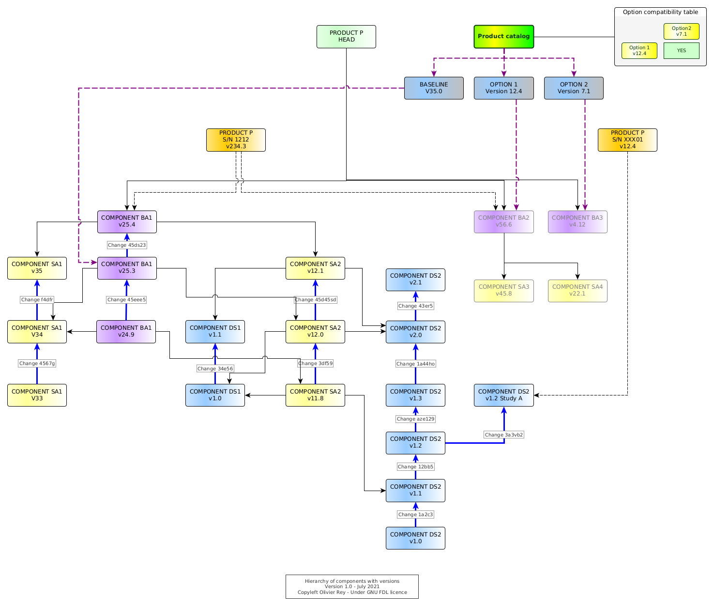

# Configuration management of industrial products in PDM/PLM

This article is the second one of a series on PLM. Please have a look at [PLM and Graph Data](about-plm.md) article for an introduction.

*Photo by [Martin Kessel](https://freeimages.com/photographer/ukmjk-31383) from [FreeImages](https://freeimages.com)*

Configuration management (CM) is at the heart of the industry, being the traditional industry or the software industry. While the software industry massively invested on this area for decades, reaching a certain level of maturity in which CM is no longer a problem, some areas of the traditional industry still use old CM practices that prevent other digital evolutions to be massively used, such as works at the digital twin level. When CM stays a matter of experts and is not streamlined in the industrial process, inefficiencies, productivity losses and bad quality of data are everywhere. This implies, generally, many product defects and customer dissatisfaction.

In this article, we will try to examine the two different ways of performing CM:

* The *dynamic* one, where the configuration of a product is the result of a calculation (quite often based on a complex filtering);
* The *static* one, where the configuration of a product is benefiting from the graph data that we can find in PLMs (see [PLM and Graph Data](about-plm.md) for more information).

Strangely, this topic is not massively discussed on the web while it is at the heart of the industry performance (and non performance), being during the design process, the manufacturing phase of product life cycle or during its support phase.

## The old way: Filtering the product tree

We will explore the first kind of industrial configuration management, the dynamic one, based on the the filtering, more or less elaborated, of the product tree.

## The product tree

In Part Data Management (PDM) systems, a product is represented by a tree, which leaves are parts or groups of parts (often called "design solutions").

The product tree structure is generally the fruit of several inspirations, amongst which we can find:

* A functional split of the product (quite often coming from the [system engineering](https://en.wikipedia.org/wiki/Systems_engineering) view of the product);
* A regulatory view of the product (e.g. a split of an aircraft product per ATA code of the systems in the aerospace world);
* An organizational view of the product, e.g. mapping the product in the various organizations of the engineering office that design the product (mechanical engineering, electrical engineering, engine, air conditioning, etc.);
* A mix between technical PDM systems capabilities (sometimes related to CM) and between the previous constraints.

The product tree, or "product structure", is containing the product with all its options, which is sometimes called "the 150% vision of the product". For sure, all options will not be applicable at the same time on a single instance of the product.

The big challenges are, in this context:

* To be able to get the exact list of applicable parts (or applicable design solutions) for a certain instance of the product;
* To be able to manage the catalog of applicable options at a certain moment to future instances of the product;
* To be able to manage change in this universe, for instance when some parts become obsolete and must be exchanged by something else.

Moreover, the configurations of products that were manufactured or built must be preserved for maintenance. That can mean being able to create maintenance manuals and spare part lists for all products that were, at some point, manufactured and/or built. That would mean keeping track of the individual configuration of some product at some key moments of their life cycle.

## Manual version management in the product tree

Generally, old PDM systems don't manage natively the version management. When a leaf of the tree changes, let's suppose it is a design solution, a new version of the design solution must be created manually by copying the previous one and its content and name it with a version number in its name.

Let's take an example: The brakes of the bicycle product (see Figure 1) are changing because the brakes provider does not manufacture the old brakes anymore. In the PDM system, we must keep the old brake version because those information can be useful for the support of the already manufactured bicycles. We create a new brakes design solution by copying the old one, renaming it, and changing in it what needs to be changed to take into account the new version of the component.

From a certain point in time, from a certain instance of the bicycle product, all brakes will be of the new release `V2`. Generally, industrially, we will move from the old version `V1` to the new one `V2` when the stock of old brakes will be empty. This shows that the changes in product configuration can have quickly industrial impacts.

In the PDM system, we end up having, at the bottom of one branch, two versions of the brakes. If the product tree was inspired by a systems engineering approach, we should have a generic "brakes branch", corresponding to the "brake function", with two possible implementations:

* One that was used from the first instances of the bicycle product up to instance number N (we will often speak about product "serial number" or S/N to identify in a unique way the instances of the product),
* And the second one that will be used from instance number N+1 and for the future (see Figure 1).

*Figure 1: Basic applicability in PDM*

## Configuration management using links

We can provide a quick definition of applicability in this context:

* For a product with a serial number `K`, the brakes version `1` are applicable to S/N `K` if `K` is inferior or equal to `N`;
* From `N+1`, the version `2` of the brake is applicable.

In PDM systems, the applicability is traditionally attached to the links as shown in Figure 1. Applicabilities are, in that case, intervals of product S/N: Brakes `V1` are applicable to bicycle which S/N is in the range `[1, N]`, and brakes `V2` are applicable to the products which S/N is in the range `[N+1, infinity[`.

Having defined the applicabilities on all links, it is possible to *filter* the full product tree with a specific S/N to see what is applicable to this S/N. The filtered tree will correspond to the subset of the product tree corresponding to the specific options that are present in the product which serial number is `K`.

For sure, if we try to filter the product tree with a S/N that does not exist (i.e. in the future), we may retrieve (depending on how the filtering mechanism is implemented) the list of all possible design solutions that are applicable *from now*. In the case of Figure 1, for sure, the `V1` of the brakes will not be applicable anymore for any S/N superior to `N`. Without any particular definition of our S/N options, we may see more than 100% of a product because we did not defined the very features of that S/N yet, and we may get all available options (product catalog) with this filter.

## The product catalog

In order to maintain a catalog of options and to manage options compatibility, we need to have those data store somewhere (see Figure 2).

*Figure 2: Basic PDM product catalog*

In some cases, those crucial data will be maintained outside the PDM, in Excel, or in a separate Access database, which will rely on manual actions for the synchronization (source of errors and inconsistencies); in some other times, those data will be maintained inside the PDM system itself.

Compatibility tables are an important element of this product catalog. Very frequently, they implement non trivial rules that depend on one another. The Figure 2 shows a sample of that: the basic breaks in `V2` are compatible with both basic wheels in `V3` and premium wheels in `V2`.

The product catalog is crucial because it is enabling:

* To create a vision of the product options for the marketing and sales department (in a certain way to define the common language between marketing and sales and the engineering departments);
* To attach to a specific S/N of product a list of options;
* To guarantee that those options are compatible with one another.

The product catalog introduces a S/N vision inside the PDM system. From now on, without any product catalog vision, we could live with just "S/N intervals" of applicabilities. But if we make the S/N concrete and attached to a specific set of options, we can ask ourselves what is the best way of managing this information inside the system (we will come back on that point).

## Managing the changes

For, sure, as shown in Figure 2, components have versions, and we must track the changes between those versions. Change tracking is fundamental because it has an industrial impact, especially on stocks, on procurement, on all the manufacturing process, and on the maintenance process. Change management is the set of required actions that are done to justify the change and master its impacts.

In some businesses such as aerospace, the change is also tracked to prove to the authority that the aircraft can "inherit" from a past certification because the changes performed on it are just "small" ones. In case a change is important, a re-certification is required on a part or all the aircraft type.

Basically, during the life cycle of the product, all entities will change and will be versioned, including the compatibility tables for the various options. Change objects are interesting to track precisely why we did a change. In complex manufacturing products, change management ensure that the primary objective of the change is respected: fix something, enhance something else, take into account the impact of obsolescence, etc.

## Special case: Applicability management through changes

In some areas such as aerospace, the change is considered so important, because of the fact that it is linked to airworthiness certification of flying machines, that the *full product is seen through changes* - and not through physical components.

To explain the problem, we will simplify a bit the situation. A change is an entity that will describe the replacement of one or several design solutions by one or several new ones. If we consider that an original design solution was "created by a change" (`Change 1` in Figure 3 is creating the Brakes in `V1`), we can see the product as a "stack of changes".

*Figure 3: Managing applicabilities with changes*

In Figure 3, we can see several states of the brakes:

* The `Change 1` is creating the design solution `Brakes V1`.
* The `Change 2` does a modification to the `Brakes V1`.
    * In our example, this situation is often called a "retrofit". The design solution `Modification to brakes V1` must be envisaged as being applicable on top of `Brakes V1`. This situation occurs when, for instance, a part was forgotten in the original `Brakes V1` design solution but, for certain reasons, we can't change directly the design solution `Brakes V1`.
    * To apply this retrofit, both `Change 1` and `Change 2` will be applicable, but maybe some products were manufactured with only the `Change 1` and so they may have defects.
    * For sure, the manufacturing and the support will have to be aware that `Modification to brakes V1` is not a full design solution but some kind of "delta" to be applied to the previous version of the component (here `Brakes V1`).
* The `Change 3` replaces the previous one with a full new design solution that is only pointing to `Brakes V2`.

It is interesting to note that, in this model, we know if a design solution is applicable or not to a product serial number *if the change is applicable to the product serial number*. The product is no more a set of components: It is a "set of changes".

We will call this way of proceeding an "administrative configuration management method", administrative because the product is *hidden behind the administrative iterative change process that leads to define it and to ensure its certification*.

The main consequence of this kind of configuration management is that a specific S/N of the product cannot be retrieved from the product tree by applying just a filtering on S/N ranges: We must do some kind of complex "calculation" to start from the description of the product as a set of changes to find what are the real design solutions that are applicable to this S/N.

We can note that this way of working is complexifying the works of everyone, because everyone in the company needs a static vision of the S/N, at least in a certain version:

* The design office needs to work in a certain product context to perform relevant modifications;
* The industry needs to know the exact configuration of the S/N in order to build it;
* The support needs the exact configuration of all S/N to ensure that the maintenance manuals and spare part lists are covering all the manufactured products.

The problem of configuration calculation process is that it embeds *business rules*. An example of that is the retrofit situation that we have just shown in Figure 3. We could have decided never to use this kind of "delta" mechanism and only work by a replacement approach. The set of rules that will apply to find back the configuration of a S/N being business rules, they may change with time.

This can lead to real problems because with this change in time, it is not guaranteed at all that when we recalculate the configuration of a S/N in the past, we will find again the exact same configuration that we have delivered top the manufacturing team. That is often interpreted, wrongly,  as a non reliability of the PDM system that cannot fond back the configurations of the already delivered products.

### Stacking the changes

This model establishes a "lineage" between changes that, most of the time, does not enable "forks" of design solutions, like shown in Figure 4.

*Figure 4: Forking a design solution*

`Brakes V3` are clearly a fork of `Brakes V1`, so the change should be done between both. But, in a standard "stack-oriented change system", the `Change 4` will be associated to the next iteration of Brakes V2, which is not the case.

This lineage forces to see the product as a continuous set of changes, a pile or a stack of changes. That means that, in case of wrong modifications in the design solutions, it is not possible to get a design solution of the past and to start at this point, which the fork mechanism is all about. It is mandatory to "undo" all modifications you did to come back to the previous state.

Undoing is generally a manual, costly and error prone process (incredible to people that come from the software industry, where forking is one very basic action in configuration management).

### From the PDM system to the CLM system

This stacking of changes method transforms the PDM system into what we could call a "CLM", standing for Change Lifecycle Management, but not into a PLM (Product Lifecycle Management).

This statement is very important because, in a certain way, the administrative CM method based on change stacks is proposing an approach that is *diverging from the PLM world* where the product is at the center and the change on a secondary level. The CLM system, by putting the change first and the product "behind" it, closes the door to static graph data usage in PLM. This way of working, as we will see it in the rest of the article, creates cascading problems in all the manufacturing company.

## The limitations of filtering-based CM

Filtering-based CM systems (being simple applicability oriented or change-based applicability oriented) seem to us as being structural sources of problems. Moreover, when investigating their origin, it appears that they are very linked to the PDM system limitations of the 90s.

And the fact is PDM systems evolved into PLM systems leveraging the product graph data and enabling a vision of CM closer to what is found in the software industry, a method that we could name "100% calculated configuration" or "static configuration management". This way of working is the only one to enable works at the digital twin level.

Indeed, how can you work on the digital product if the vision you have of the product is the result of a dynamic filtering calculation that will not be persistent enough to enable the creation of the many links you need to do in the graph data?

## Work around: Isolate from filtering-based configuration

If we try to implement concurrent engineering in an environment where the CM is dynamic, we immediately face problems. Let's suppose we work on component `C1` and this component is applicable to our S/N at `T0`. At a certain point in time `T1`, we discover that the configuration calculation declared `C1` not applicable anymore.

First of all, we will have to find back what is applicable instead of `C1` (let's suppose it is `C2`),  which may be not easy, but what would be feasible if we are part of the change board.

We probably created some data attached to `C1` and the problem will be to adapt those data to the `C2` case. Typically, we are in that situation where we created manufacturing instructions or support documentation attached to `C1`. We have, in this situation, many chances to be forced to live at the rhythm of the engineering configuration changes.

The common work around that we can see is a persistence of configuration in another database as shown in Figure 5.

*Figure 5: Work around with dynamic CM*

All intermediate configuration calculation will be stored in a separate area with a time stamp. Every other actor can work on a certain stable version for a while, without being disturbed by the continuous changes in applicability.

Then, when a version is ready, it is possible to calculate the deltas between the version I was working on and the last one. Ideally, we can calculate one single delta for many accumulated changes (like the software industry is doing). We can then act on the accumulated changes, analyze the impacts on our linked objects and perform the required changes.

The most severe consequence in not having a mechanism of systematic persistence of the dynamic configuration is that the manufacturing and the support are bound to work at the rhythm of the design office, whereas their processes and business objects may require a different lifecycle.

## The new way: Linking static graph data

We will now explore the second king of configuration management: the static one based on persistent non mutable graph data.

## Reusing components in the industry

Those last decades, the vision of the manufactured product changed a lot. If manufacturers were used to build almost all parts of their products, they transformed progressively into assemblers, letting the role of manufacturing subsystems to subcontractors (so-called "suppliers"). In a lot of cases, the supplier is not only manufacturing components, but it is also in charge of designing them.

The manufacturing industry entered the same constraints as the software industry. In order to build your product, you have to assemble components that you did not manufacture, so you have to master their compatibility with your own products. You must then take conventions with your suppliers about "interfaces".

To come back to our brakes example, as a bike manufacturer, we buy the brakes from an external supplier that will provide brakes to our company but also to other bicycle manufacturers. We have to define in a contract what will be the interfaces between our bicycle and the brakes. Those interfaces can be mechanical, but also, in the general case, electrical, fluid based, etc.

This definition of clear interfaces between components is the condition of component reusability. It also enabled a certain specialization of manufacturers that can perform R&D activities on their very domain and be innovative. This also created a component market that can imply large worldwide supply chains.

Being in machines, in automotive or in aerospace, the assemblers must control the configuration of the components they use. Like in software, during the lifecycle of a product, there will be many versions of the same component available for series production. For each of them, every actor will need information:

* In order to integrate it in the product tree (and possibly into the product 3D mock-up);
* In order to assemble it to the other parts of the product;
* In order to support it in the long run.

## The site specialization

Even if the assembler is mainly assembling components that are not manufactured internally, many manufacturers tend to specialize sites in order to implement the same component-oriented industrial strategy. Big manufacturers have the same constraints than their suppliers and, if they want to keep an expertise on some areas, it is better that they concentrate this expertise on a set of physical locations.

## Variants and customizations

Consequently, the challenge of modern manufacturing is to manage the product as a set of components, each of them having its own lifecycle, and most of them being more or less mastered by suppliers.

This model has many advantages:

* It is easier to create product variants, or product families, product lines, or different brands, considering that many components can be reused from one model to another;
* The component reusability enables better innovation on each component level;
* The industrial process is divided between component assembly process and final assembly processes, which implies a good performance of the logistics to be able to transport components to the different assembly lines.

The main drawback of the model is to enter a cycle of incremental component improvements without any product redesign. Indeed, redesigning a product is a much bigger task that can change the scope of the various components. When a supply chain is optimized with many internal and external components, the global innovation may have a tendency to decrease. In this context, new players can enter the industry with more effective approaches.

## Consequences for the product tree

The first consequence of this industrial reality is that the configuration must be managed at different levels:

* At the component level, the configuration must support variants and options;
* At the product level, the configuration must support which components are applicable.

For some big manufacturing products, such as cars, ships or aircrafts, we can have intermediate levels, sort of "big components" that aggregate smaller components. The configuration of the product becomes a multi-level configuration management system.

The product tree representation should materialize this tree of components like shown in Figure 6.

*Figure 6: Hierarchy of components*

We see that the product is composed of several layers of components. By seeing the diagram, we could analyze the various levels:

* The blue level is the design solution level. In that sample, that is the only layer the manufacturer of the product `P` really masters in terms of detailed design.
* The yellow level is the level of "Small Assemblies" (prefixed `SA`). Only the `SA2` is mastered internally. All other small assembly are coming from suppliers.
* The purple layer is the layer of "Big Assemblies" (prefixed `BA`). `BA1` and `BA2` are mastered by the manufacturing company because they are in charge of assembling the small assemblies that composed them. But `BA3` is directly coming from a supplier.

We can see that the way of organizing the data implies several things:

* The split of the product in components generally comes from the early phases of the design, especially from the systems engineering phase, that created a **product architecture** enabling to define the various components and their interfaces.
* It is required to frequently test the digital fit of the digital components together before trying to assemble them physically. We can call this process the **digital integration** of components at the "digital twin" level. Note that this process can be quite complicated because it can imply the verification of many interfaces on many levels.

Product architecture and digital integration are at the core of modern manufacturing. We can note those two activities are at the core of the software industry for decades, and that the manufacturing area converges progressively to the software industry practices, even if some constraints (at the interface level) are more complex in the industry.

## Adding versions to the product tree

If we add the versions of the various components in the product tree, we obtain Figure 7.

*Figure 7: Hierarchy of components with versions*

In this figure is shown the lifecycle of some components and their links together.

Let's start by analyzing `DS1`. This design solution has many versions. Those versions are linked together by a change having a unique ID (e.g. `Change 1a2c3` is tagging the link between `DS2` in `v1.0` and `DS2` in `v1.1`.

In the schema, the chosen convention is that any change on version on a lower component implies a change on the upper one. `DS2` in `v1.1` is used by `SA2` in `v1.18` and `v2.0` is used by `SA2` in `v12.0` and in `v12.1`. The structural dependencies are shown with black arrows.

The head of the product `P` is pointing to all heads (last versions) of all components. For sure, it is not because the product head is pointing to those components that they are applicable to every instance of the product.

## Materializing the S/N in the product tree

At the top of the diagram, we have an instance of product `P` with S/N `1212` using the `BA1` and `BA2` respectively in `v25.4` and `v56.6`. Each of the big assemblies points to the small assemblies that are in it, and those small assemblies point to the design solution they are composed of.

The first important thing to note is that there are no more calculation mechanism: The S/N `1212` in version `v234.3` is pointing to existing versions of big assemblies that are fully defined. If an upgrade would be done at whatever level on the tree (in Figure 7, at the design solution level, the small or big assembly level), the version management would enable to create a new version of product `P` S/N `1212` to point to those specific versions.

Note that when a version is "wired" with links, *it will never change in the future*, and ten years later, this past part of the graph will be exactly the same.

This way of creating graph data is another way (compared to the filtering approach), *much more efficient*, to manage applicabilities, configuration and changes.

## Applicability

The notion of applicability, as we saw it in the first part of the article, is twofold:

* Indicate that a specific product S/N is using a specific component;
* Indicate that, for future S/N, from a certain S/N, the component to be used should be a certain component in a certain version (something called sometimes "effectivity").

Looking at the tree of versions, for instance for `DS2`, we can see that we can decorrelate the versions of `DS2` and the versions of `SA2`: When `SA2` was only upgraded once, the `DS2` design solution had 2 intermediate versions that were not used to collaborate to the small assembly (`v1.2` and `v1.7`).

In a graph mode, the applicability can be seen under 2 angles:

* Real usage: A certain component really uses some other component in a certain version. The version used is *de facto* applicable to the component that aggregates the sub-component.
* Future applicability: It is defined by the set of components that can be used in the future. In a certain way, this is an open choice because all releases of all components are for ever available in the system. It can also be linked to an explicit feature available in the product catalog (see below).

In Figure 7, if we suppose that the components that we can produce are linked to the last one, we will be able to produce products using `BA1` in version `v25.4`, `BA2` in version `v56.6` and `BA3` in version `v4.12`, and all their graph of dependencies.

We can note also, in Figure 7, that a specific "study S/N" `XXX01` points to a fork of a design solution located in the past (`DS2` in version `v1.2 study A`). That enables to potentially come back to a design solution that could be better in the past and to start from it.

## Configuration

If the dynamic filtering model was requiring a more or less complex algorithm to find the real S/N, the Figure 7 shows that the S/N (in a certain version) is the head of a tree of components that is defined down to the level that is relevant for the proper industry. And, each time a component is changing of release, an impact study can be led to see if this change should also impact the S/N that must be produced.

The graph data approach enables, in that case, that all versions of the S/N configuration are secured forever inside the system. By the way, we can see here that the system can be called a "Product Lifecycle Management (PLM)" system because it contains the full history of the product line, of the product components (whatever the level) and of all the serial numbers. In a certain way, all configurations are there, are "solved", are calculated" (because there are no more calculation).

The fact that all versions of the configuration are secured inside a PLM is critical for many processes, especially the concurrent engineering ones. Let's take an example.

Let us suppose the engineering sent the version `v12.0` of `SA2` to the manufacturing preparation. Some people will work on the assembling instructions of this version of the small assembly pointing to specific versions of design solution `DS1` and `DS2`. Meanwhile, the engineering department worked in the version `v2.1` of the `DS2`. Everyone can work in parallel without having any conflict. That is a much better situation than the one we saw previously.

## Change management

In the graph model, changes will tag the various links between two versions of the same component.

The fact that the change is restricted to the same component is very important because it is quite different from a model where a change can aggregate a "before" status (composed by several components) and an "after" status (composed also by several components). This kid of change does not exist anymore and is replaced potentially by a change at an assembly level. The next version of an assembly can embed different components that the previous version of the same assembly.

In this model, the change object is limited to change.

For a certain product instance (serial number), finding its delta of changes compared to a certain version in the history (for instance a certified baseline) will consist in aggregating all the changes that led to all versions of all its sub-components.

In Figure 7, the component `SA2` changes version from `v11.8` to `v12.0` while skipping two versions of `DS2`. In a certain way, the change `3df59` corresponds to the union of changes `12bb5`, `aze129` and `1a44ho` (because also `v11.8` and `v12.0` of `SA2` are using the same version of `DS1`).

In order to be able to commit, at the `SA2` level, the change, specific digital tools enabling to compare directly version `v2.0` and `v1.1` of `DS1` are needed. Contrary to the change management we saw in the first part of the article, each real state of each component is secured and there is no need to create tricks to recompose the true component or design solution.

Using graph data in PLM enables to put the change *behind* the product and to enter the world of PLM, rather to keep working in a CLM world.

This model should be seen as the real product-oriented model. There are two major differences between this model and the filtering tree model:

* All configurations are solved and explicit in the graph model;
* To get the set of changes between a product S/N and a baseline in the past, we have to perform some graph analysis, comparing the graph of the S/N and the graph of the baseline and gathering all changes that enabled to go from the one to the other.

In one word, the product comes **first** and the change comes second. A system with this kind of management can be called a product lifecycle management system.

## Product catalog

An interesting thing to note is that is a "solved graph" containing all design solutions (or parts) in all versions, all assemblies, whatever their size, all serial numbers, it is very easy to create a product catalog (see Figure 7).

Indeed, the product catalog is:

* The head of all the applicable elements at a certain point in time, with the desired level of granularity;
* The compatibility and incompatibility tables between the various options.

We can also see that, if we put in place, inside the PLM, a process of choosing the baseline (the major set of components that is applicable to all products, `BA1` in Figure 7) and all the options, the product instance definition can create a S/N as a new head in the graph pointing the right versions of all components (like shown in Figure 7). In that model, there is no calculation: The S/N, in its first version, is the direct fruit of the product catalog. It is directly usable by the manufacturing and the support.

In a certain way, we have defined a direct and non ambiguous link between marketing and sales, engineering, manufacturing and support.

## More PLM features

Many features that are considered as basic and standard by the software industry would be of great interest in the industries that are not using PLM (or using PLM with a filtering configuration approach).

For instance, the fixes on some components (retrofits) can be solved by forking a component (like `DS2` in version `v1.2 study A`) to fix it in a parallel branch. In order to get back the fix on the main branch, we will create a merge between the version in the branch and the head version of the main branch. Branching can then be used as in the software industry (see [branching](https://en.wikipedia.org/wiki/Branching_(version_control) "branching")). For sure, some merge strategy will have to be defined to be applicable in an environment where design solutions are composed by 3D models, list of parts (so-called bill of materials or "BOM"s) and documents.

We already saw the capability of studies that graph data offer: At any moment it is possible to create fake products in which specific components, applicable today, are replaced by:

* New components, fruit of new studies: Very useful for innovation or to answer to a specific unusual customer requirement;
* Fake components: Very useful when a digital mock-up has to be produced but without giving the exact details of some areas of the products (to be protected from competition piracy);
* Old components: To make some analysis in specific old configurations (in which we can apply possible retrofits);
* Any other kind of situation where we need to create a product that we do not intend, at least at first, to industrialize.

## Playing with the digital twin

The full graph in the PLM represents the digital twin of the product line, product line because all possible products are in it. In a certain way, the PLM of the product line is the global digital twin and contains each S/N which is the digital twin of each product.

As the PLM contains a graph of data, it is possible to make any link at whatever level we want, and so add links to data that are related to a certain "node".

## Conclusion

We saw, in this article, that there were two ways of doing configuration management in PDM/PLM systems:

* The dynamic filter-based one,
* The static graph-based one.

We believe the first one is bringing many problems and inefficiencies in the engineering department an much more in the manufacturing and the support departments. The second one however is securing all data, makes things simple and enables concurrent engineering.

The migration from the first to the second is a complicated but very interesting task we have been working on (see [Madics conference 2019](https://orey.github.io/papers/semantic/data-migration/ "Madics conference")). It can bring a lot of value, simplicity and productivity to the industry. It also opens the door to more product architecture activities, more digital integration works, more digital delta tools between several versions of components.

The graph data are at the core of the PLM systems.

## See also

The series of articles about PLM:

* Article 1: [PLM and graph data](about-plm.md "PLM and graph data")
* Article 3: [The four core functions showing you need a PLM](spreadsheet-and-PLM.md)

Other connected articles:

* [The real nature of data](data-interop.md "The real nature of data")

*(July 2021)*

