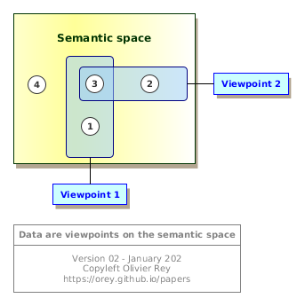
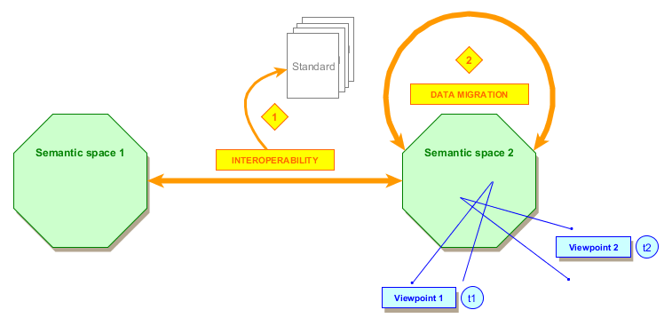

# Data challenges in the industry

 

"Data is the new gold". "Data drives the world". "We are in a data driven world".

All medias, and not especially the IT medias, are obsessed with data and the value they represent. The fact is what is true for retail, where people buy products, is not so obvious in a lot of other businesses such as the industry.

Maybe data is the new gold, but we are often like old miners: looking at a way to extract the value from multiple sources representing complex objects that have a complex and specific lifecycle. Like old miners, we need methods to deal with those data and make sense of them.

In the industry, where the "Digital Continuity" or "Digital Thread" are both necessities and buzzwords, the data related issues are numerous.

Even if there is always the idea of an "end-to-end backbone", of a "central repository of multi-view oriented data", not all companies can achieve this dream of having "all data, in all lifecycle states, in a consistent way, in a single place".

In other industries, this dream is highly linked to the monolith architecture anti-pattern.

## The real nature of data

The first fact we must keep in mind is that data is not "absolute", it is the result of a set of factors.

<u>Figure 1</u>: The relative nature of data

Data was always produced by a certain business process. For that reason, data is the product of the following factors:

  * A semantic space, which corresponds to a set of "business concepts" having semantic meanings and semantic links to one another;
  * A point of view;
  * A specific moment in time.

Some data may be simple to interpret, for instance the list of articles you consulted in a retail website. With those data and the ones of people that bought the same products than you, you can create personalized recommendation algorithms.

But in the industry, that is not because you have the data that you can use them easily, even if you are talking about the exact same thing than your neighbor of the next office (same semantic space): you may look at the same business concepts in another time frame, or your perspective makes you look at the other linked business concepts that are not relevant for the next office.

 

## See Also

 * [About GraphQL](graphql-web-services.md)

## Notes

[1] - In some businesses, like the airline one (standardized by [IATA](https://www.iata.org)), services have big requests and big responses for decades because the business requires it.

(*December 2018*)

