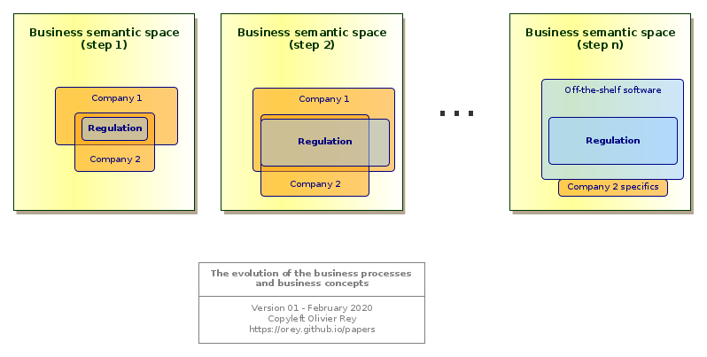

# The real nature of data

 

"Data is the new gold". "Data drives the world". "We are in a data driven world".

All medias, and not especially the IT medias, seem obsessed with data, especially big data, and the value they are representing or should represent.

For decades now, we are running on data. Big data is just another step in a long-term trend that is just beginning. As always, the marketing speeches around big data are over-selling promises as they did in the past with relational databases, datawarehouses, datamarts, etc.).

This article explains that data is not a simple absolute usable IT "product" that can be used, in all cases, as a *source material*. On the contrary, it is an elaborated product, fruit of a certain set of use cases and technical constraints, which makes its usability complex in many cases, which explains why some concepts like datalakes are not working in any case.

## Describing the business

### Software development is all about representation

One of the main objectives of IT is to automate the business processes and enable a better business management. This is achieved by storing the business concepts and manage the business rules associated to them and that control their life cycle.

In order to do a good job, the IT people must create a working *representation* of the business, both static and dynamic to be able to create the software applications that will automate the business.

Application development is, consequently, all about *representating*.

IT representations are like all representations: They are relative and changing. This fact has many consequences on data, as we will see.

### Business concepts and business processes

In every business domain, we can exhibit business concepts. Those business concepts are linked together with various kinds of relationships. They establish a first *representation* of the business.

Business processes are manipulating those business concepts, creating them, changing their state, linking or unlinking them together. Business processes establish the second dimension of the representation of business (to simplify, we will consider that business rules are part of the business processes).

From this double representation, software designers can do many things:

* Create applications that manipulate those concepts and the concepts life cycles;
* Create databases that store those concepts;
* Create business workflows that will be a way to *assist* the business processes with software.

For each business, we can define the set of all business processes and business concepts of the business domain as the *business semantic space*. This set is a theoretical concept that contains *all possible IT representations of a particular business*. Every software attached to a business domain is covering a part of the related business semantic space.

### Enriching the representations

With time and business digital maturity, the business concepts and business processes are enriched. This phenomenon is a big constant of the IT world.

Let us take an example: accounting. In the 80s, every company that had the financial means had their own accounting system, developed by themselves. The legislation was, often, not very detailed and each company had interpreted it in slightly different ways. With time, the legislation became more detailed and companies found it hard to implement the concepts and processes. Software companies provided generic accounting software that were taking in charge all concepts and processes of the accounting business and that could be parameterized to the special case of each company.



<a name="figure1"></a><u>Figure 1</u>: The evolution of the business concepts and processes

With time and maturity, the considered business *discovers* progressively how to structure its business processes and business concepts: it is *shaping* its business by creating the most adequate representations at a certain point in time. That activity is called *modeling*.

The Fig. 1 tries to represent this progressive representation enrichment in the case of a regulated business. At the beginning, both company 1 and company 2 have implemented their interpretation of the regulation: They both cover it (and more), but in different ways. At this stage, one company can have a competitive advantage on the other, if its interpretation is having better business impact.

Then, the regulation expands (step 2 in Fig. 1): Company 1 covers it but company 2 has a hard time to do it. After a certain time, companies 1 and 2 will use an off-the-shelf software to cover the regulation (step n). Company 2 will still have a specific application connected to the off-the-shelf software. In that case, company 2 may have a better digitization of its business domain than company 1 by covering more of the business semantic space with a specific software.

This maturity cycle is a crucial dynamic process in IT, and every IT architect should be aware of it. There are several signs that enable to to estimate the maturity of a business in terms of knowledge representation (business concepts and business processes).

### The starting point: A paper/Excel-based process

As long as the business concepts are not known for what they really are, the business is not represented (at least from an IT standpoint): it is not conceptualized. At this moment, every user can get satisfied with generic multi-purpose tools like Excel.

In that case, the business knowledge can be:

* Located in procedures, written in documents, and that everyone has to follow (but with no way to control the real application of those procedures);
* People-driven: everyone is doing the business as he wants, provided the end result is obtained (which is causing recurring troubles to work in teams).

This kind of processes is both dangerous for the company because it relies on individuals and can be lost when knowledgeable people are no more in charge, and not scalable, so not able to run with more business activity.

The business teams need a software to manage their business: it will be the first generation of software. This generation will embed the first IT representation of the business (business concepts and business processes). It will address the first business use cases of identified business roles.

As soon as the business concepts are represented, they have a structure, they generally have fields of a certain type, they have links with one another and it is no more possible to manage them with Excel.

### The evolution of the business representation

Progressively, the business have a better understanding of its business, and some concepts will become more detailed and new concepts will appear (or just will be "named").

In those cases, the business representation will evolve: instead of having one business concept, the business team realizes that 2 concepts are indeed *hidden* in the original one; or the reverse, that 2 different concepts are, at last, the same.

This evolution enables to make business processes evolve and, quite often, gain in productivity.

For sure, we have to insist: the new representation is different from the previous one, generally covering more space in the business semantic space. But it is still relative to the use cases and the roles taken in charge. It is still a representation, and a representation is not absolute.

This phase is interesting because it can also exhibits a new kind of concept: *management concepts*, like "task", "folder", "affair", more generic concepts that could be used in another business domain, and that are used to manage things.

### Next generation software

The next generation of software is generally built on both the experience of the previous one and on the new ways of working of the domain (for instance imposed by the regulation). Its perspective is often larger and encompasses a larger set of use cases.

It becomes necessary when the previous system shows limitations in terms of evolutions. Indeed, in software, the way of representing the business concepts and business processes is largely sub-optimal (see our works on the [graph-oriented programming](https://orey.github.io/papers/)), which implies the necessity to rewrite the business application on a larger set of hypothesis, to keep on gaining in efficiency and productivity.

The representation can be deeply modified, being on a business process level and on a business concept level. That means that:

* There is a need for change management to adapt the processes;
* There is a need for data migration to transform the old concepts into the new ones;
* There is a need to reconsider the interfaces between the system that evolves and its ecosystem.

All mature businesses went to several generations of software.

Let us take back the accounting sample. Many companies are now running their 3rd or 4th generation of accounting software. We can consider that the business is quite mature, and for sure, if we see the large functional scope of modern accounting software, we see that most concepts, along with the regulation, are quite mature.

### Connecting business domains
<a name="interop"></a>

An important sign of business maturity is the *presence in the business of a multi-company standard exchange format*, like the IATA transactions in the travel business, the Swift system in the banking area or the Step and ASD standards of the aerospace industry. Those standards are generally the fruits of impressive collective efforts to provide a multi-company shared vision of one or several business domains, in terms of business processes and in terms of business concepts.

The presence of exchange standards are very important, not only because they define common business concepts and business processes, but because *they define a frontier* between the different business semantic spaces.


<a name="figure2"></a><u>Figure 2</u>: Connecting several semantic spaces

The Fig. 2 is representing this situation of 2 business semantic spaces exchange concepts through an exchange format. Note that Fig. 2 represents 2 applications, application 1 and 2 respectively in the semantic spaces A and B. For them, for sure, the exchange format will be a subset of the concepts and processes they manipulate.

Indeed, even if the business semantic space is hard to define in terms of exact scope, collective efforts to define interchange formats lead to the conclusion that several business:

* Are different;
* Need to share some concepts and be part of a larger process.

These 2 very basic statements should not be taken lightly, because they have deep consequences on the shape of global IT systems.

Indeed, there are *several business domains* in the world, each of them having their own concepts and processes. They sometimes have to be part of a larger process and have to share concepts in that purpose. But being able to exchange concepts does not mean that they are in the same semantic space.

The optimal frontiers between different semantic spaces are the root problem behind an efficient set of IT systems, a global company performance, and an optimal business function placement (in French: "urbanisation").

Optimal business function placement is one of the most important role of the enterprise architect. If the systems are respecting the business semantic spaces, the company will be efficient, and every business will be able to evolve independently from the others provided the exchange formats are respected. If the business functions of various business semantic spaces are mixed together, there will be a huge confusion in processes and responsibilities and it will be very complicated for every business to evolve without impact the full company.

Because, with time, business representations are changing, while staying in the same business semantic spaces, businesses deserve to have the capability to mature without being too tight to other businesses, even if they share a large number of business concepts (but not represented the same way).

That is why exchange standards are so important: because they define the perimeter of the various business semantic spaces and enable to build large processes among them; and because this representation is the fruit of a collective effort of experts in the particular business domains.

## The real nature of data

### A attempt to define "data"

As we explain, business concepts are representations. They can have many representations in the same semantic space.

We can define "data" as follows: *Data are projections of the business concepts on technical constraints*.


<a name="figure3"></a><u>Figure 3</u>: Data are viewpoints on business concepts of the semantic space

This simple representation of Fig. 3 is trying to put in focus several points:

* An application is defining a *viewpoint* on the business semantic space; This viewpoint is not absolute, it is a *representation* of business processes and business concepts that is the fruit of business roles and business use cases;
* Data are a projection of the business concepts in the space of technical constraints; This projection is a *transformation* of the business concepts; It is not absolute, and it depends upon the programming languages, the database technology, the performance requirements, etc.

In other words, data are a technical transformation of a business representation of a business concept.

### The relativity of data

As we saw in the [Connecting domains](#interop) section and in [Fig. 2](#figure2), business domains can communicate together with the help of exchange formats.

Let us examine this process at the data level by considering Fig. 4.


<a name="figure4"></a><u>Figure 4</u>: Data models are relative

At the data level we can see 3 different representations of the same interchange concepts:

* The are 4 business objects in the data model of application 1;
* There are only 3 business objects in the data model of application 2;
* In the exchange format, there is no explicit mention of the links between ```A```, ```B```, ```C``` and ```D```, but a grouping of those business objects and a cardinality grammar.

Those 3 different representations of data are *semantically equivalent*, but they are different representations of the same reality.

Two more comments can be added to that description:

* The data model we see for application 1 and application 2 is just a subset of their complete data model that will manipulate concepts that are not known from the other application (because they are in 2 different business domains);
* The interchange format is transported in a *service* way, within the concept of a *verb* (see our article on web services [here](https://orey.github.io/papers/articles/about-rest/) and [here](https://orey.github.io/papers/articles/graphql-web-services/).

### Aggregating data

Let us suppose, taking the sample of [Fig. 4](#figure4), that the application 1 publishes data to application 2. If we were to aggregate data from application 1 and application 2, we would be facing a problem: what data should we consider?

It is not an easy problem. The application 1 offers more details in modeling ```A``` and ```C``` as different entities, whereas application 2 is using ```AunionC``` instead. But in terms of sequence, if data in application 2 is fresher than data in application 1 (because it is after in the flow), should not we take data in application 2 instead of data in application 1? But who is really the master in those data? And what about we need data connected to ```C```? Is it equivalent to connect those data to ```AunionC```?


<a name="figure5"></a><u>Figure 5</u>: What data should be in the data lake?

[Fig. 5](#figure5) shows the problem graphically.

It is possible to solve this issue on two conditions:

* To explicitly determine what we intend to do by aggregating the data from those two applications; What is the point in doing that? What treatments we want to implement? For what functional purpose?
* To have a minimum of functional and technical knowledge about applications 1 and 2, why are they communicating together, to what purpose, at what moment, etc.

Aggregating data is not an end, it is a solution answering to a business question. So what is the business question?

## About data lakes

### The data lake for real use cases

In some business, the interest of manipulating a huge amount of data is obvious:

* In Internet retail for instance: for big websites, you have a massive amount of data for each customer visiting your website with all information related to the consultations and to the purchases; Those data are being largely used for years;
* In the industry: Most production assembly lines generate a lot of data that are used to monitor the quality of the product and the productivity;
* In public services: Analyzing in details at the country level the various business trends, employment data and so on, can be done now from the real low level real data instead of using representative samples;
* Etc.

What is common between all those samples is that the use cases of those big data are very clear and the big data technologies are just a way to answer to them. In a certain way, we are just talking about classical software applications using big data technology to store many more data than classical applications used to do.

### The data lake for no use cases

<a name="link-note1"></a>The fact is most data lakes projects are not focusing on real use cases: they do the reverse. They are infrastructure projects to *enable future use cases*. They are called *enablers* which is a nice word to say: "let's do a technical project and we'll see afterwards if it can be used on real use cases" [(1)](#note1).

Big data vendors are so powerful (as datawarehouse vendors decades ago) and so trendy, that they convince enterprises to put in place big data infrastructure *prior* to having real use cases.

The speech is seductive: In order to realize whatever use case you will want to implement in the future, your company needs to put all company data in a data lake; This will enable you to correlate all data you want and  find value in your sleeping data.

<a name="link-note2"></a>This speech has the advantage of seducing end users that understand the concept, and IT people that are thrilled by the introduction of new technology [(2)](#note2).

For sure, the fact that data lakes with real use cases work are confusing the situation.

For data lakes like for other topics, providing technology without a real use case is a very risky operation, that generally ends badly: Millions invested for nothing.
ure out what system is master at what point in time.

### Data lake as an application

Indeed, working data lakes are applications (with big data). But, if this reasoning is true, that would mean that a data lake is an *application* rather than a *data store*, that it has some data ingestion *business logic* to be able to ingest data that fit in a global data landscape without introducing ambiguities or erroneous data links.

But, if that is the case, that means that the data lake is also creating its own viewpoint on the semantic space, like shown if Fig. 6, which most of the time is built on the pivot models we find in exchange formats.


<a name="figure6"></a><u>Figure 6</u>: The data lake as another kind of application

### Semantic technology applied to data lakes

The most recent flavor of the ever lasting concept of data warehouse is the *semantic data lake*.

The idea can be summarized as follows: with the proper ontological description (ontologies being Semantic Web way of describing concepts), it is possible to aggregate all sorts of data and link them together.

[Fig. 4](#figure4) is showing that, for the same concepts, we have 3 ways of representing it. The ontology approach will unfortunately not change this fact. For each representation, we can define a specific ontology that will not be the same and that will *show knowledge representation* choices (or modeling choices). For sure, we could define graph transformations that would make those 3 ontologies equivalent: but they are not the same. So Semantic Web technologies will not help in defining the "data lake for no use cases".

As we saw, the modeling formalism is not important because business concepts are representations, and so are relative to the particular point of view of the application (roles and use cases).

## Conclusion

The big data technologies are impressive. They come from the Internet age and from the solutions Cloud companies found to manage volumes of data that are much bigger than anything the humanity saw in the 20th century. Those technologies can be very useful for identified use cases, such as the industrial use cases (to better the product design, to monitor the product product, to manage the in-service life of products) or the Internet retail.

But those technologies should not be envisaged outside of clearly defined use cases, first of all because all big data technologies cannot answer to all big data problems (e.g. large time series oriented data processing), and second of all because data is a relative object, quite often product of complex upstream processes.

Furthermore, big data will always be expensive, and as all expensive technologies, the business case of using it should be carefully analyzed before investing.

## See Also

* [Considerations About Rest And Web Services](about-rest.md)
* [About GraphQL](graphql-web-services.md)

## Notes

<a name="note1"></a>(1) - The modern vocabulary of IT is a real regression compared to UML for instance. By talking about "features" and "enablers", it opens the door to develop "features" for unknown business roles and business processes, and to put in place "enablers", so technical infrastructure for the day when people will need it. This semantic shift is the result of a large-scale technical marketing of the large Cloud companies: instead of thinking about enhancing the business, most IT people and more and more business people think about technology. [Back to text](#link-note1).

<a name="note2"></a>(2) - Most IT people find it hard to enter into the knowledge of the business. They prefer working on technological assets. That is why, it is an important role of the IT management to continuously refocus IT people to answer business requirements or to help businesses use wisely the IT resources to solve their business problems. Without this continuous refocus, the gap between business and IT people is growing, opening the door to "IT done by the business" syndrome, sign of that impossibility to communicate. [Back to text](#link-note2).

(*February 2020*)


