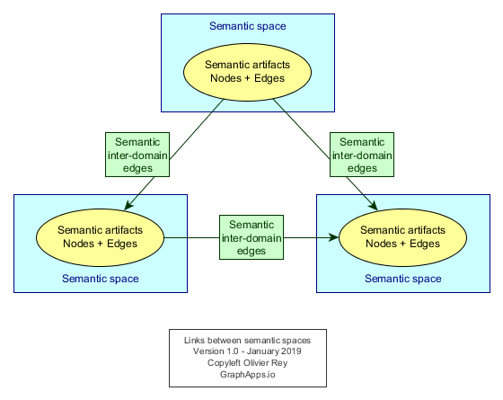
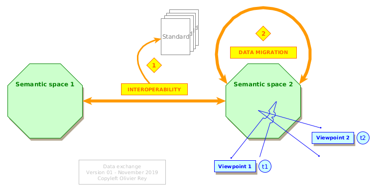

# Data and interoperability, history of a misunderstanding

 

"Data is the new gold". "Data drives the world". "We are in a data driven world".

All medias, and not especially the IT medias, seem obsessed with data, especially big data, and the value they are representing or should represent.

For decades now, we are running on data, and big data is just another step in a long-term trend that is selling continuously the same promises (datawarehouse, datamart, big data, analytics, etc.).

## Two kinds of approaches

### Big data technologies for real use cases

In some business, the interest of manipulating a huge amount of data is obvious:

* In Internet retail for instance: for big websites, you have a massive amount of data for each customer visiting your website with all information related to the consultations and to the purchases; Those data are being largely used for years;
* In the industry: Most production assembly lines generate a lot of data that are used to monitor the quality of the product and the productivity;
* In public services: Analyzing in details at the country level the various business trends, employment data and so on, can be done now from the real low level real data instead of using representative samples;
* Etc.

What is common between all those samples is that the use cases of those big data are very clear and the big data technologies are just a way to answer them. In a certain way, we are just talking about classical software applications using big data.

### Big data technology for no use cases

The fact is most big data projects are not focusing on real use cases: they do the reverse. They are infrastructure projects to enable future use cases.

Big data vendors are so powerful (as datawarehouse vendors decades ago) and so trendy, that they convince enterprises to put in place big data infrastructure *prior* to having real use cases. In order to realize whatever use case, you need all company data in a data lake. This will enable you to correlate all data as you want and, like old miners, to find hidden gold in your sleeping data.

For sure, as many enterprise applications store many data that, most often, represent various temporal states of complex business objects, at a certain moment of their lifecycle, the idea of putting all that together in a first step, to mine it afterwards and find value in a second, is very seductive to a lot of people:

* End users understand the concept,
* Tech people are thrilled.

Yet, those projects lead, generally, to major under achievements in regard to the expected value, despite millions invested. Why is that?

In this article, we will try to remember what is data and why some approaches are failing. Some ideas expressed here are well-known by a lot of people, but maybe not enough.

## Describing the business

### Business concepts and business processes

In every business domain, we can exhibit business concepts. Those business concepts are linked together with various kinds of relationships. They establish a first *representation* of the business.

Business processes are manipulating those business concepts, creating them, changing their state, linking or unlinking them together. Business processes establish the second dimension of the representation of business.

From this double representation, IT people can do many things:

* Create applications that manipulate those concepts and the concepts life cycles;
* Create databases that store those concepts;
* Create business workflows that will be a way to *assist* the business processes with software.

For each business, we have a set of business processes and business concepts. In this article we will name this set the business *semantic space*.

### Enriching the representations

With time and business digital maturity, the business concepts and business processes are enriched. This phenomenon is a big constant of the IT world.

Let us take an example: accounting. In the 80s, every company that had the financial means had their own accounting system, developed by themselves. The legislation was, often, not very detailed and each company had interpreted it in slightly different ways. With time, the legislation became more detailed and companies found it hard to implement the concepts and processes. Software companies provided generic accounting software that were taking in charge all concepts and processes from the accounting business and that could be parameterized to the very case of each company.


<u>Figure 1</u>: The evolution of the business concepts and processes

With time and maturity, the considered business discovers progressively how to structure its business processes and business concepts.

The Fig. 1 tries to represent this enrichment in the case of a regulated business. At the beginning, both company 1 and company 2 have implemented their interpretation of the regulation: They both cover it (and more), but in different ways. At this stage, one company can have a competitive advantage on the other, if its interpretation is having better business impact.

Then, the regulation expands (step 2 in Fig. 1): Company 1 covers it but company 2 has a hard time to do it. After a certain time, companies 1 and 2 will use an off-the-shelf software to cover the regulation (step n). Company 2 will still have a specific application connected to the off-the-shelf software. In that case, company 2 may have a better digitization of its business domain than company 1 by covering more of the business semantic space with software.

This maturity cycle is a crucial dynamic process in IT, and every IT architect should be aware of it. There are several signs that enable to to estimate the maturity of a business in terms of knowledge representation (business concepts and business processes).

### The path to maturity

As long as the business concepts are not known for what they really are, every user can get satisfied with generic multi-purpose tools like Excel. In that case, the business knowledge can be:

* Located in procedures written in documents, and that everyone has to follow;
* Personal: everyone is doing as he wishes provided the end result is obtained.

As soon as your business concepts are known, they have a structure, they have fields of a certain type, they have links with other concepts and it is no more possible to manage them with Excel. A business software is required to manipulate the business concepts and to manage a part of the business processes.

The first sign of the maturation of the business is *when business concepts appear*. This phase generally happens several times as Fig. 1 shows it:

* At first, a specific application will be developed implementing a certain vision of the business concepts and processes;
* Then, the applications evolutions will make evolve the business concepts and processes;
* Then application rewriting can bring a new vision, sometimes more adapted to the new practices but exploring in more details a part of the business semantic space.

Quite often, business processes can be ineffective because one or several concepts are hiding. They must be discovered (sometimes just "named") to unlock the business and enable the implementation of the business evolution in software.

It is quite important to note here that the concepts of a business semantic spaces are just *representations* - and representations do change (with maturity, with time, with change of practices, with regulation, etc.). Thus, *there is no absolute representation of a business concept*: There is just a *valid representation* at a certain time for a certain amount of people of a specific business concept.

Applications evolutions will, most of time, enhance the business concept representation, tweak it for it to be optimal. Maybe the original concept will see its structure evolve, maybe it will become 2 concepts or fusion with some other concepts. A business concept is an evolving object.

For sure, application rewriting/replacement is an important indicator for IT architects because it determines quite often the maturity of the business. The question is: *how many generations of software* implemented this very business after the paper/Excel phase.

Let us take back our accounting sample. Many companies are now running their 3rd generation of accounting software. We can consider that the business is quite mature, and for sure, if we see the large functional scope of modern accounting software, we see that most concepts, along with the regulation, are quite mature.

### Connecting business domains

Another important sign of business maturity is the *presence in the business of a multi-company exchange format*, like the IATA transactions in the travel business, the Swift system in the banking area or the Step and ASD standards of the aerospace industry. Those standards are generally impressive collective efforts to provide a multi-company shared vision of one or several business domains, in terms of business processes and in terms of business concepts: a collective effort to explore the semantic business domain.

The presence of exchange standards are very important, not only because they define common business concepts and business processes, but because *they define a frontier* between different business semantic spaces.


<u>Figure 2</u>: Connecting several semantic spaces

Indeed, even if the business semantic space is hard to define in terms of exact scope, collective efforts to define interchange formats lead to the conclusion that several business:

* Are different;
* Need to share some concepts and be part of a larger process.

Fig. 2 is representing this situation of 2 business semantic spaces exchange concepts through an exchange format. Note that Fig. 2 represents 2 applications, application 1 and 2 respectively in the semantic spaces A and B. For them, for sure, the exchange format will be a subset of the concepts and processes they manipulate.

We must insist on this fact, that is simple but heavy in its consequences: There are *several business domains* in the world, each of them having their own concepts and processes. They sometimes have to be part of a larger process and have to share concepts in that purpose. But being able to exchange concepts does not mean that they are in the same semantic space.

The optimal frontiers between different semantic spaces are the root problem behind an efficient set of IT systems and an optimal function placement (in French: "urbanisation"). Some semantic spaces must be separated while some others are indeed the same. Generally, it is not difficult to identify those spaces and when the business is changing (concepts, processes, actors).

As we will show, an extreme data orientation tends to believe that all business domains are just part of a single big semantic space... Which is untrue.

## The real nature of data

### A definition of data

As we explain, business concepts are representations. They can have many representations in the same semantic space.

We can define "data" (attached to an application) as follows:

    *Data is a **viewpoint** on a semantic space*,
    viewpoint brought by a business application
    (actors, processes, concepts).

Fig. 3 is representing this fact.


<u>Figure 3</u>: Data are viewpoints on business concepts of the semantic space

That means that another application could have another *interpretation* of the same business concepts. If the interpretation differs a lot, maybe the 2 representations are in different semantic spaces and maybe we are considering the exchange format.

--- reprendre ici


### Sample of data viewpoints


<u>Figure 4</u>: Data models are relative

If we consider Fig. 4, we can see that data models are relative to the use cases.

The data model of the applications 1 and 2 correspond respectively to the types 1 and 2 of data we saw in Fig. 3, and the exchange format to the data type 3. Those 3 different representations of data are equivalent, on a semantic standpoint, but we see that their implementation is quite different:

* The are 4 business objects in the data model of application 1 and only 3 in the data model of application 2;
* In the exchange format, there is no explicit mention of the links between ```A```, ```B```, ```C``` and ```D```, but a grouping of those business objects and a cardinality grammar.

For sure, the data model of applications 1 and 2 are much larger than what we see on Fig. 4, probably with concepts that are not known from one another (data of types 1 and 2).

## Data lake or data swamp

### Aggregating data is not obvious


<u>Figure 5</u>: What data should be in the data lake?

Continuing on the example of Fig. 4 with Fig. 5, if we were to gather all data in the same data lake starting from the data models, we would have twice the ```B``` and ```D``` objects, and once the ```A```, ```C``` and ```A-union-C``` objects. If we suppose that the application 1 is sending its data to application 2 at a certain point in time, we can suppose that the interface will transport "publishable" data, which means that, at a certain point in time, application 1 is likely to have more recent versions of the ```A```, ```B```, ```C``` and ```D``` business objects than the application 2. In the data lake, what would be the reference?

By looking at Fig. 5, what to do about the business objects which scope changes with the application 1 to application 2 interface? Must the data lake store ```A```, ```C``` and/or ```A-union-C```? Most often, all will depend on the data that will be connected in application 2.

For sure, with a little knowledge about the applications 1 and 2, their *functional* mechanisms, their very viewpoints on data (especially on data lifecycle), the reasons why they publish data at a certain moment to other applications, we can create a more intelligent data export in a data lake.

The concept of data lake is not bad in itself, but to be useful, the data lake must absolutely be built by people knowing:

* The data in the source systems and their lifecycles (the viewpoints on the semantic space), so their business rules also;
* The links between the many applications in order to figure out what system is master at what point in time.

### Is a data lake an application?

But, if this reasoning is true, that would mean that a data lake is an *application* rather than a *data store*, that it has some data ingestion *business logic* to be able to ingest data that fit in a global data landscape without introducing ambiguities or erroneous data links.

But, if that is the case, that means that the data lake is also creating its own viewpoint on the semantic space, like shown if Fig. 6.


<u>Figure 6</u>: The data lake as another kind of application


---reprendre ici


For some time, the simplistic idea of gathering all data from all sources in a single place, like a "data lake", is in the air. With time, this idea has been declined in several flavors, the most recent one being the semantic data lake: Indeed, with the proper data description (ontologies) and with the Semantic Web technologies, it seems possible to aggregate all sorts of data and link them together. To do what? To get the most out of them, for sure. Like years ago with data warehouses and data marts.


### Data is not absolute in a single business semantic space

As we explain, business concepts are representations. They can have many representations in the same semantic space.



<u>Figure 3</u>: The relative nature of data


We can define "data" (attached to an application) as the result of 2 main factors:

* A business semantic space,
* A *viewpoint* on that semantic space, brought by the application (actors, processes, concepts).

The Fig. 3 illustrates a semantic space and various viewpoints on it that result on "data". We can note that there as, on Fig. 3, 4 kinds of "data":

* Data type 1 and 2: Those data types are the ones we manipulate every day.
  * The viewpoint 1 and 2 are defined by applications that use a certain data model to manage their data.
* Data type 3: Data common to several viewpoints.
  * In Fig. 3, the viewpoints 1 and 2 have a common set of data, each of them being integrated in their larger viewpoint.
  * A typical sample of that would be 2 applications exchanging data by using a common exchange model based on data type 3.
* Data type 4: Data that is not addressed yet by any viewpoint but that resides in the same semantic space
  * A sample of that would be, in the industry, when we begin to measure some physical dimensions that were, previously only seen in a qualitative way. The new measuring methods make those data "visible", whereas they were in the semantic space of the very domain from the beginning, but we had no access to them.


For sure, if the data lake is built by people knowing the business, there is a good chance the data correlations will be possible and fruitful. But, if data is considered from a technical point of view, the aggregated data will most probably not provide any


We can note that the problem is difficult in itself and there are no generic solution.


Data was always produced by a certain business process. For that reason, data is the product of the following factors:

  * A semantic space, which corresponds to a set of "business concepts" having semantic meanings and semantic links to one another;
  * A point of view;
  * A specific moment in time.

Some data may be simple to interpret, for instance the list of articles you consulted in a retail website. With those data and the ones of people that bought the same products than you, you can create personalized recommendation algorithms.

But in the industry, that is not because you have the data that you can use them easily, even if you are talking about the exact same thing than your neighbor of the next office (same semantic space): you may look at the same business concepts in another time frame, or your perspective makes you look at the other linked business concepts that are not relevant for the next office.


 


In other industries, this dream is highly linked to the monolith architecture anti-pattern.


## See Also

 * [About GraphQL](graphql-web-services.md)

## Notes

[1] - In some businesses, like the airline one (standardized by [IATA](https://www.iata.org)), services have big requests and big responses for decades because the business requires it.

(*December 2018*)


