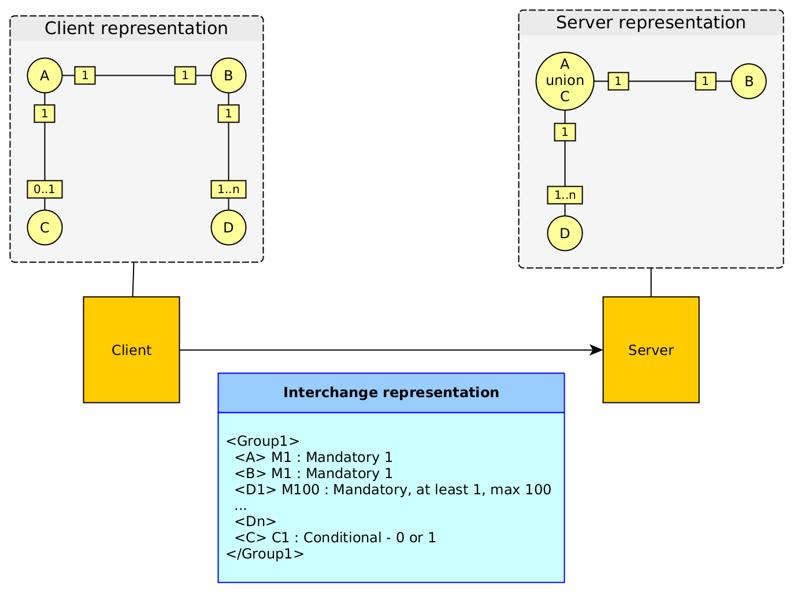
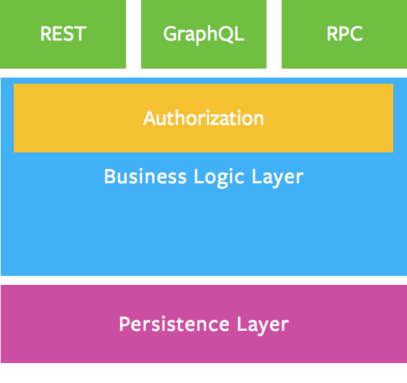

# GraphQL And Classic Web Services

 

Facebook produced the [GraphQL specification](http://graphql.org/) in order to be an alternative to Rest.

We already explained [what we thought of Rest services](about-rest.md).

GraphQL appears to us as a new way to do the same thing that what the industry is doing for decades.

This article is a first analysis of GraphQL and may be enriched or corrected with time with feedback on the industrial use of the standard.

## The Basics of Services

### Various Standards, Same Spirit

The underlying basis of services is RPC (Remote Procedure Call, [see the dedicated article on the subject](about-rest.md)). For decades, this concept is reinvented again and again with various flavors.

Apart from RPC protocols or proprietary protocols (like the [Tuxedo](https://en.wikipedia.org/wiki/Tuxedo_(software)) ones), [Edifact](https://en.wikipedia.org/wiki/EDIFACT) was for a long time an industry standard in some business domains like travel, banking, medical and logistics. Edifact was replaced by [XML](https://en.wikipedia.org/wiki/XML) then by [JSON](https://en.wikipedia.org/wiki/JSON).

Every of those standards aimed to provide the same functionality: exchanging structured data between two different systems, probably implemented with different programming languages and/or paradigms, and having a client system benefiting from a service provided by a server system.

### Basic Requirements For a Service Oriented Language

The first requirement is to have a "verb", meaning the name of the "transaction" we expect the remote system to process.

The second requirement is to have a type system to be able to send structured data under the form of a tree of objects. This is generally achieved by proposing basic types (like string, integer, float, etc.) and the capability of defining fields that have those properties and that can be grouped into classes. Classes will generally have to indicate what fields are required and what fields are optional. This is generally done within the context of one particular transaction.

Once classes are defined, they can be grouped in larger structures or other classes to define groups of object structures than define larger entities, most of the time, better suitable to express the business semantics.

Optionally, those definitions are expressed in "grammars" or "schemas". This is the case in RPC systems, in Edifact and in XML, and this is optional for JSON (even if the [JSON schema](http://json-schema.org/specification.html) specification is very usable). Note that, even if there is no explicit schema mechanism, the fact of defining objects and structures leads to the use of implicit schemas. The difference is really what part of the code is "validating" that the messages are well formed:

 * With an explicit schema definition, we can generate the validation code and create a kind of serializer/unserializer layer (wrapper/unwrapper or proxy/stub layer);
 * Without an explicit schema definition, the validation code is generally hand written.

All those requirements are defined in the [OSI model](https://en.wikipedia.org/wiki/OSI_model) in the "presentation layer".

### Don't forget the protocol

The last requirement is to have some kind of underlying protocol to:

 * Send and receive messages between systems;
 * Create a naming convention that enables to use the name of the service (or name of the "verb");
 * Find the network configuration that enable to route the request message to the proper entry point;
 * Possibly associate the request and the response with identifiers;
 * Possibly include information about the sender and its security credentials.

Once again, the [OSI model](https://en.wikipedia.org/wiki/OSI_model) defines a certain split of responsibilities between all those requirements. Quickly explained:

 * The transport layer (layer 4) is defining the addressing scheme and primitives that enables several systems to communicate together;
 * The session layer (layer 5) enables to manage the sessions and conversations between the client and the server; this layer manages the succession of names messages that the two peers will exchange;
 * The presentation layer (layer 6) manages the content of data, their structure and their values.

In the current JSON world, [JSON-RPC](http://www.jsonrpc.org/specification) is presenting a very basic protocol that can manage the basic single statement and request response messages.

## GraphQL Answers To Service Oriented Requirements

GraphQL seems to us as a new flavor of the same old story. It brings some interesting new stuff (and we will come back on that), but the important point is that we can implement traditional services with this language.

### The "Verb"

Each GraphQL service is an named `http` entry point. The `get` method will be used to access the `query` part of the service and the `post` method will access the `mutation` part of it.

This looks like Rest but this is rather different, because the idea seems not to access to a single resource (even if it is possible), but to perform a service.

### The Type System

GraphQL proposes an extended type system that proposes:

 * Basic types,
 * Classes,
 * Groups of classes,
 * Fragments (kind of filters on classes),
 * Queries.

With all the available semantics, it is very easy to implement all the existing web services that are used currently in the business.

Moreover, it is possible to have a richer interface on existing services and a more adaptative way of performing transactions.

This seems rather promising for mobile or chatbot accesses for instance. Those two UIs manipulate a small amount of data and may require some server services to adapt their reply to their particular use.

For sure, we could argue saying: with standard web services in JSON, as a client, we can always extract the subset of the response that is interesting to us. The fact is this feature goes beyond the subset approach and enables to ask the server to adapt the contents of its response to the client.

### And The Protocol?

In the Web, the protocol is `http` and the approach seems inspired by both Rest and Ajax kind of calls.

## A Promising Standard

### An Intermediate Between JSON-RPC and Rest?

GraphQL seems to target the intermediate path between JSON-RPC (which is a simplified SOAP) and Rest. The fact of publishing a schema enables both approaches:

 * Perform elaborated services (like before);
 * Access business objects (like the Rest or CRUD approach).

GraphQL seems to propose a way to benefit from both approaches.

The fact of being able to perform complex queries (with a lot of flavours) also adds intelligence to the protocol, an intelligence driven by the client.

## But What Impact On The Server Design?

This seems very interesting but the problem caused by this new protocol is located on the backend part.

Some questions must be answered:

 * What kind of models and/or application this protocol is targeting? All applications? Applications that should be able to disclose a part of their model?
 * Do we know the extend of the server impacts in terms of design?

### Model Your Business Domain As A Graph

We are entering here into delicate topics.

For those how already performed some semantic modeling with [RDF](https://www.w3.org/RDF/), [RDFS](https://www.w3.org/TR/rdf-schema/) or [OWL](https://www.w3.org/OWL/), I think you're convinced about the fact that we can model a business domain with a graph.

For those who already used graph databases such as [Neo](https://neo4j.com/) or [Orient](http://orientdb.com/) in Big Data use cases or fraud recognition or social applications, may be convinced that a business model can be modeled as a graph.

But for the vast majority of IT people, this assertion is not obvious.

Well, we'll come back on this particular topic in future articles, so we'll take for granted that a business domain can be modeled with a graph.

### Graph Data Means Graph Database

What Facebook is proposing us is a protocol that enables to query the internal structure of the graph of data.

So, the first consequences seem to be:

 * Your data are modeled as a graph,
 * You probably use a graph database of some sort.

Consequently, your GraphQL schema is more or less the same thing as your graph database schema (when this sort of things exists such as in [OrientDB](http://orientdb.com/)).

### Open Heart Data Model

The second consequence is also double:

 1. You published your graph business model to your clients;
 1. You use your database model as the presentation layer.

This second point is very problematic. Indeed, it explains why the protocol is proposing so much complexity in some of its part: because it is supposed to be, at the same time, a protocol and a graph query language (like [Cypher](https://www.opencypher.org/).

In a certain sense, it is supposed to be the new [SQL*Net](http://www.orafaq.com/wiki/SQL*Net) or [ODBC](https://docs.microsoft.com/fr-fr/sql/odbc/microsoft-open-database-connectivity-odbc) but for graphs.

And this is where the approach is questionable.

### The Myth Of The Single Representation Of Reality

There are many myths in IT, and this one is a big one. Many people believe that there is only one way of representing the reality-theirs, indeed. And the reality is, they are wrong.

Note that, throughout the history of science, many great scientists had the same debate as the [intuitionist debate of the beginning of the 20th Century](https://en.wikipedia.org/wiki/Brouwer%E2%80%93Hilbert_controversy).

Any software designer that worked sufficiently in the domain should have seen several facts:

 * Whatever the efforts and the design patterns used, you cannot predict how the business will evolve;
 * Two designer confronted to the same problem will produce two different designs.

Indeed, design is very subjective and, for a lot of reasons we won't explain here, it is not a bad thing that there is no unique model for a particular business domain, on the contrary.

### When Client and Server Share Everything

GraphQL is proposing a way for the customer to be very near from its server, so near that its data model is perfectly known, right from the client.

This can be very useful when you work with yourself, when you develop your own client and server in a kind of symbiosis. If you are on an Internet application, you also must know that you core model will be known from the outside, which can be a problems in terms of IP and in terms of security.

So:

 * GraphQL is OK if your API is **internal**;
 * GraphQL seems not OK if your API is external.

### Publishing a GraphQL API

Well, if you want to publish a GraphQL API, you have to consider several things:

 * You will impose to your client the graph model of your business domain, and maybe it is relevant and maybe not (see next part);
 * You will disclose a graph representation of your business model, which is not the case in JSON-RPC where you only disclose the *interoperability formats*; This can represent a potential threat on your IT because your software design is very often at the heart of your business value;
 * You will have to have a complex security system, which is the security system of the graph exploration, and this will not be obvious to address;
 * You will be bound to implement the protocol complexity that can open more security issues in your software.

For sure, there are cases where all those arguments may be irrelevant:

 * You can work in a domain where the graph model has no value or is very well known (for instance the social media);
 * You can work for non profit organizations;
 * You can have a system that will not cause any loss of money, loss of IP or loss of value if hacked.

## The Fundamental Principle Of Interoperability

In complement to the [article on REST](about-rest.md), we will explain the fundamental principle of interoperability.

The context of interoperability is the following:

 * Systems communicate when they have some interest in doing so: interoperability is business-oriented.
 * To establish system interconnection costs money and time, this in the project phase but also in the recurring phase: to realize those investments, the client and the server generally have a good business reason.
 * When a server is publishing an API, it cannot imagine the list of clients he will have tomorrow, nor make assumptions on their programming language or even design approach.

In this context, the fundamental principle of interoperability is that the client and the server contracting the exchange *should define the common format that is proposing the less semantic constraints possible on both ends*.

Because the client and the server don't have to commit on their internal structure and functional aspects, the interchange is described with a semantic that must be the simplest possible and that can enable the client and server to define different modeling of the same "exchanged data model".

The figure above shows the core problem of interoperability:

 * The client and the server have no reason to model the interchange data the same way. Indeed, they don't. The consequence is that they must adapt their internal formats (memory or database) to the network presentation.
 * The way they store the data is their problem, and their storage representation can be even quite different from their memory representation (that's why, generally, people use a data access layer to adapt their business objects to the database).

Very commonly, in the industry, we have 3 representations of the data: the client's, the server's and the network presentation.

Those adaptation are painful to develop, for sure, but they are the conditions of isolation, and who says isolation says separation of concerns.

This is because the client and the server are different software parts that there is no need to impose more constraints.

In this context, we do not recommend using GraphQL for an external business domain interface, but we can recommend it if the application architecture needs a kinf of ODBC or SQL*Net directly from the UI, and in a context where the API is not made to be exposed to unknown third parties.

Note that we did not really enter into the core details of "how do we really build a graph-oriented business application"? This will come in later articles.

## A Correct Intuition?

If we try to step back one minute, we can say that the Facebook team may have had an intuition that, with the graph-oriented modeling approach, this fundamental principle or interoperability could be declared obsolete (and consequently graphs could be in the client, in the server, in the database, with exactly the same structure.

In some cases, that's true: if you master both ends of the wire, that's probably one very efficient way to do it. But it looks like ODBC or SQL*Net anyway.

One thing is sure, the graph-oriented modeling of business domains will revolution the IT world, but perhaps not the way the Facebook team imagined it. We'll come back on that in the future.

## Conclusion

GraphQL is a very interesting attempt to propose a middle term between REST and JSON-RPC, as the following diagram is showing it.

However, this diagram is very misleading because the 3 inbound protocols have many impacts on the server design, contrary to what's presented.

If REST is imposing a hard resource orientation that is unnatural to business applications (see [here](about-rest.md)), GraphQL proposes a graph-oriented ODBC-like protocol that will have the tendency to tie-up strongly the client and the server.

Indeed, it seems to us that, so far, only RPC enables to design and deliver reliable and secure business applications.

The GraphQL has, however, opened publicly the cas of graph-orientation in the design of business applications.

This area is really a core game changer for the IT business and it will be a topic described and explained in the future in this site.

## See also

* [About Rest](about-rest.md)
