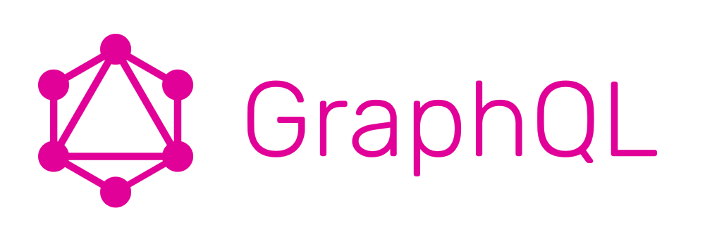

# GraphQL And Classic Web Services

 

Facebook produced the [GraphQL specification](http://graphql.org/) in order to be an alternative to Rest.

We already explained [what we thought of Rest services](about-rest.md).

GraphQL appears to us as a new way to do the same thing that what the industry is doing for decades.

This article is a first analysis of GraphQL and may be enriched or corrected with time with feedback on the industrial use of the standard.

## The Basics of Services

### Various Standards, Same Spirit

The underlying basis of services is RPC (Remote Procedure Call, [see the dedicated article on the subject](about-rest.md)). For decades, this concept is reinvented again and again with various flavors.

Apart from RPC protocols or proprietary protocols (like the [Tuxedo](https://en.wikipedia.org/wiki/Tuxedo_(software)) ones), [Edifact](https://en.wikipedia.org/wiki/EDIFACT) was for a long time an industry standard in some business domains like travel, banking, medical and logistics. Edifact was replaced by [XML](https://en.wikipedia.org/wiki/XML) then by [JSON](https://en.wikipedia.org/wiki/JSON).

Every of those standards aimed to provide the same functionality: exchanging structured data between two different systems, probably implemented with different programming languages and/or paradigms, and having a client system benefiting from a service provided by a server system.

### Basic Requirements For a Service Oriented Language

The first requirement is to have a "verb", meaning the name of the "transaction" we expect the remote system to process.

The second requirement is to have a type system to be able to send structured data under the form of a tree of objects. This is generally achieved by proposing basic types (like string, integer, float, etc.) and the capability of defining fields that have those properties and that can be grouped into classes. Classes will generally have to indicate what fields are required and what fields are optional. This is generally done within the context of one particular transaction.

Once classes are defined, they can be grouped in larger structures or other classes to define groups of object structures than define larger entities, most of the time, better suitable to express the business semantics.

Optionally, those definitions are expressed in "grammars" or "schemas". This is the case in RPC systems, in Edifact and in XML, and this is optional for JSON. Note that, even if there is no explicit schema mechanism, the fact of defining objects and structures leads to the use of implicit schemas. The difference is really what part of the code is "validating" that the messages are well formed:

 * With an explicit schema definition, we can generate the validation code and create a kind of serializer/unserializer layer (wrapper/unwrapper or proxy/stub layer);
 * Without an explicit schema definition, the validation code is generally hand written.

All those requirements are defined in the [OSI model](https://en.wikipedia.org/wiki/OSI_model) in the "presentation layer".

### Don't forget the protocol

The last requirement is to have some kind of underlying protocol to:

 * Send and receive messages between systems;
 * Create a naming convention that enables to use the name of the service (or name of the "verb");
 * Find the network configuration that enable to route the request message to the proper entry point;
 * Possibly associate the request and the response with identifiers;
 * Possibly include information about the sender and its security credentials.

Once again, the [OSI model](https://en.wikipedia.org/wiki/OSI_model) defines a certain split of responsibilities between all those requirements. Quickly explained:

 * The transport layer (layer 4) is defining the addressing scheme and primitives that enables several systems to communicate together;
 * The session layer (layer 5) enables to manage the sessions and conversations between the client and the server; this layer manages the succession of names messages that the two peers will exchange;
 * The presentation layer (layer 6) manages the content of data, their structure and their values.

## GraphQL Answers To Service Oriented Requirements

GraphQL seems to us as a new flavor of the same old story. It brings some interesting new stuff (and we will come back on that), but the important point is that we can implement traditional services with this language.

### The "verb"

Each GraphQL service is an named `http` entry point. The `get` method will be used to access the `query`part of the service and the `post` method will access the `mutation` part of it.

This looks like Rest but this is rather different, because the idea seems not to get some resources (even if it is possible), but to perform a service.

### The Type System

GraphQL proposes an extended type system that proposes:

 * Basic types,
 * Classes,
 * Groups of classes,
 * Fragments (kind of filters on classes),
 * Queries.

With all the available semantics, it is very easy to implement all the existing web services that are used currently in the business.

Moreover, it seems possible to have a richer interface on existing services and a more adaptative way of performing transactions.

This seems rather promising for mobile or chatbot accesses for instance. Those two UIs manipulate a small amount of data and may require some server services to adapt their reply to their particular use.

### And The Protocol?

In the Web, the protocol is `http` and the approach seems inspired by both Rest and Ajax kind of calls.

## A Promising Standard

### An Intermediate Between JSON-RPC and Rest?

GraphQL seems to target the intermediate path between JSON-RPC (which is a simplified SOAP) and Rest. The fact of publishing a schema enables both approaches:

 * Perform elaborated services (like before);
 * Access business objects (like the Rest or CRUD approach).

GraphQL seems to propose a way to benefit from both approaches.

The industrial use, I mean for large scale applications, has to be assessed and this article will probably be updated soon with real life feedback about the use of this protocol.

### Towards A New Kind Of Applications?

So it seems possible to build new kinds of business applications, let's say "graph-oriented applications".

This is a major change in the way the business applications are designed and we will come back on that point in other articles.

### The Smart Facebook Team

Well, despite the fact that I am not a Facebook user, I must recognize that the Facebook teams are smart. Each time they release a piece of software, the software is very often a bit smarter than what the other company are doing (except Amazon).

This is the case for the [React](https://reactjs.org/)/[Redux](https://redux.js.org/) stuff, for the [chatbot API for Facebook Messenger](https://developers.facebook.com/docs/messenger-platform).

This standard is smart because it surfs on the Rest wave (and Swagger.io stuff) while recognizing (implicitly) that it is not (always) possible for real business to implement Rest.

Look at this diagram:

Most enterprise systems are very familiar with those kinds of schema (generally a bit more complicated). GraphQL stands in between RPC and Rest! Very funny indeed.

## Conclusion

The GraphQL standard appears to be a very interesting and promising new way of doing the same old stuff plus probably more.

It opens also the road to other kind of business application design, more graph-oriented - which is really business oriented. Because the business semantic is fundamentally a graph, and said otherwise, the best way of representing the business knowledge is a semantic graph.

GraphQL also attracts progressively Rest adopters to a more RPC-like world, which is nice considering the extremist Rest approach that we can find on some companies. In those companies, many people struggle to implement Rest whereas their business just "doesn't fit" in it.

[Smart people make smart software](five-levels.md), I am convinced of that.

Waiting for more industrial feedback, I would say: "nice move, Facebook".

## See also

* [About Rest](about-rest.md)
