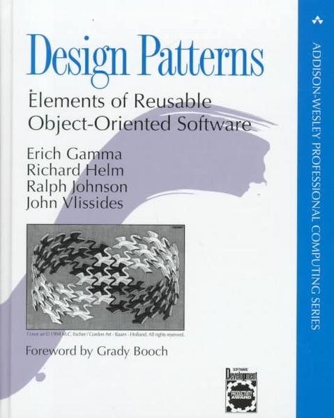

# Legends of IT

*(Image from* Les aventures de Tintin *by Hergé)*

Information technology (IT) is a very recent engineering discipline and no one implied in IT projects should never forget this fact. Like all recent technological discipline at the heart of all modern businesses, it is both a marvelous tool, because it is "soft"-ware, a formidable enabler for business, and as it is representing lots of money, it is also a great place for legends.

As IT is a very intellectual discipline, both an engineering discipline and a creative activity, as the entry ticket of making a program run is very low, it is very easy to believe things that are untrue and to loose the global perspective of what IT is for and what are the problems it should answer to.

## What criteria to judge legends?

The first problem we face in IT when trying to get some perspective is the problem of defining a criteria that will enable us to categorize the IT practices as "good" or "bad".

It is incredible that those criteria are not better known and shared, but after looking more carefully, it is easy to realize that there is no real consensus about those criteria.

So, we will define our own set of criteria as a kind of compass that will guide us through this journey of illusions.

## Criteria #1: Simplicity

Simplicity will be our first criteria. Software should be the simplest possible, software architecture also and so is IT architecture.

Where complexity is, failure will be and high maintenance costs.

## Criteria #2: As little dependencies as possible

Dependencies should be limited to their bare minimum because they will bring constraints on your application.

In particular, reusability of external components creates dependencies that jeopardize the value of the application and its capacity to evolve freely.

## Criteria #3: Adaptability

Adaptability must be understood in the sense of ease of change. Adaptability is the reverse of *technical debt*: when a technology aggravates technical debt, it should never be used.

Our notion of technical debt is defined very precisely in the article [The graph-oriented programming paradigm](../pdf/20161026-TheGraphOrientedProgrammingParadigm-ORey-PreliminaryVersion.pdf). Adaptability means as less couplings as possible.

That's why reusability of external components can be a bad idea on the long run.

## Criteria #4: Stick to standards, in particular in programming languages

At any cost, stick to the standard programming language and avoid, if you can proprietary languages. Standard languages you use should be supported by a stable community. This community does not have to be large, but you will be safer if the language specification is opened and/or massively supported and/or standardized by ANSI, ISO or any standardization office.

Avoid technologies owned by private companies or privately owned specific tools (like transpilers), those companies have the IP of the product and you will not be able to switch to another provider if they decide to make their language/tool paying, or if they decide to kill it.

## Criteria #5: Economics matter

The real cost of an adaptable application should be known, so is the cost of the maintenance phase and the constraints that will come attached to this maintenance (technology, skills).

The real cost of a software encompasses all the phases of the project, that's why business process analysis, functional specifications and functional testing are core skills to the success of a project and to the economical data attached to it, before go-live and afterwards.

## Representing a business domain

We'll not talk about games in this article but about professional applications and technology which aim is to automate some business domain.

Before automating a business domain, it is necessary to realize that IT primary movement is to "represent" it. We can qualify this representation:

* The representation of any business is partial,
* It is included in the semantic space of the particular business,
* This representation is relative (we'll come back on this one),
* It is composed by 2 parts: representing the data often with database tools and representing the business rules via programs.

## Legend #1: Data are absolute

For sure, this statement or belief is wrong, as we have shown in our article, [The real nature of data](./data-interop.md): data are the intersection of use cases and the semantic space. In the same semantic space, change the use cases and you will get different data models.

## Legend #2: For a certain problem, there is only one code design

This legend is, first of all, correlated to the last point. Depending on the various use cases you will implement, you will have an application design that will change.

Second of all, depending on the evolutions of your application, evolutions that will be very complicated to anticipate, you will realize that a design was adapted or not to the direction the application goes to, during its lifetime.

Most of the time, experience shows that software engineers are very bad at predicting in what direction the application will grow. This is quite normal because to be able to forecast correctly in what direction a software will develop during years, you have to know very well the business and the trends of this particular business.

The Gamma et al. *Design Patterns* book aggravated this feeling that there is only one code design to every problem. Despite the fact that the patterns are presented like theorems, with applicability conditions that must absolutely be respected, their industrial use results most of time in aggravating the software technical debt. Why?

Our explanation is quite simple: because software engineers are bad at anticipating the future of their software, because they are no business experts. So, when they choose a pattern, even if this pattern seems relevant at the moment of choice, it is a bet on the future. And this bet is often wrong.

A wrong design pattern brings complexity (inverse of simplicity) and increased technical debt, sometimes huge increase (and this is the reverse of adaptability).

So be very careful about design patterns, because they may damage a lot your code.

## Legend #3: Reusability is good

Reusability is a double-edged sword and not at all a sign of good software.

First of all, because software are made by creative humans, software generates attachment in the heart of the software engineers. When you worked several hours on a large program and realize that it is useless, you should be able to delete it without feelings. But the fact is, people get attached to the programs they did, because they did suffer doing them, and making them work.

There comes reusability as a way to save bad code. If the bad code is saved, you will generate more technical debt reusing it and it will generate useless complexity.

For sure, very often, when a feature seems generic, software engineers tend to make reusable code. At micro level, this is quite often necessary (see the bottom-up programming notion of Paul Graham in his [ANSI Common Lisp](https://paulgraham.com/acl.html) book, or even the [C++ Standard libray](https://en.wikipedia.org/wiki/C%2B%2B_Standard_Library)).

But, when it goes to higher level of code, the danger is everywhere. Should we reuse? Should we create some reusable code?

I remind a principle from an ancient VP Software Engineering at Amadeus, François Weissert, saying: "Reusability starts at 3". When you have twice the same code, you should be very careful about the code to be really reusable. When you have the same code 3 times, you can consider reusability.

We have to remember that the semantic of the business itself is not "reusable" and so reusability should be dealt with with a great deal of caution.

For some companies, reusability has become a way to make you a prisoner of their "framework", and especially of the mandatory updates that you must do if you want to keep been supported. Consider the giant Javascript frameworks such as Angular or React. Being forced to reuse their framework will change drastically your design because you will need to adapt to their.

Are there ways to do better? What are those frameworks provide that you really need? What is the real code you need to reuse? In some technical areas, that is obvious. As application developers, we don't want to recode the TLS protocol, so we reuse.

But in order to call an API in Javascript, do I need a big framework? No. Do I need some fancy components? Maybe yes, but what are the strings attached to this reusability? Will this corrupt my programming model? Do we really know what contract we are signing when we reuse a big framework?

Reusability is a powerful tool but also a very dangerous team. It also brings a dependency on your knowledge. By reusing, you make the choice of never knowing what really occurs but to stay on the surface of what the reusable component will show you.

## Legend #4: You should use this framework because everyone uses it

Who says you should? Your IT service provider because they have trained people and they want to amortize the trainings of their employees? The framework provider to lock you up?

What are the consequences of such a choice?

* How often the framework provider delivers big updates?
* How often are you bound to migrate?
* If you do not migrate to the last framework versions, what are the risks you take?
* Did you consider securing the code of the framework, if you have access to it?
* Did you consider securing the documentation?
* If you have skilled software engineers in the technology, can they adapt easily to the framework? Now? In 5 years?
* Is it easy to get rid of the framework or are you bound to change everything?

We won't cite too many samples but we have, in the recent history of IT, so many examples of bad technology that "you should use because everyone uses it".

GWT is the perfect example of Google marketing non-industrial project, so are the first versions of Angular. I wish the software companies use their own crappy software before providing them to the community. Look at Angular: it is not used by Google on Google Workspace. Ask them why? Maybe because Angular is a marketing project that does not respect backward compatibility and is not reliable enough to be in production at Google's?

Be reassured, Google is not the only one to propose marvelous magic tools which happen to be very bad choices on the long run, React from Facebook is the same kind of software components.

Front-end development is the place of all "innovations", so also the place where the "economics matter" principle is the most at stake. If your team code in HTML, Javascript and CSS, your code may still run and be maintainable in 10 years, whereas in 3 years, no one will still use the framework that you choose now.

We can wonder who really needs those very big frameworks, maybe some marketing companies for which rewriting the full front every 2 years is OK. If you are an institution, you can do a lot in plain JS with a few simple components (easily replaceable). If you are developing an application for your company, you mainly need forms and tables (some companies may need more).

For backend developments, choose a standard programming language. This choice is complicated nowadays, because Java is not free anymore (as it was feared), and C# is Microsoft IP (even if it runs under Linux). That makes server side Python or JS more appealing, even if the programming model is not the same.

Let's say, your choice should never be driven by your supplier or by the IT marketing messages. You will have sufficient problems to maintain your own code, don't reuse components and frameworks when you can avoid it. It violates the 4 criteria.

## Legend #5: We are in a digital world with reliable data

Depending on the business domains, the data are more or less reliable.

When they are, we can build interfaces between systems that will exchange structured data, each of them sharing the same view of the grammar of the data (see case #1 in Figure 1 below). When the traffic is slow or when systems may have trouble interoperating or when the traffic is asynchronous, files containing structured data can be exchanged (see case #2 in Figure 1 below).

Take the referential data, for instance the list of customers of a retail company, the list of enterprises upon which collect social taxes, the list of parts mounted on an aircraft, all that data should be reliable but, quite often, they are not.

There are many reasons for that:

* The data life cycle is short and things change quickly,
* The number of data in the referential is very big so, even a small percentage of errors, represents a potential large problem,
* The global process of management of those data is based partially under spreadsheets,
* Several actors share responsibilities in a global inconsistent process with no reliable interfaces between systems (or between spreadsheets),
* Where there should exist only one referential, there are multiple inconsistent referential with a difficulty of knowing what is the correct data,
* Etc.

We have to face it: the world is not perfect, and so are the data.

### Denial or acceptation

To face such a reality, two strategies can be chosen:

* Denial, which leads to build software that expect data to be complete, consistent and perfect;
* Acceptation, which leads to more of less complex ways to protect the application.

Denial leads to applications that are never working properly because they expect correct data.

That can be solved by people correcting the data on the long run, or by opening special rights inside the application, which can put at stake its security and integrity.

Quite often, the application is realized to be consistent, but, facing the reality of impossibility of use because of rotten data, the application controls are released to make it usable which creates an explosion of maintenance costs and does not solve really the data quality problems.

Acceptation has a cost that must be integrated into the cost of the application, both at build time and at maintenance time.

### The "façade" pattern

One common solution is consisting in using the façade pattern: Instead of loading data inside your application, you are loading data into a façade that will be in charge of cleaning/disambiguating/complementing the data before the output is loaded  into the application.

*Figure 1: Various kinds of façades*

The simplest case of façade is the case #3: the façade is a set of programs that which transforms `data1` and `data2` into `data` that can be loaded safely insde the target application.

Depending on the gravity of data inconsistency, the façade could be a small application with its own database, its own data processing chain, able potentially to calculate and store data versions and deltas between versions and to apply complex business rules to chose the right data to be imported inside the application (case #4).

For sure, if the flow of data is continuous, the façade must be monitored and tuned with the right rules, in order to sustain the flow and be able to feed the application with correct and reliable data.

### Never mix concerns

In all cases, the data cleanup should never pollute the application itself and so, be segregated. The façade must be a separate component, separate database if needed, and separate software. Because the application has a job to do, the data cleanup must be done up-front.

The consequence of denial is to mix the 2 kinds of feature inside the same application, and that's why this solution ends up inevitably in bad software and bad data.

## Legend #6: We can replace interfaces by sharing tables in the database

Each application is answering to a set of use cases, and the application data are the result of the intersection between the list of use cases with the business semantic space (see [The real nature of data](./data-interop.md)).

That means that each application deserves a data model fit to its needs so different the one from the other. For sure, applications may share data, but their sharing must remains as minimal as possible and bear the less structure as possible.

*Figure 2: Data models are adapted to each application*

In Figure2, we can see how 3 different data representations are semantically equivalent but absolutely not technically equivalent. We'll note that the exchange format is the most loose format. That enables each stakeholder in the exchange to rebuild data structures conforming to its use cases.

Figure 2 is showing an interface between systems. If we were to project the `viewpoint1` directly in Application 2, we would distort the data model of Application 2 imposing, as a constraint, a part of the datamodel of Application 1. Let's suppose we do that with database materialized views, we will distort and create code of Application 2 based on data structures (that can change) of Application 1.

This practice is very dirty and very risky because:

* It creates an operational complexity, Application 2 not being autonomous anymore,
* It creates a dependency that is useless, because an interface would have transform this hard dependency into a loose dependency (at the exchange format level and not at the database level),
* It creates a design and code distortion in the Application 2, because the `viewpoint1` is not what was imagined as a design for Application 2.

The last point is quite interesting: by transforming the `viewpoint1` into `viewpoint2`, the Application 2 can do some modifications on the objects transported by the exchange format to make them its own. In other terms, the transformation can include business rules and never store A or C but A union C. This code would have to be moved into the database requests in case the data model of Application is partially imposed to Application 2.

The conclusion is, for sure, we can't replace interfaces by sharing of data structures.

The second conclusion is: we can't have a single database with all data in it, that's stupid, because data are structured and live at the rhythm of their use cases and semantic business domain.

The third conclusion is: we can't group several business domains inside the same database, because one of them will drive and the others will live at the rhythm of the dominant.

