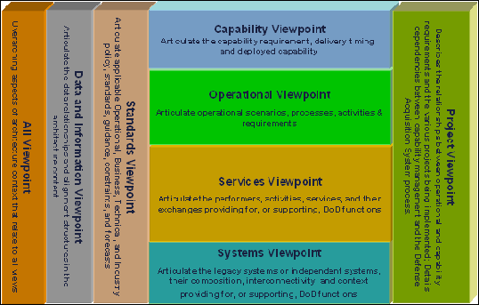

# Military frameworks, systems engineering and enterprise architecture

*(Courtesy of Pixaby on https://www.pexels.com)*

In the world of architecture modeling, the military organizations like the US Department of Defense (DoD), the UK Ministry of Defence (MoD) or the NATO organization created enterprise architecture frameworks adapted to their needs.

On the market today, 3 main frameworks are existing and used in military projects:

  * [DoDAF](https://dodcio.defense.gov/Library/DoD-Architecture-Framework/), the US MoD Architecture Framework, that was historically the first military architecture framework ever (it is originated in the 90s);
  * [MoDAF](https://www.gov.uk/guidance/mod-architecture-framework), the UK MoD architecture framework, which is both an adaptation and an abstraction of DoDAF;
  * [NAF](https://www.nato.int/cps/en/natohq/topics_157575.htm), the NATO Architecture Framework that is also an adaptation and an abstraction of DoDAF and MoDAF.

## Objectives and dimensions of the military frameworks

The main objective searched by military organization is to be able to master a global project of several billions of dollars/euros from the design phase to the support and operational phase. Because those projects/programs can be very large and very complex, the idea was that everyone (military organization and supplier organizations) share the same set of "views" on the program in order to share understanding of what was to be done, how requirements were taken into account, the full lifecycle of the project and the product.

| # | Dimension | Details |
| --- | --- | --- |
| 1 | Product definition | Can be an aircraft, weapon, complex system, etc. and all the related IT systems to manage them. The objective is to use a systems engineering approach (model-based in that case), based on requirements. |
| 2 | Product support and operations | The objective of this phase is to detail all the systems that will permit the support of the product. This is generally a wide topic including maintenance, parts procurement, etc. Moreover, the product use must be envisaged in operations preparation and in battle field in coordination with other systems and organizations. |
| 3 | Digital transformation | The objective of this phase is to evaluate and deal with the impacts of the product and product support in the operational organization, processes and IT of the army. |
| 4 | Project plan | The objective is to be able to describe the the plan to deliver the product conforming to the requirements (phases, milestones and so on), to permit project steering, and product support procurement. |

*Table 1: Structure of military requirements*

We can classify the military enterprise architecture frameworks as pursuing 4 objectives, as shown in table 1.

## Modeling domains

Those 4 objectives are traditionally modeled with 3 different modeling techniques:

  * Systems engineering for the product definition,
  * Enterprise architecture for:
    * Product support,
    * Digital transformation,
  * Project modeling tools for project management.

*Figure 1: The 3 domains Military framework concerns in the industrial V-model*

The figure 1 shows the 3 modeling modeling domains and the 4 areas of concerns that they are traditionally covering.

In terms of modeling, we could say that the core objective of the military frameworks is to have, in a single repository, the [systems engineering](https://sebokwiki.org) (MBE/MBSE, the [enterprise architecture](https://en.wikipedia.org/wiki/Enterprise_architecture) and the project management *gathered together*.

## Positioning in the V-model

Those 4 areas of concern can be mapped on an industrial [V-model](https://en.wikipedia.org/wiki/V-Model) as shown in Figure 2.

*Figure 2: Military framework concerns in the industrial V-model*

The first dimension, product definition, is in the left part of the V and corresponds to the product architecture, from its operational conditions, requirements to its system design. The second dimension is corresponding to product support (we often speak about "support concept"). The two last dimensions are running all along the project, being at the project/program level or at the digital transformation level (integrate the new product into the current organizations).

We can see in Figure 2 how an integrated modeling of those two highest branches of the V-model can be important for the military customer:

  * It ensures a full lifecycle modeling of the product,
  * It enables simulation scenarios linked to the requirement phase,
  * It enables to anticipate the impact of the new project on army's existing organizations,
  * It enables to manage the project/program.

Most of all, on top of being a common modeling language, it enables complex tradeoffs, including performance, finance, supportability, etc.

## MBSE/MBE

### The RFLP process

In manufacturing, the objective is to create products. The starting point of a product manufacturing is generally a set of requirements. To go from the requirements to the product is generally a long process involving the following phases:

  * <u>Requirements engineering</u>: The objective of this phase is to work on requirements in order to make them non ambiguous, to sort them by importance and to remove inconsistency between them; In this phase, all the operational conditions of the product are described, which is a crucial phase of the process;
  * <u>Functional analysis</u>: This phase objective is to determine the functions of the product, the information flows and dependencies between functions; Generally, the functions are worked at different levels of granularity (functions, sub-functions, sub-sub-functions and so on);
  * <u>Logical system analysis</u>: Once the various functions at various levels are known, the assignment of functions to logical elements can be done; The objective of this phase is to create the appropriate logical systems to get the nearest possible from a possible industrial split of the realization of the product; When the logical analysis is finished, we have the detailed specification of each system ;
  * <u>Physical design</u>: Once the product has been split on several components, several teams can work in parallel on component design (at the level of granularity of the component); The product architecture will ensure that all detailed components fit together conforming to the specifications.

This view is, for sure, simplified and some industries (or specific businesses inside the industries like embedded software, electronics, or mechatronics) are often using more complex processes, with dedicated sub-processes for every discipline.

However, seen from a high level standpoint, the various phases of the MBSE are the 4 we mentioned, leading some people to call the MBSE process a "RFLP" process (RFLP standing for Requirements, Functional, Logical, Physical).

Currently, we find more and more people skipping the "S" of MBSE to talk about MBE, for model-based engineering. The term becomes larger because it does not have this embedded system connotation anymore.

### Maintaining the digital thread

For sure, a RFLP process aims to create a digital "thread" or "link" between the various entities, at least between the requirements, the functions and the systems (plus all the connectivity semantics). The system entities are a solution matching the requirements, and so is their "physical" description; but this solution is the result of various levels of trade-off analysis. In other terms, solutions can (and will) evolve with time.

The full digital thread of information will have to be maintained through changes. Changes in requirements (or operational conditions) will lead to changes in systems and changes in systems (like obsolescence) must be compliant with requirements.

### RFLP processes with many variable dimensions

The RFLP processes that we can find in the industry are generally describing many parameters attached to the various elements (requirements, functions, systems, etc.): the performance, the price, the various criteria of manufacturability, the respect of regulation and standards are among the most important of parameters (the weight also in aerospace).

Those parameters are crucial because, during the various design phases:

  * They permit to use requirement quantification (with values and ranges) and not only requirement qualification;
  * They enable to simulate the various elements working together (functional simulation, system simulation, or full product simulation in some known conditions);
  * They enable complex trade-offs that lead to design the best product "under a certain set of constraints".

### Modeling in MBSE

The topic is quite vast but we will, once again, try a simplification. Modeling can be done mainly with 3 different approaches:

  * The first one is to do "manual" systems engineering with Office documents (Word and Excel mainly); This way of doing things is still very present in the industry; It is error prone, and very painful for the engineering teams;
  * The second one is to use "standard MBSE modeling language" like [SysML](http://www.omgsysml.org/) or [Capella](https://www.polarsys.org/capella/) to run the "RFL" part of the MBSE process (the "P" part will be done with specific tools like 3D design tools or electricity engineering tools); The objective is to model graphically the "RFL" part of the process and to keep links with the "P" parts;
  * The third one is to use a simulation/optimization-oriented domain-specific language (DSL, the domain being systems engineering) for requirements and systems like [PMM](https://hal.archives-ouvertes.fr/hal-01273973/document) or [Form-L](http://www.ep.liu.se/ecp/096/130/ecp14096130.pdf).

In the first style of systems engineering, the digital thread is extremely difficult to maintain or trace, and generally, to be able to do it, a lot of manual and painful efforts are required. Most of the time, the requirements are vague, not measurable, and the trade-offs analysis are not recorded.

With time, we see a growing consciousness of the advantages of the third solution to be able to do complex trade-offs very early in the product design phase (see the system engineering book of knowledge [here](https://sebokwiki.org)).

### MBE/MBSE seen from the military

The MBE/MBSE modeling techniques are a way for military organizations to ensure that their requirements are correctly understood and are refined the right way. Especially, the requirements being tightly coupled with operational conditions (often called CONOPS for CONcept of OPerationS), the graphical modeling in a unified language is an enabler for common understanding, sharing of decisions in complex trade-offs and sharing of information.

For sure, this is being true for the design phase of the system.

## About the complexity of modeling hybrid systems

The fact is systems engineering is very adapted to design the early phases of a product and do the right structuring trade-offs.

But the "products" of today are much more complex than the products of yesterday. If we take the sample of aerospace, the "ground segment", or the set of software that enable to manage the machines from the ground is much bigger and much more complex than before.

Let us take a sample in a non military domain: the constellations of satellites. To be able to operate a constellation of more than 100 satellites in a crowded space, the ground segment complexity is very high.

The thing is it is not easy to design the product (the satellite) as the set of software required to operate many instances of this very satellite. More and more military systems are facing the same kind of problems: they must be tightly coupled together.

How to ensure that all the requirements are taken in charge by all sub-systems in the global system, above all when the way of model management software systems is more related to IT techniques such as enterprise architecture, IT architecture or software architecture?

## Modeling enterprise architecture

The enterprise architecture domain is very wide and our objective is not here to describe it extensively. We will just mention that this domain is mainly split in 2 concerns:

  * What *methodology* should be used to create a good IT architecture serving the business process transformation according to the strategic intentions?
  * What are the relevant views and artifacts to use to *model* the digital transformation, starting with the strategy, going through the business layer, the application layer and the infrastructure layer?

There are many enterprise architecture methodology frameworks, but the most used nowadays is [TOGAF](https://www.opengroup.org/togaf).

The most used enterprise architecture modeling language is Archimate (see our [introductory article](archimate-intro.md) and our recommended [recipes](archimate-recipes.md)). This language is particularly adapted to model most of the other dimensions of interest of the military project, especially the organizations, strategy, processes and IT systems, whatever the complexity.

It proposes 13 basic viewpoints (see [here](https://pubs.opengroup.org/architecture/archimate3-doc/apdxc.html)) but its global metamodel makes it adapted for many complex representations.

Traditionally enterprise architecture is information systems oriented and aims at reintroducing the business common sense in IT. In order to tackle the strategic intentions of a company that wants to transform, process and IT transformation must be considered *together as a system* in order to avoid the 2 common traps:

  * The biased process-driven project able to change the company processes but without any efficiency for the company (for instance by bringing more Excel spreadsheets, more blocking steps, multiple keying and bureaucracy than the company already has);
  * The biased IT-driven project able to change the IT systems without being synchronized with new processes (and generating more troubles, data inconsistencies, process problems, double keying, etc.).

Samples of those traps are numerous. For the first case, transformation projects led by process experts often lead to a huge loss of money because they create more Excel tools and often add layers of procedures to already overly complex environments. For the second case, a typical example is the "tool project approach": when users have a need, let's by a tool and deploy it. Those two sample lead to the same result: inefficient, error prone and expensive processes, and inefficient, error prone and expensive IT systems.

Enterprise architecture, by its way of considering the processes and IT systems together enables to perform the proper tradeoffs in projects and to plan a real digital transformation, meaning a process and IT systems joint transformation targeting a better efficiency (cost reduction or productivity enhancement).

## Various solutions for military projects

Considering the military requirements of table 1, the various frameworks we mentioned propose several methodological and modeling solutions.

### The best of breed solutions

If we look at the market and take the best of breed modeling solutions adapted to the requirements of table 1, we could propose the solutions presented in Table 2.

| # | Dimension | Solution |
| --- | --- | --- |
| 1 | Product definition | [SysML](http://www.omgsysml.org/) systems engineering modeling language |
| 2 | Product support and operations | [Archimate](archimate-intro.md) enterprise architecture modeling language |
| 3 | Digital transformation | Archimate enterprise architecture modeling language |
| 4 | Project plan | Complex planning tools for programs (set of projects with dependencies) + Archimate with the implementation and migration package |

*Table 2: Best of breed solutions for military programs*

As we can see in the table 2, we have 3 ways of modeling the full program: SysML, Archimate and a planning tool.

The 3 metamodels not being integrated together, we may have problems at the "interfaces" of each domain.

SysML proposes 9 kinds of diagrams and Archimate 13 basic viewpoints, what corresponds to approximately 22 types of diagrams. If we had 2 or 3 viewpoints for planning, we would end up with a solution presenting around 25 viewpoints.

### The military frameworks

#### DoDAF

The military frameworks, for decades, defined a set of artifacts and views to have it all covered.

The Figure 3 shows the structure of views of DoDAF version 2.

 

Figure 3: [DoDAF viewpoint structure](https://dodcio.defense.gov/Library/DoD-Architecture-Framework/dodaf20_viewpoints/dodaf20_services.aspx) (52 viewpoints)

#### MoDAF

The Figure 4 shows the structure of views of MoDAF.

Figure 4: [MoDAF viewpoint structure](https://www.gov.uk/guidance/mod-architecture-framework#viewpoints-and-views) (46 viewpoints)

#### NAF

The Figure 5 shows the structure of views in NAF v4.

 

Figure 5: [NAF viewpoint structure](https://www.nato.int/cps/en/natohq/topics_157575.htm) (46 viewpoints)

#### UAF

An attempt of "unification" of those three frameworks was done by the [OMG](https://www.omg.org) with the so-called Unified Architecture Framework ([UAF](https://www.omg.org/spec/UAF/1.0)).

The Figure 6 shows the structure of views in UAF v1.

 

Figure 6: [UAF viewpoint structure](https://www.omg.org/spec/UAF/1.0) (+70 viewpoints)

#### Views and metamodel

All frameworks propose a metamodel that is often very rich, and also very complex. With time, the metamodels got more abstract which makes their use quite difficult.

### Genericity, specialization and taxonomy

The core advantage - and the core problem - of those frameworks is that they are *generic*. With the same semantics (or almost), it is possible to describe a project for a new military aircraft, or a project for a new military device or a project for a new IT application.

The fact is that, in every of those projects, some notions can be called the same even if they don't cover the same reality.

Let us take the sample of "service" (which is very emblematic of those frameworks). Some of those framework describe it as being a "service in the broadest sense of the term".

An aircraft can provide a service, so is a military device, so is an application. For each of those "products", the notion of service will represent a different reality: the aircraft can provide a high level service to the army, the device a service to other devices and the IT application a service to a set of users. The connectivity between those services will depend on the context and on what we are talking about.

If we imagine a more complex project such as an aircraft, its ground segment and all support processes, it will be very complex to represent all those various objects and their interconnectivity with generic concepts.

To address this problem of "specialization" of very general concepts (or meta-concepts), the military frameworks propose the "taxonomy" approach. By defining for the various kind of views the appropriate taxonomy, the architects define the content of the views which removes the ambiguity.

In this spirit, each project will "instantiate" the military architecture framework according to its needs: the taxonomy of artifacts will clarify the meaning of abstract artifacts in the context of the project.

This way of working can be quite easy in a simple project but can quickly become very complicated when the project is suppose to build several "products" of several kinds (which is the case in big military programs).

For instance, to be able to create meaningful and useful views in a new aircraft project containing the aircraft, the ground segment and the support system, complex and *different* conventions will have to be taken for each big "chunk" of the program. But, if we specialize each part of the program with a specific *meaning* of artifacts per program part, what not using domain-specific modeling languages such as presented in the "best of breed" part above?

### Bridging several semantic domains together

The advantage of having an integrated framework is the bridges between various domains. In a best of breed solution, the bridging are almost impossible unless the modeling tool is unifying several modeling languages.

Bridges can be very important in the lifecycle of a program, because they can link the two parts of the V-model (as shown in figure 2). Samples are numerous and at the heart of many industrial projects:

  * Interlinking product support to product definition enables a better product maturity;
  * Interlinking all phases with an integrated planning is very interesting (product-based planning) especially if the product is an assembly of other subproducts;
  * Interlinking digital transformation to the two branches of the V-model enables to prepare the efficient changes required in the organizations, their processes and their IT systems;
  * Etc.

When the modeling language and its metamodel enables to create those connections, the complexity of big programs can be described with many details [1].

### A problem of semantics

The problem, as we saw it in figure 2, is that, under the military frameworks are "concrete" semantic domains underlying. We identified 4 semantic areas in table 1 and figure 1 and 2:

  * Product definition,
  * Product support and operations,
  * Digital transformation,
  * Project management.

We can add that the target of military frameworks is to support a certain kind of projects that are belonging to a limited number of categories: full device, partial device and IT systems, more or less.

In those conditions, the advantages brought by the chosen framework must be balanced with its drawbacks. Among them we can name:

  * A non natural way of modeling of already standardized semantic domains, which will make the information understanding and sharing quite difficult, even for experienced professionals;
  * A complexity in the use of taxonomies and a risk of heterogeneity of framework interpretation, between various projects but also *within* the same project;
  * The risk of introducing ambiguities that will have a negative impact on the project;
  * The problem of finding appropriate skills to manipulate the complexity of the framework and its various interpretations;
  * The cost of training people outside the domain-specific standards;
  * The requirement of creating a tool implementing the metamodel of the framework (and maintaining it over time).

### Evolutions and work-arounds

It is important to note that, with time, the military frameworks opened to some modeling standards, while keeping their own core metamodel, which is not totally consistent.

For instance, NAF v4 indicates that Archimate and UAF can be used for modeling. Clearly, Archimate can be used only for product support and digital transformation (lines 2 and 3 of table1) but clearly, it is not adapted to model product definition. Concerning the project management Archimate has basic artifacts but that cannot enable the management of a complex program. That means that Archimate can be used in NAF, but *cannot cover all* that NAF intends to cover [2].

UAF on the other hand can cover it all, because its metamodel is an extension of SySML to integrate an abstract model looking like other military system.

## The temptation of a "one size fits all" framework

If we have a detailed look at UAF, the most complex and abstract of the 4 frameworks, we could have the impression that this framework fulfills all requirements for all kinds of military projects. For some architects, having a universal framework would be a kind of Graal.

The problem is that 

## Notes

  * [1] On the other hand, concerning the product lifecycle and specifically the links between engineering and support, some other industry-specific standards are covering the process aspect of such a challenge: the [ASD standards](http://www.sx000i.org/).
  * [2] See the first NAF to Archimate mapping in the [online article](https://bizzdesign.com/blog/nato-architecture-framework-archimate/) of Mark Lankhorst.

(*November 2019*)
