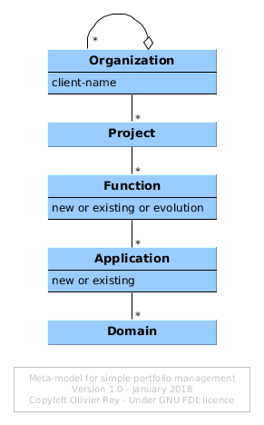

# A Simple Meta-Model for Better Portfolio Management

*Image courtesy of freedigitalphotos.net*.

One of the main problems of companies is to manage many IT projects at the same time. Most often, the companies facing this problem are managing project portfolios.

The main drawback of managing several projects in parallel is that is is not easy to:

  * Understand the dependences of the various projects together,
  * Identify and deal with the various scope overlaps between the various projects,
  * Manage the relationship with the business people that want the project to happen.

This article presents a very simple method to use to address all those points. We will present the original version of the meta-model, then the [Archimate](archimate-intro.md) version.

## Meta-Model Presentation

The first objective is to formalize the client of the IT project. Each organization has several departments in which several persons are taking the role of the client.

Our first artifact will be an "Organization" type. We will assume that every organization can include several other organizations. Each organization will also have a client name as an attribute.

When the projects intentions are declared, the materials that are produced by the various clients inside the same organization can be a list of many project names and a more or less developed functional description.

We will define two artifacts to model that:

  * A "Project" type to model the project,
  * A "Function" type to model the functionality.

In the existing IT systems, we have applications. With the projects to come, some of the current application will get new functions, some applications will be created and some other will be decommissioned.

We need one more artifact:

  * An "Application" type that models the application; if the application is new, we need a way to tag it as "new" or "existing";
  * The function artifact will be reused but we will define an attribute that indicates if the function is existing, if it is new or if it must evolve;
  * As applications are part of a big part of the IT systems (for instance the financial systems), we will attach the application to an application domain; we will use the "Domain" artifact.

In terms of relationships, we have the following semantics:

  * An organization can contain other organizations;
  * An organization will the client of several projects;
  * Projects are aggregating functions;
  * Applications are attached to domains.

The resulting meta-model is presented on the following figure.

## Methodology

Let's suppose we use this model during the budgeting process. This process is the moment where companies must budget what they want to do next year. This budget time is also often the time of hard choices.

### Step 1: Accept All Project Requests and Identify Functions

The first step is consisting in gathering all projects intentions from all organizations. For each person, the list of intentions is taken as described by the client.

The objective is to get the better functional description of the requirements, to identify the required functions. Very often, the requirements are mixing future and existing features (because the client is often not fully up-to-date concerning the implemented functions.

This phase is not meant to enter into a debate with the customer but to try to understand the requirements. To do that, it can be necessary to get out of the solution imagined by the customer to get to the original requirement.

As the model is simple, the requirement artifact does not exist and so the identification of the required functions will conclude this phase.

Once this phase is complete, we can promise the client to make a feedback on the demands relatively to all others.

### Step 2: Identify Common Functions to Highlight Dependencies

Many clients may express different projects that are using the same subset of functions. Identifying those functions is very important, this for several reasons:

  * To avoid several projects to develop several times the same function, or worse, variations of the same function.
  * To identify in what projects this function can be required. Developing this function can enable many projects whereas not developing this function may cause many projects to fail.
  * To add this function early in the roadmap.
  * To take a special care to place carefully this function  in the rest of the IT systems (step 3).

### Step 3: Associate Functions to Applications

This is a back office step that will be done between IT people, most of the time by architects. It is time to review the main functions of the existing applications to be accurate in the exercise.

Functions expressed as requirements can be classified into 3 categories:

  1. Existing functions: the function already exist. We can plan to go back to the client to assess if we missed something in the original requirement.
  1. New functions that can be naturally attached to an existing application.
  1. New functions that don't seem to be a natural evolution of the existing applications.

The two last steps can give birth to more advanced architecture studies. Covering this topic is not in the scope of this article.

All the functions that are not in existing applications should be gathered and analyzed as a whole to determine the opportunity of developing new applications.

### Step 4: Analyze the Roadmap of Each Application, Size it Roughly and Compare With The Skills Available

Once all functions were assigned to applications, we can size them roughly and have a view of the roadmap of each application.

#### The Case of Application Maintenance and Evolution

All functions of an existing application can be then prioritized in the best order of feasibility to create a first credible roadmap, that is compliant with technical constraints. At this stage, we can also identify the functions that are nice to have compared to the ones that are must haves.

The skills available for each application is important because it will determine the real feasibility of the roadmap per application.

Indeed, in that phase, we can see the bottlenecks in terms of IT people, when not enough people are skilled to develop the expected roadmap. Depending on the global priorities of the company, it is possible in that phase to plan people transfer, trainings or recruitments.

#### The Case of New Applications

Those projects are always more risky than the previous ones. In a strange way, the result of previous phases is that strictly speaking, the clients did not ask for a new application; but the union of their requirements and the status of the current IT systems lead to this solution.

The functions being sized, we can have an idea of the staff required to build the new application. We can also think about the HR options: move people from elsewhere and assign them to the new application, hire or take external consultants.

