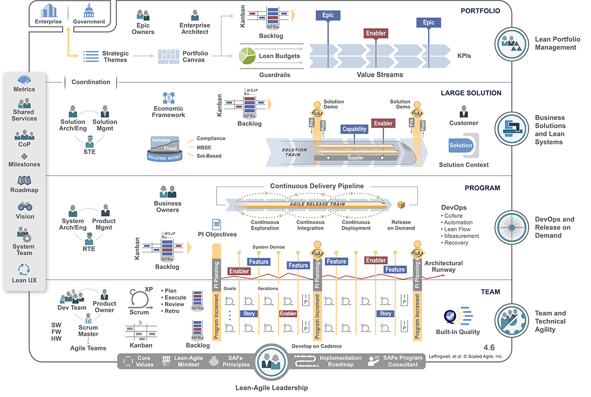

# What you should know about SAFe

We need methods in IT like in any other engineering disciplines. But there are good and bad methods.

I would like, in this article, to show how the SAFe methodology is damaging the IT systems and limiting the productivity and innovation of many companies. To be able to show it, I will come back to the advantages and drawbacks of the Agile methodology and show how SAFe does not leverage Agile at all but, on the contrary, remove its advantages.

This may be seen as attacking the *SAFe idol*, but people have to realize there are better ways.

## The origins

### Rational Unified Process (RUP), the roots of SAFe

SAFe has its origin in RUP, another enormous useless methodology. The roots of RUP trace back to the merger of the Objectory AB (founded by Ivar Jacobson) and Rational Software Corporation in the mid-1990s. In June 1998, Rational publishes the Rational Unified Process (RUP) version 5.0.

RUP was developed by a team at Rational (including Philippe Kruchten) and incorporated use-cases, UML, and iterative development practices. It was a very heavyweight process framework (nine disciplines, roles, artifacts, workflows) tailored theoretically for large systems. It aimed to address projects requiring heavy modeling.

Quickly, the software ecosystem observed that RUP was overly complex, documentation heavy and not efficient. In other terms, the market did not adopt it. In a certain way, RUP became iconic of *the methodology that should never be put in place if you wqant to realize a large software*.

### The origin of SAFe

SAFe was developed by Dean Leffingwell (and collaborators) and first publicly described around 2011. The framework draws on lean-agile, systems thinking, and agile development practices.

It was positioned as a solution to "scaling agile" practices across the enterprise (many teams, large programs) rather than single-team agile.

### Linkage between RUP and SAFe

Leffingwell’s earlier works include large-scale systems engineering and process frameworks, including RUP. Indeed, similar defaults that were rejected by the whole IT community in RUP can be found in SAFe.

We are now detailing the points that seem to us the most problematic.

## A word about IT project management

### Reminder: The core dimensions of IT project management

In order to be able to discuss about the problems caused by SAFe, we need to make a little background on the basics of IT project management. Note that we are talking about project management, and not software maintenance.

An IT project has 3 main characteristics:

* A *scope*,
* A workload in men-days, which is equivalent to a *budget* necessary to realize it,
* A timing of realization, also called a *plan*.

The *quality* of the delivery can also be taken into account even if few projects choose to lower the quality as a project hypothesis. However, the result of bad project management is often bad software quality.

Project management frameworks such as [PMP](https://en.wikipedia.org/wiki/Project_Management_Professional) add several other dimensions to a project, but we will primarily focus on the 3 core characteristics.

We'll see later in this article that SAFe, taking the pretext to *scale* the Agile methodology, introduces confusion and inefficiency in all dimensions of the project management.

Note that a project plan has:

* A start,
* An end, which correspond to go-live of the project.

In other terms, when a project is finished, we are entering in a *maintenance and evolutions phase*, which process is different from the project's.

### About the Agile methodology

The [Agile methodology](https://en.wikipedia.org/wiki/Agile_software_development), in a certain way, has few adherence with the project management methodology. In order to avoid the tunnel effect, the development teams develop in sprints of several weeks (generally between 2 and 4) and are capable, at the end of each sprint, to show something to the client of the software. This ensures that the software follows the client's requirements.

During each sprint, the client can prioritize their demands and adjust the scope of the next sprint to better match their needs.

In a way, seen from a project management standpoint, Agile is a way to organize the specification and development phases. But all the dimensions of project management, scope, costs, duration, obey to the same project laws. Needless to say that the Agile methodology is a *software development methodology* having impacts on the *requirements and specification management* process. Thus, it is not straight forward to apply Agile in other contexts, contrary to what can be thought.

For the testing phase, it is a project decision that is unrelated to Agile. The go-live can be done after all project sprints have been developed, or the project can decide to make multiple go-live. For sure, before each go-live, the testing phase will include a user acceptance phase, made of new features testing and non regression testing (if applicable).

### Agile and Waterfall responsibilities

[Waterfall](https://en.wikipedia.org/wiki/Waterfall_model) is the older way: The development team develops all the product and shows it to the client *at the end of the full development*. For the client (the functional team), it is a bit different compared to Agile, because they must make a complete set of requirements (scope) at the beginning of the project. During the project, they have no real possibility to change the scope during the development phase (in real life, they can have but it is more complicated than in Agile).

In Agile, on the contrary, they can:

* Specify the software progressively,
* Change the original scope during the development phase.

Comparing those 2 development methods, we can see that there is a complete change of responsibilities with Agile.

In Waterfall, the functional team creates a set of requirements/specifications that aims to be complete. The development team can commit on the costs/plan to develop this finite scope. They can even take fixed-price contract commitments (which was a standard way to proceed 20+ years ago). The risk is assumed by the development team that commits on a scope/costs/plan because they are supposed to know everything to be developed in advance. Hence the capability of taking contractors to realize a project: because they can *commit* on the triad scope/costs/plan.

In Agile, due to the fact that the functional team can re-prioritize the backlog at each sprint, there is no real scope, except often a *starting scope*. Thus, the development team cannot commit on the scope/plan. Costs announced in the development phase are just the price of each sprint multiplied by the number of sprints. This cost is supposed to be sufficient to realize the starting scope. As no one is committing on anything, the Agile methodology requires very mature functional teams composed of people that will follow their core scope and not be distracted along the way by their capacity to change it. The project manager follows the number of sprints (costs) and can also be vigilant that the project goes in the direction of delivering a functional software at the end of the last sprint.

Many IT service companies are selling to clients that they are in an *almost-fixed-price* contract in Agile. For sure, they estimated the cost to develop of starting scope, and published a proposition with a number of sprints of a certain team (costs) addressing the requirements (starting scope) in a particular time frame (plan). But as long as the functional people can alter the backlog at each sprint, as long as they can prioritize nice-to-have features versus core features, or features that were not in the original scope, the full budget of the project can be spent without getting to a functional and usable software at the end. Indeed, in Agile, the only role that guarantees the end product is, strangely, the functional team, meaning *the client*. Compared to the waterfall methodology in which the realization team takes commitments, Agile reverses the responsibilities by putting it on the shoulders of the client. IT service company, in Agile, are taking only a commitment based on resources, so a *means commitment* and no more a fixed-price contract commitment (result commitment). That explains why the IT contractors want to work in Agile.

We insisted on the drawbacks of Agile but the advantage of this method is that it can be much better to achieve complex programs: because the scope can be arranged differently that was was originally planned, and because a team A can be able to deliver a dependency to team B to enable team B to progress, even in the case of late dependency identification.

### The management of "IT programs" before SAFe

Before SAFe, to succeed in a complex program made of several projects, you needed 2 key skills:

* A program manager, able to manage the set of interlinked projects, often managed by their own project manager;
* At least an enterprise architect, knowing the IT landscape and the functional/technical dependencies between applications and project scopes.

Those two set of skills had to work hand in hand: The program manager was gathering the dependencies highlighted by the architect and was creating milestones of synchronization where necessary. The target was to determine *who* was delivering *what* to *whom* and *when*. Each project had its own targets, including the potential need to deliver a certain scope to another project at a certain moment.

With this classic "program management" approach, massive projects are delivered.

### Maintenance management and budget arbitration

When a project is delivered, the software enters in maintenance phase. Maintenance phase is generally less costly, based on bug fixes and small evolutions. The global common sense idea is that a company invests at certain periods on priorities (IT projects) and maintains its other software (maintenance). When some projects are over, the software enters into maintenance and the company invests on some other part of the IT landscape.

The IT landscape looks like an old castle: You always have something to work on, and that costs money (projects). For sure, you have to pay for electricity and water everywhere (maintenance).

Even if the maintenance phase can be done using Agile sprints, it is still a maintenance phase, so a phase with *reduced team and budget* (costs), compared to the project phase.

In other words, the *project mode* is a phase that ends for a particular part of the IT system to be reborn elsewhere. This is the normal life of IT landscapes.

## The SAFe approach

### A patchwork of fancy ideas

The first things that we can say about SAFe is that the methodology aims at addressing all the cases. You are supposed to do something, but you have a way to do the reverse. That's a very good approach not to be criticized, because all the critics can enter into a SAFe exception that is planned by the method! Moreover that creates expertise on all the cases that you must do: the *traditional* ones and the *exceptional* ones.

Looking at the image above shows the collection of fancy buzzwords, used to speak to every IT project stakeholder: Agile, Kanban, enabler, story, quality, NFR, Scrum, Product Owner, feature, backlog, pipeline, business owner, release,  DevOps, lean, measurement, program, solution, compliance, MBSE, framework, value stream, epic, portfolio, enterprise architect, milestone, roadmap, vision, UX, strategy, KPIs, capability, guardrails! This is incredible: Everything is in it! You can do everything with SAFe! How can the people before could be so stupid that they never invented such an ambitious methodology solving all problems?

### SAFe is confusing project and maintenance

SAFe is confusing project and maintenance: You now have "trains" composed by Agile streams that deliver continuously. This single statement has many consequences. We often say that there cannot be two masters in the house. It is applicable to SAFe. Is the SAFe approach maintenance or project? Indeed, it is more a giant maintenance mode with some rendez-vous (program increment, so-called "PI") where everyone delivers at the same time.

Can you deliver outside of the end of a PI? Yes for sure, in exceptional SAFe, even if you should not in traditional SAFe.

Considering that, in reality, in your IT systems, you have areas needing projects and areas needing maintenance, considering that you will allocate specific means (costs) to each of your Agile team, the SAFe confusion of genres is very bad for the 2 traditional project phases:

* Project: You have *no more real projects*, because they are mixed up with maintenance streams. So, you have a structural tendency to *under-invest into projects*.
* Maintenance: You *slow down maintenance* because you impose a delivery system that seems inherited from the project mode, whereas you may fix bugs and bring small features much more often than each PI. To come back on the possibility planned by SAFe to deliver outside the end of a PI, in maintenance, you may need that all the time.

### SAFe is slowing down the deliveries

Considering what we just explained, under invested projects will last longer, and maintenance will deliver less often. So structurally, SAFe is slower than projects and maintenance :

* Projects will split their scope in more iterations due to the under investment (and dependencies).
* Maintenance will spend money in useless features and nice-to-have to deliver each PI.

A counter argument is to reduce the size of the maintenance teams for software that are in maintenance. OK, let's do that. But if they have the need to deliver often bug fixes and small evolutions (like many maintenance phases), why keep them in the train? And if they are excluded from the train, the remains are the real project streams. So we are back to a standard IT program, right? Not a good idea.

The fun fact is that everyone that have worked in SAFe is feeling this deceleration in deliveries. With SAFe, you just *cannot* deliver "quickly".

### SAFe is hiding the project dependencies

All must stay in the train to be able to address *dependencies*. The maintenance projects as the real projects depend upon some other stream, being an "enabler" or another project. In SAFe, everything can depend upon everything. For sure, this is not the reality and architects are paid for that not to happen.

With SAFe, the architecture problems are becoming hidden : Even if you may have many more architects working on your "solution", the fact that all stream can depend all streams has a tendency to *hide the real dependencies*. As everyone is delivering at the end of the Program Increment (PI) in his silo, who really knows where are the true dependencies?

This one-size-fits-all way of working has several annoying consequences:

* Useless dependencies are often created: As everyone can depend on anyone, it is easy to create complexity in the architecture and on the function placement without alerting anybody, quite often for "the sake of reuse". If a team is developing a small stuff that you could use, why shouldn't you instead of redoing it yourself? This logic may have very serious effects though.
* You have a tendency to make bad architecture durable - because everyone is in its silo, so you won't change anything structural.

### SAFe generates bureaucracy

When we look at the diagram above, we can see several interesting things in the complete SAFe methodology:

* You have 4 layers and the IT teams are at the very bottom, which is convenient because IT people are boring and talking in a strange language.
* You have between 1 and 3 "administrative" layers depending on the size of your SAFe organization, knowing that SAFe is worth it if you have a "Solution Train" (3 layers).
* You can see strange positioning of functions: solution architects for instance are positioned at the large solution level whereas they should be involved in the bottom IT layer.

SAFe loves administration (like RUP in its time): The more you have people that have neither business or functional knowledge nor any IT knowledge, the better. They are here to make the link between the reality (the bottom of the ship where the engines are) and the control bridge where the captain and his lieutenants are. 3 layers of pilots in a portfolio organization enables to say that it is not the fault of the method if all that structure is inefficient. It is because people are not respecting enough their role, they are not trained enough, etc.

For those who haven't done it yet, assist to a PI planning, those 1-2 days of global collaboration between every actor in the SAFe organization. You will see what is bureaucracy. You will also be able to wonder where is the real dependency map between streams/software. Personally, I never saw one. 

### SAFe blurs the scope

The company culture is used to projects (even if not so many companies know how to run projects efficiently). When you go to the Executive Committee, you sell a project with a scope, costs and plan. You commit. And then, you face the *SAFe Black Hole*!

Your project will be exploded in the train, in the various Agile Release Trains and enablers, and each of them will split their part per PI. If they have dependencies, you will wait many PIs to have something. As, indeed, you are feeding backlogs of many software managed by administrative people, you will have to fight to:

* Master your scope that will potentially be split into a lot of parts,
* Master your plan because PIs are long and if people are waiting for each other, you will loose enormous amounts of time,
* Master your priorities because you will be challenged on the fact that your critical project that you sold in ExCom may be less important than the features asked by M. Doe in another department.

The real question are:

* At the end of the day, who really works on your project?
* When will your project scope be delivered (if ever) ?

You can't say. But no-one can in the SAFe structure. Because we are in "Agile", no one can say. You have to be there and repeat at each PI planning that the feature you want for next PI is part of your initial scope, the one you sold in ExCom. Once again, like in Agile, SAFe puts a lot more responsibilities on the shoulders of the client. Don't believe that the administrative SAFe structure is working for you. They don't: They work for the method.

### SAFe is (very) expensive

We already talked about the cost structure of SAFe, costs that can quickly become huge.

But the real cost is the cost of projects: costs in money and costs in time-to-market. If your project is delivered in twice the time that would have delivered your scope in a traditional program mode, who pays the overcost? Your project.

Who pays the cost structure, the 2/3 layers of administration? Your project.

As the trains are running, you are only sure of one thing: You will spend a lot of money paying a lot of people that will work in a system that is far from optimizing the deliveries.

### SAFe is hiding the real constraints, especially resource issues and priorities

Let's suppose you have several IT products and a team attached to each of them to perform maintenance and evolutions.

In SAFe, it will be complicated to realize that one team is understaffed and the others are overstaffed if all of them have a filled roadmap, which is generally the case. Because you are managing the trains with people that are *external to the software reality*, you may not see that the overstaffed team is developing only nice to have features, while the understaffed team will take many PIs to get the important features done. In a certain way, SAFe hides the resource allocation topic.

SAFe also hides priorities. Who, in a SAFe management team, is able to assess that one backlog is full of critical feature and one is only filled with nice to have? You have to know the business in details to know that. And for product owners, every roadmap is important. In large SAFe solutions, you can even see dedicated administrative structures that are in charge of recording the requirements: For sure they don't know what they are talking about, the scope is too big, no-one can assess if we should implement this feature or not. After some PIs and some initial project scope split, no-one even remembers why this feature is in the roadmap.

Another sign of that problem is the non capability of explaining where we are standing in the project: "The trains are going on". Yes, but what did we deliver as a *complete feature*? What business processes are covered? Did we change something? Did we deliver something consistent? When can I have my project scope?

All that will lead you to :

* Inevitable delays in your projects: The understaffed team will slow down everyone,
* Useless money consumption: You will develop many nice to have with a money that could have been used elsewhere.

The misuse of money shows how the methodology has perverse effects: It seems Agile, but the scaling effect has a critical anti-Agile effect. It pushes the teams with no real requirements to fill roadmaps with useless features: Because your pace of delivery must be the same as the other streams, you have to find something to deliver.

In other words, whatever the size of teams, they will always be occupied 100%. I hope you have a lot of money to pay for all that.

### SAFe is flourishing on fragmented IT landscapes

With SAFe, you are in a certain way *hard-coding* the software delivery organization: one Agile team per stream plus all the overhead resources that come on top will freeze the organization making it complicated to change it.

That means that, the more fragmented your IT systems (small tools inefficiently working together), the greater the SAFe pyramid and the lower the delivery.

Worst: By hardcoding your software organization, one team per (historically badly scoped) small application, *you guarantee that you will never better your system*. Indeed, let's take the case of one application that should have disappeared in a project gathering 3 applications. But in SAFe, your organization is hard-coded. Everyone will continue to work in their silo evolve the crappy tools that you had. So, not only you will not reduce complexity, but you will increase it with time! And, when the complexity grows, delivery speed decreases.  That's what we could call the *Freeze Effect*. With time, with the same amount of money, you will deliver less and less.

### SAFe is preventing innovation to happen

Considering the previous points, you can see that you hardcode your problems entering into a "super maintenance phase" where everything has the same weight because it is managed administratively.

So, *you will never innovate*, never reduce the complexity, and you will create silos that the dwellers will protect, like dogs in comfortable niches.

Only real projects with a clear scope and dedicated people can really innovate. But in SAFe, you can't.

### Who likes SAFe?

Many people like SAFe, often many non-IT people. The project mode is complicated, stressful, risky, with a clear delivery at the end, delivery that works... or not. And when it does not work, everyone sees that it's your fault. In SAFe, you don't have:

* A personal responsibility: That's a collective hard to analyze problem;
* Changing rhythms like in a real project, which is comforting for day-to-day non anticipative minds ('S' people in the [MBTI](https://en.wikipedia.org/wiki/Myers–Briggs_Type_Indicator) classification);
* To adapt to the company strategy: this company strategy is spread amongst a rigid hard-coded procedure-oriented organization that can solve all problems;
* To worry about costs: Your train will have a constant cost, whatever the content of the deliveries;
* To see the real IT guys and try to communicate with them: They are in the ship's hold of the methodology.

I would say that the best qualifier for SAFe is the word *comforting* (for non-IT people). The fact that this methodology is widely used seems to me as a bad sign of IT skills lack in the IT departments of companies.

Financially, only the IT service companies benefit from SAFe: they can sell you plenty of contractors that should never work on any IT projects, because they take bad decisions, because they don't have the required skills.

On the métier side, many practitioners, especially the ones with previous project experiences, learn to hate SAFe, because they see that everything is slower, smaller, and more expensive.

But, and that's the beauty of this method: *A motivated SAFe organization delivers stuff*, less than before, in a much longer time for much more money, but is able to deliver. The Freeze Effect slows down the productivity with time, for sure but that can run many years.

## With SAFe, you're not safe

As a conclusion, the tour-de-force of the SAFe method is that you master none of the traditional IT project parameters:

* Scope: You can't know when you will get it (if ever),
* Plan: You will wait a long time for your deliveries and you may have to learn to live with continuous partial deliveries,
* Costs: For sure, you'll spend a lot but you don't know how much.

Let's suppose you have a regulatory milestone to respect. In SAFe, *you are sure that you won't make it on time with the right scope*. It's not an accident: You will fail *by design*. In SAFe, you are all but safe.

## Appendice: UML at the source of inconsistency thinking?

RUP was using extensively [UML](https://en.wikipedia.org/wiki/Unified_Modeling_Language). The biggest problem of UML is a consistency problem. As a modeling language, UML brings several kinds of diagrams to represent several kinds of aspects of the software. For each diagram type, you have a *grammar* with a certain semantics. As those diagrams are not *connectable*, each one being in its own *space* (structural, behavior, state machine, etc.), it is easy to build an inconsistent software model that will lead to crappy software. In a certain way, the consistency work has to be done by the designer/developer himself, and so UML helped a lot good designers/developers to model complex problems.

In the 2000s, tools like Rational Rose were developed to overcome the UML drawbacks, tools trying to connect the various artifacts of the diagrams and check for a little consistency. But as the semantics of those models was really different, those efforts were not very successful.

UML has the same problems as the [Zachman framework](https://en.wikipedia.org/wiki/Zachman_Framework) or the [military frameworks](mbse-vs-ea.md) in the enterprise architecture world: They propose an inconsistent view of the reality built upon multiple viewpoints with different semantics (sometimes even *overlapping* semantics but not interconnected semantics, see [graph-oriented programming](https://orey.github.io/papers/articles/first-article) for a vision of interconnected semantic domains).

About the Zachman Framework, Wikipedia says it *is a structured tool used in enterprise architecture to organize and understand complex business systems. It acts as an ontology, providing a clear and formal way to describe an enterprise through a two-dimensional grid.* The fact is this is false. It proposes 30 disconnected ontologies with semantic overlaps, like UML, and like the other frameworks used by the military programs.

The consequence, for us, is that there is a generation of methodology people that, in IT, have a structural problem to understand that the juxtaposition of various viewpoints does not make a consistent representation.

SAFe can be interpreted as being in line with this kind of thought patterns. Taken individually, some elements seem pertinent, but as a whole, they are creating an inconsistent edifice pretending to cover all cases.

*(October 27 2025)*

