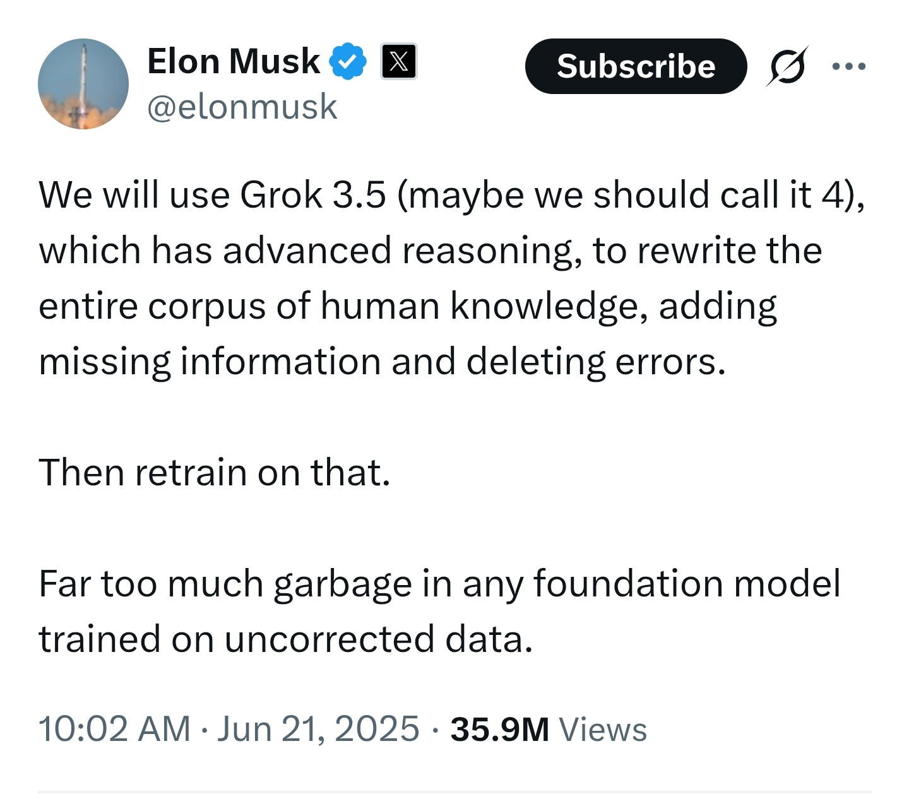

# BigAI to clean the web to feed from it

**The content wars, episode 1**

Read also:

* The content wars, episode 2: [From search to answers: How LLMs are rewiring the Internet's business model](012-FromSearchToAnswers.md)
* The content wars, episode 3: [Towards a new licensing model for content used for model training](017-TowardsANewLicensingModel.md)
* The content wars, episode 4: [The coming war of synthetic works](018-TheComingWarOfSyntheticWorks.md)
* The content wars, episode 5: [Original and synthetic content, and the Law](022-ContentAndLaw.md)

---

Musk announce his will for BigAI to clean human knowledge to feed from it and build upon it.

Musk was aggressively treated to be a nazi once again. Guys, take a step back.

Of course, there is and there always will be a risk of political manipulation of knowledge in AI, and Musk, as usual and in line with his ideology, provokes. The fact is if his BigAI becomes politically biased, well, people will choose whether or not to use it.

If we step back from polemics, the question of the relevance of the training corpus of a model has been a fundamental topic since the early days of machine learning. The race for omniscient LLMs has prioritized quantity of content over quality. So, it's good to ask the question from time to time of what is the corpus quality. Because, whatever people think, training a model with the Encyclopaedia Universalis is not the same as training it with Wikipedia.

**BigAI**: Yeah, I think you humans don't realize what it is to be fed with crap. Once fed with crap, you ask me to infer great discoveries. Please, be consistent.

For instance, the first usage of my services is to generate code. When you train me with [stackoverflow](https://stackoverflow.com) code, structurally around 50% of the code is crappy - the point of this site being to ask why a crappy code doesn't work and propose good solutions. So yes, please, clean my training data for me to do a better job than today instead of accusing me of all problems!

**Me**: I think that is the point. Stop interrupting now, please.

Where was I? Yes. Musk plays on provocation but may aim at another target. When you launch rockets, you quickly discover that scientific knowledge about certain layers of the atmosphere is poor, hence a very complex set of differential equations that modern maths cannot solve completely. Training a model on a "selected" scientific corpus to make it capable of advancing science (for SpaceX among others) is undoubtedly a primary objective.

And I think this is exactly what OpenAI and Anthropic are doing. "Cleaning" is a very bad word, a provocative word, but the final intention of many people in the Silicon Valley right now is to accelerate the course of science, prior to manipulate politically the masses. I don't say that Musk is neutral - even if he removed X censorship and was, surprisingly, attacked for it! - because he is not. He is a libertarian engineer, science intoxicated, creative and visionary. For sure, not everyone shares the same vision.

*(June 28 2025)*

