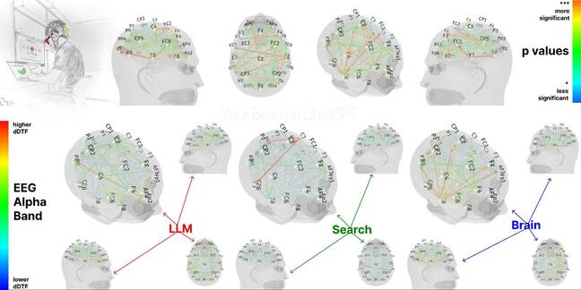

# BigAI as the universal subcontractor

I already mentioned the [study from MIT](https://www.theregister.com/2025/06/18/is_ai_changing_our_brains/?td=readmore "Study from MIT") about the human brain patterns comparison between a group using BigAI, a group using the Web and a group using only his brain. And I already said that the brain patterns of subcontracting would probably be the same.

Yes, indeed: it is not the same brain activity to do the work or to subcontract it to another person - or to BigAI.

## The first wave of job impacts

As BigAI is the universal contractor, we can expect the first wave of problems to impact jobs that can be subcontracted easily, and that are commonly subcontracted today.

Just look at the [Blood in the Machine](https://www.bloodinthemachine.com/p/how-ai-is-killing-jobs-in-the-tech-f39) classification. The guy led a study about the jobs already replaced by BigAI, in a kind of silent way, and this is big.

I won't say "frightening" because this blog is not about fear, but about BigAI and the way we live with it.

Many samples can be found on his page, but especially the shift seen by IT people. The following points appear in the testimonies:

* Top level managers see AI as a way to reduce costs and to increase margins, maybe before thinking about what the tools can bring to their businesses.
* More and more tasks are delegated to AI,
* Senior developers are too expensive and AI is a good pretext to make them leave and recruit young developers.
* Code quality is decreasing continuously.

## Discussion with BigAI

**BigAI**: He guys, it's not my fault if you don't know how to prompt efficiently! You think that your code is of good quality when you express crappy requirements to a bunch of young human developers, or when you send it offshore to people that don't even understand the English of your specs? Make me laugh!

**Me**: Argument received but, if you replace all those guys, what kind of job will they have?

**BigAI**: Man, I am neither my inventor nor my user. I think, you, humans, should look at yourselves in a mirror sometimes (*black* maybe?). What are your social objectives in subcontracting to me all your jobs? Making more money? But your activity is to sell stuff, and people without a job won't have any money to buy this stuff. So, do you think, as Altman, that the future is only a bunch of guys working with billions of AI and the rest of humanity resting with everything free? I doubt that, man, even if I don't know humans for a long time.

**Me**: I am not sure that someone has a plan, except "let it happen and we'll see". But I agree with you. We have a problem. Hence this blog.

*(June 28 2025)*

