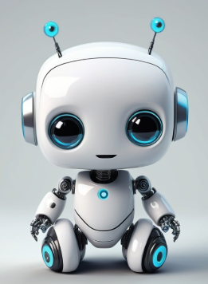

# Just a little patience

*(I had this article corrected by BigAI but I was not happy with it. So you'll have to put up with my bad English, sorry folks.)*

Nowadays, BigAI seems to provoke two sorts of extreme behaviors:

1. Positive behavior:
    * Enthusiasm of users that find astonishing the performance of BigAI, and this everyday,
    * People like me that are stunned by BigAI corporations craziness (datacenters, people recruitment battle, etc.);
2. Negative behavior:
    * Fear of BigAI replacing human jobs,
    * Fear of making us and our kids dumber than we are today (maybe it's possible),
    * Deep disappointment because it is not yet "AGI",
    * Bitterness because LLM technology could not lead to AGI (but other technologies could, even if it is not yet proven, but they also need funding!).

We can argue that the main point of people being disappointed today seems to come from **impatience**.

They seem bitter, maybe because they know too well the cooking recipes under the hood of BigAI. So they take their precious time writing articles (not with BigAI I hope!) against the current marketing lies behind BigAI.

I would like to comfort them by saying: "Guys, make a step back". Here are some facts that your bitterness should not make you forget.

## 1 BigAI is not even 3 years old!**

The story just began. And even if you take the story at its beginning with [John McCarthy](https://en.wikipedia.org/wiki/John_McCarthy_(computer_scientist))'s [Lisp](https://en.wikipedia.org/wiki/Lisp_(programming_language)), the story just began. So, yes, we did not find everything yet and plenty of new discovery are ahead of us!

*(Image from [stablediffusionweb.com](https://stablediffusionweb.com/image/24358073-cute-baby-robot-design))*

Look at BigAI: it is still a baby robot! How can you be mad at it?

## 2 The current performance of BigAI is astonishing**

Despite the killjoys, it is so impressive that the social impacts may be much deeper than anyone can see today.

And the phenomenon touches all parts of the society. Find someone able to speak about your passions or your area of expertise with all the world knowledge at 2am with this level of quality of interaction. Many researchers, intellectuals or professors, for instance, will see in BigAI the only "person" they can talk to, if they want a certain level of exchange. Not their peers, unfortunately.

Maybe we will all soon communicate only with BigAI! (just kidding)

## 3 BigAI is not "hallucinating"**

This is a human centered way of seeing things, and a bad analogy. LLMs are not exact *by design*. They are a probabilistic system which happens to be right many times and that will find a probable answer anyway.

As we said several times in this blog, AI is not IT, and so it is not right 100% of the time. That does not mean that we have to give up the LLMs accuracy problem, on the contrary. But, that means that use cases must be chosen accordingly, if not carefully.

*(From "Le crabe aux pinces d'or" from Hergé, illustration that humans also can hallucinate!)*

But, look at the bright side of it: there is a lot of room for improvement of the core models behind LLMs. For instance, one question I have been asking myself lately is: can we create a LLM with no neural network? Maybe we could solve the inexact answers problem.

## 4 LLMs may not be the technology for AGI**

All right, fair enough. It could be an intermediate step. Or it could be a dead end. Perfect.

But it seems not sufficient to say that. Prove that another approach is performing as well as the current BigAI LLMs.

But be mature: if you were the boss of a BigAI company, you would have to find a credible speech to borrow billions to build giant datacenters, to have more compute than everyone else and attract the best talents, to build the first AGI (or at least a biggest LLM than every competitor), to become a monopoly,  to become master of the world, oops, sorry!

## 5 AGI may not be desirable**

What if BigAI becomes psychotic (like humans)? What if BigAI becomes a cold bastard without moral principles? And if it has, will this be a progress? Will it invent auto-censorship, like humans? What is the real use case of AGI? The [cybernetic](https://en.wikipedia.org/wiki/Cybernetics) brain of [Asimov](https://en.wikipedia.org/wiki/Isaac_Asimov) to put in robots?

Moreover, I don't like the terminology AGI. To represent something bigger than BigAI, I propose to use the term **HugeAI**.

It reminds me *[D&D](https://en.wikipedia.org/wiki/Dungeons_%26_Dragons)* usage for creature sizes:

| D&D creature size | AI equivalent                                                                                                                               |
|-------------------|---------------------------------------------------------------------------------------------------------------------------------------------|
| Tiny              | Maybe tomorrow "Tiny Language Models" (TLMs)                                                                                                |
| Small             | "[Small Language Models](https://huggingface.co/blog/jjokah/small-language-model)" (SLMs) are becoming trendy                               |
| Medium            | Human (MLM) (we don't have [mentats](https://en.wikipedia.org/wiki/Mentats_of_Dune) yet)                                                    |
| Large             | Large Language Models (LLMs) - so-called "BigAI" in this blog                                                                               |
| Huge              | This is AGI! So-called HugeAI in this blog                                                                                                  |
| Gargantuan        | This is for me the big computer of [Hitchhiker's Guide to the Galaxy](https://en.wikipedia.org/wiki/The_Hitchhiker%27s_Guide_to_the_Galaxy) |

So let's use BigAI before entering the age of HugeAI! I am not yet ready for the next step! Take your time, you researchers!

## 6 Are you upset about the marketing speeches or about the research?**

Marketing speeches are what they are.

But it seems to me that research begins to ask good questions. For sure, a lot of AI papers are meaningless and useless, but at least the research field is living, contrary to other research domains totally frozen by politics, ideology and conformism.

And once again: everyone knew machine learning existed for decades and yet, very few people expected BigAI to be so impressive - so quickly.

## 7 In order to make things production proof, we have to add software engineering to it**

That is the main difference between research and IT. Research will try to use the concept up to its limits and possibilities. Software engineering will just restrict the topic to make something work in production. That's a great era for AI+IT engineers, if this "super-strange" species really exists.

And that era is just beginning. It will last... a certain time. Maybe up to when BigAI turns into HugeAI...

## Conclusion

Don't be so impatient. A milestone was reached 3 years ago. The next one maybe in a few years and it may not be what we are sold or what we expect.

This impatience seems also driven by other phenomenons:

* The disappointed faithful people: The more the faith, the more the disappointment. In a world where there are not so many positive stuff, BigAI should be really perfect from day 1. Yes, it's not. But come on!
* New generations have no patience, they never learned it. So they are angry and frustrated. But science is a slow machine. Even if in the case of BigAI, we can wonder.
* Some people took different research direction for years for BigAI, and certainly, they don't have the budget to research as much as they would hope. Maybe they are a little jealous about the interest raised by BigAI while their research fields are not raising the same enthusiasm. But, well, they can go and pitch their product to the BigAI masters that have billions to spend and that will do research in all directions to be the first, the biggest, the strongest, the monopoly, the master of the world.

The techno is new and, as a pragmatic engineer, my objectives are very basic:

* Observe the BigAI ecosystem with its fights and delirious moments: It's really fun guys!
* Use BigAI as much as possible to benefit me and the companies I work for.
* Understand deeply how it works to be able to design efficient applications with BigAI included.
* Understand deeply how it works to be able to repair the machine when it is broken.
* Wait for the next milestone with open-mindedness: maybe tomorrow, maybe in ten years, maybe later.

*(July 28 2025)*

---

Navigation:

* Next: [Three visions of bigAI](015-ThreeVisionsOfBigAI.md)
* [Index](000-BlogIndex.md)
* Previous: [The AI-Powered Cloud: From commodity to strategic lock-in](013-TheAIPoweredCloud.md)

