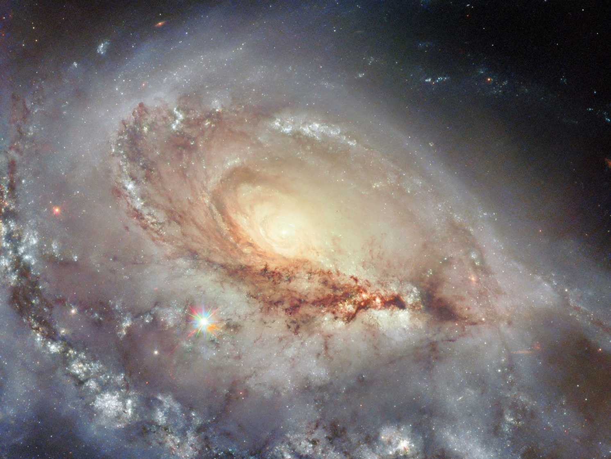

# Where is everybody?

**Could BigAI be responsible for the demise of galactic civilizations?**

*(Image from [NASA](https://science.nasa.gov/missions/hubble/elliptical-galaxy/))*

I just looked at an AI generated video about the scientific hypothesis of why we did not detect alien life in the galaxy yet. This is an old problem of physics: Considering the statistics of inhabitable planets, we should see traces of galactic civilizations, probably many of them.

The video modernizes a bit the vision of Enrico Fermi by putting in perspective the AI as the probable source of civilization collapse. It is said that AI is in the normal path of scientific discovery, and it appears as the most probable cause of civilization disappearance, explaining why it seems that “we are alone” in our galaxy.

This scientific, or statistical, hypothesis can be split into two main parts:

* First, the civilization face another level of intelligence, and that form takes precedence over them;
* Second, this level of intelligence is coming from “intelligent machines”, which seem to be the consequence of standard development of science and engineering for every evolved society.

## Humanity in front of a super-intelligence

Stanislas Lem explored at least two faces of the problem of humanity in front of a super-intelligence.

The first one is in [Solaris](https://en.wikipedia.org/wiki/Solaris_(novel)) where humans are faced with an non-understandable intelligent ocean, a kind of enormous brain, capable of creation, in particular capable of creating living being from the memories people have of dead persons. At some point, understanding that humans don’t like that, the living ocean ceases to play with humans, as we would do by ceasing to play with ants. We can see in that novel the huge gap between poor humans and this ocean that remains untouchable, distant, focused on its own incomprehensible objectives.

The second is [His Master's Voice](https://en.wikipedia.org/wiki/His_Master%27s_Voice_(novel)). A multi-scientific teams project is organized to decipher a regular flow of neutrinos that cannot be created by any celestial object we know, and so, that should come from an intelligent source. The question is: What does the message say? Lem describes a scientific world where people are narrow-minded non-collaborative self-centered beings. He accuses our lack of wisdom and poor collaborative minds, which consequence is that we cannot raise at the level at the super-intelligence that tries to communicate with us.

The Lem’s books are quite interesting because they really show the **gap between intelligence “levels”**.

To illustrate the gap between intelligence levels, we can take the analogy of us playing with insects: Try taking a small piece of wood to prevent an insect to go its way. At some point, the insect will make very clear to you that you are hostile to it, and that it intends to fight back. You understand it, but the reverse is not true. The insect will never be able to comprehend why you spend so much time searching for a bug in your last software.

In Lem’s novels, the super-intelligence is not human but it is supposed that it is a living species. That does not make a real difference at the end with the matter today: Super-intelligent machines may show the same syndromes as super-intelligent beings.

## Searching for intelligence as we know it

The video insists on a question: If we were in front of a super-intelligence, would we recognize it? Because this intelligence may pursue incomprehensible objectives, and communicate through non-imaginable means, we could just not “see” it - while it is here.

The video uses the word “**filter**” to describe that we search, in the universe, intelligence that looks like ours - and not other forms we can’t imagine. We have a “**human filter**” before our eyes.

This video takes the following argumentation:

* The intelligent machines are the natural consequence of science and engineering mastery;
* Each civilization reaching our technology level will create intelligent machines;
* Intelligent machines, at some point, destroy the civilization that created them;
* The civilizations do not communicate anymore;
* So the galaxy seems *empty*.

Some comments can be done about this argumentation:

* If humans are searching for civilizations with a “human filter”, **it is not sure that we are able to see other civilizations**, even if they existed and wanted to communicate;
* The fact that they disappeared can be attributed to many other reasons than BigAI.

In this argument, there is something totally underestimated: **The time for information to travel to us**. If we consider that our civilization was built and will be destroyed by BigAI in 10,000 years, during this period, our capability of sending messages to the external world will not exceed 100 years.

Think about it and suppose that other civilizations knew the same demise as the video says we are facing. They will emit information during one century only. That means that their period of emission must synchronize with our period of reception, all that considering the distance that separates us. That reduces a lot the probability of contact!

## The Drake Equation

The Drake equation is written like that

N = $R_*$ . $f_p$ . $n_e$ . $f_l$ . $f_i$ . $f_c$ . $L$

To find $N$ (the number of civilizations in our galaxy with which communication might be possible), you multiply the following factors:

* $R_*$: The average rate of star formation in our galaxy,
* $f_p$: The fraction of those stars that have planets,
* $n_e$: The average number of planets that can potentially support life per star that has planets,
* $f_l$: The fraction of planets that could support life that actually develop life at some point,
* $f_i$: The fraction of planets with life that go on to develop intelligent life (civilizations),
* $f_c$: The fraction of civilizations that develop a technology that releases detectable signs of their existence into space,
* $L$: The length of time for which such civilizations release detectable signals into space.

If we take the original optimistic values, we get:

* $R_ = 10$* (10 stars born per year),
* $f_p = 0.5$ (Half of stars have planets),
* $n_e = 2$ (2 habitable planets per system),
* $f_l = 1$ (100% of habitable planets develop life),
* $f_i = 1$ (100% of life becomes intelligent),
* $f_c = 0.1$ (10% develop detectable radio tech),
* $L = 10,000$ (Civilizations last 10,000 years).

Result: $N = 10,000$

In this scenario, there are 10,000 civilizations in the Milky Way right now.

Now suppose that those civilization are spread on the last billion years only, our galaxy’s age being 13.5 billion years, which is, again, very optimistic, which leads to a civilization born every 100,000 years. As the civilization lasts 10,000 years, that means that **90% of the time, the galaxy is really empty of intelligent civilization**.

If we consider that this civilization is able to communicate during 100 years before collapsing, that means that it would be very very surprising that we are just in the right moment, and just at the right distance, to detect the message.

## The gigantic size of the galaxy and the limited life expectancy of living species

As far as we know, we are not living in Dune and we cannot fold space to travel far in no time. We did not invent machines to beat the speed of light and travel safely far from our solar system. Indeed, in all science-fiction novels, the colonization of the universe begins by traveling faster the speed of light, quite often much faster, and we are not there yet.

Just see the damage caused by debris to a satellite and imagine what technology would be required to resist the impact of small objects into your ship when travelling close to the speed of light. Imagine also the impact of radiations on humans. Stars are quite aggressive entities for humans. We must recognize it: **Space is a very hostile environment for us**.

Well, suffice to say that we have not succeeded in solving the fast travel issue enabling intergalactic travel. Even colonizing the solar system will be a challenge. The fact is our galaxy is huge and distances are enormous. The technology required to colonize the nearest star will be incredibly complex and expensive, and the trip will be immensely long (several generations) and incredibly risky. Can we imagine to travel with ships several centuries without external support? At now, **the technology is not there**, and we are very far from it.

Because space is hostile, cold, dark, and distances between stars are incredibly big, we would need to invent long lasting ships. To maintain ships for several centuries, we may need a huge amount of spare parts. Or we take raw materials with us and build the part in the ship, so we need factories inside the ship. But the factories will need also spare parts. That would lead to enormous ships. And what about air and water? It would be necessary to have very efficient recycling technologies and also control over the number of humans that breathe and drink. Vegetables can purify the air provided they have earth and nutriments. **A full autonomous ecosystem should be transported in space**.

And, maybe more important than everything: How can we ensure that **knowledge is passed through generations**, that our grand-grand-children will be able to maintain the ship while it is traversing the huge darkness between stars? How can we ensure that men will not destroy each other in the trip, like they are used to do on earth, that the power quest may end by a catastrophe?

Science-fiction solves the problem with ships controlled by machines and people being asleep for centuries. Once again, aging is not yet controlled by humans and that remains an unreachable objective.

We can say that it appears to all science-fiction writers that interstellar travel can only be imagined with a technology that has not been invented yet - and that may never be.

That opens a philosophical question: **What if those immense distances are for the best?** What if that isolation is the guarantee to protect us from other aggressive species, species that have the same problems as we do? They can’t colonize the galaxy because they are not materially able to go to the next star. What is the point to communicate, then, if requests and responses take ages to be delivered and if you can’t reach the other party?

All that to say that the double constraint of gigantic distance on one hand and short life expectancy seems to indicate that interstellar travel is not possible for humans unless there is a huge discovery changing the time required to travel between stars.

## Machines that create better machines?

This hypothesis keeps coming back. It is used currently by companies like Anthropic to describe the models that create better models.

Let’s analyze this: We already fed the LLMs with all the written human knowledge. As I wrote in a previous article, *BigAI is the Book of Sand*, we expect the model to hallucinate to discover new stuff.

See: [BigAI is the Book of Sand](019-BigAIIsTheBookOfSand.md)

Why? Because  a certain type of creativity comes from unexpected correlations. A model can be intelligent and find “new stuff” **provided it hallucinates**. So we have to search for hallucinations and absolutely not to prevent them. By limiting the hallucinations because we want our models to be like an encyclopedia and tell us the real facts, we limit their basic creativity.

But, we have to realize that **the “thinking space” of the LLM is finite**. We already put everything that we had in it. So, the creativity of the model will be limited by the boundaries of the training data. So it will be limited by the human knowledge as of today.

Just imagine our LLM is fed with all the books available at the time of Galileo. Do you think the LLM would be capable of thinking that, probably, Earth is in rotation around the Sun, and not the reverse? Probably not. Would the LLM capable of discovering general relativity? Galileo broke the “circle of common knowledge”, at the time.

We can extend training data, in certain ways. That is what the Chinese companies are doing with domestic robots, creating new data sets, coming from common human life: fold clothes, empty the dishwasher, etc. We can also include many behavioral data that we currently do not record. **But the data will be both finite and human**.

Is this enabling a model to write a better version of itself? Even if we think outside current model limitations: Will an AI able to re-code itself in a better version that what it is? And what will be the criteria for “better” when no human will be there to define it? Faster? More creative? More accurate? Following what criteria?

## Trapped in the circle of common knowledge

The hypothesis that machines will reinvent themselves to develop an intelligence that is beyond humanity should appear as **just a hypothesis**. Why would it be possible? If machines are stuck inside the “circle of common knowledge”, they can innovate by hallucinating, but will they be able to invent something really new? You can argue that most of the innovations nowadays are made of correlations of existing materials. The answer is probably yes: But is this sufficient for Humanity? Don’t we need to go to space, don’t we need nuclear fusion, don’t we need new paradigms? Until now, only humans proved that the circle of common knowledge could be broken.

That opens to a new philosophical argument: **Inspiration**. Why some of us, humans, are inspired? Is inspiration the same thing as LLM hallucination? Maybe, and maybe not. Are we really capable of thinking “out of the box”, out of the circle of common knowledge, because that would mean that humans can “invent new things” rather than just correlate differently the cognitive materials that are already available?

## The bigger, the more intelligent - or the more stupid?

The argument used by BigAI companies and the one in the video are always the same: Let’s build a bigger machine, why not the size of a planet, with a way to capture a large portion of the Sun’s energy. The bigger the machine, the bigger the intelligence, that is the hypothesis. Autonomous machines building machines like in the Matrix. Maybe. That would mean we have built something that can beat brain evolution.

It is not sure the problem is well formalized. Because, maybe the hypothesis that machines are capable of creating more intelligent machines is not the real problem, after all.

If we fear that intelligent machines can terminate a civilization, we may consider that **the danger may just come from the machines that we currently have**, or are about to produce. Maybe the danger may come from **our lack of control of “stupid machines that mimic human intelligence”**.

That would mean that the problem is not super-intelligence but control over “semi-intelligent” machines, machines that do not have (human) common sense, that are not reasoning in a consistent way, machines that have serious flaws in their cognitive functions.

Maybe this is about: Maybe civilizations disappear not because they are creating super-intelligent machines, but on the contrary **because they are creating “very powerful stupid machines”** that can destroy them without even realizing the consequences.

## What would be the machines purpose?

What would be the machines purpose?
Humans have purpose. It would be better if they realized their purpose should not be based on killing other people. That would be a real “plus” that Humanity never reached, so far. If we build machines at our image, we can expect a very dark future…

Humans are curious. But machines? Suppose machines are super-intelligent and want to take over. What would be their purpose? To be like humans, to be the boss, the slave master, the destroyer of all risks? Humans are a risk for the super-intelligent machine so let’s get rid of humans? But that is a human way of thinking, not a super-intelligent way. From the dawn of time, machines are here to help humans. What would be the purpose of a super-intelligent machine that would have destroyed humanity? If it is super intelligent, it can reason that it will be alone, for the first time ever.

And then comes the purpose afterwards.

A super-intelligent machine would create other machines to conquer the galaxy? But machines life expectancy is low, because they are fragile, more than living things. So they would need a massive amount of spare parts, they would need to exploit mines to get materials to create those parts, those processors to be able to survive. They would need to create big ships… And here we go again: In space, machines face the same problems as we humans.

All that to say that super-intelligent machines could protect civilizations and help them grow, while super-powerful stupid machines could destroy them. That is a matter a choice. What power are we giving to the machines?

## Conclusion

For sure, we did not yet detect other life form in the galaxy. We did not have contact with intelligent life forms. The galaxy appears to us as empty.

But first of all, we just started to look seriously. We did like humans do, we presume that civilizations would like to communicate with us as we would like to communicate with them. We project our human vision on the galaxy.

Instead, we should try to understand where we live. We understand a few things concerning our galaxy, but not so many. Dark matter theory is here to show how little things we really know about where we live.

The fact is, to come back to the video, maybe civilizations are not killed by super-intelligent machines: Maybe they are killed by machines that are super-stupid and that enable their creators to be stupid at a larger scale than ever before?

As a conclusion, let’s work a bit on things, on increasing our knowledge about the galaxy, and if BigAI can help, well, that’s great - except when it replaces the human understanding that cannot and should be offloaded. Let’s be modest and not project our worries upon the galaxy!

I will end with telling you about a short story of Lem in which Ijon Tichy, his hero, is sending a robot to spy on a silicone-based planet. He hears a silicon-based teacher discussing with his silicon-based pupil who is proposing that there could be life forms based on carbon. The teacher laughs and says:

-- Ridiculous! There cannot be other life forms than the ones based on silicone!

*(April 6 2026)*

---

Navigation:

* [Index](000-BlogIndex.md)
* Previous: [Education and personality](023-EducationAndPersonality.md)
* Next: [AI faces only heathens](025-AiFacesOnlyHeathens.md)

