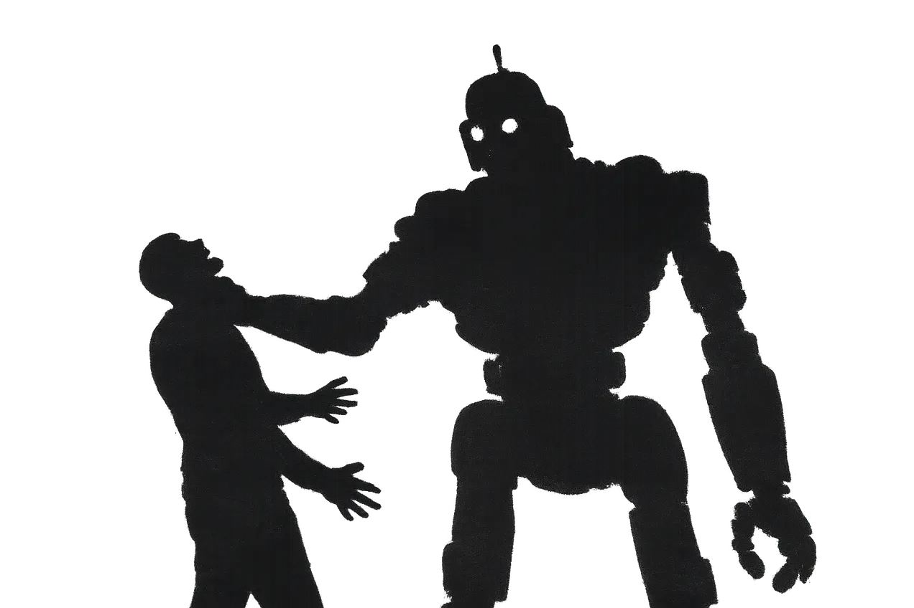

# Strangling Agents

**The agentic leash**

Last year, everything was about RAG. It wasn't perfect, but a program was still in control. The model was the backend — a powerful tool, yes, but a tool.

With agents, **the model is in control**.

I started wondering why the AI marketing machine was pushing so hard into "agents." Then it clicked. For the big three American AI platforms — ChatGPT, Claude, Gemini — becoming the front is not a strategy, it's a survival requirement.

They absorbed the web during training. Now they must **hide** it. They must become the only interface, the indispensable intermediary, the oracle you cannot bypass.

So the message becomes:

* *Talk only to our model and it will do everything for you.*
* *Don't look at the web behind the curtain.*
* *Give us your money or lose your automation advantage.*
* *Give us your data or die as a company.*

Think about what that actually means. You become a **willing prisoner** in a very elegant digital prison.

They take your money, your worldview, your processes, your data, your automation — everything — while threatening economic death if you resist. They cannot even promise you stable pricing, because once they have you, the strangling can begin.

They have overinvested in hardware. They have enormous debts. They need you inside their net, paying, continuously, always more.

Once you have fired everyone, you may feel competitive. But **you will be a slave** — a volunteer slave — unable to act without the machine, stuck to a system you don't own, you cannot replace and can bankrupt at any time, letting you with nothing, no skills, no data and no employees. You will have given up your freedom in exchange for convenience and short-time profit.

I am not against AI, but I am not fond of digital prisons where the omnipotent gard is strangling me to pay his debts.

Before going full agent mode with the Big Three, think twice:

* Play with agents on a local model.
* Keep the "model as backend" pattern alive.

In short, keep the control where it belongs: **with you**.

*(November 21 2025)*

---

Navigation:

* [Index](000-BlogIndex.md)
* Previous: [AI faces only heathens](025-AiFacesOnlyHeathens.md)
* Next: [Companies in Front of the Content Tsunami](027-GenAIasMaginfyingGlass.md)

