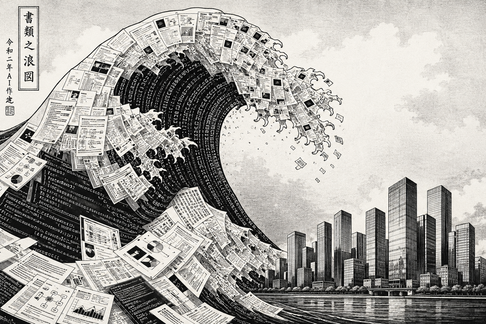

# Companies in Front of the Content Tsunami

**The content wars, episode 6**

A common assumption is that AI will lift all boats. The reality is more interesting, and more dangerous. Because AI tends to amplify whatever operational DNA a company already has, the good and the bad alike, not every company will benefit from its adoption. Many companies could, with the help of AI, simply accelerate their own demise.

## The Generator Problem

The main advantage and the main drawback of "generative AI" are the same thing: its name tells it plainly. **It generates content**. Currently, two categories of content occupy most companies: general corporate content, and software programs. The ease of generation inevitably pushes quantity upward. More slides, more memos, more tools, more code.

What follows from that is not obviously good.

## Corporate Content: Slides Versus Reality

In many companies, a reliable proxy for structural health is **the distance between slides and reality**.

Ask the simple question: *do the things shown in these presentations correspond to something that actually exists?* And, in a surprising number of organisations, the answer is *no*.

That gap has always been the source of misallocated investment. Business cases were invented, in part, for this reason: to force a minimum of grounding, a minimum of quantified reality, before a manager with limited technical skill committed resources to a concept. The process was imperfect, but it was friction, friction that slowed bad ideas down.

**Generative AI removes that friction entirely**. Today, anyone can present any concept, however poorly defined, and immediately produce a fluent, well-structured, professionally formatted business case around it. The concept may be empty. The document will not look empty. On the contrary, it will look great.

The legitimate fear is not that the gap between reality and its representation will grow — it already existed. The fear is that **the representation will become more credible than ever**, precisely as it becomes more detached from the ground.

In organisations with multiple management layers, where information has always had a tendency to be filtered or softened as it moves upward, the combination of content volume and content quality will soon make it very difficult for executives to maintain contact with operational reality. Mid-management misrepresentation, being conscious or not, may become AI-powered as a matter of course. Detecting it will become substantially harder.

We should not lie to ourselves about what this means. Giving open access to generative AI to middle management in a poorly aligned company is like giving matches to a pyromaniac in a dry forest.

## The Old Recipe Will Come Back

Historically, executives in well-run organisations built **compensating systems**: personal audit teams, informal networks, direct floor visits, people at every level who reported outside the formal chain.

These mechanisms were considered costly, and perhaps slightly paranoid. Soon, they will be indispensable, especially in large organisations. The executive who has no independent channel to operational reality will be flying blind in a cockpit full of beautifully rendered business cases, progress reports and KPIs.

## Code Generation: The Industry Risk

In software companies, AI-assisted code generation, automated analysis, and cybersecurity tooling will bring genuine gains. The risks there are dependency, feature overload, and loss of architectural control. We already have discussed the dependency problem in [Strangling Agents](026-StranglingAgents.md).

The less discussed risk concerns companies that are *not* primarily software businesses but employ large numbers of engineers:

* Industrial groups,
* Infrastructure operators,
* Manufacturers.

In these environments, the general software ecosystem culture is typically thin. Engineers know enough to be confident. They do not always know enough to be correct.

Before accessible code generation, the natural friction of development acted as a filter. Building an internal tool to a standard that justified deployment took, conservatively, on the order of one engineer working for close to a year. That friction was a form of quality control, however imperfect.

With powerful AI assistance, a productivity factor of twenty is conservative — fifty is plausible for simple tooling. Take the more cautious number. An engineer who previously would have spent a year producing one deployable application can now produce **ten** in the same period. Applied across a large organisation:

Consider a company with 1,000 engineers outside the IT department, where perhaps 5% of time is informally spent building small internal tools. Without AI, that population produces roughly five applications a year. With a factor-of-twenty acceleration, it produces one hundred. With a factor of forty, two hundred.

The company would rapidly **accumulate a software estate it cannot govern**. Data consistency, security posture, maintenance responsibility: none of this scales with the generation speed. The organisation becomes overrun by its own tooling. And data disorganization is growing.

Letting bored engineers with limited software culture loose on a powerful code generation platform is not an empowerment strategy. It is, to continue the metaphor, giving flamethrowers to pyromaniacs in a dry forest.

## Predation as the Proposed Solution?

Both pathologies described above — the corporate content spiral and the ungoverned software proliferation — point to the same diagnosis: many companies will prove incapable of managing AI usage internally. They will accumulate the liabilities before they recognize the problem.

This is, perhaps not coincidentally, a perfect entry point for a particular commercial model: the **Forward Deployed Engineer**, or FDE.

The concept, promoted most aggressively by companies like *Palantir* and now increasingly adopted by the major AI platforms, consists in embedding engineers from the AI vendor directly inside the client organisation. The proposition is explicit:

* If you cannot use AI competently, let our people do it;
* And **convert your internal headcount costs into a fee paid to us**.

The economics behind this make sense from the vendor's perspective. Large AI companies cannot finance their infrastructure through subscriptions alone. The datacenter bills are enormous. Creating margin by dramatically reducing client operating costs, and capturing a share of those savings, is a structurally more attractive revenue model. The client organisation, overwhelmed by the very tools it was given, becomes a natural candidate for this arrangement.

Seen from a certain angle, the logic is circular in a way that should make us uncomfortable:

* The AI provider creates tools that generate problems the client cannot solve.
* The client, unable to adapt, invites the provider in to manage the adaptation. Dependency deepens.

The provider, positioned as a rescuer, is in practice exercising a form of structural predation:

* *I created the flood*,
* *You could not build the levee*,
* *Now I will manage your drainage*,
* *For a fee*,
* *And a permanent presence inside your walls*.

A possible outcome of those situation would be to simply **buy** the “AI-optimized company” to structurally ensure this margin transfer. Considering the enormous financial means of BigAI companies, that option seems possible.

## Conclusion

The content tsunami is not a distant scenario. It is already forming.

The situation could be worsen with the hiring of a generation that spent their formative years delegating cognitive work to AI.

The organisations that will live through this period will be those that maintain independent channels to reality, govern tool access deliberately, and understand what they are actually building, what control they should keep on their business.

For the others, and there will be many, the rescuers may turn out to be the same entities that designed the flood.

BigAI companies could easily turn into the mega-corporations of William Gibson’s novels. Pushed to survive at all costs, they could become the vampires of our economy by draining progressively all the profits of all competing AI-enslaved companies.

*(June 6 2026)*

---

Navigation:

* [Index](000-BlogIndex.md)
* Previous: [Strangling Agents](026-StranglingAgents.md)

