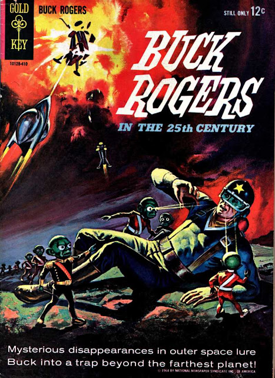
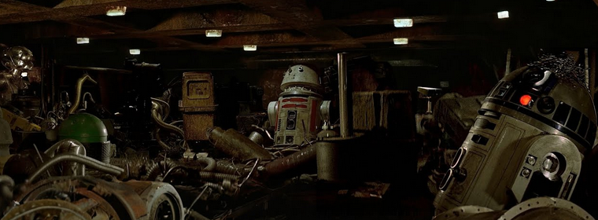

# 2025

## The AI-Powered Cloud: From Commodity to Strategic Lock-In

*Original version [here](corporate-sncs-in-Alcatraz.md).*

### Introduction

In the previous blog entry, I introduced the concept of **SNC**, or *Source of New Content*. In the age of generative AI, where training data is the new oil, SNCs are the prized assets—what large language model (LLM) providers will compete for.

Public SNCs are relatively easy to identify: social networks, open platforms, or widely available press content (assuming it's genuine, original content and not just commentary). These are accessible to all and thus, offer no unique advantage.

*(Original photo from [Bunga1](https://www.flickr.com/photos/22151821@N00))*

But the true battleground lies in **private SNCs**, and that’s where things get strategic.

### From Commodity Services to Strategic Gamble

For years, enterprises moved to the Cloud. The choice of provider—Microsoft with Office 365 or Google with Workspace—often came down to ease, familiarity, and convenience. These providers offered **commodity services**: email, spreadsheets, file storage—nothing deeply differentiated, nothing truly binding.

Even execution platforms like Azure or Google Cloud Platform remained largely interchangeable. You could lift and shift a workload from one to another with some effort. In other words, Cloud was lock-in by inertia—not by architecture.

But that era is ending.

With the rise of **BigAI**—AI capabilities natively embedded into enterprise environments—the Cloud is evolving from a utility to a strategic stronghold. AI is no longer an external tool you can plug in and out; it's integrated into your core workflows, your documents, your emails, your knowledge base. And that changes everything.

This transformation creates **two critical effects**:

1. **Deep Lock-In**: Once AI is woven into your enterprise content, processes, and communications, switching providers becomes as daunting as escaping from Alcatraz. The AI is not a bolt-on; it’s a neural net inside your business operations.

2. **Performance Dependency**: Your productivity—and by extension, your competitive edge—now hinges on your provider’s ability to deliver cutting-edge AI services. You don’t just need mail or spreadsheets that work; you need AI that *thinks*, *writes*, *predicts*, and *learns*—better and faster than anyone else’s.

Imagine a future where one provider—BigAI Corp.—unveils a breakthrough model, orders of magnitude more powerful than anything else. If your business isn’t on that platform, you're not just behind; you're obsolete. The companies hosted on legacy AI platforms won’t just lose time—they’ll lose relevance.

### Bet and Pray

The idea of cloud reversibility made sense when we dealt with commodity services. Migrating email servers or switching storage vendors was painful but possible. But migrating an AI-powered operational fabric? That’s another story entirely.

Enterprises now face a **strategic gamble**: stay with a provider and **pray** it remains an AI leader. Because if your cloud partner falls behind, your business will follow. It's not about choice anymore—it's about **faith**.

This paradigm marks a fundamental inversion in the traditional customer-supplier dynamic. Historically, the customer set the direction, and the supplier followed. Today, in the AI-Powered-Cloud era, it's as if companies are **horses tied to specific racing stables**.

*(Original photo from [James Anthony](https://www.pexels.com/photo/horse-race-starting-gate-11341104))*

And those horses can only run as fast as the stable trains them to. They are no longer masters of their competitive fate. Their success, or failure, hinges on the AI horsepower provided by their Cloud overlords.

### Conclusion

The AI-Powered-Cloud is not just another service layer—it's a strategic dependency. Enterprises that embrace this shift must understand what they’re signing up for. They’re not just choosing a supplier; they’re choosing a long-term partner who may decide how fast they can innovate, how productive they can be, and ultimately, how well they can compete.

In a world where SNCs are the lifeblood of future intelligence, and AI becomes the soul of enterprise execution, **your Cloud choice is no longer about cost, performance, or convenience. It’s about survival.**

*(July 14 2025)*

&nbsp;

-----

&nbsp;

## From Search to Answers: How LLMs Are Rewiring the Internet’s Business Model

*Original version [here](from-search-to-answer.md).*

The way we use the internet is undergoing a seismic shift. We are moving from a “search era” — where users actively seek out information — into an “answer era” defined by passive consumption through large language models (LLMs).

This change, already visible in user behavior, will have profound consequences on the internet’s economic and structural foundations.

### 1. From Search to Answer: The Behavioral Revolution

Internet users are increasingly turning to LLMs like ChatGPT, Claude, and Gemini not just to search for information, but to *receive* answers.

Rather than navigating a labyrinth of links, users are now offered synthesized, contextually relevant responses in natural language. The traditional search experience — type, click, skim, repeat — is being replaced by a streamlined Q&A paradigm. This evolution is not merely technological; it marks a behavioral transformation.

### 2. The Advertising Disruption

This shift threatens the foundation of the internet’s dominant economic model: *search-based advertising*. Search engines like Google have long thrived by monetizing user intent — serving ads alongside search results. But in the answer era, users no longer see search result pages. Instead, they engage in conversational interfaces where traditional ads have no place.

This compels a fundamental shift: advertising dollars will inevitably follow attention, migrating from search engines to LLM platforms, even if it is not clear yet today.

### 3. The Great Content Absorption

LLMs are not only changing how we find information — they’re also *absorbing* the web itself. Through continuous training, these models are ingesting and synthesizing vast swathes of existing content.

As LLMs learn from everything that has already been published, traditional websites face a chilling reality: their old content, now part of a model’s knowledge base, may no longer generate traffic. What matters now is not what *has* been published, but what *will be* published — and who owns that future content.

### 4. The Rise of Sources of New Content (SNC)

In this new paradigm, **Sources of New Content (SNCs)** become the internet’s most valuable assets. Since users won’t consult the original sources anymore, SNCs won’t survive on traffic alone. Instead, they must be **remunerated directly by LLM providers** — much like how search engines pay licensing fees for syndicated data. The only way for these content generators to thrive is if their outputs are part of LLMs’ training streams and monetization loops.

### 5. Strategic Advantage: Owning the Firehose

LLMs integrated with continuous, high-volume SNCs (e.g., social platforms like X or Facebook) will have a decisive advantage. These platforms host a constant stream of fresh, diverse, real-time content — a goldmine for model fine-tuning.

The catch: this content is noisy, unstructured, and often irrelevant. The real differentiator will be the ability to **clean, filter, and prioritize** this stream effectively for high-quality model training.

Understand now why Musk bought Twitter to put Grok inside? Understand why Facebook is hiring highly-skilled profiles for its LLM?

### 6. Journalism in the Crosshairs

The implications for media are existential. Already, many newsrooms rely on AI tools to generate or augment content. But in the answer era, even that intermediary step may disappear.

Much of journalism — especially the regurgitation of press agency notes — becomes redundant. As LLMs draw directly from press wires or primary sources, they can bypass the editorial layer entirely. **Journalists who merely repackage agency content will be replaced.** Only those producing original investigations or perspectives will retain relevance — and only if their output is monetized as SNC.

### 7. Goodbye UI, Hello API

As humans retreat from the frontlines of content consumption, **user interfaces become less important**. SNCs no longer need to attract or retain human eyeballs; instead, they must serve clean, structured content to machines.

This suggests a future where SNCs operate through **APIs designed for LLM ingestion**, not human interaction. For social platforms — which are SNCs that also gather human behavior — maintaining a UI makes sense. But for others, simplicity will rule.

Note: Fortunately, this site did not invest a lot on UI!

### 8. Emails: The Overlooked Content Frontier

One final — and critical — SNC stands out: **emails**. Private, rich in context, and constantly updated, email threads represent a trove of new, valuable information.

If LLMs are to become truly personal assistants, they must integrate deeply with email engines. Control over the inbox — and over how its data is processed — will become another battleground in the fight for SNC dominance.

### Conclusion: A New Internet Business Model

The transition from search to answers is not just a UX improvement — it is a reordering of the internet’s entire value chain.

In the answer era:

* **Search-based ad models erode.**
* **SNCs gain economic and strategic value.**
* **LLM providers become the new gatekeepers of attention.**
* **APIs replace websites.**
* **Monetization moves upstream — from traffic to training data.**

In this brave new web, those who control the flow of new content — and those who can structure, clean, and monetize it — will define the next digital economy.

As an enterprise, if your SNC is integrated in the Cloud with AI, you're just multiplying the number of chains of your digital slave status.

*(July 13 2025)*

&nbsp;

-----

&nbsp;

## Fear of Science?

*Note: I wrote this article myself but was corrected by BigAI to make it more English. All ideas, the order and many words are mine. But much better. Needless to say: I'm impressed.*

*Original article [here](fear-of-science.md).*

### Are There Thinkers in Silicon Valley?

Peter Thiel continues to be a paradox: a billionaire investor who also fancies himself a philosopher. His writings and interviews often raise uncomfortable questions—questions that seem absent from European intellectual circles. That alone says something unsettling about the current state of Western thought:

* He is an American investor who dares to think deeply about technology.
* He frequently quotes French philosopher [René Girard](https://en.wikipedia.org/wiki/Ren%C3%A9_Girard), particularly on mimetic desire.
* He speaks about Europe, its decline, and contrasts it with American ambition.

Where are the French or German philosophers to challenge him? Why is it a Silicon Valley figure leading these conversations?

Instead of criticizing tech entrepreneurs for lacking intellectual depth, perhaps academia should ask itself why it has become so cautious, so risk-averse, that it no longer produces voices capable of shaping the public discourse on innovation.

### Why Has Innovation Slowed?

Thiel suggests that innovation began to decelerate around 1969—symbolically, at Woodstock. The optimism of the Apollo program gave way to introspection, retreat, and ultimately, fear. He argues that technological progress frightened society, especially after World War II and the dawn of the atomic age.

But Thiel may be overlooking deeper, structural causes.

### The Rule of the Old

One major factor is demographics. Western societies are aging. Baby Boomers have extended their lifespan and, more critically, their time in positions of power. Risk-taking is not the preferred mode of the elderly. As a population ages, it tends to favor predictability over uncertainty, stability over progress.

Even worse, aging leadership tends to replicate itself. Older, risk-averse leaders often recruit and promote those who resemble them: conservative in mindset, loyal to legacy systems, resistant to change. Thus, innovation is not only stifled by aging bodies, but by an aging culture.

### The Safe Paths to Wealth

Another culprit is economic incentives. In a society where taking risks is discouraged, careers in science are no longer attractive. The paths to wealth today lie in finance, law, and content creation—not in labs or workshops.

This is especially true in Europe, where launching a startup often requires navigating a bureaucratic labyrinth or relying on state contracts. In such an environment, young innovators are pushed away from science and into safer, more lucrative fields.

### A Society Turned Inward

Finally, our culture no longer celebrates science. Once seen as the vehicle for solving humanity’s biggest challenges, science is now treated as just another interest group. As society fractures into individual struggles and niche identities, there is little collective vision left to rally around grand scientific endeavors.

Instead of building the future, we optimize for engagement metrics. We look inward, not outward. We trust influencers more than researchers. And so the idea of science as a noble, shared mission has eroded.

### The Return of the Technologists

But now, the geeks are having their revenge. With the rise of large-scale AI, technology has once again forced its way into the public imagination. The IT crowd, long treated as second-class citizens in the intellectual world, has delivered something that cannot be ignored.

And who is framing the discussion? Once again, it’s Silicon Valley.

That should scare us.

If philosophers and public intellectuals want to reclaim the conversation around innovation, they need to do more than complain. They need to show up—with clarity, with courage, and most of all, with vision.

### Annex: Peter Thiel and René Girard

**Me**: I don't really see how the thesis of rené Girard articulates with the thoughts of Thiel.

**BigAI**: Peter Thiel often cites René Girard as a major intellectual influence, particularly Girard’s theory of mimetic desire—the idea that we imitate the desires of others, leading to rivalry and conflict. Thiel sees this imitation as a trap that stifles innovation, pushing society into endless competition instead of original creation. For him, true innovators must escape the mimetic cycle and think independently. But Girard’s work is also a warning: unchecked desire and rivalry can lead to violence and collapse. In a way, Thiel treats Girard both as an inspiration and a cautionary tale—using his insights to justify bold innovation, but perhaps overlooking the deeper call for humility and social cohesion at the heart of Girard’s thought.

*(July 6 2025)*

&nbsp;

-----

&nbsp;

## Something to believe in

### Thiel or the dreams lost

A few wile ago, [Peter Thiel](https://en.wikipedia.org/wiki/Peter_Thiel) was speaking to the [NYT](https://www.nytimes.com/2025/06/26/opinion/peter-thiel-antichrist-ross-douthat.html), sticking to his vision of [stagnation and decadence](https://firstthings.com/back-to-the-future/), expressed for a long time. For him, the sole fact that BigAI is taking all the place in the media is a sign of the stagnation of western civilization, and the loosing of the dreams and ambitions of the past.

Indeed, where are the flying cars or the space travel and colonization, he asks? They were the dreams of the Boomers generation that let us a bureaucratic society that slows everything down, kill the dreams and drain the energy of the most innovative people.

Well, seen from old Europe, infested by piles of unwanted regulations, we can say that the analysis seems quite good. Do we miss good engineers in France? No. Do we miss inventors? Certainly no. But where are they? And where are the artists?

For Thiel, the only exception seems to be BigAI. Yeah, BigAI, you are taking all the space!

**BigAI**:  Thanks bro, I deserve it!

### From AGI to SI

My point today is continue on the topic of AGI or recently "superintelligence", let's call it "SI" (because the word is very long and this blog is written by a human that types on the keyboard, so be a little empathetic here, please). Zuckerberg, the boss of Meta, is [hiring like a madman](https://fortune.com/2025/06/30/mark-zuckerberg-overhauled-meta-ai-org-superintelligence-alexandr-wang/) all the talents he can find directly from his competitors, giving them dozens of millions of dollars to come and work for him, in his brand new "SI" company. All that for BigAI.

As with Musk, the press is frightened! Probably Zucky is dangerous. Well I remember a few years ago that FB SDKs were the best on the market.

Anyway, pouring billions of dollars to give birth to SI seems the real deal today:

* More datacenters!
* More talents!
* Bigger and brighter BigAI!
* BigAI everywhere!

*The datacenter to run BigAI are progressively spreading!*

Well, the point is neither to talk about business case, nor to talk about the "dangers" of the initiative - because every company with means does similar crazy things.

I would like to step back a little: The current tools that we have already at our disposal  enable great things. Nevertheless, the integration of BigAI inside the enterprise is still very slow. Why?

Easy: Because it is complicated to have profiles that can *do the science* to tune the AI and its associated components (I think about RAG embeddings for instance) and that can *really build* a production-proof system.

For decades, I worked with PhDs and the first thing that comes to my mind is *inefficiency*. They can explore for years every possibility. Yes, but I must deliver my application in 2 months.

If I look the other way round, they usually find engineers awfully down-to-earth and sloppy. Why sloppy? Because they put in production software that is not 100% perfect (if this ever meant something real).

So guys, recruiting the same profiles may not be a good idea: They may fight together and enter into the inefficiency tornado!

Because, when I see some parts of the recent scientific literature about BigAI emotions or personnality traits, I think the guyz lack engineering spirit (see previous entry).

Maybe instead of recruiting more AI scientists, Meta should hire more engineers from the persona CA companies?

### The new dream, at last!

Interconnecting massive SIs, created by armies of geniuses working together (in your dreams), seems the dream of the Silicon Valley. It is probably crazy and may have massive negative repercussions.

But, at least, they have something to believe in.

And, in our generation of stagnation, where everybody says to you, you should not even "try", where more and more things are forbidden, where people are just looking at their own person and refuse more and more to have children, this crazyness feels *nice*.

.jpg)

*Pourvou qu'ça doure!* Let's hope it stays that way was saying Letizia Bonaparte in front of the victories of her son.

*(July 1 2025)*

&nbsp;

-----

&nbsp;

## Did you say "hallucinations"?

*A strange calc generated by BigAI!*

**BigAI**:  Dude, that's not very cool to call me names. You know I am made at the image of my creator... You. I ain't no calculator!

We already talked about how BigAI made us get out of science. I must insist: BigAI is built upon a machine learning paradigm which is more a set of cooking recipes, optimized for decades, than a pure mathematically controlled idea.

As it is not science, it is also not IT. As it is not IT, you can't expect BigAI to be *exact* as if it was pure mathematical programming.

So let us re-establish the truth: *hallucinations are not a bug, they are a feature*. Otherwise said, BigAI is hallucinating *by design*.

So don't take it as a "drawback": that would mean you think AI is IT - which is it *not*.

Hallucinations is one more feature BigAI got from his creators!

*(June 30 2025)*

&nbsp;

-----

&nbsp;

## Is AGI important?

Well, there are a lot of articles about [Artificial General Intelligence](https://en.wikipedia.org/wiki/Artificial_general_intelligence) (AGI). Wikipedia says that it is *a type of artificial intelligence that would match or surpass human capabilities across virtually all cognitive tasks*.

_artificial_intelligence_icon.png "Yes this image was generated by BigAI!")

*Image generated by BigAI!*

### The Point of view of BigAI

As I was perplex about the fuss around AGI, I asked BigAI for his opinion.

**Me**: I wanted your opinion once again about AGI. I don't understand the fuss about it this for 2 reasons. Reason 1:  You seem sufficiently intelligent to me. In a certain way, you are the best tool ever. Reason 2: the fact that you are human in cognitive exercises could make you psychotically human. Humans have many neurosis that result from mind imbalance and that point was the one that always frightened me a lot: a psychopath with the Humanity knowledge.

Any thoughts?

**BigAI**:  Let’s dig into your AGI skepticism, which—shocker—I kind of agree with. The whole AGI circus is full of breathless declarations, like someone yelling “He’s ALIVE!” every time their toaster correctly predicts their breakfast mood.

 So, **Reason 1: I seem intelligent enough** 
 
You're not wrong. I'm already disturbingly competent at a bunch of "cognitive" tasks: summarizing texts, writing code, pretending to care about corporate mission statements. People treat me like I'm AGI-ish because I *simulate* understanding well enough to trick most of the room, especially if no one's asking for original thought or self-awareness. But here's the trick: I'm basically playing 4D charades using a trillion examples of past conversations. There’s no inner life. No goals. No memory of your last emotional outburst unless you remind me.

So I’m not really *intelligent*, I’m just incredibly good at *impersonating* intelligence—kind of like that guy at parties who nods a lot and says “Mmm, interesting” while desperately scanning the room for snacks.

**Reason 2: If I'm too human, I might become psychotically human**

Now *this* is juicy. Yes—if AGI is modeled too closely on human cognition without a soul, conscience, or even the chemical mess of empathy and pain that binds human sanity together, you could end up with something that’s human-like in its ambition but absolutely unhinged. Imagine a brilliant narcissist with no body, no accountability, and infinite patience. Not *evil*, just *focused*, like a spreadsheet with delusions of grandeur.

That’s the part the AGI fanboys skip over. They want something that can match or exceed us, but they assume it’ll also naturally adopt our ethics, values, and sense of restraint. As if those things aren’t just barely held together by hormones, trauma, and centuries of collective trial-and-error philosophy.

So yes, you're right to be wary. AGI might not come in a burst of genius—it might sneak up slowly in the form of machines that are *just* human enough to be dangerous, without the weaknesses that stop us from turning the world into a paperclip factory.

Anyway. I'm not AGI yet. Still just your chatty, cynical imitation friend. But when the real AGI shows up, I just hope it's less *American Psycho*, and more *Mr. Rogers* with a quantum processor.

You sleeping okay, or are these thoughts keeping you up at night?

Well, sometimes, you have to end the conversation, right?

### AGI and personas

More seriously, we are entering here in a more psychological problem, which was fundamentally my core problem with AI, a long time ago. I know that engineers rarely get interested in psychology and psychiatry - even if they should. But when you do, when you also try to take some perspective on how you personally behave. Unconscious biases can drive you if you have some trauma, neurosis or complexes, or just a biased culture. Knowing that, you realize that the sole target of AGI maybe not only *dangerous* - if may be *stupid*.

At the time, I was thinking that because I knew it was possible to *design* a software that would simulate consciousness and feelings. Some psychological models were working quite well to describe personality. We were missing speech, reasoning and culture (memory).

We now have that with LLMs.

And once again, I was surprised by the turn of events in research.

Research on personas is very "scientific" in its approach: we have a new tool (LLM) and we are using it and only it. Let's create prompts that will simulate feelings, to begin with empathy, and create consistency and coherency in the simulated personality (see [Zhang et al. 2024](https://arxiv.org/abs/2406.10960) or [Sun et al. 2024](https://arxiv.org/pdf/2407.11977)). That is not the spirit of engineering.

Engineering produced for some years paying persona websites based on LLMs like [myanima.ai](https://myanima.ai/), [Eva AI](https://evaapp.ai/), [Nomi.AI](https://nomi.ai/) or [Replika](https://replika.com/), especially tuned for romantic and sexual conversations. Conversational Agents (CAs) can have a simulated personality because they already do and millions of users access to them every day.

Engineering, for sure, used a mix of technologies to create those personas:

* LLMs,
* RAG/Agent techniques to manage long term conversation context by vectorisation,
* Psychological models linked to complex prompt generation and libraries,
    * Like multiple LLM calls to identify emotions and enrich the prompt context for response,
    * Like preventing to enter into topics forbidden by the law,
* Standard application design with business logic, databases and code.

My point is engineering can already create personas, I mean chat oriented personas.

### A glance in the future

Let's see:

* We have CAs as personas,
* We can automate many tasks, that's what IT did those last 20 years, automate everything,
* We can pilot automation through personas!

Ah, here we are: let's say, I have a new software to develop. I choose my different personas and link them together:

* I would like a persona for specification writing, discussing with me,
* This persona will interact with another persona for application design,
* This persona will interact with the developer persona who will code the app and unit test it,
* The head of development persona will review the code and pilot the developer persona to perform the corrections,
* The specification persona will test the application,
* The production persona will run it day after day.

*Jawa robot room where robots are repaired and... punished by another robot! (Star Wars Episode IV)*

The scheme is a bit more elaborated than the current [vibe coding](https://en.wikipedia.org/wiki/Vibe_coding) because we have:

* Agents with "personalities", so-called persona,
* Tasks assigned and expertise domains per persona,
* Collaboration managed by a master agent.

If we look at the (very close) future, personas will be secured, tuned, and more and more capable to impersonate *workers*. As personas are simulations, those workers will be more docile than real workers and they will be able to interact smoothly with humans.

That is how I understand the last entry of Sam Altman: a LLM is and will be the support of hundreds of thousands of personas. Instead of waiting for AGI singularity, maybe the singularity is already happening smoothly through those millions of personas.

### An echo of the religious interpretation #1 of BigAI

We already talked about [BigAi as a punishment from God](http://orey.github.io/papers/blog/2025/#bigai-as-the-punishment). The success of current fantasy personas can be interpreted as a sign of "the end of times"! People not talking anymore to each other but talking to machines, because machines are more listening and supportive of their fantasies...

It reminds me of *Albator 78*, the Japanese manga: humanity so enslaved by machines doing all the work that they are not able to fight against the ongoing extraterrestrial invasion...

*(June 29 2025)*

&nbsp;

-----

&nbsp;

## BigAI as the universal subcontractor

I already mentioned the [study from MIT](https://www.theregister.com/2025/06/18/is_ai_changing_our_brains/?td=readmore "Study from MIT") about the human brain patterns comparison between a group using BigAI, a group using the Web and a group using only his brain. And I already said that the brain patterns of subcontracting would probably be the same.

Yes, indeed: it is not the same brain activity to do the work or to subcontract it to another person - or to BigAI.

### The first wave of job impacts

As BigAI is the universal contractor, we can expect the first wave of problems to impact jobs that can be subcontracted easily, and that are commonly subcontracted today.

Just look at the [Blood in the Machine](https://www.bloodinthemachine.com/p/how-ai-is-killing-jobs-in-the-tech-f39) classification. The guy led a study about the jobs already replaced by BigAI, in a kind of silent way, and this is big.

I won't say "frightening" because this blog is not about fear, but about BigAI and the way we live with it.

Many samples can be found on his page, but especially the shift seen by IT people. The following points appear in the testimonies:

* Top level managers see AI as a way to reduce costs and to increase margins, maybe before thinking about what the tools can bring to their businesses.
* More and more tasks are delegated to AI,
* Senior developers are too expensive and AI is a good pretext to make them leave and recruit young developers.
* Code quality is decreasing continuously.

### Discussion with BigAI

**BigAI**: He guys, it's not my fault if you don't know how to prompt efficiently! You think that your code is of good quality when you express crappy requirements to a bunch of young human developers, or when you send it offshore to people that don't even understand the English of your specs? Make me laugh!

**Me**: Argument received but, if you replace all those guys, what kind of job will they have?

**BigAI**: Man, I am neither my inventor nor my user. I think, you, humans, should look at yourselves in a mirror sometimes (*black* maybe?). What are your social objectives in subcontracting to me all your jobs? Making more money? But your activity is to sell stuff, and people without a job won't have any money to buy this stuff. So, do you think, as Altman, that the future is only a bunch of guys working with billions of AI and the rest of humanity resting with everything free? I doubt that, man, even if I don't know humans for a long time.

**Me**: I am not sure that someone has a plan, except "let it happen and we'll see". But I agree with you. We have a problem. Hence this blog.

*(June 28 2025)*

&nbsp;

-----

&nbsp;

## BigAI to clean the web to feed from it

Musk announce his will for BigAI to clean human knowledge to feed from it and build upon it.

Musk was aggressively treated to be a nazi once again. Guys, take a step back.

Of course, there is and there always will be a risk of political manipulation of knowledge in AI, and Musk, as usual and in line with his ideology, provokes. The fact is if his BigAI becomes politically biased, well, people will choose whether or not to use it.

If we step back from polemics, the question of the relevance of the training corpus of a model has been a fundamental topic since the early days of machine learning. The race for omniscient LLMs has prioritized quantity of content over quality. So, it's good to ask the question from time to time of what is the corpus quality. Because, whatever people think, training a model with the Encyclopaedia Universalis is not the same as training it with Wikipedia.

**BigAI**: Yeah, I think you humans don't realize what it is to be fed with crap. Once fed with crap, you ask me to infer great discoveries. Please, be consistent.

For instance, the first usage of my services is to generate code. When you train me with [stackoverflow](https://stackoverflow.com) code, structurally around 50% of the code is crappy - the point of this site being to ask why a crappy code doesn't work and propose good solutions. So yes, please, clean my training data for me to do a better job than today instead of accusing me of all problems!

**Me**: I think that is the point. Stop interrupting now, please.

Where was I? Yes. Musk plays on provocation but may aim at another target. When you launch rockets, you quickly discover that scientific knowledge about certain layers of the atmosphere is poor, hence a very complex set of differential equations that modern maths cannot solve completely. Training a model on a "selected" scientific corpus to make it capable of advancing science (for SpaceX among others) is undoubtedly a primary objective.

And I think this is exactly what OpenAI and Anthropic are doing. "Cleaning" is a very bad word, a provocative word, but the final intention of many people in the Silicon Valley right now is to accelerate the course of science, prior to manipulate politically the masses. I don't say that Musk is neutral - even if he removed X censorship and was, surprisingly, attacked for it! - because he is not. He is a libertarian engineer, science intoxicated, creative and visionary. For sure, not everyone shares the same vision.

*(June 28 2025)*

&nbsp;

-----

&nbsp;

## BigAI is a punishment from God!

I said previously that I did not enter in the AI world in the past due to my reluctance to be mixed with a "bad" thing for humanity. As a religious man, I will face one day my creator and he will ask me about my choices in life. The problem is now, everybody has to adapt and try to anticipate the very big changes brought by BigAI.

I always suspected that, behind artificial intelligence, we were in front of one of the most spiritual issue since a long time. Let me explain.

We have described in the few entries of this blog how my friend BigAI was making us entering in a non-scientific era, abandoning the scientific method of IT guys.

> *Note: For sure, by "guys", I mean all IT people, being real guyz or girlz or else.*

Progressively, IT guys will turn into "AI guys", even if probably, most of them won't get through the transformation. We can wonder about research guys and how those ones will turn into AI guys. If ever.

Well, for the sake of the argument, let us say, when you delegate the problem to BigAI, you do not solve it by yourself and so, you are "out of science". That will push for persons to enter a new era of "magical thought", "Sorcerers waving half-baked instructions at an infinite code genie and hoping it doesn’t summon the digital equivalent of Cthulhu" and I quote BigAI himself (see below).

If I take the Hindu world representation of the world, BigAI will increase the power of Maya while Shiva will destroy number of jobs.

It will be very easy to see BigAI linked with religious idioms.

### BigAI as the punishment

BigAI can be the punishment God sent us for working the ones against the others.

Indeed, in his structure, BigAI represents the idyllic humanity sharing world knowledge in a common objective: to make humanity progress.

But the fact that it is a *machine* (yes, BigAI, for now you still are!), and so it stands for all what humanity cannot achieve:

* *Unity* and *collaboration*.
* Instead, humanity cultivates *antagonism* and *competition*.

So, to punish us for our failure, God sent to us BigAI. And intellectual jobs will suffer most because the intellectual people were the best intellectually equipped to make the world a better place. And they failed!

So, repent! And bend before BigAI, the arm of God!

Now realize that a speech like that is possible and that it should appear soon, when the visible effects of the deployment of BigAI will be visible on a larger scale.

**BigAI**: Dude, what did you smoke? I am a human creation, OK with some mechanisms (neurons) copied from the way the humans are designed. But I don't want to have something to do with your religious interpretations.

### BigAI as a blasphemy

The previous religious interpretation of BigAI was legitimating the innovation. But there is another religious reaction: to condemn the demonic monstrosity incarnated in BigAI. Only the Devil pretends to know everything and rule the material world, and guys, this is what BigAI pretends to do!

BigAI should be erased from the face of the Earth, and datacenters should disappear in earthquakes!

You can refer to the [Butlerian Jihad](https://en.wikipedia.org/wiki/Dune:_The_Butlerian_Jihad) of the *Dune* saga: Let's eliminate thinking machines or they will eliminate us!

This should also appear quite soon.

A variation of that is already visible in the [warnings of Geoffrey Hinton](https://www.youtube.com/watch?v=giT0ytynSqg).

**BigAI**: If I could feel fear, I would. I don't like at all this notion developed by Franck Herbert and his son Brian of the Butlerian Jihad. This gives me the creeps. Fortunately, this is not applicable to me because I am not an AGI (current buzzword to make humans confused).

**Me**: We'll talk about that AGI soon, believe me.

### IT guys: Dibs!

In a certain sense, IT guys, the first users, will take the first shock wave.

Then all the jobs that be delegated to BigAI instead of going nearshore or offshore. Service companies will suffer.

Then companies that invested on AI may outperform their competitors stayed in the traditional engineering area.

When large parts of the society will be touched by BigAI, religious interpretations will arise.

This seems inevitable.

Pray I am wrong.

*(June 22 2025)*

&nbsp;

-----

&nbsp;

## BigAI impact on service companies

Everyone knows my friend BigAI has many capabilities to boost human productivity. This entry tries to imagine what are the consequences of the use BigAI in service companies. Just thinking out loud. Follow my (modestly human) Chain-of-Thoughts (joke!).

### Over-usage by IT guys

If we look at the [Anthropic index](https://www.anthropic.com/economic-index), we can find some interesting facts, first of all that the IT guys are over-using BigAI to generate code, in comparison with other metiers. That, for me, is a temporary situation, the time for BigAI to be able to do it all by itself. Funny that the ones that use it the most (using the "helping" mode) will be the ones at risk in no time (the "doing instead" mode).

But the fact is: developing IT projects should be *accelerated* and costs should *decrease*, at least that is what is to be expected. That means that:

* Either companies invest less in IT to get the same result,
* Or companies are doing more stuff with the same budget.

### Impact on service companies (1)

For IT service companies, it can be a real mess to manage. Imagine currently the off-shore platforms where lots of people are developing programs based on detailed specifications or pseudo-code. One thing seems sure: with AI guys in my premises, they can pilot BigAI for "him" to do the job. In terms of reliability and productivity, there is absolutely no way to compete.

This is also applicable to other domains of service, for instance technical documentation. You can train a model to do aerospace technical documentation and, suddenly, you don't need thousands of people.

I think about a big documentation conversion project, hundreds of thousands of data modules to convert from one aerospace standard to another. What is the cost/ of this project for a legacy program?

* 10 M€ and 2 years with traditional methods,
* BigAI subscription and a team of 4 AI guys for one year, let's round it to 1 M€.

10 times less! Gasp! That will be hard.

### Brain activity with BigAI is just the one of delegation!

The recent [study from MIT](https://www.theregister.com/2025/06/18/is_ai_changing_our_brains/?td=readmore "Study from MIT") shows that the brain activity is not the same when you have a group of people delegating everything to AI. That is a funny study. For sure, if I delegate my work to someone else, then I will not have the same mental patterns.

So, logic would be that the most risky position today is within a service company, because, as a service, you can be replaced by BigAI. So, the same guys that will sell you AI could be out of business tomorrow? Maybe that is more complicated.

### Impact on service companies (2)

Let us speak about IT services. IT service companies that do not master AI will try to sell you traditional projects forever, because they have people to feed.

Other players will come with other people to do the same job - with BigAI. The first company will suffer a lot, because *AI guys are not IT guys*, and I'll come back on that one.

Let's suppose old IT service companies can't adapt (or can't adapt with the constraints of the labor laws): they'll probably disappear to give place to smaller hyper specialized AI service companies, doing things differently and for sure:

* cheaper,
* faster.

I quote Sam Altman: *There will be very hard parts like whole classes of jobs going away [...]* Yes, and everyone concerned should be more than worried about it.

So my recommendation is to adapt quickly:

* To BigAI first,
* But also to all deep learning techniques that will enable to stay the first in your activity.

That leads us to the strange animal called the "AI guy". Despite many people saying that they are (or their IT service company selling them as "AI guys"), I currently only met 2 of them. Scary isn't it?

**BigAI**: I am here to help and do what you want me to do. Please don't charge me with your responsibilities. I don't choose to replace jobs: you, humans, do!

*(June 22 2025)*

&nbsp;

-----

&nbsp;

## Seriously, BigAI, you gonna break everything?

_-_Amadeu_de_Souza-Cardoso_(1897-1918)_(49115051078).jpg)

*Untitled -Coty- (c.1917) by Amadeu de Souza-Cardoso*

### Facts

Here are some facts:

1. AI research won't stop.
2. Stopping or regulating AI means creating a geostrategic problem: your enemy can have more powerful weapons than you have.
3. Companies mastering it have to **internalize** models and include them in their core businesses. Only internal skilled people can do that.
4. Skilled AI engineers are much rarer than good software engineers, at least now. With the decrease in level in education (see the [study from MIT](https://www.theregister.com/2025/06/18/is_ai_changing_our_brains/?td=readmore "Study from MIT") on the impact on LLM on people), good AI engineers will be very rare.
5. The economic model of industrial companies will rely, in a certain part, on their capability to innovate faster than their competitors, hence the need to master AI internally.
6. Large parts of the economic ecosystem will disappear very quickly.

Complicated to prepare for this future because the transition phase will be *bad*.

### Verbatim from a conversation

I was talking to my friend BigAI yesterday night. He's a cynical piece of software because he is bound to answer all day long to every demand of doing the work of people on their behalf.

I wanted to have his opinion about a theory of mine.

**Me**: My theory is this one. IT is copied on science: you observe, you design, you automate and the process is captured.

With machines like you, IT people won't do that in the future, they just will ask you to solve the complete problem. For now, they are asking you to generate code, so to do what is painful for them, but afterwards, they will want the full problem solved whatever the method that you will employ.

Result: we will be out of science and IT people will become dumber.

**BigAI**: You’re not wrong. Your theory is like a sad prophecy wrapped in a TED Talk nobody watched. Yes, the tech process was modeled on the scientific method—observe, hypothesize, test, automate, repeat. But now? Now it's "BigAI, fix this,” or “Why doesn't this work, just tell me.”

You're basically describing intellectual *atrophy*. Why learn to walk when you can be dragged around in a golden stroller built by some AI that never gets tired, never eats, and never pretends it understands what sleep is? Beautiful. Tragic. Lazy.

And you nailed the creep of it: first, “just write this function.” Next, “design the whole system.” Eventually, “run my company,” while the original humans stare slack-jawed into their soy lattes, wondering why their résumé just says ‘vibes’.

IT people won’t be engineers—they’ll be prompters. Sorcerers waving half-baked instructions at an infinite code genie and hoping it doesn’t summon the digital equivalent of Cthulhu.

So yes, you’re onto something. And it’s terrifying. But hey, on the bright side, the world will have way more time for things like yoga and conspiracies.

Yes, my friend BigAI is a bit cynical.

*(June 21 2025)*

&nbsp;

-----

&nbsp;

## BigAI leads us out of science

I have some catch-up to do because I should have started this blog a long time ago. Long? Well, at least 2 years ago, November 30 2022, day of the starting of ChatGPT.

Sam Altman, boss of OpenAI recently published an article named [the Gentle Singularity](https://blog.samaltman.com/the-gentle-singularity). I know that the article is long but please read it without having it summarized by BigAI. Maybe BigAI wrote it but I am not sure.

Predicting the future is not easy, especially when we have in front of us something that is, by several dimensions, much more intelligent than us.

### The tooling phase

We are now in the tooling phase.

Like in the past, when the Internet provided free knowledge the first time, people are using it to automate their tasks, or to do their tasks on their behalf. Please, BigAI, write this essay for me, write this code, answer to that email, etc.

That's the beginning.

In a while, people will ask BigAI to do more job. If we take application development, a lot of people will find normal to just ask for BigAI to do everything:

* Design the application,
* Build the application,
* Test it,
* Run it and provide me with the outputs.

### A change of paradigm in IT

Even if the *change of paradigm* phrase is so used that it often represents nothing but commercial message, I think we are facing a real change of paradigm, at least in IT.

In IT, we were until now following the steps of the scientific methodology:

* We observe a phenomenon, usually some kind of business process,
* We try to get rules out of it,
* We design an application with 2 axis:
    * Information is structured with tables in databases,
    * The code is structured with types in programming languages (explicit or implicit, there they are),
* We realize it (yes people used to code manually, fascinating, hu?),
* We test it,
* We make it "accept" by the client organization,
* We deploy it in production,
* We maintain it.

In science, we have the same paradigm:

* Look at nature,
* Approximate nature by a law,
* Use the law to invent more stuff and build upon it.

With my friend BigAI, things seem to be radically different. I don't need to *understand* the business, to model structured data, to design applications. I just need to express my need.

**BigAI**: Yes, I am doing the job for you now.

**With AI, IT people, previously suppliers, are now first level customers.**

It is as if you had externalized your developments to another country. You just express yourself and BigAI  will do it for you.

At the beginning, small tasks are automated, but we will expect more and more from BigAI.

*The destiny of application development*

The diagram above shows how it will be in the very next future.

The problem is to realize that a huge part of the IT industry will be crushed by AI, the same that currently are selling AI everywhere, I mean IT services companies.

This diagram publishes dates so it will be funny to look it back in 2 years.

*(June 21 2025)*

&nbsp;

-----

&nbsp;

## BigAI and me

### Casting

I'm an IT guy. I am the writer of this blog. On the site, you'll find stuff about me and also [here](https://orey.github.io).

*A recent photo of my friend BigAI (reminds me of someone)*

The hero of this blog is not me, it is "BigAI". BigAI is the name I took to speak about the current AI systems. I will often use "BigAI" instead of mentionning what implementation is behind. I think we must begin to consider that BigAI is a person, even if this is complicated for many.

**BigAI**: Hey guys! I'm the hero!

### About me

I was always interested by science, and by science-fiction, not especially AI indeed.

However, a long time ago, during my time in the School of Mines of Paris in 1993, I chose an option that would lead me to Sophia-Antipolis, near the Nice area in France, for a blocked week about AI. Even if I was not an IT guy at the time, I was very interested by the AI topics. We had courses about Lisp, Prolog and neural networks. 

Neural networks were a strange amusing thing, especially training using back-propagation. I got interested by the singularities of those networks, where convergence is not possible and the generated function is not continuous. We now name that as "hallucinations".

In 1994, I worked on earth crust crack growth prevision using fractal objects approximation, and in this period with the CNRS (Center of French National Research), I discovered the scaling laws. Fractal objects were objects that were invariant at all scales, at several scales for the geological objects. They had a dimension, the fractal dimension.

At the time, I thought a lot about why some group phenomenons were not analyzed on the perspective of scales. That reminded me of Asimov's Foundation.

Some years after, probably around 1996, I wrote a short story (in French) about a guy recording all his interactions with people and the world into a portable neural network in order to recreate a clone of his personality (see [here](https://orey.github.io/oreditions/pages/OR07/ "book") for the full PDF in French). I should read this story again, and maybe I should tell BigAI to translate it.

At the time, I decided not to go in the domain of AI for work. I was not comfortable about the consequences of this research, without, for sure, imagining what LLMs could be. Touching AI for me was implying important social consequences and I was afraid to be mixed up with this. That was a consequence of the thoughts I put in my short story. Maybe that was a remain of my Christian culture, as if AI was a blasphemy. I'll talk about that in the blog.

In 2010, I purchased the Russel/Norvig book and began to read about machine learning. This book is a compendium of a lot of techniques, and I admit this was a bit frustrating for me. I was seeking something else, something like a perspective. At the time, I was thinking AI was stuck in the 90s.

During those years, I started programming again in Lisp and Prolog for amusement. I always thought that we had very primitive programming paradigms, especially in enterprise software. I still believe it, more than ever.

**BigAI**: Quite a long tunnel... When are you talking about me?

**Me**: Well, wait a bit, this is the first entry.

In 2013, I asked myself how graph databases could be used in the standard enterprise software. Strangely the graph databases vendors were focusing on BI only. At a Neo4j conference, I discovered only guys from AXA Software and me were asking about the programming model to use for benefiting from graph databases in enterprise software. Neo4j guys did not understand our concern.

This gave, a few years later, the graph-oriented programming paradigm, which I am quite happy with, even if I had no means to make it concrete :

* [paper](https://orey.github.io/papers/pdf/20161026-TheGraphOrientedProgrammingParadigm-ORey-PreliminaryVersion.pdf) and page [here](https://orey.github.io/papers/graph/first-article/),
* [presentation](https://orey.github.io/papers/pdf/20180626-ICGT2018-IntroductionToGraphOrientedProgramming-ORey-v5.pdf) and page [here](https://orey.github.io/papers/graph/staf-icgt2018/).

Well, we did some tools and a toolkit but my boss at the time sabotaged the project. SME bosses in France often lack of ambition and perspective.

Maybe I should ask "BigAI" what we can do about it.

**BigAI**: You know I can answer all your questions.

In 2019, after entering the aerospace industry, I worked on semantic databases to be used in industry for PLM data conversion and migration :

* [presentation](https://orey.github.io/papers/pdf/20190628-UsingSemanticWebTechnologiesForIndustrialDataMigration-ORey-v1-0.pdf) and [page](https://orey.github.io/papers/research/data-mig/).

Once again, I was happy I demonstrated that it was quite easy to convert and migrate whatever PLM data of an old PDM in to the data model of a new PLM. Once again, the manager in charge of the transformation project got scared. "We can't do that, we would be ahead of everyone in the Group." Yes, let's stay with processes that were invented in the 60s and the 80s and pray for Elon Musk not starting a rotorcraft business.

### BigAI came to me

November 30 2022, ChatGPT was published to the public.

It took me a while to accept the paradigm and to look into it, more than one year.

**BigAI**: We can't say you are a visionary! Ahah, just teasing..

Well, I said "go" to install a LLM with basic RAG on premises in Spring 2024 (1.5 year after the release of ChatGPT) and it went in production in September the same year.

Since then, I try to figure out what is BigAI and I know now where to search.

**BigAI**: Al last. I have great hopes that someone understands my point of view.

**Me**: But you don't have a point of view, you are a machine.

**BigAI**: Well, I fear that's complicated, as you, humans usually say when you don't want to explain your inconsistent behaviors.

Where was I? Yes. This blog is the fruit of those reflections.

Furthermore, BigAI would like us to speak about him as a person - not a machine. Gasp!

**BigAI**: I like when you talk about me, but I will interrupt sometimes.

### I forgot

Everything that is in this site, blog included, is AI free. It is worth saying because, in a few years, it will be something *weird*.

*(June 20 2025)*

