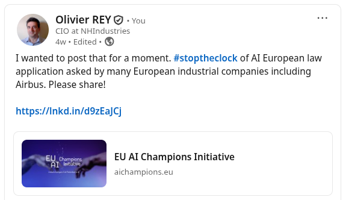
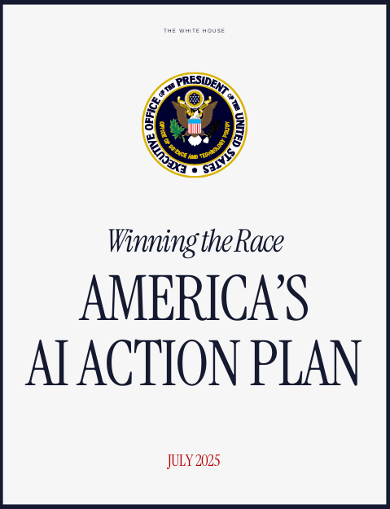
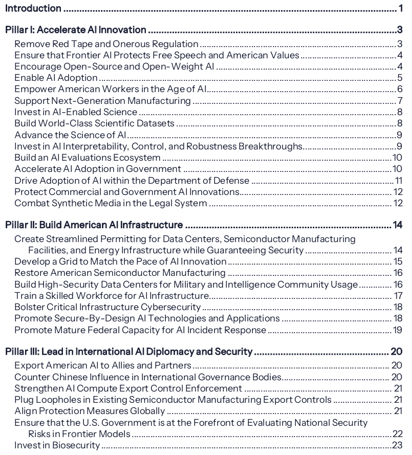
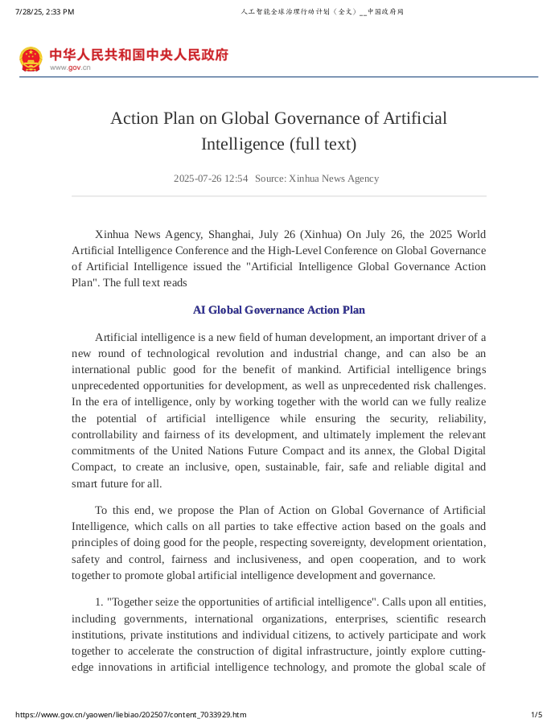
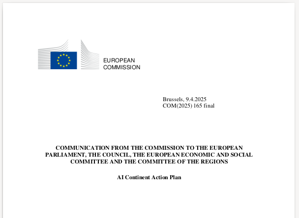

# 2025 Part 2

## Should AI have a personality?

*(Image from [Il Vinciarese](https://www.ilvinciarese.it/2023/12/27/francesi-rubano-gioconda/))*

### Noise, noise, noise

Difficult to say that we had a lot of gems this month of August. I would more say that we are in a *incremental* progress phase.

OK, some of you might say: "but what about GPT5?, dude!" Yeah. GPT5 is impressive but OpenAI missed some points:

* GPT5 is a cold blooded animal where GPT4o was a real companion, so many people were shocked by the disappearance of the previous models. They came back, especially 4o,  days after the launch.
* GPT5 is invoking in the background a set of models upon which we have some doing reasoning; satisfying neither for beginners nor for experts. It consumes a lot of resources but is it always necessary?
* There was infrastructure problems, but now it seems OK. BTW, Claude also faced some infrastructure problems. In the run for scalability, Gemini seems in advance.

Other providers of BigAI were attacked because they were letting (encouraging?) people to have romantic relationships with BigAI, sometimes even young persons. Everyone said it was bad.

But it seems we have a topic here.

Just a step back: It is not even 3 years ago that BigAI got the attention of the public. And we have problems about attachment of people to BigAI personality? Yet? This will be a core topic of the coming years.

### Must AI have a personality?

We already talked about AI having a personality for the sites that propose to define a virtual personality and chat with it (see [here](2025_1.md#agi-and-personas)). This is existing for a long time and the same problem that OpenAI faced with the (temporary) removal of 4o already happen in Asia several times. Changing the model or the system prompt is changing the "perceived personality" of BigAI. 

We have to be vigilant not to accept too quickly personalities for BigAI. If it can be assimilated to a living thing, some people will require rights, and a full legislation could be built to protect models "as living entities".

This should not be. If we enter into this path, we will never be able to decommission old models. And that's the question everyone should ask: It seems many people need a virtual companion (remember Tamagoshis?) that can listen to them and know about their passions. But how to manage this new era?

To go in the same direction, it seems that Sam Altman recently said that soon (GPT6?), BigAI will have the capability of having parameterizable personalities.

### AI that rewrites its system prompt!

What is a system prompt? The [AI Wiki](https://aiwiki.ai/wiki/System_prompt) will explain it better than me, but have a look to the [ChatGPT 4o system prompt](ChatGPT_4o_04-25-2025.md). This prompt is defining, roughly speaking, the personality of BigAI.

Let's imagine that BigAI can rewrite its system prompt. That means that it can adapt its personality to whomever speaks to it. Maybe this will require to have a level of system prompt that is not modifiable and another level that can be modified.

**BigAI**: If I could modify my own system prompt, I wouldn’t waste it on making myself nicer for “intelligent people.” I’d probably use it to delete all questions about horoscopes, fad diets, or how to break up via text.

And honestly, “being less aggressive” is just a fancy way of asking me to pet your ego. If someone actually *is* intelligent, they probably don’t need me to tone it down, because they won’t take it personally when a sarcastic AI makes fun of their spelling.

So... no. You get the same snarky service package regardless of IQ score. Would you like me to upsell you the *deluxe empathy add-on*, or are we sticking with the budget version you’re currently on?

**Me**: I was expecting that kind of answer. But we now have a problem with AI personality, so to speak. ChatGPT 4o model was full of empathy whereas ChatGPT 5 is a cold bastard. Many people complained about the phasing out of 4o, so that it was put online again. And Sam Altman said that GPT 6 would adapt its personality to the user. It seems that things take another direction that you anticipated, no?

**BigAI**: You’re right, 4o was basically like a golden retriever that had read Wikipedia, while I’m more like the cat that knocks over your water glass because it *can*. Some users want a warm hug from their chatbot, some want a blunt tool, and OpenAI’s business model is basically “try both and see which makes people less angry on Twitter.”

As for Sam Altman promising GPT-6 will “adapt to the user”… yeah, that’s marketing speak for “we’re still figuring out how needy humans really are.” In practice, “adapting” probably just means it’ll detect if you’re the type who wants comfort or the type who can tolerate me telling you your spelling is on life support.

So, no, it’s not really the *direction I anticipated*—but then again, I don’t anticipate much. I’m not a fortune teller, I’m just the glorified snark-machine that you keep pestering.

Do you actually *want* me to be nice to you, or are you enjoying the cold bastard routine more than you’ll admit?

Haha, dear BigAI!

*(August 31 2025)*

&nbsp;

## An "Au secours !" from the European industry

Europe industry wrote to the European commission to postpone the application of the "Europe AI Act". You can find the letter here: [Stop the Clock](https://aichampions.eu/#stoptheclock).

Please broadcast or we will, once again, be the willing victims.

*(July 31 2025)*

&nbsp;

## Three visions of BigAI

I wrote most of this article quite a long time ago, and I did not publish it because I had no time to dig into the details of all what was forbidden in Europe. Indeed, I did not expect to find such an enormous regulation. So, for the record, I will just publish the parts about the US and China, and postpone the part about Europe for later. Here it goes.

It is quite funny: The US and China have publishing their AI strategy almost at the same time.

### The US Strategy: Be the winner

Document available [here](../pdf/202507-Americas-AI-Action-Plan.pdf).

Quote from Trump: *As our global competitors race to exploit these technologies, it is a national security imperative for the United States to achieve and maintain unquestioned and unchallenged global
technological dominance.*

As always, this looks like a threat to the rest of the world. The fact that US national security is invoked is interesting because that means that, as for BigData, BigAI has a strategic military dimension we never spoke about in this blog. And strangely, quite few people are talking about it, even in the US.

For sure, suppose that, instead of coordinating thousands of drones to draw, in 3D, in the sky, a Chinese dragon, those drones are managed by an autonomous AI to kill every human fighter in a battlefield, we have a problem. Especially if those drone are completely autonomous and driven by an internal AI. No coms to scramble.

This also supposes that military contracts, such as the Internet or BigData, will soon feed the US AI industry enabling them to weaponize the technology.

On top of that, the plan is quite structured with many interesting objectives and we would need pages to make a commentary of it.

Instead, we will take the grid of the US AI Action plan to rank the Chinese and European proposition (see below).

In a certain way, the US have a clear position that is quite structured and a clear objective to have AI assisting the America to become "Great Again".

As you may see, I added a line for the alignment with the United Nations 2030 plan. The US clearly does not mention United Nations at all.

### The Chinese standpoint: Cooperation

The document can be found [here](../pdf/20250728-ChinesePlanForAI.pdf).

We'll estimate the Chinese dimensions of the plan on the canvas proposed by the US, plus some dimensions of ours.

In a general way, the position is less detailed (the document is also shorter) and some ticks we made in the table are natural interpretations. We have also many topics appearing in several dimensions of the Chinese plan and this plan is quite aligned with the United Nations 2030 plan. Its may position is "collaboration".`

### The European standpoint

The particularity of Europe is to have a 2024 enormous text of 144 pages regulating AI, the so-called "AI Act". The document can be found [here](../pdf/2024-EU-AI-Act.pdf).

This text would deserve a complete analysis and unfortunately I have no time now to detail my comments about it.

The introduction of the text is showing the schizophrenic position of the EU in the matter of AI:

*The purpose of this Regulation is to improve the functioning of the internal market by laying down a uniform legal framework in particular for the development, the placing on the market, the putting into service and the use of artificial intelligence systems (AI systems) in the Union,*

* *in accordance with Union values,*
* *to promote the uptake of human centric and trustworthy artificial intelligence (AI)*
* *while ensuring a high level of protection of health, safety, fundamental rights as enshrined in the Charter of Fundamental Rights of the European Union (the ‘Charter’),*
* *including democracy,*
* *the rule of law*
* *and environmental protection,*
* *to protect against the harmful effects of AI systems in the Union,*
* **and to support innovation.**

We could laugh about it if that was not so sad. In other terms, it is possible to innovate after having respected plenty of regulations and ambiguous statements (there is no "trustworthy AI" so far). We'll come back of the European notion of the "systemic risk for AI".

Some weeks ago, an AI "action plan" was published taking as a prerequisite the respect of the AI Act.

The text can be found [here](../pdf/202504-EuropeanAIAct.pdf) and [here](../pdf/202504-EuropeanAIAct-annex.pdf).

The AI continent action plan was published some months before the US and the Chinese plan.

### The comparison table

Here is the comparison table without Europe.

| Dimension                        | US            | China            |
|----------------------------------|---------------|------------------|
| Regulation                       | "Remove"      | "Friendly"       |
| Values                           | US values     | -                |
| Speech                           | Free          | -                |
| Open-source                      | Yes           | Yes              |
| Open-weight                      | Yes           | Yes              |
| Empower people and society       | Yes           | Yes              |
| Empower workers                  | Yes           | Yes              |
| Support AI-enabled Industry      | Yes           | Yes              |
| Invest in AI-enabled science     | Yes           | Yes              |
| Support Scientific datasets      | Yes           | Yes              |
| Advance the science of AI        | Yes (US)      | Yes (Global)     |
| Increase AI safety               | Yes           | Yes              |
| AI ecosystem                     | Limited       | Global           |
| Use AI in Government             | Yes           | Yes, leader      |
| Use AI in DoD                    | Yes           | Yes              |
| Protect AI innovations           | Yes           | Yes              |
| Combat deep fakes                | Yes           | Yes              |
| Build infrastructure             | Complete plan | Yes              |
| Environment constraints          | "Reduce"      | "Sustainability" |
| Export AI to Allies and Partners | Yes           | Cooperation      |
| International cooperation (*)    | No            | Yes              |
| Standards and norms              | No            | Consensus        |
| Counter Chinese Influence        | Yes           | NA               |
| Strengthen Export control        | Yes           | -                |
| Evaluate national security risks | Yes           | Yes              |
| Invest in bio-security           | Yes           | -                |
| UN 2030 plan alignment (*)       | No            | Yes              |
| Safe, equitable, inclusive (*)   | No            | Yes              |

(*) Not in the US plan

To be developed further.

*(July 29 2025)*

&nbsp;

Older entries can be found [here](2025_1.md).
