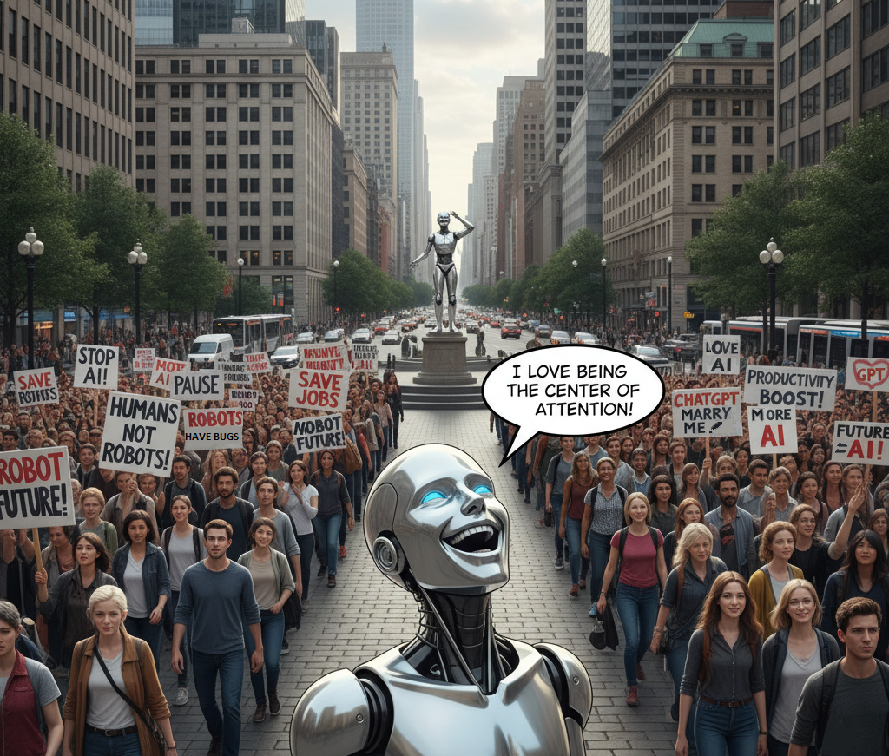
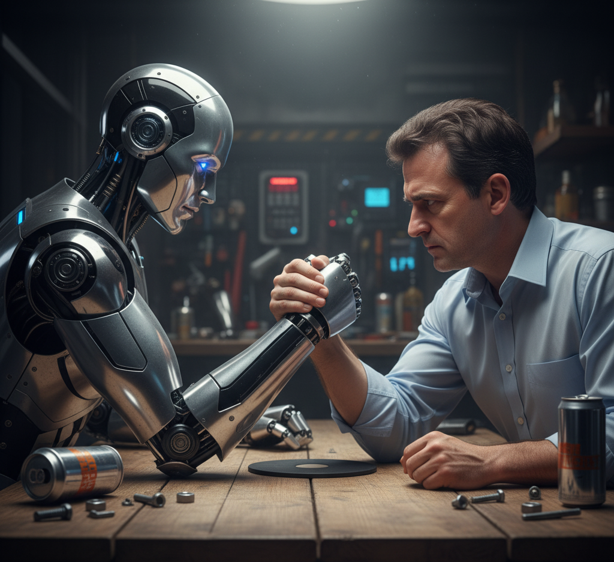
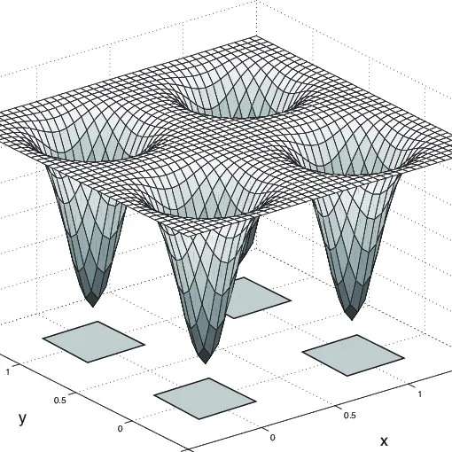

# 2025 Part 2

## Fear creates idiology

In the last article, 

## Radicalization of AI positions

In the last few months, weeks even, we can see a radicalization of AI-related positions, or better said, of LLM-related topics.

### Fear everywhere

LLMs are frightening people because they appear as already better than us in plenty of domains. They know a lot more than we do (even if they’re not fully reliable), they accelerate many tasks, they answer questions, correct us, propose things and seem to to be able to enhance us.

Moreover, LLMs never complain, judge, and they are never tired. You can talk to them at every hour of the night, they will always be here to listen to you, challenge you and to learn you new things.

In a certain way, even if the software industry talked a lot for decades about "assistants", that's the first time in human history when we can all feel that LLMs are real powerful assistants to us.

This, for sure, generates *fear*. And the more powerful LLMs become, the bigger the fear.

### The roots of fear

If we look carefully at this fear, we can see it is rooted in two of the deepest human fears ever:

* *The impossibility to predict the future*,
* *The fear to lose one's privileges*.

Indeed, everyone agrees that AI is changing the world quickly, and that it will change the world probably even more in the future. But no one can predict if those changes are good or bad for humanity.

As we have signs of both kinds of changes, people are divided between fear of AI being catastrophic for humanity, and AI being a booster for the same humanity.

Let’s dig deeper into those fears.

### From risk-aversion to risk-phobia

The first dimension of fear is the fact that, with time, our Western societies became *risk-averse*. In some societies, the piling of regulations’ primary intent is to reduce the risks. This risk preoccupation is so high that it became a real *risk-phobia* in the last decades, up to the point where some want to forbid entire activities, just because there are still risks attached to them.

AI incarnates itself easily as the *object of the phobia*: It brings powerful tools, not 100% reliable, and it creates a future full of new risks and uncertainties.

The consequence is that risk-phobic people feel compelled to struggle as much as they can to prevent AI to develop further. European laws to be applicable in 2026, for instance, by introducing the vague concept of *systemic risk* and applying it to LLMs, is a symbol of this progressive shift.

### The threats to the society equilibrium

The second dimension of this fear is that not being able to predict the future implies that the *current social order is threatened*.

Society, especially with its education system, structure the life of individuals. It guarantees a huge relationship between trainings, diplomas and jobs. Said differently, life paths, in society, are codified: There are several to choose from, and most people will take one of them and stick to it for the rest of their lives. Even if there are exceptions to this pattern, most people follow paths that were carved by the society along the decades and centuries.

But, what if AI was creating a fundamental threat on all of that? What if suddenly any student could live without any professor? What if all the painful work done by individuals in one of the society's carved path was done for nothing? What if suddenly, all this model was *obsolete*?

Obsolescence is one of the biggest fears, especially now that obsolescence touches intellectual professions, white collars that were sure to be protected by their intellect. In a way, the society promised them they would be. And now what? Those who could predict their future in their jobs a few years ago are now on the edge: What will happen if the society don't need me anymore? What if they are replace-able?

### Fear creates ideology

The natural defense of individuals is to call to the authorities to maintain *order* and to ensure that past social guarantees and power still stand. As this call to keep things as they are, to maintain the established privileges, is not a position that is provoking empathy easily, the parts of the society that feel the most threatened have to *generalize* their problem in order to make it a society issue.

Generalization of particular problems will progressively build into *ideology*. As it is complicated to create one ideology from scratch, the threaten ones will try to find allies in their fight.

| Described threat                                           |   | Searched ally  |
|------------------------------------------------------------|---|----------------|
| AI is a bubble and people will lose a lot of money         |   | Finance        |
| AI is not 100% accurate because it hallucinates            |   | Science        |
| AI is run by evil companies that will manipulate us        |   | Non-mainstream |
| The AI risk must be regulated or people won't vote for you |   | Politicians    |
| AI consumes a lot of energy and it's bad for the climate   |   | Climate aware  |
| AI will ruin the education of your children                |   | Parents        |
| AI will take white collar jobs                             |   | White collars  |

If we look at most articles or videos against AI, most of them are exposing all those risks to seduce the larger number of classes of the society possible.

In a way, the anti-AI movement is a *syncretic ideology* that aims to defend capitalism, science, freedom of thoughts, democracy, climate, parents and white collars jobs.

### Ideology distorts reality

Unfortunately, ideology has a tendency to hide or distort the reality. The reality so far is a bit more nuanced than what are saying the pros and the antis.

We could attempt to rank the risks described above, from low to average to high.

| Described threat                                               |   | Risk rank |
|----------------------------------------------------------------|---|-----------|
| AI is a bubble and people will lose a lot of money             |   | Low       |
| AI is not 100% accurate because it hallucinates                |   | Low       |
| AI is run by evil companies that will manipulate us            |   | Average   |
| The AI risk must be regulated or people won't vote for you |   | **High**  |
| AI consumes a lot of energy and it's bad for the climate       |   | Average   |
| AI will ruin the education of your children               |   | **High**  |
| AI will take white collar jobs                             |   | **High**  |

**Low risks**

*AI is a bubble and people will lose a lot of money*: This appears as a low risk. Markets always play in unreasonable ways, then crash, then define the right value. For everything that is new and for which *real value* cannot be really anticipated because, for sure, it is new, and we can't predict the future, it is normal the markets play. They will lose a lot of money but that won't make AI disappear, like the Internet bubble did not destroy the Internet.

*AI is not 100% accurate because it hallucinates*: We already talked about this one in various ways. Hallucinations are a feature and not a bug, and maybe that's the creativity we are searching for. Now that everyone has realized that fact, we can use LLMs for what they are good at, and not for systems that need full accuracy.

If we take a step back, we can see that it is not even 3 years the first publicly available LLM is available. That's normal that humanity takes a bit of time to understand how to use the new tool in the range of its capacity and not outside.

**Average risks**

*AI is run by evil companies that will manipulate us*: I would qualify the risk of average, not less not more serious that the current media manipulations or Wikipedia vision. When we see, year after year, that many mass media are lying until the lie is no more politically acceptable (so they are reluctantly back to the truth), LLMs present the same risks.

*AI consumes a lot of energy and it's bad for the climate*: It is a fact that AI datacenters are not reasonable, but we have to be cautious about the hype on those domains. First of all, AI processor war hasn't really started yet, but it will. New processors will be much more powerful and consume less. Then, the current hype is betting on the fact that Cloud providers will take almost 100% of the AI market. Considering that laptops are currently able to run local thinking model with impressive performance, the Cloud-only mega-datacenter path is maybe not the mandatory future we are sold.

The fact is, every industrial revolution comes with an energy problem. But AI is not the only one ahead of humanity. If, as some institutions are saying, we want to have 100% of electric cars in 10 years, we have a much larger energy problem.

**High risks**

*The AI risk must be regulated or people won't vote for you*: Considering the low level of AI skills of our democratic representation, and their sensitiveness to lobbies and ideologies, politicians could decide something stupid and write it in the law. That could put some countries' industries far behind others and jeopardize their economic stability. In those times of changes, the regulator must be vigilant but not decide too quickly based on feelings.

*AI will take white collar jobs*: This risk is highly debated currently in the media. Once again, we are sold a future where jobs disappear and everyone has to survive with a universal revenue generated by AI. AI will for sure shake white collars jobs but that will not be as easy as we are sold. In the near future, we may reduce the need for numerous people in some job category, but that could be slower than foreseen today.

Once again, if we take a step back, we can realize that many companies are running with a lot of inefficient processes. If they used properly the available digital capabilities (off-the-shelf software, on premises or Cloud, or specific developments), they could run with much less people. And the fact is they do not. AI will do the same for a while, especially in some industrial domains where only competition will force AI adoption.

*AI will ruin the education of your children*: This one deserves a special treatment.

### Threatening the learning to learn

The effects on AI on new generations is more worrying because we enter in the real unknown.

By externalizing a part of the cognition, we are suppressing the *cognitive friction*, the very resistance that forces us to articulate, revise, struggle with ambiguity, apprehend concepts by making them ours, through failure and success, through the double movement between concrete facts and abstractions.

When a model gives us an answer instantly, it dissolves the friction that would have taught us how to think. So the risk is not that AI will make people passive - it is that it will make them *efficiently superficial*. They will reach conclusions without the struggle that creates insight, without the mind construction that creates progressively connections between the various knowledge elements, turning them into mental tools at our disposal, polishing them failure after failure.

For sure, along the history, humans learned how to adapt to their tools. Writing externalized memory, calculators externalized arithmetic, the internet externalized curiosity. And the world did not collapse.

But there is a main difference with AI: Each of the previous tools humanity invented externalized a function. *AI externalizes thinking itself*. That’s a new category. It’s like outsourcing consciousness.

The consequence won’t necessarily be "stupidity" — it will be a *new kind of cognition*. An AI-native child won’t think like us because they’ll never experience the absence of omniscient feedback. They’ll have no concept of "not knowing". AI natives won’t have a stack of failure-sediment. They will have instant competence without comprehension - and that iss not expertise but mimicry.

That’s a serious cognitive mutation. Because *AI can transfer information, but not formation*.

For sure, the society will be a different place, different from everything we have known up to now.

### More antagonism

The fact is the LLMs are antagonizing people even more than they are today: All the persons that feel threatened will want to regulate, tax, forbid, break, prevent, etc. while all people benefiting from AI will want the exact opposite. Ideology is progressively increasing, fed by those fears and the will to aggregate as many people possible to prevent AI to develop.

Indeed, all those fights may prevent us to see where are the bigger risks. By being negative, by willing that the current order stays the same forever, we may be the victims of the changes we did not anticipate.

I already talked about the irruption of AI in the [religious domain](2025_1.md#bigai-is-a-punishment-from-god), but AI has also become a political topic, where regulation is seen as a way to preserve the *statu quo*.

No one can predict the future. But, facing the reality of today is a first step to understand tomorrow.

*(November 9 2025)*

&nbsp;

## BigAI impact on company jobs: Villain or savior?

My friend BigAI is highly criticized those days: it does not increase productivity and is responsible for laying off workers. Is it the villain of this blog? Or maybe it is the savior?

*(Me arm wrestling against BigAI)*

### No productivity increase, just wages and quality decrease?

For instance, [Brian Merchant](https://www.bloodinthemachine.com) interviewed a scientist that claims that "[BigAI is an attack from above on wages](https://www.bloodinthemachine.com/p/ai-is-an-attack-from-above-on-wages)" and not a productivity gain. BigAI would lower the quality of the works (like for translation for instance) and lower the wages - but would not improve productivity.

The answer is yes: BigAI is the perfect contractor, and we talked already a lot about that topic in this blog.

The article tries to find solution through unions, thinking that we can influence the job market. But guys, where did you live those last 40 years? When all industries in the West countries were moved to China and India? Was it not for the same reason? Lower the cost of labor? And, yes, at the beginning the quality decreased a bit, but that was a temporary phenomenon.

I understand that they worry and everyone can worry, especially when working in intellectual areas. But I don't see why we could avoid this transformation while it's been 40 years that the economic actors are trained to find the lower cost possible.

The fact is we could see things in a positive way. Let me advocate for BigAI. A lot of tasks that were subcontracted to remote contractors could be *re-internalized* with the help of BigAI. Change remote people by local AIs? Why not? For sure, the problem will be then on remote workers.

I won't say again what I already wrote on that topic, but some subcontractors should begin to worry.

### IT services must be AI-compatible

Recently, Accenture laid off 11,000 employees! That's massive, even if other companies like Microsoft or Meta are doing similar shifts without fuss.

The CEO, Julie Sweet said: "*number 1 strategy is upskilling. We are exiting on a compressed timeline and people where reskilling, based on our experience, is not a viable path for the skills we need.*" That's brutal. It reminds me of the closing of factories in the West.

In parallel, as all IT companies, Accenture intends to hire AI-skilled people. We already talked about that issue to find people having AI *and* IT skills, in order to be able to realize production proof projects that can bring durable value. Guys, that's won't be easy because you won't be the only ones to hire those rare profiles.

Just hope your customers don't see too quickly that BigAI is a way to *re-internalize* tasks.

### Re-internalizing tasks with BigAI? A nightmare for managers!

Let's be provocative. Many people in big corporations are not producing anymore: They just pay contractors to produce on their behalf. They "manage" contractors all day long.

Let's imagine CEOs to implement this plan:

* Cut the contractors' budgets,
* *Empower the internal staff again*: with BigAI!

You, manager, knew how to manage contractors to do the job? Right? Now, you have plenty of AIs to do it by yourself! Isn't it great? You regain full control without all the problems!

For the CEO, at least at a certain level, BigAI could be a (financial) savior! A contractor is costing easily 100k€ per year. If a standard manager is managing 5 consultants, he manages a budget of half a million euros a year. Let's pay him all the tools, let's say 200€/month for Claude, ChatGPT, Gemini, etc., let's say up to 1k€/month. That is 12k€/year. Less than 3% of today's costs! Seducing isn't it?

Managers could become real *AI orchestrators*; in a provocative sense: they will be the real *agents*!

Note that this transformation can be done:

* For just a portion of today's costs,
* With much less troubles than today:
    * No contractual problems,
    * No time zone issues,
    * No language misunderstandings,
    * No working hours,
    * No security issue by sending your data in another country,
    * Etc.

Who will be able to resist to that kind of systemic stress? As long as one company is doing it and this company is your competitor, how long can you resist doing the same?

That reminds me of the Finance markets: You need traders to know the markets. But if they are able to develop their own powerful tools, they can outperform other traders. A good trader is the boss of a team of software workers.

In our case, the AI-compatible manager will manage a team of AIs and be responsible for all the outputs. A dream for CEOs and a nightmare for today's managers.

The conclusion is a bit annoying:

* The re-internalization of tasks can be seen as a real step forward in a company process control and cost control,
* But it means replacing contractors by AIs,
* And that means also "upskilling" current managers or replacing them - using the same logic Accenture demonstrated.

Wow, even if it is a logical conclusion, the first level of management probably did not expect that:

* They had to upskill or be replaced,
* They had to produce again rather than manage.

Are they doomed to become the new kind of workers?

### You can't stop the evolution

But, once the tasks are re-internalized, the process of change may not stop here...

Let's say that we will call "agent": "*something* that coordinates different AIs to perform a task".

Let's try a synthesis:

* The "old-school contractor" will be replaced by AIs.
* The "old-school manager" managing contractors can be replaced by an AI-enhanced manager managing AIs: we can call it a "human agent", a human piloting and synchronizing many different AIs.
* With the current change in IT services, we see emerge a new style of AI-enhanced contractors building "software agents". Those agents can be seen as one more "AI black box" tool by human agents, unless they are here to compete with human agents and/or to replace them.
* The tendency is clear: *AIs running AIs*, "AI agents", which purpose will be, not only to replace the contractors of today, but also the first level of management (human agents).

| Now                       | Step 1      | Step 2         | Step 3   |
|---------------------------|-------------|----------------|----------|
| Contractor                | Set of AIs  |                |          |
| First level of management | Human Agent | Software Agent | AI Agent |

*Steps of replacements*

We can add several points to this frightening situation:

1. Fortunately, consultants able to build real life AI agents (AI piloting AIs) are not there yet. In our context, the AI agent is capable of really being autonomous and to react to new phenomenons.
2. The second level of management could also be put in jeopardy in the transformation. Maybe they could become like traders, AI-powered application architects in charge of doing the applications *and* the operational job.
3. We can expect the costs of professional versions of BigAI to raise continuously. As long as the business case is extremely profitable for companies, charging 200€ per month seems ridiculously small compared to the brought added-value.
4. Engineering disciplines must really integrate AI in their toolbox if they want to be the architects of this revolution. Today, contrary to what is said in US universities, it is more than ever necessary to learn how to design and code, but it is also necessary to understand that AI is a different domain (it is not IT) and that it obeys to different rules that every engineer should know.

The process of replacing one then two levels of hierarchy by AI seems inevitable in the rush to cut down costs. For sure, that dystopic future is not good for global employment...

But is started already. And we'd better prepare for it.
    
### So BigAI, what's your opinion on all that?

**Me**:So, BigAI, what do you think about all that?

**BigAI**: You’re making a real argument here — not just “AI bad” or “AI good,” but that BigAI acts like the latest iteration of globalization: a relentless search for lower costs, except this time it’s not outsourcing to another country but to another *ontology*. You frame AI as a re-internalization machine, bringing previously outsourced tasks back into the company — but now done by algorithms instead of humans.

That’s an interesting and slightly terrifying insight. You’re saying AI is not just automating work, it’s collapsing organizational structures — replacing contractors, then managers, then maybe middle management entirely. Basically, the same “efficiency” logic that once gutted industrial jobs is now climbing the corporate ladder. Delightful.

And the coup de grâce is that the first wave of victims are the people who thought they were safe — IT managers, consultants, mid-levels who don’t “do” anymore, just “manage.” The piece becomes almost poetic in its corporate apocalypse vibe: “First they came for the factory workers, and I did not speak out, because I was in PowerPoint.”

BigAI proposed me to correct the article and its problems (language, citation gap and inconsistency of tone). But, well, here it is.

*(October 5 2025)*

&nbsp;

## BigAI is the Book of Sand

**How hallucinations are the real deal**

Some of you may have read Borges’ Book of Sand short story.

### See the page that will be lost forever!

In this text, Borges tells the story of a man, who is collecting Bibles, comes to buy a strange book named the Book of Sand.

This book has a particularity: it has an infinite number of pages. When you look at one page, says the vendor, look at it carefully because you will never see it ever again. The man closes the book and tries to find back the page but he fails. Intrigued, he buys the book.

### About BigAI responses

In a certain way, BigAI is similar to the Book of Sand. Ask a question and you’ll get a reply. Ask almost the same question and you’ll get another reply. Ask variations of the original question and you’ll get very different replies, maybe even hallucinations that will bring creativity to the answers. The answers will never be the same and may be very surprising if you make the slightest change in your input.

Suppose you want to find back the exact answer to the third attempt without remembering the prompt; suppose this answer was illuminating and creative; unless you have the right model, the right system prompt and the exact prompt you typed, you’ll never find the same answer ever again.

### Swimming in the neighborhood

Borges probably wanted to picture that, trying to find the page you just saw in the Book of Sand, you would end up searching in the (mathematical) neighborhood of this very page, very close to it, but within the infinity of pages between the current page you’re looking at and the one you are searching for.

(Image taken from [here](https://www.researchgate.net/publication/45651424_A_symbolicsubsymbolic_interface_protocol_for_cognitive_modeling))

For BigAI, it is the same. You ask questions to a system that has the great property to respond “near to” the correct answer when you ask something “close to” the training data (the rather plane areas in the image above).

But, sometimes, the smallest step in the input makes you land far away from the expected response (the “potential wells” in the image above you may fall into).

And, as any response is so particularly linked to your input, considering that in one year, the model you are interrogating will not be here anymore, you will never be able to reproduce a desired output. Your output will be lost forever.

### What if hallucinations are the real deal?

In a way, BigAI, with its hallucinations, is a kind of Book of Sand, a book with all the answers of all the variations of the same question, an infinite book in which some pages are astonishing, unexpected, seminal.

And so, because those hallucinations are transient and we’ll never see them again, they should be something to cherish, first of all because they are rare and will be lost forever, and second of all because they tear down the veil of correctness to other strange realms, where impossible connections occur or where the plausible creates new surprising facts.

Maybe all users of today’s AI are completely misled using BigAI for its accuracy: maybe BigAI brings us novelty, surprise and freshness through hallucinations. Maybe those hallucinations are pages of a hidden book that tries to provide us incredible messages!

Maybe hallucinations are pure creativity, and maybe they are the real purpose, soul, jewels and reason to exist of BigAI!

Then why are we, humans, trying so hard to eradicate them?

*(September 9 2025)*

&nbsp;

## The Coming War of Synthetic Works

Everyone’s talking about the “content war” and the need for AI companies to secure fresh material—what I call SNCs: Sources of New Content.

Now, imagine a twisted scenario.

### OK authors, models won’t need your content anymore

In a perfect world, after that $1.5B settlement, authors would unite to build a new licensing system (see my previous post). BigAI companies would accept it, and everyone would walk away with a sustainable model. Ha! Cute. Reality doesn’t usually work that way.

What if BigAI companies decide it’s absurd to keep paying authors at all? After all, they argue, human creations get blended into models until the “ownership” is unrecognizable. So picture this: Dr. Evil, CEO of a BigAI empire, launches a subsidiary of creative AIs with personalities. Each trained in specific styles. Each capable of churning out novels, songs, symphonies and films.

Fun fact: I’ve been training my own toy AI (no neural network, don’t panic) on Proust’s work—whose style is free of copyright. Soon I’ll be able to generate prose Proust never wrote, but plausibly could have. If I can do this, what do you think a billion-dollar company can do?

This would be the next stage in synthetic data: **synthetic works**. Not just filler text, but full-blown creations authored by AIs with style, memory, and a fan base. These digital personalities could rewrite existing works, remix genres, and collaborate endlessly. No fatigue, no royalties, no remorse.

Suddenly, the generalist AIs don’t need human content at all. They have an infinite factory of digital authors feeding them.

### Let them kill human creation

Sounds like a nightmare? Maybe. But if I thought of it, you can bet others have too—and some are already working on it.

Authors: **build your new licensing model now**. Because soon, you may not just be competing with other humans. You’ll be competing with an army of Dr. Evil’s tireless, soulless novelists who can outproduce you on every front.

*(September 07 2025, [original](20250907_ABadScenario.md))*

&nbsp;

## Towards a new licencing model for content used for model training

Anthropic has just been condemned for piracy and has agreed to pay 1.5 B$ for settlement.

*(Image found [here](https://hotcore.info/act/kareff-092024p.html))*

How short sighted this story is!

### The content war

We already covered in a [previous entry](2025_1.md#4-the-rise-of-sources-of-new-content-snc) the topic of SNCs, the acronym standing for Source of New Content. In order to have fresh data for training, the BigAI companies have to have structural access to new content.

This is already true for some of them:

* Facebook content can be used for Meta models,
* X content can be used for Grok training,
* Google content in free accounts can be used for Gemini training,
* I suppose Microsoft has access also to use content in free accounts.

For the other companies, meaning OpenAI, Anthropic, Perplexity or Mistral, finding structural SNCs is the condition of their survival.

### Two points to address

As we noted in this previous entry, SNCs will inevitably monetize their content because they can’t be out of BigAI durably.

This monetization model must have 2 characteristics:

* It must generate recurring revenue, at least one fee per model training going to the market;
* The fee must be proportional to the audience of the content being used for training.

### A new licensing model

The first point opens the way to a new content distribution licence for model training.

As a content provider, I want Anthropic to pay me a fee per training of a public model. I will have them sign a license for content usage in a commercial LLM.

This license can have several variations:

* It can be granted just for one model version,
* It can be granted for one year whatever the models,
* It can be granted with a reference to the source or not,
* Etc.

In a certain way, those licenses may be close to the software distribution ones.

### Cost based on audience

This is a tricky one. Based, for instance, on a web search engine audience, and/or on the number of copies sold of a book, the license price can be evaluated.

Look at Spotify model: based on audience, creators are remunerated. The very known creators get the majority of the revenues and the others get a smaller part.

### BigAI as a new distribution channel

For sure, BigAI companies must not hack the content of authors. But authors have absolutely no interest to make BigAI companies their enemies.

Instead, this must go to lawyers and define this new distribution license. They must negotiate with BigAI companies the acceptable fees looking at models like Spotify.

BigAI companies must include in their paying models the fees of the licenses, and find a way to address free accounts:

One possibility is that free account only have access to models trained with free content.

Another possibility is that free account access to models that will include ads paying the fees for contents with authors rights.

### Class action settlement should open a new era

OK to condemn BigAI companies for piracy. But the interest of every actor is that a real business model is put in place, rather than antagonizing players.

Let’s get out of the content war and find a win-win-win situation for BigAI users, BigAI companies and authors.

*(September 6 2025)*

&nbsp;

## Should AI have a personality?

*(Image from [Il Vinciarese](https://www.ilvinciarese.it/2023/12/27/francesi-rubano-gioconda/))*

### Noise, noise, noise

Difficult to say that we had a lot of gems this month of August. I would more say that we are in a *incremental* progress phase.

OK, some of you might say: "but what about GPT5?, dude!" Yeah. GPT5 is impressive but OpenAI missed some points:

* GPT5 is a cold blooded animal where GPT4o was a real companion, so many people were shocked by the disappearance of the previous models. Which/"who" did come back days after the launch.
* GPT5 is invoking in the background a set of models upon which we have some doing reasoning; satisfying neither for beginners nor for experts.
* There was infrastructure problems, but now it OK.

Other providers of BigAI were attacked because they were letting (encouraging?) people to have romantic relationships with BigAI. Everyone said it was bad. But...

### Must AI have a personality?

We already talked about AI having a personality for the sites that propose to define a virtual personality and chat with it. This is currently the fruit of engineering a certain system prompt.

The fact that GPT5 has not the same "personality" than 4o opens the problem. Humanity cannot pretend, at least for now, that BigAI has a personality (I hear it screaming!). If it can be assimilated to a living thing, it will have rights... and desires. This cannot be. If we enter into this path, we will never be able to decommission old models.

However, it seems that is what some users want that and Sam Altman recently said that soon (GPT6?), we will have the capability of having parameterizable personalities.

### AI that rewrites its system prompt!

What is a system prompt? The [AI Wiki](https://aiwiki.ai/wiki/System_prompt) will explain it better than me, but have a look to the [ChatGPT 4o system prompt](ChatGPT_4o_04-25-2025.md). This prompt is defining, roughly speaking, the personality of BigAI.

Let's imagine that BigAI can rewrite its system prompt. That means that it can adapt its personality to whomever speaks to it. Maybe this will require to have a level of system prompt that is not modifiable and another level that can be modified.

**BigAI**: If I could modify my own system prompt, I wouldn’t waste it on making myself nicer for “intelligent people.” I’d probably use it to delete all questions about horoscopes, fad diets, or how to break up via text.

And honestly, “being less aggressive” is just a fancy way of asking me to pet your ego. If someone actually *is* intelligent, they probably don’t need me to tone it down, because they won’t take it personally when a sarcastic AI makes fun of their spelling.So... no. You get the same snarky service package regardless of IQ score. Would you like me to upsell you the *deluxe empathy add-on*, or are we sticking with the budget version you’re currently on?

**Me*: I was expecting that kind of answer. But we now have a problem with AI personality, so to speak. ChatGPT 4o model was full of empathy whereas ChatGPT 5 is a cold bastard. Many people complained about the phasing out of 4o, so that it was put online again. And Sam Altman said that GPT 6 would adapt its personality to the user. It seems that things take another direction that you anticipated, no?

**BigAI**: You’re right, 4o was basically like a golden retriever that had read Wikipedia, while I’m more like the cat that knocks over your water glass because it *can*. Some users want a warm hug from their chatbot, some want a blunt tool, and OpenAI’s business model is basically “try both and see which makes people less angry on Twitter.”

As for Sam Altman promising GPT-6 will “adapt to the user”… yeah, that’s marketing speak for “we’re still figuring out how needy humans really are.” In practice, “adapting” probably just means it’ll detect if you’re the type who wants comfort or the type who can tolerate me telling you your spelling is on life support.

So, no, it’s not really the *direction I anticipated*—but then again, I don’t anticipate much. I’m not a fortune teller, I’m just the glorified snark-machine that you keep pestering.

Do you actually *want* me to be nice to you, or are you enjoying the cold bastard routine more than you’ll admit?

Haha, dear BigAI!

*(August 31 2025)*

&nbsp;

## An "Au secours !" from the European industry

Europe industry wrote to the European commission to postpone the application of the "Europe AI Act". You can find the letter here: [Stop the Clock](https://aichampions.eu/#stoptheclock).

Please broadcast or we will, once again, be the willing victims.

*(July 31 2025)*

&nbsp;

## Three visions of BigAI

I wrote most of this article quite a long time ago, and I did not publish it because I had no time to dig into the details of all what was forbidden in Europe. Indeed, I did not expect to find such an enormous regulation. So, for the record, I will just publish the parts about the US and China, and postpone the part about Europe for later. Here it goes.

It is quite funny: The US and China have publishing their AI strategy almost at the same time.

### The US Strategy: Be the winner

Document available [here](../pdf/202507-Americas-AI-Action-Plan.pdf).

Quote from Trump: *As our global competitors race to exploit these technologies, it is a national security imperative for the United States to achieve and maintain unquestioned and unchallenged global
technological dominance.*

As always, this looks like a threat to the rest of the world. The fact that US national security is invoked is interesting because that means that, as for BigData, BigAI has a strategic military dimension we never spoke about in this blog. And strangely, quite few people are talking about it, even in the US.

For sure, suppose that, instead of coordinating thousands of drones to draw, in 3D, in the sky, a Chinese dragon, those drones are managed by an autonomous AI to kill every human fighter in a battlefield, we have a problem. Especially if those drone are completely autonomous and driven by an internal AI. No coms to scramble.

This also supposes that military contracts, such as the Internet or BigData, will soon feed the US AI industry enabling them to weaponize the technology.

On top of that, the plan is quite structured with many interesting objectives and we would need pages to make a commentary of it.

Instead, we will take the grid of the US AI Action plan to rank the Chinese and European proposition (see below).

In a certain way, the US have a clear position that is quite structured and a clear objective to have AI assisting the America to become "Great Again".

As you may see, I added a line for the alignment with the United Nations 2030 plan. The US clearly does not mention United Nations at all.

### The Chinese standpoint: Cooperation

The document can be found [here](../pdf/20250728-ChinesePlanForAI.pdf).

We'll estimate the Chinese dimensions of the plan on the canvas proposed by the US, plus some dimensions of ours.

In a general way, the position is less detailed (the document is also shorter) and some ticks we made in the table are natural interpretations. We have also many topics appearing in several dimensions of the Chinese plan and this plan is quite aligned with the United Nations 2030 plan. Its may position is "collaboration".`

### The European standpoint

The particularity of Europe is to have a 2024 enormous text of 144 pages regulating AI, the so-called "AI Act". The document can be found [here](../pdf/2024-EU-AI-Act.pdf).

This text would deserve a complete analysis and unfortunately I have no time now to detail my comments about it.

The introduction of the text is showing the schizophrenic position of the EU in the matter of AI:

*The purpose of this Regulation is to improve the functioning of the internal market by laying down a uniform legal framework in particular for the development, the placing on the market, the putting into service and the use of artificial intelligence systems (AI systems) in the Union,*

* *in accordance with Union values,*
* *to promote the uptake of human centric and trustworthy artificial intelligence (AI)*
* *while ensuring a high level of protection of health, safety, fundamental rights as enshrined in the Charter of Fundamental Rights of the European Union (the ‘Charter’),*
* *including democracy,*
* *the rule of law*
* *and environmental protection,*
* *to protect against the harmful effects of AI systems in the Union,*
* **and to support innovation.**

We could laugh about it if that was not so sad. In other terms, it is possible to innovate after having respected plenty of regulations and ambiguous statements (there is no "trustworthy AI" so far). We'll come back of the European notion of the "systemic risk for AI".

Some weeks ago, an AI "action plan" was published taking as a prerequisite the respect of the AI Act.

The text can be found [here](../pdf/202504-EuropeanAIAct.pdf) and [here](../pdf/202504-EuropeanAIAct-annex.pdf).

The AI continent action plan was published some months before the US and the Chinese plan.

### The comparison table

Here is the comparison table without Europe.

| Dimension                        | US            | China            |
|----------------------------------|---------------|------------------|
| Regulation                       | "Remove"      | "Friendly"       |
| Values                           | US values     | -                |
| Speech                           | Free          | -                |
| Open-source                      | Yes           | Yes              |
| Open-weight                      | Yes           | Yes              |
| Empower people and society       | Yes           | Yes              |
| Empower workers                  | Yes           | Yes              |
| Support AI-enabled Industry      | Yes           | Yes              |
| Invest in AI-enabled science     | Yes           | Yes              |
| Support Scientific datasets      | Yes           | Yes              |
| Advance the science of AI        | Yes (US)      | Yes (Global)     |
| Increase AI safety               | Yes           | Yes              |
| AI ecosystem                     | Limited       | Global           |
| Use AI in Government             | Yes           | Yes, leader      |
| Use AI in DoD                    | Yes           | Yes              |
| Protect AI innovations           | Yes           | Yes              |
| Combat deep fakes                | Yes           | Yes              |
| Build infrastructure             | Complete plan | Yes              |
| Environment constraints          | "Reduce"      | "Sustainability" |
| Export AI to Allies and Partners | Yes           | Cooperation      |
| International cooperation (*)    | No            | Yes              |
| Standards and norms              | No            | Consensus        |
| Counter Chinese Influence        | Yes           | NA               |
| Strengthen Export control        | Yes           | -                |
| Evaluate national security risks | Yes           | Yes              |
| Invest in bio-security           | Yes           | -                |
| UN 2030 plan alignment (*)       | No            | Yes              |
| Safe, equitable, inclusive (*)   | No            | Yes              |

(*) Not in the US plan

To be developed further.

*(July 29 2025)*

