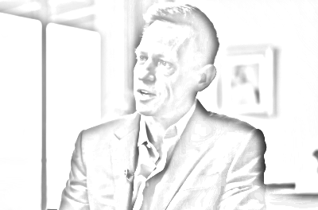
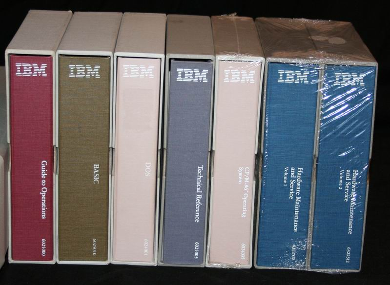
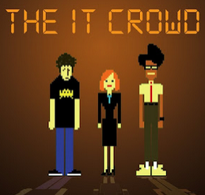

# Fear of science?

## Are they thinkers in Silicon Valley?

I continue investigating in the sayings and writings of Peter Thiel. In a way, his interrogations are a kind of triple sign that France is only the shadow of what it once was:

* It is an American thinker while being an investor, he is thinking about technology,
* It is quoting numerous times a French thinker [René Girard](https://en.wikipedia.org/wiki/Ren%C3%A9_Girard) about mimetic desire,
* He is talking a lot about Europe and about the European and US history.

Sometimes, we can ask ourselves where are the French or German philosophers to be outperformed by a Silicon Valley guy.

The same question could be asked to famous English and American universities. Instead of using censorship against the researchers that would like their research to go outside the "authorized domains", you should enlighten us with your analysis of the innovation trends, instead of wining that Silicon Valley guys are no thinkers.

Hello? Anyone?

## The reasons for innovation deceleration

Thiel is not a real philosopher but one of the few people to interrogate our relationship to technology and the arrival of BigAI is a good pretext to ask those questions again.

In a [recent interview](https://www.youtube.com/watch?v=918qslcfwfY), he indicates that, fo him, one of the reasons of the innovation deceleration is probably *fear of technology*. After the war, people tool some time to realize that the atom was very powerful but also very dangerous. He dates the beginning of the innovation deceleration in 1969 in Woodstock. Instead of continuing the vision of Apollo to go "outside", people just wanted to go back "inside". Then, for him, the fear got installed.

I disagree. I think he neglects fundamental phenomenons.

## We are run by old people

The first one is the age of the Boomers. At some point, Thiel says we abandoned the will to live old. But we are living very old already. And boomers are living very old, and a lot of them are still in responsibility positions. Risk is not an old's person combat. So, I would say society is focusing on less risks as soon as the population is aging. When people become old, they vote for conservative parties that will make laws to prevent anything dangerous to happen.

For sure, you don't have to be old to be old in your head. When old-minded people recruit people, they are often modeled on their recruiter's mind. Old spirit want to keep what exist:

* Because it runs,
* Because they were taught like that,
* Because there is no reason to change,
* Because it feels so comfortable and so predictable!

So, in a sense, Thiel is completely wrong: The Boomers succeeded in living much longer than the previous generations. And they are doing everything since the 70s to slow down every innovation that could be "risky". Hence the need to forbid more and more things in Europe and in the US.

## Making money in a world with less innovation

The second phenomenon is the path to make money. In a society dominated by risk aversion, how can you become rich, in the US at least? You enter into Finance or work as an attorney - but you won't go into science. Going into science to gain what?

The society Boomers left us is a society where you don't have many choices if you want to make money, and this is much worse in Europe than in the US. Who is willing to create startups in France, unless you have state-financed customers and/or a big network? Boomers created the *collusion capitalism* and this makes no place for innovators. So young creative people work in Finance or in Legal but not in science.

Believe me, I find that horrifying. It is a deep sign of the Western societies decline because in Russia or in China, being a doctor or an engineer is important, whereas for young westerners, being a YouTube influencer is great.

## Society does not like science anymore

The third phenomenon is that society turned its back to science. Decades ago, the society was expecting the technology to solve big human problems, but now, it seems that it is not important anymore. The society of individuals being a fight of everyone against each other, it is complicated to realize great science projects.

This reminds me the [BigAI is a punishment from God](005-BigAIIsAPunishmentFromGod.md) that we discussed a bit earlier. When humans are not able to gather for big science projects, that's not a good sign.

When people look only at themselves, this gives bad things. When people look at a certain ideal that is beyond them, they can accomplish big things.

In a certain way, and Thiel says also that, IT was never appealing to society, as a necessary evil. In the 80s or the 90s, the IT people were strange animals that were not skilled enough to do science research. They were reading big English books written by other weirdos, and were talking esoteric languages and acronyms. Then, after the Internet Bubble, IT became a big more trendy because some people became millionaires, but this occurred at the cost of skills. It was so simple to create a website that, probably, being an IT guy was being a unskilled geek or nerd.

We saw that in the last decades, where productivity in the West decreased whereas it has always increase for centuries.

## The revenge of the geeks

In the background, IT is coming back with BigAI. After years of digital cooking and trying recipes of many kinds, BigAI is here and the world will never be the same. In a sense, it is the revenge of technology, the revenge of the geeks. They invented something crazy.

And the ones who think about it are Silicon Valley guys! Aren't you afraid?

