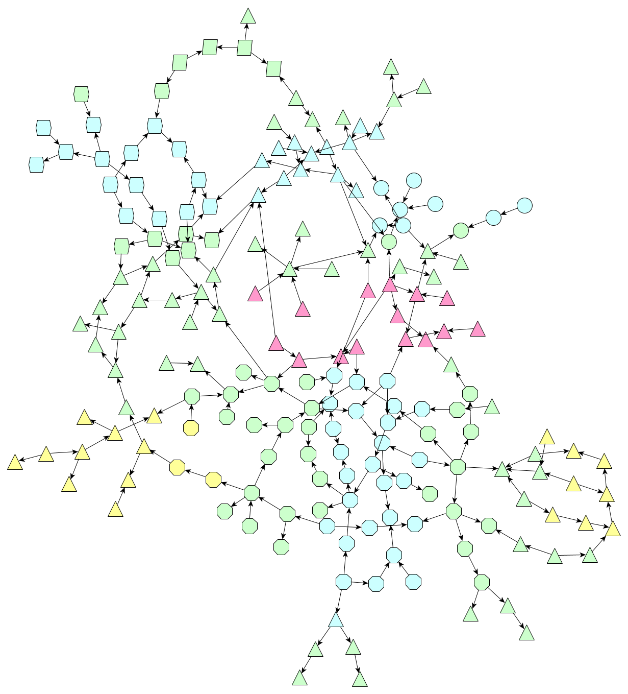
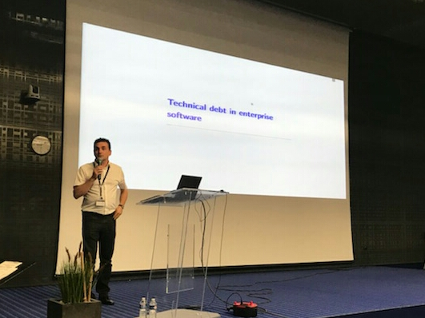

# Conference at the STAF/ICGT 2018 in Toulouse

 

The prototyping works of the GraphApps were stopped in December 2016 for economic reasons, the products (Design and Web Framework) staying closed source.

However, I kept on working on the graph-oriented programming topic, in particular in the perspective of solving the technical debt.

## Marburg University

During Fall 2017, some conference calls were organized with Prof. Dr. [Gabriele Taentzer](https://www.uni-marburg.de/fb12/arbeitsgruppen/swt/gabi-taentzer). Those discussions were about graph-oriented programming but also about [Henshin](https://www.eclipse.org/henshin/).

Beginning of 2018, Prof. Dr. Taentzer proposed that I was keynote speaker at the [STAF/ICGT 2018](https://www.hpi.uni-potsdam.de/giese/events/icgt2018/) in Toulouse, conference organized by Dr. [Leen Lambers](https://hpi.de/giese/personen/dr-leen-lambers.html) and Prof. Dr. [Jens Weber](https://www.uvic.ca/engineering/software/research/our-researchers/weberjens.php). I thank all of them for their invitation and support.

## Introductory papers

For the conference, two introductory papers were produced:

  * [An abstract of the presentation](../pdf/ORey-GraphOrientedProgrammingAbstract-v4-0.pdf) for the [Springer proceedings](https://link.springer.com/book/10.1007/978-3-319-75396-6);
  * [A non published introduction](ORey-IntroductionToGraphOrientedProgramming-v1-0.pdf) to graph-oriented programming.

## Slides of the presentation

The slides of the presentation can be found hereafter: [Introduction to graph-oriented programming](../pdf/20180626-ICGT2018-IntroductionToGraphOrientedProgramming-ORey-v5.pdf)

A copy of those slides can also be found on the conference website [here](https://www.hpi.uni-potsdam.de/giese/events/icgt2018/slides/Rey18.pdf).

## What's next?

My works on graph-oriented programming will go on, but with probably less time that I had in 2016.

*(July 2018)*

