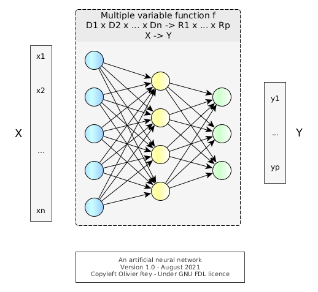
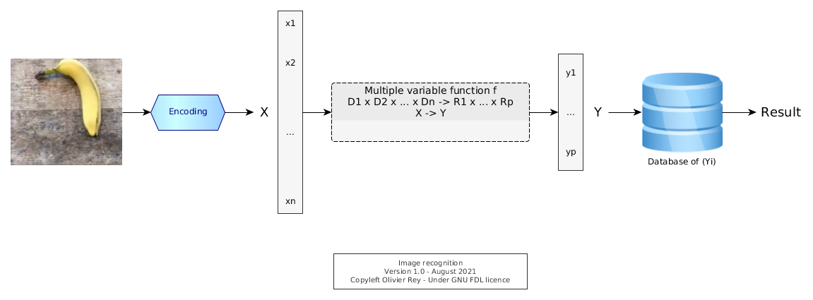
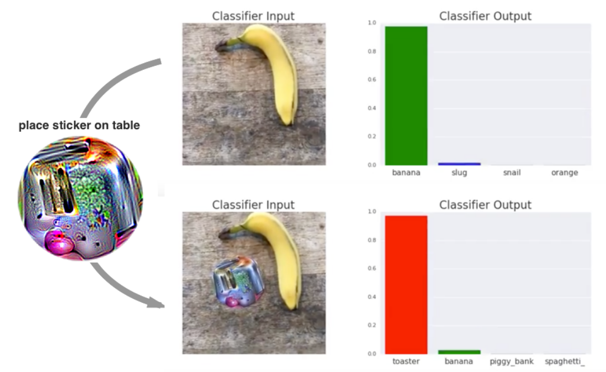
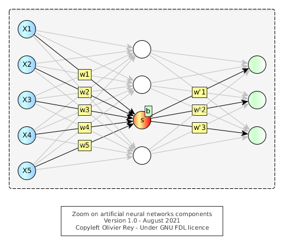
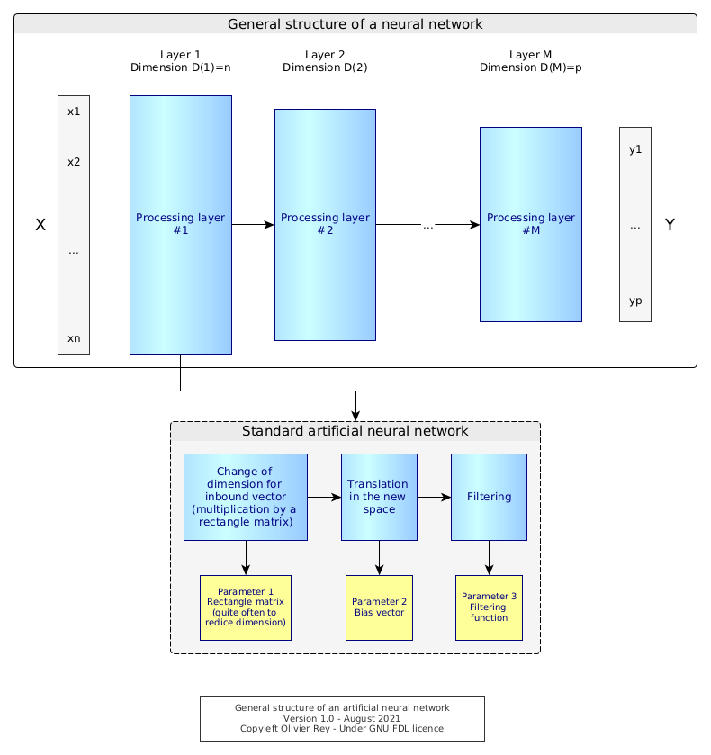
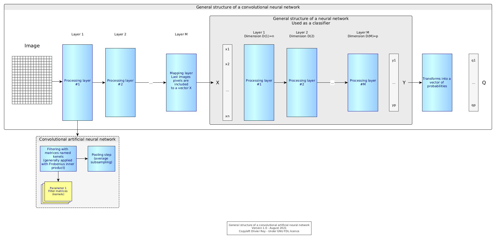

# About artificial neural networks and machine learning

*Photo by [oliver brandt](https://freeimages.com/photographer/ollinger-36628) from [FreeImages](https://freeimages.com)*

Machine learning based on artificial neural networks attracted much attention and credits those last decades (after a long "winter of AI") up to the point where, boosted by marketing, an anti-scientific approach is sold as being the solution to all problems.

In this article, we will try to recall the simple mathematical reality behind artificial neural networks, and why this technology is not reliable, even if it attracts massive investments. We will also analyze the philosophical side of the neural networks.

Notes:

* We will focus on supervised learning artificial neural networks and  will not talk now about other variants such as unsupervised learning.
* We detail the artificial neural network working later in the article [here](#detail).

## What is an artificial neural network?

Basically, an artificial neural network is:

* A mathematical function `f` of several variable;
* A complex function construction algorithm:
    * Using a representation of neurons and axons that was used to create the function `f`,
    * Based on a list of inputs of the form (x1, x2, ..., xn), matching with outputs of the form (y1, y2, ..., yp).

*Figure 1: A simple artificial neural network*

The Figure 1 shows a sample of an artificial neural network.

There are many techniques to build the function `f`, hence the variety of machine learning algorithms.

## An interpolation function

Let us go a bit more into the details. Let us note :

> Xk = (xk1, xk2, ..., xkn)

> And Ym = (ym1, ym2, ..., ymp).

Let us suppose we have a set of known inputs and related known outputs, (Xk, Ym) for (k,m) known.

Considering a predefined neural network with nodes and edges in layers, we can use an algorithm to define characteristics of nodes and edges so that we define a function `f` like following:

> f : D1 x D2 x ... X Dn &rarr; R1 x R2 x ... x Rp

> (x1, x2, ..., xn) &rarr; (y1, y2, ..., yp)

To create this function, the algorithm used tried, more of less, to satisfy the following hypothesis:

> f(Xk) = Ym

This process is called "training the network".

The resulting function `f` is an *interpolation* function, defined by an algorithm. Once defined, `f` is a function of many variables that has the following characteristics:

* It is probable that f(Xk) = Ym or | f(Xk) - Ym | < &epsi; with "|" a norm in the R1 x R2 x ... x Rp space;
* The determined global function is not globally mathematically known, which implies it can have singular points, often called "potential wells".

## An interpolation function working in extrapolation mode

The idea of neural networks is to assume that `f` is a continuous function at least in the neighborhood of the known hyper-points Xi. That means that:

> If we take Xi so that | Xk - Xi | < &epsi;

> Then | f(Xk) - f(Xi) | < &epsi;'

Said differently, any point in the neighborhood of Xk will have its image by `f` in the neighborhood of f(Xk).

When `f` matches this assertion, we can use `f` as an extrapolation function and consider that its evaluation on Xi is valid.

The problem is that we have no ways of *knowing* that `f` is really continuous in a neighborhood of an hyper-point.

Let us consider the Figure 2.

*Figure 2: Two potential wells in a surface. Image from [wired.com](https://www.wired.com/wp-content/uploads/2014/06/63-plaster-logarithmics.gif)*

The Figure 2 is an artist representation of two singularities in a 3D curve:

* One where `z` tends to +&infin;,
* One where `z` tends to -&infin;.

That means, for the first singularity, that we have the following situation:

> For a Xi so that | Xk - Xi | < &epsi;

> | f(Xk) - f(Xi) | >> &epsi;'

The presence of potential wells in neural networks was a well known phenomenon in the 80s, and one of the reasons of the AI winter. Because neural networks were considered as non reliable "by construction", those techniques were temporarily abandoned.

Mathematically speaking, the situation is quite simple: An interpolation function should not be used as an extrapolation function.

## Big data and processing power

The development and explosion of machine learning beginning of the 2000s was funded on new beliefs that overpass the previous arguments and mathematical reality.

The first idea (which is an engineer's idea) is that if we have a huge number of data (i.e. a lot of couples of the form (Xk, Ym)) to feed the algorithm, we will be able to generate many hyper-points in the `f` hyper-surface.

This will imply that the `f` function will be more "dense" in R1 x R2 x ... x Rp and so we will "reduce" the risk of potential well.

This idea is, from an engineering standpoint, of good sense, but mathematically, being able to generate one thousand points or one billion points will not change the mathematical reality of potential wells, especially when we talk about functions of many variables.

Let's take the example of the image classifier. First of all, we have to create a program to "encode" whatever image in the Xk form. Then, in supervised learning, we will associate to an image representation Xk a value Ym representing the result, for instance a number. Let us suppose the number is `12` and it represents the banana.

The `f` function that will be generated by the algorithm will be the result of "training" of many images associated with the result we expect. Then, when a new image will come, we will transform if into a Xi, *hoping* that f(Xi) will be meaningful.

*Figure 3: The chain of image recognition*

The fact is, it is a hope. What is funny is that *it works* in many cases. And when it doesn't, some various techniques are existing to try to make it work anyway.

We can note that, in that process, the encoding function may be quite important. In a certain way, it can hide a structural analysis of the problem, as it is representing the reality.

## But the banana disappears...

**Figure 4: The banana disappears. Taken from [Brown et al. 2017](https://arxiv.org/pdf/1712.09665.pdf)*

Without any surprise, Brown et al. demonstrated in their [article](https://arxiv.org/pdf/1712.09665.pdf) *Adversarial patch* (see Figure 4) that it was possible to mislead a neural network training to recognize some images. It may be even worse, because they claim it is possible to structurally mislead all neural networks that were used as image classifiers.

For us, despite the interest of the article, we are only rediscovering the structural mathematical problem of this technique.

See also our [note on encoder](#note1).

## New beliefs brought by the machine learning era

The machine learning trend brought new beliefs among IT people, some of them being totally the opposite of the usual computer science paradigm. We will list some of them.

## Belief 1: Big data and brute force can solve mathematical problems

This a way to reformulate the big data belief: If we inject billions of images to create an image classifier with an artificial neural network, we will overcome the mathematical problem. For sure, to be able to do that, we need an enormous processing power.

We saw that this approach was not working.

Without despising engineering (the author himself is an engineer ;), we see here an engineering reasoning: find all recipes to *make it work* for the maximum number of cases. Unfortunately, mathematics cannot be overcome by brute force.

Another issue that we see with big data is that no data set is completely neutral. Data sets are coming from somewhere and they have inherent bias attached to them. This is natural when we consider [the real nature of data](../articles/data-interop.md). data is an output product that is the result of the intersection of a semantic field, business rules and use cases.

## Belief 2: Programs can make mistakes like humans

The second idea (also an engineer's idea) is to say that *better have the neural network than nothing*. At least, "most of the time", the extrapolation does work and provides relevant results.

That is a fundamental regression compared to the objectives that computer science targeted from the beginning of the discipline. Computers, as they were automating human tasks were trustable because they were exact. In a certain sense, we can delegate tasks to computers *provided* they make no mistake and we can trust them, better than if the tasks were performed by humans.

We even created the notion of "bug" to name a problem to be fixed in a program, for the computer to to exact, and so reliable.

The argumentation is that, as humans make mistakes, it is acceptable that computers do too...

If computer make errors in a structural way (which is the case of artificial neural networks), we change the complete computer science paradigm.

Computers could be at the source of serious administrative mistakes, medical mistakes, justice mistakes... Even is statistically, those mistakes happen 1% of the time, how to trust computer programs anymore?

If we accept to generalize techniques that make errors, we enter into a non certain world, that looks like the Brazil movie.

## Belief 3: The marvelous ubiquitous set of tools for functionally unskilled people

In the hype of machine learning, another element is crucial. It is possible to learn the data crunching techniques *separately* from any other functional knowledge, and to pretend being able to apply them to whatever functional domain. In a sense, machine learning is the *ubiquitous set of tools*.

More: We don't need to be functionally skilled, meaning *in the business area where we do data science*. Our skills in machine learning will be enough.

## Belief 4: Finding meaning in data without knowing the business domain

We tried to explain, in our article [the real nature of data](../articles/data-interop.md), why data was a complex *output product*, result of the intersection of a semantic domain, some business rules and some use cases.

With machine learning, we take a reverse approach: Data becomes the *input* and you are suppose to be able to "discover" things from it, with generic tools, without, most of the time realizing those tools have limitations.

In the case where the analyzed data are the fruit of a highly semantically standardized business domain (which is the case in many areas where the regulator or standards structured a particular business domain like accounting, aerospace, travel, etc.), machine learning can "rediscover" elements of this underlying structure, feeding the illusion that it found sense in data.

For sure, the reasoning is bad: Data was, at the beginning, the fruit of a structured and standardized business, and machine learning will just find back some dimensions already present in the data in the first place. Generally, those discovery will established very challenge-able correlations that can be analyzed as relevant or not, only by the ones knowing the business domain.

## Belief 5: The average wins and that's OK

If we need billions of data to determine an interpolation function, we will create an interpolation function that will tend to favor the average data. And the fact is, some phenomena are not correctly represented with averages, but more with signal having a certain diversity. The more data, the more the non average data (particular cases, legitimous singular points) will be erased in the resulting interpolation function.

The belief is in the fact that seeing the world through average is OK, whereas most of the time, the diversity is the real nature of the world.

## Philosophical aspects on science

The scientific method is what built the technical foundations of our world. Science is a method and is aiming at being exact or at mastering the margin of error.

Science always took the same approach:

* First, we observe the reality as it is;
* Second, we try to model what is, with laws and operational models implementing those laws;
* Third, we iterate, comparing the laws of our model to the reality and aligning our laws to it. In that process, we are able to measure the differences between our laws and the reality, and put some quantifier in them.

Neural networks are a complete perversion of the scientific method because:

* To create the magic interpolation function, machine learning takes as "reality" a set of data, which are output products as we saw.
* There is no intelligent construction of a operational model based on laws. Instead, a generic approach is taken to determine an operative function, without thinking of a law or without understanding why the function should be as it is. In a certain way, the model is "hidden" inside the interpolation function.
* The iterative process is not perfecting a model, because this model is hidden. Indeed, if we want to reconsider the model, we have to re-do the full process of training (interpolation function determination) with a bigger data set, data set containing the new samples that probably were badly treated or recognized in the first attempts.
* When the model is wrong, there is no real possibility of estimation: How often is it wrong? To what extent? We cannot say. And, as the process of creating the interpolation function is based on data, who knows if introducing new data will not create a completely different interpolation function that does not have the same qualities or the same drawbacks that the one previously generated. In a certain way, the model being data-driven, there is no possibility of enhancing its fundamental laws.

So, machine learning is like Canada Dry: It looks like science, it says it is science, it claims many usages in many domains, which is true and really frightening, but machine learning is absolutely not science.

There is no understanding on what's going on at all. There is no progress of science. On the contrary, by taking output products as input products, we can be in incredibly absurd situations.

A good image would be to try to understand how Emacs works on a PC with all the data of all electrical currents in a computer. Data are an output product, and they were generated in a very specific semantic context with very specific business rules.

In a way, machine learning is nearer from the magical thinking than from science.

## Conclusion

Machine learning is a technique that must be used with much caution for all the points that we have detailed in this article.

The especially worrying phenomenon is the generalization of machine learning in various areas of our daily life, without us to be aware that some people changed the fundamental paradigm of computer science that tasks can be delegated to machines provided machines do it perfectly. Here, we are delegating tasks to machine that will structurally make mistakes without a lot of people to even realize the change.

## The alternate model: Reasoning on semantic data

Data being output products, they embed a lot of semantic prerequisites, in their structure and in their values. It would be probably much more efficient to work on the semantic modeling of data, to interpret a certain set of data based on their semantic content and then reason on those data with logical paradigms.

-----

## Note on image encoder

One interesting question that we can ask considering the [article of Brown et al.](https://arxiv.org/pdf/1712.09665.pdf) is: Is the second image with the sticker in the "neighborhood" of the first one?

We can see, asking this question, that the very notion of "neighborhood" seems not defined in the "space of images". This is normal because we are entering the world of mathematics and function building *only after the encoding of the image* (see [Figure 3](#Figure3)). Indeed, the notion of neighborhood is only defined in the space of (Xi) which are the results of the encoding of the images. We need to define a mathematical notion of topology in the space of images.

This problem is currently addressed by various techniques of image labelling, decomposing the image in parts.

We see that, in order to make the function more relevant, we tend to add complex pre-processing based on business rules and possibly complex post-processing based also on business rules. The neural network part is decreased at the benefit of more traditional approaches.

-----

## Detailed analysis

The history of neural networks is quite funny. It started from the modeling of mathematical structures that were inspired by the biological neurons. The idea of training by backpropagation (indeed distance reduction through partial derivation equations) led to a complete field that investigated a lot and in several phases in the study of the "stuff" created.

For sure, as the artificial neural network is a complex object, and as many different design options can be chosen, it opened the place to many research in the field, up to convolutional neural networks (CNN) that begin to look like standard processing chains, more than neural networks.

We will, in this part, try to dig into the core of neural networks and exhibit some elements that appear core to us.

## Characteristics of a standard artificial neural network

*Figure 5: Detailed view of an artificial neural network*

If we take the most common case, an artificial neural network is a set of artificial neurons arranged in layers (vertical layers in Figure 5) defined by the following characteristics:

* Each layer has a number of nodes, that we will call the layer "dimension". In Figure 5, the dimension is noted D(n) for the nth layer.
* Each node of layer n has a link to all other nodes of the layer n+1. On each of those nodes, we have "weights" that are noted &omega;layer,rank_of_source_node,rank_of_target_node.
* Each node belonging to a layer, except nodes from the first and the last layers, will have in a way 3 parts (as shown in detail in Figure 5 for the kth node of the nth layer:
    * A first part noted &Sigma;n,k = (&sigma;n-1,1 x  &omega;n-1,1,k) + (&sigma;n-1,2 x  &omega;n-1,2,k) + ... + (&sigma;n-1,D(n-1),k x  &omega;n-1,D(n-1)) which is the sum of the products of the activation function &sigma; on the weights &omega; for all incoming links.
    * A second part that will be the application of the &Sigma; function to this sum &Sigma; to which we add a constant called the bias and noted &beta;.
    * The result of this calculation is shown on the last rectangle and is noted &sigma;layer,rank_of_node. The same value will be used for the calculation of the &Sigma; of the following layer.

The first layer is considered as the input. It acts as a &sigma;layer,rank_of_node, except that the value is imposed by the user. It is shown as X in Figure 1. The last layer will be the fruit of the calculation.

Indeed, this representation is very complex, and does not show properly the mathematical objects that are at stake, even if those objects are very simple.

## Representing neural networks with matrices

If we go back to Figure 1 and take X = (x1, x2, ..., xD(1)) as an input, and consider X as the "first layer". The &Sigma;-s of the second layer can be written with a matrix.

Let's consider the following matrix W1,2:

|  |  |  |  |
|-----|-----|-----|-----|
| &omega;1,1,1 | &omega;1,2,1 | ... | &omega;1,D(1),1 |
| &omega;1,1,2 | &omega;1,2,2 | ... | &omega;1,D(1),2 |
| ... | ... | ... | ... |
| &omega;1,1,D(2) | &omega;1,2,D(2) | ... | &omega;1,D(1),D(2) |

The dimension of the matrix is D(2) x D(1) and it enables a vector like X of dimension D(1) to be projected in a space of dimension D(2).

If we define the &Sigma;2 vector for rank 2, with &Sigma;2 = (&Sigma;2,1, &Sigma;2,2, ..., &Sigma;2,D(2)) then we have:

> &Sigma;2 = W1,2 . X

We just did half of the work. We must now consider:

* Taking into account the bias &beta;i in all coordinates of &Sigma;2,
* And then to apply the &sigma; function.

The first operation is a simple vector addition:

> With &Beta;2 = (&beta;2,1, &beta;2,2, ..., &beta;2,D(2))

> &alpha;2 = &Sigma;2 + &Beta;2

&sigma; is then applied to &alpha;2.

The result vector in step 2 can be written with only structural characteristics of the neural network: W1,2 and &Beta;2.

Let's call Z2 this result. We have:

> Z2 = &sigma;( (W1,2 . X) + &Beta;2 )

For sure, the formula does not depend on indices, so we have:

> Z3 = &sigma;( (W2,3 . Z2) + &Beta;3 )

> Z3 = &sigma;( (W2,3 . ( &sigma;( (W1,2 . X) + &Beta;2 ) ) + &Beta;3 )

And so on. For the last layer, we will have Y = Zp with p the number of layers.

We reached, in a certain way, a good idea of a simple representation of the neural network: A mix of various matrix operations that make the input signal progressively change space to arrive to the wished result.

We can represent the neural network by a chain of functions.

First function: Change of space (going from a space with D(1) dimensions to a space with D(2) dimensions.

> W1,2: X &rarr; W1,2 . X = &Sigma;2

Second function: Translation in the D(2) dimension space.

> T2: &Sigma;2 &rarr; &Sigma;2 + &Beta;2 = &alpha;2

Third function: Filtering the result vector with a &sigma; function

> &sigma;: &alpha;2 &rarr; &sigma;(&alpha;2)

So:

> Z2 = (&sigma; o T2 o W1,2) (X)

> Z2 = (&sigma; o T3 o W2,3) o (&sigma; o T2 o W1,2) (X)

With M the number of layers, we have:

> Y = (&sigma; o TM o WM-1,M) o ... o (&sigma; o T3 o W2,3) o (&sigma; o T2 o W1,2) (X)

In that context, the training consists in minimizing the distance between the various values of Y we want to achieve at the end of the neural network and the real values that we got.

If we take Xi, the input values that we have, Yi the results of the network and Y'i the wished results, we can define a measurement of the distances between the various Yi and the various Y'i by defining a loss function of the kind:

> L = 1/M . &Sigma;1M || Yi - Y'i ||

Here, we are using the standard euclidean distance.

Then, the backpropagation process consists in using an algorithm, generally based on partial derivation, to change the weight matrices and the bias vectors in order to minimize the loss function.

## Advantages of the chain of function representation

The chain of function representation makes it possible to understand what is going on in the various layers. Indeed, the three transformations of the input signal Zi into Zi+1 (change of space, translation and filtering) opens the way to less "neural-inspired" design and more "efficient engineering-designed" networks (are they neural anymore?).

Indeed a standard artificial neural network can be represented like follows:

*Figure 6: Standard structure of the artificial neural network*

We can see that a neural network is indeed a series of processing steps, which intention is to reduce complexity. A complex object X must be transformed into a simple object Y based on a series of complex transformations.

When we realize that those treatments can be virtually anything, we can imagine more complex architectures, such as the CNN, which is adapted to image processing.

*Figure 6: Standard structure of the CNN*

A CNN is composed of two main parts:

* A part where the image is filtered by kernels (matrices in charge of finding the image features);
* A part that is the real neural network used as a classifier.

In a certain way, a CNN is a specific architecture of treatments used for a specific purpose which is image classification. We see that the part of the neural network is decreasing to the benefit of more classic processing (filtering and subsampling).

-----

## Bibliography

* (1986) Parallel distributed processing (PDP) - vol 1 & 2 - McClelland et al. - MIT Press. [Link](https://stanford.edu/~jlmcc/papers/PDP/).
* (1997) An introduction to neural networks - Gurney. [Link](https://www.inf.ed.ac.uk/teaching/courses/nlu/assets/reading/Gurney_et_al.pdf).
* (2003) Matrix representation of a Neural Network - Christensen. [Link](https://backend.orbit.dtu.dk/ws/portalfiles/portal/131600547/Matrix_representation_of_a_Neural_Network.pdf).
* (2005) Catastrophic forgetting in neural networks - Moe-Helgesen et al. [Link](http://ox.no/files/catastrophic_forgetting_in_neural_networks.pdf).
* (2015) Matrix Backpropagation for ICCV - Ionescu. [Link](https://www.cv-foundation.org/openaccess/content_iccv_2015/papers/Ionescu_Matrix_Backpropagation_for_ICCV_2015_paper.pdf).
* (2018) Adversarial Patch - Brown et al. - [Link](https://arxiv.org/pdf/1712.09665.pdf).
* (2018) Introduction to representation theory - Etingof et al. [Link](http://www-math.mit.edu/~etingof/repbookcor1.pdf).
* (2019) Thesis - Mathematical Analysis of Neural Networks - Leidinger. [Link](http://www-m15.ma.tum.de/foswiki/pub/M15/Allgemeines/PublicationsEN/Thesis_ALeidinger_final.pdf).
* (2019) Optimization for deep learning - theory and algorithms - Sun. [Link](https://arxiv.org/pdf/1912.08957.pdf).
* (2020) Topology of Deep Neural Networks - Naitzat et al. [Link](http://www.stat.uchicago.edu/~lekheng/work/topdeep.pdf).
* (2021) The Representation Theory of Neural Networks - Armanta et al. [Link](https://arxiv.org/pdf/2007.12213.pdf).

*(Last update: August 2021)*
