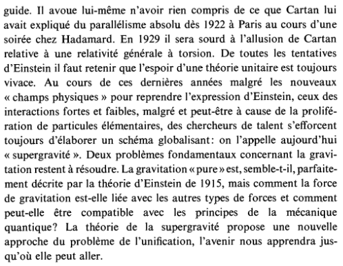
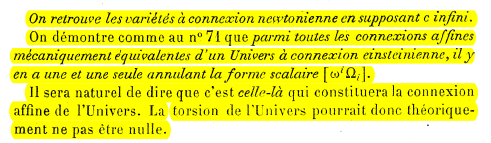
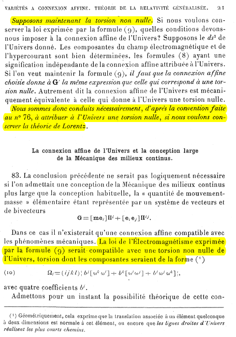
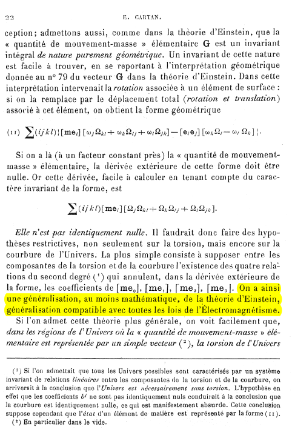

# Einstein, Cartan et la géométrie différentielle

Il m'arrive de rechercher des choses sur la structure de l'univers. Par exemple, je n'ai jamais cru à l'existence des trous noirs. Je vois plutôt le centre des galaxies comme un genre de cristal, avec des étoiles qui se bloquent les unes les autres dans leurs champs gravitationnels respectifs. Le centre des galaxies serait donc un milieu ayant les propriétés d'un solide très légèrement ductile, du fait de la rotation (qu'est-ce qui d'ailleurs fait tourner les galaxies, l'inertie ?). En s'éloignant du centre en rotation, les forces gravitationnelles passent par des grappes d'étoiles d'où cet aspect filandreux.

Le sujet de la matière noire me fait aussi bien rigoler. Quand on a une théorie qui prédit que l'on ne voit pas 85% de la matière de l'univers, il faut changer de théorie ! Commençons par supposer que le photon ait une masse et refaisons les calculs !

J'ai lu ce weekend quelques articles de Cartan sur la géométrie différentielle et les variétés à connexion affines, notamment *Sur les variétés à connexion affine et la théorie de la relativité généralisée* : [là](http://archive.numdam.org/item/ASENS_1923_3_40__325_0/), [ici](http://archive.numdam.org/item/ASENS_1924_3_41__1_0/) et [là](http://archive.numdam.org/item/ASENS_1925_3_42__17_0/).

Je pense avoir compris deux grands concepts de ces lectures assez fascinantes.

1. La géométrie différentielle s'intéresse aux propriétés des espaces non euclidiens au voisinage des points en envisageant des transformations locales pouvant être assimilées à des transformations euclidiennes. Ces transformations, selon Cartan, se décomposent en trois transformations fondamentales (chacune représentée par un tenseur) : la torsion (translation) et la courbure (ayant une composante de rotation et une composante d'homothétie). Cartan est intéressé par les invariants de ces transformations, invariants qui, au final, caractérisent l'espace en question.

2. Ces transformations permettent d'expliquer comment passer progressivement d'espaces aux propriétés macroscopiques différentes selon les endroits. Par exemple, si le point considéré est dans le vide, alors il ne sera pas soumis aux mêmes champs gravitationnels qu'au voisinage d'une étoile en rotation.

Les variétés permettent donc de caractériser ces espaces non homogènes en recollant des espaces homogènes locaux via des transformations (les connexions).

Ce qui est intéressant, dans ce champ des mathématiques, est que les outils qui sont développés sont justement parfaitement adaptés à des physiciens qui voudraient "recoller des théories entre elles", surtout lorsque ces théories ne sont potentiellement pas à la même échelle. Car, ce que permet la géométrie différentielle, c'est de travailler sur des transformations de points dans des voisinages minuscules et donc d'étudier les transitions des espaces non euclidiens par des successions de transformations plus connues sur des espaces tangentes.

Einstein avait eu recours, pour la théorie de la relativité générale, à un espace de Riemann dans lequel la torsion était considérée comme nulle. Cartan, dans ses lettres à Einstein, partage le sujet d'une inclusion de paramètre de torsion, oublié (?) par Einstein.

Extrait de la lettre de Cartan à Einstein du 3 décembre 1929 :

Cartan met en lumière l'importance de la torsion, oubliée ou négligée par Einstein dans sa théorie. En fait, Einstein ne comprend pas la remarque comme l'introduction du livre (*Elie Cartan and Albert Einstein: Letters on Absolute Parallelism, 1929-1932*) sur la correspondance de Cartan avec Einstein le souligne :

(_Robert Debever_)

En 1923, Cartan a écrit le premier volume de son mémoire *Sur les variétés à connexion affine et la théorie de la relativité généralisée*. Les citations suivantes sont quand même hallucinantes :

Page 11 du mémoire (première partie, suite) :

Puis page 17 :

Puis 21, 22 et 23 :

"Sans entrer dans plus de détails à ce sujet" ? Hé quoi ? Cartan indique une méthode pour unifier la gravitation et l'électromagnétisme, en 1923, et son travail reste lettre morte... C'est incompréhensible.

La description géométrique de Cartan des espaces non euclidiens est particulièrement intéressante : en distinguant les trois composantes de transformation locale d'un espace non euclidien dans le voisinage d'un point (translation, rotation et homothétie, et donc "torsion" et "courbure"), Cartan caractérise des espaces où des règles différentes peuvent s'appliquer suivant les différents endroits de cet espace. De fait, suivant les endroits, les différentes composantes vont prendre des valeurs plus ou moins importantes tout en restant homogènes, au niveau microscopiques. La décomposition de ces transformations en invariants permet de décrire la structure de notre univers, une structure dans laquelle les lois que nous connaissons sont applicables, dans un voisinage donné.

Ainsi, philosophiquement, il est naturel que ce je vis dans le référentiel euclidien du système solaire ne soit pas tout à fait applicable au centre de la galaxie, ni dans le vide entre deux galaxies, bien que nous soyons dans un univers "continu", que ce soit géographiquement ou au niveau des échelles.

Enfin, si le modèle avec torsion est une généralisation de la relativité générale incluant l'électromagnétisme, pourquoi les physiciens recherchent-ils encore l'unification des forces ?

_11 septembre 2022_
