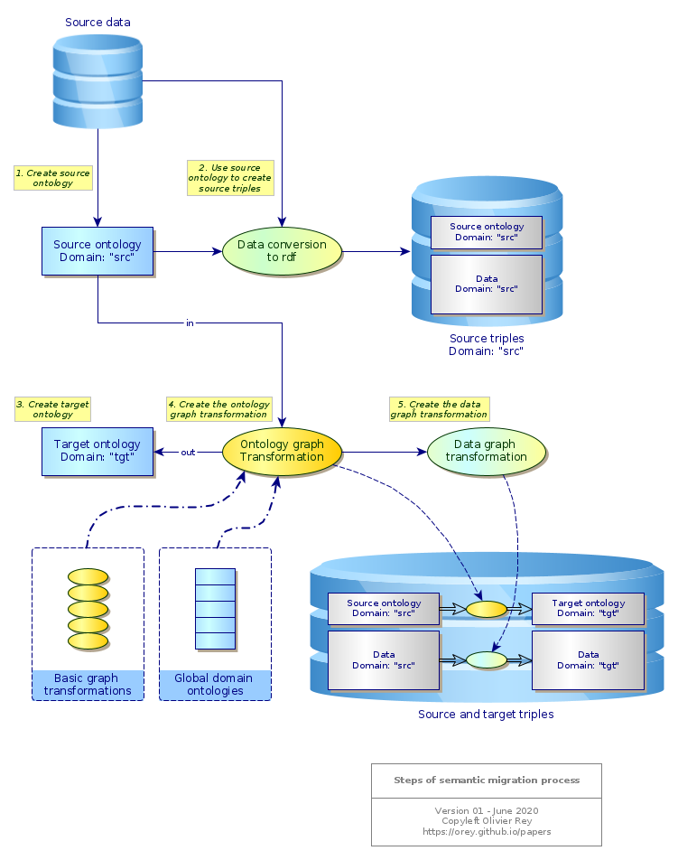

# Semantic data migration project

## Presentation to CNRS Madics conference in 2019

You can read the following article :

  * [Using semantic web technologies for aerospace industrial data migration, Madics 2019](../semantic/data-migration.md)

## First research elements (2018-2020)

### Why?

Arguments for using the semantic graph technology to complex data conversion:

  * It is relatively easy to turn whatever table into sets of triples.
  * The semantic of each column must be named and reused as a "semantic dictionary" between the multiples sources. This step is much easier to accomplish than in standard data lakes where the complete big definitions must be set in one single movement.
  * The design actions, that were at the heart of the problems in [GraphApps](graphapps.md), are less important and can be limited to a correct understanding of the data.
  * The semantic databases (For instance AllegroGraph or Apache Jena) are working in an incremental way: if a triple already exists, the attempt to import it again will do nothing, which "by design" eliminates redundant information.
  * Sparql enables easy graph transformations, first of all to visualize data (Gruff on AllegroGraph is a good triplestore visualization tool), and then to transform them.

### Timed of life-cycled data

Data versions (being time-based versions or life-cycle versions) can be managed with a link timestamp or a link version stamp. The timestamp relation will have to be a ```rdfs:SubClassOf``` the theoretical link type.

### Basic semantic graph transformation (in work)

In the context of [graph transformations](graph-transfo.md), the page [Basic semantic graph transformations](basic-semantic-graph-transformations.md) aims at defining a set of basic graph transformations.

### Industry data

The page [Graphs and semantic data in industry](industry-data.md) talks about the opportunity of using RDF approaches to convert efficiently industrial data.

## A systematic migration process (2020-)

### The 4 steps of transformation

The process of data migration is linked to the transformation of ontologies.

The migration process that we target is the following:

 1. <u>Definition of the hidden source ontology</u>: In the data as they are structured today, a source ontology is hidden. The objective of this step is to exhibit the source ontology, and to create a triplestore with the existing data based on the source ontology. The source ontology must have its own namespace.
 2. <u>Convert the source data</u> in the source ontology referential.
 3. <u>Definition of the target ontology</u>: We want to convert data in a target format which is based on a target ontology. This ontology must be formalized. It must have its own namespace.
 3. <u>Definition of the graph transformation required to transform the source ontology in the target ontology</u>: This graph transformation should be defined with [Basic semantic graph transformations](basic-semantic-graph-transformations.md), and can also use certain abstract domain ontologies.
 5. <u>Derive from the ontology graph representation, a data graph transformation</u> that enables to transform the data from the source ontology in the target ontology.



### Data representation is relative

This process is based on the facts that:

  * The same reality can be modeled differently,
  * There is a path between the various modeling spaces when it comes to the same concept representations.

See also: [The real nature of data](../articles/data-interop.md).

*(Last update: June 2020)*

