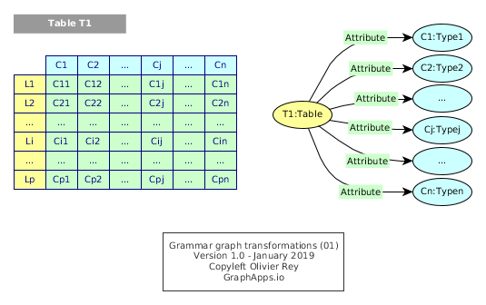
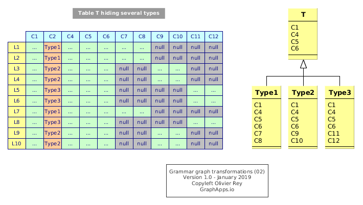
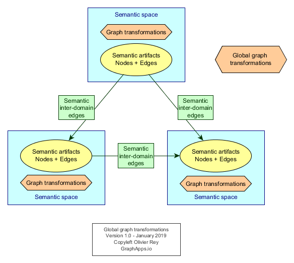

# Grammar graph transformation

Graphs in general, and semantic graphs in particular, can be used to migrate very efficiently data from one format to another.

## Grammar

By grammar, we mean several possible things:

  1. A description of the schema of a RDBMS, especially of tables, specifying the type of each table and the types of each columns. In that case, the grammar corresponds to the information contained in the database schema.
  2. The grammar that we can have to generate triples from a structured table format source. See [the page on industry data](industry-data.md "industry data") for a sample. In that page, the description of the types of all data in a particular semantic space can be called the "grammar" of the semantic space.

## Transforming grammars with reusable basic graph transformations

Grammars can be expressed in graphs.

Let's take the very simple example of the following RDMS schema (see Figure 1).



Figure 1: Simple grammar for a table

This grammar can be expressed in basic RDF.

```
T1 a Table .
T1 attribute C1 .
C1 SubClassOf Type1 .
...
Tj attribute Cj .
Cj SubClassOf Typej .
...
Tn attribute Cn .
Cn SubClassOf Typen .

```

## Basic RDBMS schema transformation in a multi-attributes graph database

The following transformations are basic RDBMS schema transformations.

Note that graph transformations are not commutative and their order is important.

### Transforming foreign key into a relationship

Let's suppose `Ck` is a foreign key of `Table1` to `Table2`, referencing column `Kl`.

```
# Before
T1 attribute Ck .
Ck SubClassOf T2 .

T2 attribute Kl .
Kl SubClassOf Typel .

# Grammar graph transformation 1
Transform_foreign_key {
  # 1. Link the two table colums with a particular semantic predicate
  # 2. Remove Ck attribute from T1
}

# After
T1 foreign_key T2 .

T2 attribute Kl .
Kl SubClassOf Typel .
```

The predicate `foreign_key` will enable real data transformation later.

### Simple class split and simple class merge

Those graph transformations are exploiting the `1-1` relationship. In case of split, semantically the table `T` aggregates 2 concepts that are implicitly linked together.

It is possible to reorder the attributes in that case. Let's consider a table `T` with 4 attributes `C1`, `C2`, `C3` and `C4`.

The graph transformation will create a new resource `T'` and use a new semantic predicate (here `linked_to`) so that:

```
# Before
T attribute C1 .
T attribute C2 .
T attribute C3 .
T attribute C4 .

# Grammar graph transformation 2
Split_class {
  # 1. Create the new resource type for T' (here a Table but could be some other semantic class)
  # 2. Link to source T
  # 3. Get attributes of T
  # 4. Remove attributes from T
}

# After
T attribute C1 .
T attribute C2 .

T linked_to T' .

T' a Table .
T' attribute C3 .
T' attribute C4 .
```

Symmetrically, we have the merge.

```
# Before
T attribute C1 .
T attribute C2 .

T' attribute C3 .
T' attribute C4 .

# Grammar graph transformation 3
Merge_classes {
  # 1. Get attributes of T' to wire them in T
  # 2. Remove attributes from T'
  # 3. Remove T'
}

# After
T attribute C1 .
T attribute C2 .
T attribute C3 .
T attribute C4 .
```

For sure, if `T'` is removed, we have to ensure before that, in the semantic space, the type is not required elsewhere.

### Complex class split

One problem of table design is that we have sometimes different types hiding in the same table. Those cases are frequent in RDBMS and can be due to:

  * A compromise between the object oriented approach and the RDMS (see Figure 2);
  * Ease of code reuse for some different concepts.
  
Note: Those practices generate a lot of technical debt and may paralyze the evolution of a software.




Figure 2: Many types hiding in a table

The class split will exhibit new concepts `Type1`, `Type2` and `Type3`, all those concepts not having anymore the attribute of type indication (`C2` in Figure 2).

The transformation will have to manage the various values in `C2` and, depending on those values, choose what attributes to move from one resource to another.

## Non destructiveness and changing the semantic domain

If we don't want to be destructive on the original grammar, we might want to contextualize the grammar to a semantic space describing the source world (here the RDBMS world).

This could be done by using a specific URI prefix, like `rdbms`.

The consequence is that we need basic transformations to transform `rdbms:Table` artifact into `graph:Concept` artifact, and `rdms:attribute` into `graph:attribute`. Those transformations are like "translations".



Figure 3: Various levels of graph transformations

In that case, we will have global (inter-semantic domain) graph transformations for translations, and intra grammar semantic space (graph) for the various transformations we just saw before.

Using the time approach described in the [basic semantic graph transformation page](basic-semantic-graph-transformations.md), we could imagine chaining the graph transformations for the global transformation of the RDBMS model into a richer, "re-semantized", version of the model.

From that chain of graph transformations, we can generate code to transform the real data from the grammar transformation process.

----

Complementary readings:

  * [Basic semantic graph transformations](basic-semantic-graph-transformations.md)
  * [Basic graph transformations](basic-graph-transformations.md)

