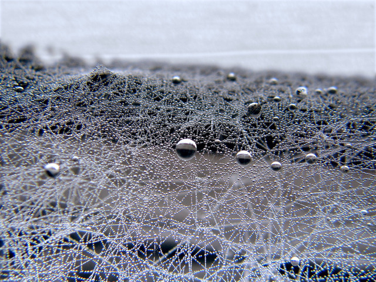

# A general interoperability model using graph transformations

This article proposes a general view of interoperability between systems using the concept of [graph transformations](graph-transfo.md).

*Photo by [kliverap](https://freeimages.com/photographer/kliverap-40511) from [FreeImages](https://freeimages.com)*

