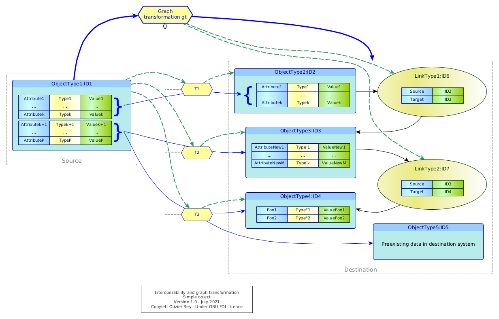

# A general interoperability model using graph transformations

This article proposes a general model of interoperability between systems using the concept of [graph transformation](graph-transfo.md).

*Photo by [kliverap](https://freeimages.com/photographer/kliverap-40511) from [FreeImages](https://freeimages.com)*

## Introduction

In the [real nature of data](../articles/data-interop.md), we discussed many important dimensions of data:

* Data can be considered as the *intersection* between the semantic domain and the point of view defined by the actor and the use case;
* Data are organized in a *relative* way, meaning that there are several ways to represent the same reality;
* Data is an *output product*, result of a process and business rules that were applied before, and considering it as a "entry product" may lead to anti-scientific approaches (see the [article on artificial neural networks](about-ml.md)).

The model of interoperability that we propose is grounded on the understanding that data is organized relatively to the use cases. In the general case, as shown in Figure 1 below, we can count 3 data models in every interoperability problem:

1. The source data model, being located in the source system,
2. The interchange data model, that is what is actually transferred between systems,
3. The target data model, being located in the target system.

*Figure 1: Sample of three semantically equivalent data representation in an interoperability context (extract from our [article on Graphql](../articles/graphql-web-services.md))*

In this article, we will focus on the data models that are in the source and target systems only, because the objective of this study is to analyze what are the characteristics of graph transformations that enable to go from the source data model to the target data model.

Those considerations have huge impacts on:

* The optimal architecture of distributed IT systems;
* The potential software architecture of big platforms.

With the graph transformation based representation of the problem, we believe we propose an understandable general way of representing interoperability between systems.

## Exchanging a single data between systems

We will first consider the very basic case of exchanging a single data between two systems, this case being the simplest case we can think of.

A single piece of data, in the source system, will be characterized by:

* Its name,
* Its type (explicit or implicit),
* Its value.

We already know that some information maybe not transported during interoperability, the data name for instance.

When it goes from one system to another, we have several possibility, some of them being shown in Figure 2.

*Figure 2: Basic interoperability with one source data*

The source data can be represented differently in the target system:

* It can be preserved as it is in the source system, named identically, having the same type, and the same value (not shown in Figure 2);
* It can renamed, retyped, and its value can change;
    * That is frequent when just a part of data is used in the target system;
        * For instance, if the source data is `(Name1, Type1, Value1) = (address, string, "12 avenue des Champs-Elysées")`, we can have the target data being: `(Name2, Type2, Value2) = (address_nb, number, "12")` (`gt1`);
* The data can be split in parts, or mixed by other data in the target system to create new data (`gt2`).

For sure, our objective is not to list all existing cases that are numerous, even in the context of this simple example.

Conceptually, to go from one system to the next system, there will be a data transformation. Even if we currently don't see any graph, we will consider that the transformation is a graph transformation (this will be more understandable later).

`gt1` and `gt2` have business rules. `gt1` renames, extracts and retype data, while `gt2` will reorganize it, possibly mixing the source data with target system data. 

The important element here is that the graph transformation embeds business rules, even in this simple case, to adapt the data that is being transferred to the target system in which the system are not representing the same data the exact same way than in the source system.

## Transferring an object

In Figure 3, we enter a more complex case, the one of transferred an object of type `ObjectType1` to a target system. We represented on the figure the conceptual graph transformation `gt` in charge of the transformation.

*Figure 3: Graph transformation of object in interoperability context*

Seen from high level, `gt` is transforming the source into the destination, the source being one object and the destination being a complex landscape of nodes and links (blue arrows).

In dashed green,we represented the manipulation of the `ID1` instance by sub parts of `gt`, meaning `T1`, `T2` and `T3`.

We can comment the Figure 3 through a table describing the various actions done by the various graph transformations involved in the process.

| Graph transformation | Action |
|---|---|
| `T1` | Creates and instance of `ObjectType2` (`ID2`)and copies the fields of `ID1` into `ID2` |
| `T2` | Creates and instance of `ObjectType3` (`ID3`) and creates new fields based on some fields of `ID1` |
| `T3` | Creates and instance of `ObjectType4` (`ID4`) and creates new fields based on some fields of `ID1` and preexisting data (`ID5`) |
| `gt`| Coordinates the actions of the three graph transformations (`T1`, `T2` and `T3`) and creates the target data topology, i.e. the links (`ID6` and `ID7`) between the 3 new object instances in the target system |

Indeed the source object was modified to become a graph, with data coming from the source system, but not only.

We distinguished in the diagram graph transformation that were only manipulating data  in instances and the master graph transformation `gt` that creates the topology. This split is the result of a concern to be able to reuse internal graph transformation components (here `T1`, `T2` and `T3`) and to limit the knowledge of the graph to the master graph transformation (more information can be found on the [section](graph-transfo.md) on graph transformations).

Even with this simple sample, we can see:

* How complex can be a simple object exchange between two systems;
* The various levels of business rules that we can find applied during the transformation.

*(Last update: August 2021)*