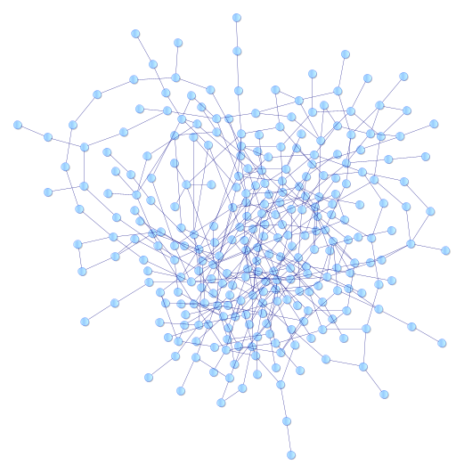

# Graph transformations



Graph transformation is an essential concept to understand to understand those projects.

## Signature

The graph transformations signature is homogeneous:

Let g be a graph transformation.

g(G) = G'

If G &sub; G', then g is said to be non destructive.

If G &nsub; G', then g is said to be destructive.

<u>Implementation notes</u>

a. A root node is often very practical to associate the applicability of a transformation from a certain root node.

b.Domain and range of graph transformations are not so easily defined (lots of works in the mathematical fields on that topic).

In order to create a workable model, we will define the special value ```NOT_APPLICABLE```. Consequently, we can write:

```
g(G1) = NOT_APPLICABLE

&forall; g, graph transformation, g(NOT_APPLICABLE) = NOT_APPLICABLE
```

## Graph transformations can be composed

```
Let g and h graph transformations. g o h and h o g are graph transformations.
```

This defines:

  * The basis of reusability;
  * The possible existence of a "graph transformation base" of basic graph transformations.

## Basic set of graph transformations

See the special pages:

* [Basic graph transformations](basic-graph-transformations.md)
* [Basic semantic graph transformations](basic-semantic-graph-transformations.md)

## Applicability of graph transformations

See:

  * [DSL for graph topology check](DSL-for-graph-topology-checks.md)
  * [Graph transformation applicability](graph-transformation-applicability.md)

Note: to be declined in Sparql.

## Grammar for graph transformation

In the context of [the page on industry data](industry-data.md "industry data"), please have a look at the [grammar of graph transformation](grammar-graph-transformation.md).


*(Last update: June 2020)*