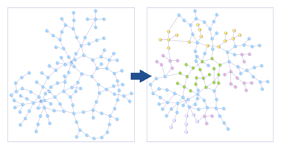

# Graph transformations

Graph transformation are mathematical objects that transform graphs.

## Generalities

### Definition of an labeled directed graph

A graph is a mathematical object that contains nodes attached by edges. It is noted:

* G = {N, E} where N is a set of nodes, and E a set of pair of nodes n &isin; N

An labeled graph is a graph where nodes and edges can have labels. Because we are in IT, we will consider that each node and edge has at least one label that is its unique identifier named `id`.

In all the pages of this site, we will often consider that the graph label is an attribute with a value, what could be represented as follows, for a node `n` &isin; N and for an edge `e` &isin; E:

* n{id:value, attribute1:value1, ..., attributen,valuen}
* e{id:value, sourcenode, destination node, attribute1:value1, ..., attributen,valuen}

Note that the edges are directed in the graphs we are considering which means that they have a source and a destination. That enables to exhibit the notions of:

* Incoming relationships to a node: All edges pointing to that node
* Outgoing relationships from a node: All edges have the node as their source

Graphs can be included in each other. At the level of attributed directed graphs, the inclusion can be defined as follows.

Let A = {N1, E1} and B = {N2, E2} two graphs, we will note:

* B &sub; A if and only if &forall; n &isin; N2, n &isin; N1, and &forall; e &isin; E2, e &isin; E1

Note: That means that all labels are the same.

### Definition of a semantic graph

A semantic graph is defined with RDF triples manipulating and linking resources (URI).

We will often think about resources as bearing 3 kinds of information:

* Their domain
* Their type
* Their identifier

For instance, the following URI `http://example.com/2021/07/product#item12345` can be split in:

* Domain: http://example.com/2021/07/
* Type: product
* Id: item12345

Some cases are more complex but we will address them as they come.

In a semantic graph, URIs can be used as nodes and edges, which make the semantic graph not a graph actually, and makes it complicated to manipulate without some specific hypothesis on an IT standpoint.

### Definition of a graph transformation

Let `g` be a graph transformation. `g` is define as follows:

* g: D &rarr; R, D and R being sets of graphs, potentially reduced to a single graph
* For G &isin; D: g(G) = G' (1)
    * If G &sub; G', then g is said to be *non destructive*.
    * If G &nsub; G', then g is said to be *destructive*.

Note: If some labels were modified, then g is qualified as destructive even if the node or edge is preserved.

Non destructive graph transformations preserve the full input graph and all the labels attached to its nodes and edges. We can call this process *graph enrichment*. It is used in the process of [data migration](data-mig.md).

That leads us to highlight the two kinds of graph transformations:

* *Enrichment*
* *Modify*, which has two subtypes:
    * Modify destructive
    * Modify non destructive

This split is quite important in IT where, implicitly, most graph transformation are in the modify mode to keep the same graph in memory. But, for operations that need to track all previous steps, we can use enrichment graph transformations.

Naturally, graph transformations can be composed:

* Let f: D &rarr; R and g: R &rarr; P
* g o f is a graph transformation from D &rarr; P

This defines:

  * The basis of graph transformation reusability;
  * The possible existence of a "graph transformation base" of basic graph transformations.

See after.

### Definition of a root node

We will define a *root node* as a node of G that is preserved by `g` at least in its existence (maybe its labels were modified, all except its id). Using a root note `r` instead of the graph itself, we can write by extension of (1):

* g(r) = r with the first r &isin; G and the second r &isin; G'

Note: Qualifying "root node" a node of G is relative and can only be done in the context of a graph transformation.

This enables to create graph transformations *with an homogeneous IT signature* that enables cascades of function calls. Indeed, let's suppose `r` is a root node for g1, g2 and gp, we can define `h`the composition of all graph transformations gi by:

* h = gp o gp-1 o ... o g1 if h(r) = gp(gp-1(... (g1(r)...)) = r

But warning, at each step, `r` is representing a different graph.

### Limit conditions

In the IT context, some graph transformations may be not applicable to a certain graph because some conditions are not met. Instead of being an error, we can enrich a bit the semantics by defining the `NOT_APPLICABLE` keyword.

For `f` a graph transformation that is not applicable to a graph G, we can note:

* f: D &rarr; R
* G &rarr;  NOT_APPLICABLE

Even if it is only another way of expressing that G &notin; D, it can be very useful in IT because D is never really defined if `f` contains business rules.

To make the model homogeneous, we can postulate, in order to have the composition of graph transformation work, that:

* &forall; g, graph transformation, g(NOT_APPLICABLE) = NOT_APPLICABLE

## Basic set of graph transformations

See the special pages:

* [Basic graph transformations](basic-graph-transformations.md)
* [Basic semantic graph transformations](basic-semantic-graph-transformations.md)

## Applicability of graph transformations

See:

  * [DSL for graph topology check](DSL-for-graph-topology-checks.md)
  * [Graph transformation applicability](graph-transformation-applicability.md)

Note: to be declined in Sparql.

## Grammar for graph transformation

In the context of [the page on industry data](industry-data.md "industry data"), please have a look at the [grammar of graph transformation](grammar-graph-transformation.md).

*(Last update: July 2021)*
