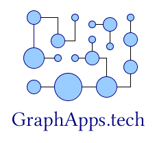

# GraphApps project

## What is GraphApps?

GraphApps was a research project (2013-2018) that aims to use graphs and graph transformations in the context of software engineering, like application building. It was focused on attributed directed graphs.

## Graph-oriented programming and technical debt

You can read the following articles:

  * [First article on graph oriented programming](../graph/first-article.md)
  * [Slides from the ICGT 2018 conference](../graph/staf-icgt2018.md)

The code that was produced during this period is under copyright and so, unfortunately, this code is not available.

## Important points

Those works brought several results.

1. Object-oriented and RDBMS-based software engineering generates a lot of couplings (structural and temporal). Those couplings are, for us, at the center of the technical debt problem.

The way we represent knowledge in current software engineering is *largely sub-optimal*, and we believe that the technical debt is a problem created by bad engineering practices and tools (OOP/RDBMS) and not attached to the business semantics.

2. A new programming model called "graph-oriented programming" enables to limit the technical debt to its minimal expression (semantic couplings).

This programming model is using:

  * *Graph databases* (attributed directed graph databases);
  * *Graph transformations* to model business logic.

This programming model is an intermediate between object-orientation and functional programming. Shortly said, it takes the best out of the two programming models while being totally consistent because based on the business semantics and not on technical considerations.

*(June 2020)*

----

## Second period (2018-now): Exploring (semantic) graph transformations for data conversion

### Basic graph transformations

As graph transformations can be composed easily, the idea is to build a set of basic graph transformations as a foundation for applications.

Two repos are currently under development to study those dimensions:

  * The [graph](https://github.com/orey/graph) repo: The paper [Basic graph transformations](basic-graph-transformations.md) explains the intention of this repo. This repo is in Python. See also [a page in the repo](https://github.com/orey/graph/blob/master/graph_transformations/README.md).
  * The [graphappsjs](https://github.com/orey/graphappsjs) repo, which is targeting the same objective but analyzes the link of the programming language in that problem.
  
  The underlying topic under those repos is also the capability of building a graph-oriented programming language with adapted constructs. A direction to explore would be to propotype a DSL of a graph-oriented programming language with Common Lisp.

### Semantic data conversion draft papers

The following draft papers are exploring the semantic data conversion approach:

  * The article [Arguments for semantic use in data conversion](arguments_semantic.md "arguments") gathers the various reasons why using a semantic approach can be interesting.
  * The paper [Basic semantic graph transformations](basic-semantic-graph-transformations.md) aims at defining a set of basic graph transformations.
  * The paper [Graphs and semantic data in industry](industry-data.md) talks about the opportunity of using RDF approaches to convert efficiently industrial data.

### Graph data visualization

#### Converting CSV data into RDF

Before being able to use semantic graph transformation on data, we must be able to convert CSV data to RDF. This is the objective of the `csv2rdf.py` tool available in the [csv2rdf](https://github.com/orey/csv2rdf) repo.

There are two options proposed by this tool to convert CSV data:

  * The default conversion option,
  * The semantic grammar option, which enables to determine precisely the triple construction.
  
By reusing the same semantic grammar, multiple sources of data can be gathered in the same semantic database (current tests are using [Apache Jena](http://jena.apache.org/)).

#### Visualizing RDF data

*Per se* RDF data are quite complicated to represent because of the hierachy of predicates. The following tools do not consider this hierarchy and generate one new edge object per predicate, while generating only one node for the subject and object across the full set of triples.

The [rdfviz](https://github.com/orey/rdfviz) repo contains two options of visualization:

  * `GML` conversion, to be imported in tools like [Yed](https://www.yworks.com/products/yed) or [Cytoscape](https://cytoscape.org/);
  * `dot` conversion to be displayed with [GraphViz](http://graphviz.org/).

#### Exploring RDF graph data through neighborhoods

In the original GraphApps project, a lot of efforts were put in the use of node neighborhood as a basic element of knowledge navigation.

The [ontovisu](https://github.com/orey/ontovisu) repo aims at enabling the neighborhood-based visual navigation in RDF graph data. It is based on :

  * [Node](https://nodejs.org/en/),
  * [Apache Jena](http://jena.apache.org/)),
  * [Cytoscape js graph library](https://js.cytoscape.org/).
  
Development of this repo is ongoing.

----

## Various notes linked to graphs

  * Using graph transformations at the grammar level, the case of RDBMS schema transformation for re-semantization: [Grammar graph transformations](grammar-graph-transformation.md)
  * [A DSL to check the graph topology](DSL-for-graph-topology-checks.md)
  * [Graph transformation applicability](graph-transformation-applicability.md)
  * Also ongoing: it is quite difficult to properly design in the context of RDF/RDFS (without even talking Owl). This ongoing paper [RDF design patterns](rdf-design-patterns.md) is a first attempt.
  * [Notes on Description Logic](notes-dl.md)

----

See also

  * The [papers](https://orey.github.io/papers) on [orey.github.io](https://orey.github.io).

----

Those documents are available under the [GNU FDL](GNU_FDL.md) license.

