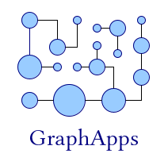

# GraphApps project

## What is GraphApps?

GraphApps is a research project (first phase: 2013-2018) that aims to use graphs and graph transformations in the context of software engineering, like application building and data migration. The first phase of GraphApps was focused on the use of attributed directed graphs in software engineering.

## Graph-oriented programming and technical debt

You can read the following articles:

  * [First article on graph oriented programming](../graph/first-article.md)
  * [Slides from the ICGT 2018 conference](../graph/staf-icgt2018.md)

The code that was produced during this period is under copyright and so, unfortunately, this code is not available.

## Important points

Those works brought several results.

1. Object-oriented and RDBMS-based software engineering generates a lot of couplings (structural and temporal). Those couplings are, for us, at the center of the technical debt problem.

The way we represent knowledge in current software engineering is *largely sub-optimal*, and we believe that the technical debt is a problem created by bad engineering practices and tools (OOP/RDBMS) and not attached to the business semantics.

2. A new programming model called "graph-oriented programming" enables to limit the technical debt to its minimal expression (semantic couplings).

This programming model is using:

  * *Graph databases* (attributed directed graph databases);
  * *Graph transformations* to model business logic.

This programming model is an intermediate between object-orientation and functional programming. Shortly said, it takes the best out of the two programming models while being totally consistent because based on the business semantics and not on technical considerations.

## See also

The [research page](index-research.md).

*(June 2020)*

