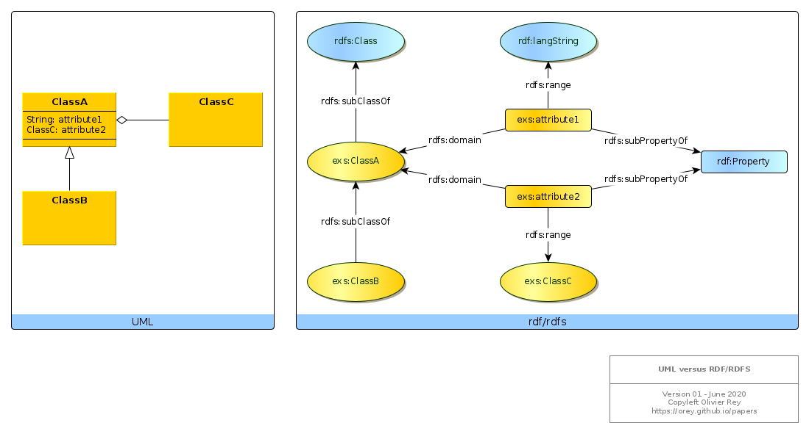

# RDF design patterns

## References

In a W3C article, [Semantic Web Best Practices](https://www.w3.org/2001/sw/BestPractices/), some indications are provided to compare the semantic web approach with the object-oriented approach. Those indications are very interesting but they are not complete to serve as a guide for software engineers trying to work with semantic web technologies.

This page aims at gathering interesting elements about that topic.

## Correspondence between UML and rdf/rdfs

Consider the following figure.



Several points must be noted:

  * All classes are `subClassOf` `rdfs:Class`;
  * All properties are `subPropertyOf` `rdf:Property`;
  * There can be hierarchies of classes, and hierarchies of properties;
  * A property is defined by its domain and its range:
    * If it exists `?x` and `?y` so that `?x p ?y`, that means that `?x` should be of type "domain of p" and `?y` of type "range of p".
  * Properties are linked to class by the domain and range, but there is not class link to property:
    * Something like: `exs:ClassA exs:something exs:attribute1` does not exist in rdf/rdfs.
    * That means the predicate is the "linker" of nodes.

This model is great because the knowledge of the value of the attribute is delegated to the attribute.

However, it may not be sufficient for what we are searching (an efficient software engineering model).

## Defining Class attribute membership

We can question if it would be useful to create a membership concept or just to use `rdfs:member` property.

Without it, we need to query the attributes of a class using their domain:

```
SELECT ?attribute
WHERE
{
    ?attribute rdfs:domain exs:ClassA .
}
```

If, we attach all attributes to the class like that:

```
exs:ClassA rdfs:member exs:attribute1 .
exs:ClassA rdfs:member exs:attribute2 .
```
We can query attributes like that:
```
SELECT ?attribute
WHERE
{
    exs:ClassA rdfs:member ?attribute .
}
```

That is not more elegant than the previous one and not standard.

However, we miss an important information from the UML model. The attribute 1 can be considered as a "final attribute", which value is intrinsically attached to the ClassA instance. The attribute 2 is a structural link between classes, and we know ([graph-oriented programming](../graph/first-article.md)) that this kind of links is generating technical debt.

rdf/rdfs modeling can enable us to model this case differently. We will consider as "final" the `rdfs:Literal`.

We can now distinguish the realm attributes from the links between classes.

```
SELECT ?attribute
WHERE
{
    ?attribute rdfs:domain exs:ClassA .
    ?attribute rdfs:range rdfs:Literal .
}
```

For sure, the literal types will probably be `rdfs:subClassOf rdfs:Literal` (that why we need Sparl).

To find the structural links between concepts:

```
SELECT ?attribute
WHERE
{
    ?attribute rdfs:domain exs:ClassA .
    MINUS {
        ?attribute rdfs:range rdfs:Literal .
    }
}
```

With this restriction, we can explore the topology of the classes and their real dependencies.


*(June 2020)*