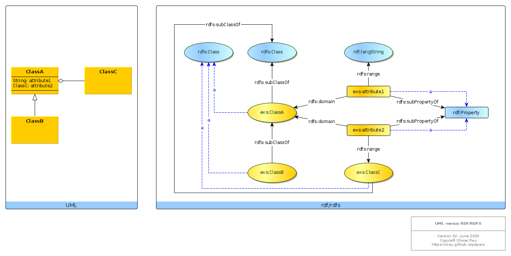

# UML to RDF considerations

## References

In a W3C article, [Semantic Web Best Practices](https://www.w3.org/2001/sw/BestPractices/), some indications are provided to compare the semantic web approach with the object-oriented approach. Those indications are very interesting but they are not complete to serve as a guide for software engineers trying to work with semantic web technologies.

This page aims at gathering interesting elements about that topic.

## Basic correspondence between UML and rdf/rdfs

Consider the following figure.



Several points must be noted.

## Types are instances of rdf:Property and rdfs:Class

Basically, in most existing (RDFS) ontologies, when a new class is created, it is declared as being `a rdfs:Class`, and when a new property type is created, it is declared as being `a rdf:Property`. We have this situation in the diagram for `exs:ClassA`, `exs:ClassB`, `exs:ClassC` and for `exs:attribute1` and `exs:attribute2`.

That means that new types, being class types or property types, are considered as "instances" of the "meta-types" `rdfs:Class` and `rdf:Property`.

## First translation

In the UML diagram, `ClassB` derives from `ClassA`. That implies: `exs:ClassB rdfs:subClassOf exs:ClassA` as an obvious translation of the UML fact.

We can stay like that and have a first UML to RDF translation like that:

```
@prefix rdf:  <http://www.w3.org/1999/02/22-rdf-syntax-ns#> .
@prefix rdfs: <http://www.w3.org/2000/01/rdf-schema#> .
@prefix owl: <http://www.w3.org/2002/07/owl#> .
@prefix exs: <https://orey.github.io/sample-schema.ttl#> .

exs:ClassA a rdfs:Class.

exs:ClassB a rdfs:Class ;
           rdfs:subClassOf exs:ClassA .

exs:ClassC a rdfs:Class.

exs:attribute1 a rdf:Property ;
               rdfs:domain exs:ClassA ;
               rdfs:range rdf:langString .

exs:attribute2 a rdf:Property ;
               rdfs:domain exs:ClassA ;
               rdfs:range exs:ClassC .

```

## Second translation

This first translation may be considered as having a slight problem. All new classes could be `subClassOf` another class, in order to enable reasoning based on sub-classes.

We could enrich a bit our first translation by adding some lines.

```
@prefix rdf:  <http://www.w3.org/1999/02/22-rdf-syntax-ns#> .
@prefix rdfs: <http://www.w3.org/2000/01/rdf-schema#> .
@prefix owl: <http://www.w3.org/2002/07/owl#> .
@prefix exs: <https://orey.github.io/sample-schema.ttl#> .

exs:ClassA a rdfs:Class ;
           rdfs:subClassOf rdfs:Class . <= NEW

exs:ClassB a rdfs:Class ;
           rdfs:subClassOf exs:ClassA .

exs:ClassC a rdfs:Class ;
           rdfs:subClassOf rdfs:Class . <= NEW

exs:attribute1 a rdf:Property;
               rdfs:subPropertyOf rdf:Property ; <= NEW
               rdfs:domain exs:ClassA ;
               rdfs:range rdf:langString .

exs:attribute2 a rdf:Property ;
               rdfs:subPropertyOf rdf:Property ; <= NEW
               rdfs:domain exs:ClassA ;
               rdfs:range exs:ClassC .

```

Semantically, the `a` indicates the real nature of the entity and the `rdfs:subClass/PropertyOf` its type hierarchy.

## 2 kinds of attribute types

Attribute types are not homogeneous. For a given attribute `exs:att`, `exs:att rdfs:range rdfs:Class` may indicate that we are talking about a link or relationship between two objects, whereas `exs:att rdfs:range rdfs:Literal` may indicate that we have a real attribute with a literal value.

That is one UML and object-orientation deepest problem: the aggregation (and composition) relationships are represented at the same level than the attributes pointing to literal values (see [paper on graph-oriented programming](../graph/first-article.md)). The semantic web enables us to get over this crucial limitation by defining the attribute outside of the class itself.

But, if we want to be effective, we would need a specific root attribute type for the attribute types having a range in the `rdfs:Literal` world, and a root attribute type for the attribute types that point to objects.

That leads us to the third translation below.

```
@prefix rdf:  <http://www.w3.org/1999/02/22-rdf-syntax-ns#> .
@prefix rdfs: <http://www.w3.org/2000/01/rdf-schema#> .
@prefix owl: <http://www.w3.org/2002/07/owl#> .
@prefix dc: <http://purl.org/dc/elements/1.1/> .
@prefix ga: <https://orey.github.io/graphapps-V2#> .

@prefix exs: <https://orey.github.io/sample-schema.ttl#> .

exs:ClassA a rdfs:Class ;
           rdfs:subClassOf ga:Class . <= NEW

exs:ClassB a rdfs:Class ;
           rdfs:subClassOf exs:ClassA .

exs:ClassC a rdfs:Class ;
           rdfs:subClassOf ga:Class . <= NEW

exs:attribute1 a rdf:Property ;
               rdfs:subPropertyOf ga:attribute ; <= NEW
               rdfs:domain exs:ClassA ;
               rdfs:range rdf:langString .

exs:attribute2 a rdf:Property ;
               rdfs:subPropertyOf ga:link ; <= NEW
               rdfs:domain exs:ClassA ;
               rdfs:range exs:ClassC .
```

The root attribute type for attribute types having a range in `rdfs:Literal` is `ga:attribute`, and the root attribute type for attribute types that point to classes is `ga:link`.

If we want to be sure that classes are realm classes, and because `rdfs:Class` maybe sometimes too large, we defined `ga:Class` as the root type for all classes.

That provides the following RDFS-based ontology:

```
@prefix rdf:  <http://www.w3.org/1999/02/22-rdf-syntax-ns#> .
@prefix rdfs: <http://www.w3.org/2000/01/rdf-schema#> .
@prefix owl: <http://www.w3.org/2002/07/owl#> .
@prefix dc: <http://purl.org/dc/elements/1.1/> .

@prefix ga:   <https://orey.github.io/graphapps-V2#> .

<https://orey.github.io/graphapps-V2#> a owl:Ontology ;
        dc:title "GraphApps ontology for building semantic applications" ;
        dc:date "2020-06-21" ;
        dc:description "This ontology describe the minimal set of constructs required to build applications in the spirit of the GraphApps works." .

ga:Class a rdfs:Class ;
         rdfs:subClassOf rdfs:Class ;
         rdfs:isDefinedBy <https://orey.github.io/graphapps-V2#> ;
         rdfs:label "Class" ;
         rdfs:comment "Root class of the GraphApps classes." .

ga:attribute a rdf:Property ;
             rdfs:subPropertyOf rdf:Property ;
             rdfs:isDefinedBy <https://orey.github.io/graphapps-V2#> ;
             rdfs:label "attribute" ;
             rdfs:comment "Root property of final data attributes." ;
             rdfs:domain ga:Class ;
             rdfs:range rdfs:Literal .

ga:link a rdf:Property ;
             rdfs:subPropertyOf rdf:Property ;
             rdfs:isDefinedBy <https://orey.github.io/graphapps-V2#> ;
             rdfs:label "link" ;
             rdfs:comment "Root property of link between ga:Class." ;
             rdfs:domain ga:Class ;
             rdfs:range rdfs:Class .

ga:id a ga:attribute ;
      rdfs:isDefinedBy <https://orey.github.io/graphapps-V2#> ;
      rdfs:label "id" ;
      rdfs:comment "Instance of attribute type to define a unique id for ga:Class instances." ;
      rdfs:domain ga:Class ;
      rdfs:range rdfs:Literal .

```

Such a grammar is enabling several things:

  * Translate UML concepts in semantic web concepts;
  * Distinguish between topological links between concepts, and values of attributes;
  * Reason on less ambiguous concepts;
  * Benefit from the RDF/RDFS definition of attributes out of classes;
  * Enable graph transformations based on a set of non ambiguous concepts.

The grammar can be found [here](https://orey.github.io/graphapps-V2).

*(June 2020)*