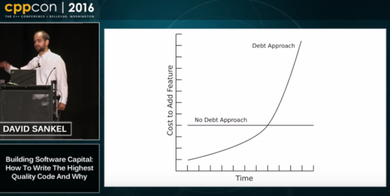

# Resources

[Back to index](index-research.md)

### Technical debt

The well-known curve of software technical debt.

### Maintenance costs

The rule of 60/60 (Robert L. Glass):

  * Between 40% and 80% of software costs are maintenance costs (average 60%);
  * Around 60% of maintenance costs are enhancements.

Source: [Frequently forgotten fundamental facts about software engineering](https://denetria.wordpress.com/2008/10/09/frequently-forgotten-fundamental-facts-about-software-engineering/) - [alternate](../pdf/2008-FrequentlyForgottenFundamentalFactsAboutSoftwareEngineering.pdf).

This figure seems rather optimistic and the interval may more be 60-80% for maintenance costs.

(Same source)

[Back to index](index-research.md)

*(Last update: June 2020)*
