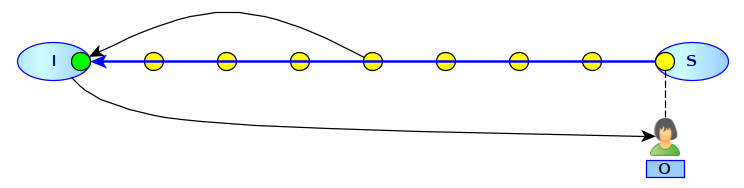

# Paradoxe de Zénon et dépassement de la vitesse de la lumière

Certains faux problèmes semblent habiter le monde de la physique depuis longtemps. Le problème du dépassement de la vitesse de la lumière pour remonter le temps est du même genre : un faux problème.

## Le paradoxe de Zénon

_Figure 1 : Paradoxe d'Achille et de la Tortue (image de [Martin Grangjean](http://www.martingrandjean.ch/bergson-paradoxes-zenon-achille-tortue/))_

Le paradoxe d'Achille et de la tortue en est un très connu : en prenant pour base le chemin parcouru par la tortue à l'itération `n-1`, et en calculant à l'itération `n`, le chemin parcouru  par Achille, la tortue aura avancé à l'itération `n` et donc Achille ne pourra jamais la rattraper (en tous cas avec cette méthode de calcul).

## Dépassement de la vitesse de la lumière

Pour moi, ce sujet fait partie des vices de logique les plus simples et j'avoue que je suis toujours surpris par les raisonnements ayant trait à ce sujet. Certains racontent qu'Einstein se serait posé la question de savoir ce que l'on voyait si l'on remontait un flux lumineux plus rapidement que la vitesse de la lumière. D'aucuns prétendent que cette procédure permettrait de remonter le temps. Nous allons répondre à ces deux questions avec des arguments de bon sens.

Prenons dans notre modélisation, deux points `I` et `S`, pour "Initial" et "Source". La source de lumière émet de la lumière vers la gauche et nous allons nous intéresser à ce que voit un observateur `O` allant vers la source `S` depuis `I` en allant *deux fois plus vite* que la vitesse de la lumière.

La lumière est composée de photons, il est donc naturel de considérer qu'à l'instar d'un distributeur de balles de tennis, la source `S` envoie un flux de photons continus. cela donne la figure 2.

_Figure 2 : Dispositif_

Les photons sont les petites balles jaunes (et verte) et la flèche montre leur sens de progression.

Nous allons prendre pour principe que la figure 2 est une photo à TO.

_Figure 3 : Avancée du photon vert_

La figure 3 montre l'avancée du photon vert d'un "cran" vers la gauche. L'observateur a, lui, avancé de deux crans vers la droite. L'avancée d'un cran sera notre mesure du temps : &Delta;T. La figure 3 est donc une photo prise à T0 + &Delta;T.

La figure 4 ne présente aucune surprise.

_Figure 4 : Progression parallèle_

En effet, l'observateur allant deux fois plus vite que le photon vert, il arrive au milieu du chemin entre `I` et `S` alors que le photon vert n'a parcouru qu'un quart du chemin. La photo est prise à T0+2&Delta;T.

_Figure 5 : Arrivée à destination_

La figure 5 montre l'arrivée à destination de l'observateur, de manière concomitante avec l'arrivée du photon vert au point d'origine. Le moment auquel la photo est prise est donc T0+4&Delta;T.

Cette modélisation est simple et nous pourrions, en lieu et place d'avoir des photons et un observateur, avoir des voitures qui se croisent sur une route. Cela donnerait le même résultat.

Le fait est que l'hypothèse sous-jacente à cette petite explication est que le temps est uniforme et qu'il se déroule de la même façon n'importe où dans l'univers. En effet, le temps s'écoule aussi vite en `S` qu'en `I`. Dès lors, l'observateur `O` verra l'histoire de `S` *en accéléré* jusqu'à arriver au présent de `S` qui est le même présent que celui de `I` au même instant.

## Voyager dans le futur ou remonter le temps ?

Écartons de suite la possibilité de remonter le temps sur `S` avant T0. En effet, il semble raisonnable de postuler qu'à T0, l'univers est dans un certain état, que ce soit en `I` ou en `S`. Si `O` part de `I` à T0, il ne peut pas arriver en `S` avant T0 ; cela semble évident.

Cette hypothèse signifie que si nous placions une horloge atomiques en `I` et en `S`, que ces endroits ne sont soumis à aucune distorsion grave (de gravitation, de vitesse, électromagnétique ou autre), nous aurons la fonction `t` du temps en `I` et en `S` qui sera la même.

L'expérience prouve que le temps s'écoule plus lentement dans le référentiel de celui qui va vite en comparaison du temps qui s'écoule chez celui qui ne bouge pas (à supposer que cela existe dans l'univers). La théorie d'Einstein de la relativité restreinte puis générale modélise ces variations, dont une des plus célèbres fictions dérivées est la *Planète des Singes*. Des astronautes voyagent à la vitesse de la lumière et reviennent dans une terre du futur alors que eux n'ont vécu que quelques années.

Ce phénomène est décrit par l'expérience des deux horloges atomiques : la première horloge reste dans un référentiel fixe (la terre) et la seconde voyage dans l'espace.

_Figure 6 : La seconde horloge perd une seconde par rapport à la première_

Dans le cas de la figure 6, l'horloge se "recale" avec la fonction de temps partagée entre `I` et `S`. L'observateur est donc plus jeune de 1 seconde par rapport aux habitants de `I` et `S`.

Prenons le cas général où `O` a voyagé non pas en 4&Delta;T mais en 4&Delta;T-&epsilon;. Sa vitesse lui a fait perdre &epsilon;.

Nous pourrions argumenter que le temps en `S` est donc T0+4&Delta;T-&epsilon; (il est perçu comme cela par `O`) et donc effectivement, `O` aurait, en quelque sorte, remonté le temps dans la mesure où il serait arrivé plus vite que la durée de son voyage vu de `I`. Mais cela serait contraire à l'hypothèse que `S` a un écoulement du temps identique de celui de `I`.

Le scénario de la *Planète des Singes* est donc plus crédible, en un sens : seul le référentiel de temps touché par la distorsion vit les choses différemment, mais ce dernier se recale lorsque la distorsion se termine.

## Qu'est-ce que le temps ?

Nous en revenons à la question de la définition du temps. Il est indéniable que l'univers existe maintenant dans un état différent de son état d'il y a un milliard d'années. Il semble indéniable que l'univers existe dans le présent, et cela indépendemment de l'observateur. Par contre, si l'observateur est soumis à des conditions gravito-électromagnétiques spéciales, il est possible que ce dernier ne "perçoive" pas vraiment les choses comme les autres observateurs.

Comme tout bouge dans l'univers, aucun observateur n'est vraiment dans des conditions idéales de "point fixe" ou "point neutre" en termes d'influences gravito-électromagnétiques. Chacun aura donc de légères variations dans sa perception du temps. Pour autant, la réalité se "recalant" sur le présent, sommes nous certains que nous mesurons bien ce temps ?

En effet, tous les dispositifs expérimentaux très élaborés inventés par les humains pour mesure le temps (horloge atomique, horloge optique, etc.) se basent sur des phénomènes gravito-électromagnétiques dont la maîtrise complète est faible, il faut le reconnaître. Nos théories actuelles permettent d'expliquer des choses mais tant de choses restent pour nous des énigmes.

Par exemple, la théorie de la relativité générale semble omettre la partie électromagnétique (voir l'article sur [Cartan](cartan.md)) qui est juste la moitié du "problème". Serait-il possible qu'en réincluant cette partie, nous puissions progresser dans notre compréhension de l'univers et du temps ?

_02 avril 2023_

