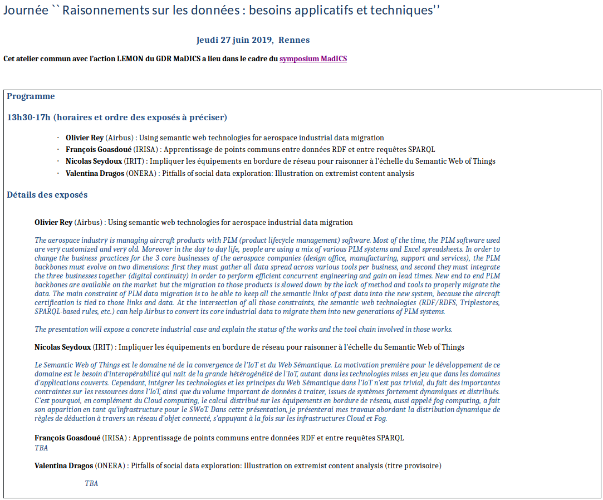

# Conference at the Madics 2019 CNRS Conference in Rennes

The aerospace industry is managing aircraft products with PLM (product lifecycle management) software. Most of the time, the PLM software used are very customized and very old. Moreover in the day to day life, people are using a mix of various PLM systems and Excel spreadsheets. In order to change the business practices for the 3 core businesses of the aerospace companies (design office, manufacturing, support and services), the PLM backbones must evolve on two dimensions: first they must gather all data spread across various tools per business, and second they must integrate the three businesses together (digital continuity) in order to perform efficient concurrent engineering and gain on lead times. New end to end PLM backbones are available on the market but the migration to those products is slowed down by the lack of method and tools to properly migrate the data. The main constraint of PLM data migration is to be able to keep all the semantic links of past data into the new system, because the aircraft certification is tied to those links and data. At the intersection of all those constraints, the semantic web technologies (RDF/RDFS, Triplestores, SPARQL-based rules, etc.) can help Airbus to convert its core industrial data to migrate them into new generations of PLM systems.

The presentation exposes a concrete industrial case and explain the status of the works and the tool chain involved in those works.

[Presentation](../pdf/20190628-UsingSemanticWebTechnologiesForIndustrialDataMigration-ORey-v1-0.pdf)

*(June 2020)*

